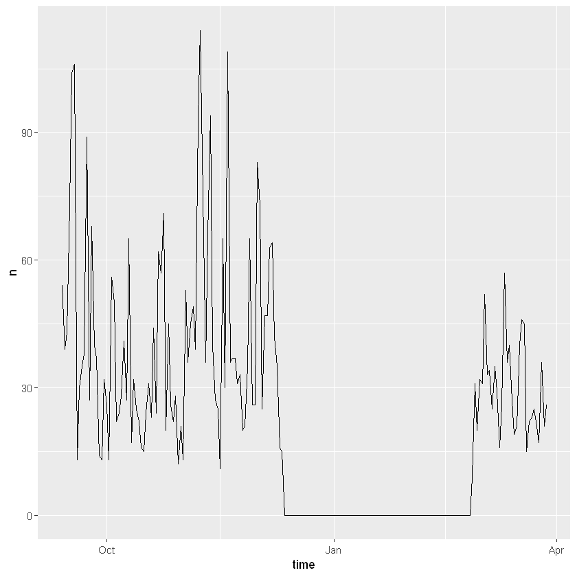
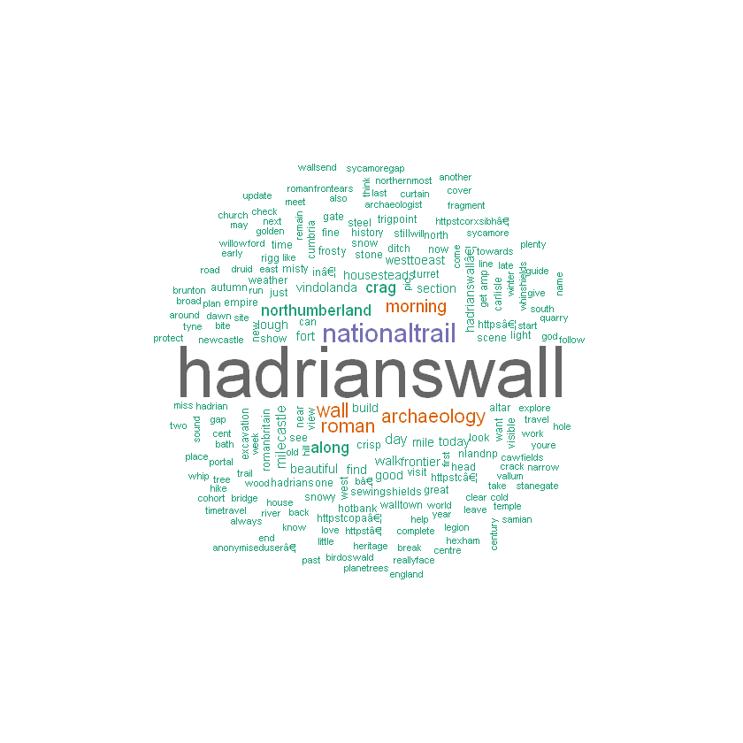

# Social Media Data Extraction and Analysis

## 6 February 2020, University of Cologne

### Introduction

In this tutorial, we will be using R, which is a free and open source statistical software that is extensively used in data science and can facilitate a broad range of analyses. To do things in R you need to write the commands directly in the console, and execute them by pressing enter.

In the following sections, we will use R to obtain data from twitter through the API, and then to carry out data analysis. The first part of the tutorial will focus on the data collection, and will also cover the creation of the developer account on twitter, and a twitter App required to access data though R. For some steps in this part of the tutorial you will need a developer account, which takes few days to obtain and requires a phone number, so you may not be able to follow all the steps exactly during the tutorial, but you will learn how to obtain the twitter data on your own in the future if you decide to apply for a developer account. The second part will focus on the analysis of term frequenciens and associations and topic modelling, for which you will be provided with the pre-downloaded data.  

Before you start the tutorial, you therfore need to download the files with the data (ADD LINK) and put them in the folder that will be your working directory. Then you need to set your working directory in R to the folder where your files are located. To do that, execute the following command, replacing the path with your directory:


```R
setwd("G:\\My Drive\\my_repositories\\cologne")
```

### Part 1: Data collection

In this section we will see how to extract tweets from Twitter's public API (Application Programming Interface).

Please note that, through the procedurew that we will show you, you will be accessing:

1. Up to 3200 tweets from a public Twitter account (current rtweet documentation).
2. Tweets containing a specific # and published up to 7 days before the data collection starts (current Twitter developer documentation).
3. A small random sample of tweets containing a specific term amongst those that are published live during a specific time interval (current rtweet documentation).

These limits are constantly updated by social media companies, so make sure you check the relevant documentation each time.

To get data from Twitter, we will be using the rtweet library. In programming, libraries are collections of pre-defined routines that a program can use. In other words, they provide additional functions. In the case of Free and Open Source Software like R, these functions can be written and shared by anyone and published as packages. To use a library, you need to install it first:


```R
install.packages("rtweet")
install.packages("wordcloud")
```

    Installing package into 'C:/Users/ycrnm/Documents/R/win-library/3.5'
    (as 'lib' is unspecified)
    
    

    package 'rtweet' successfully unpacked and MD5 sums checked
    
    The downloaded binary packages are in
    	C:\Users\ycrnm\AppData\Local\Temp\Rtmpgd4C6r\downloaded_packages
    


```R
library(rtweet)
library(wordcloud)
```

To download data from Twitter we will need an 'access token', which is like a special key allowing us to access Twitter's public API. There is a function in the rtweet library that allows you to create an access token, called create_token(). (Functions in R are always followed by a bracket and usually contain arguments. So in the code above you used a function library(), to load the library, and provide argument *rtweet* to tell R which library to load.) To check how the ?create token functon works type:


```R
?create_token
```

As you can see, the function requires 5 arguments: the name of the Twitter app (application) created by the user, the consumer key, the consumer secret, the access token and the access secret. To get all this information, you need to create a Twitter app in this way:

- Apply for a developer account going to this link: https://developer.twitter.com/en/apply/user.

- Log in to your Twitter account and make sure that you have provided your phone number as part of your profile information.

- Wait for an email confirming that your account has been approved.

- Go to https://apps.twitter.com/ and click on the create New App button.

- Under application details, enter app name (e.g. token_1 or anything else that is not already taken), app description (e.g. token for R) and website (e.g. http://example.com). As Callback URL enter: http://127.0.0.1:1410 and provide a short description (min 100 characters) of the App for the 'Tell us how this app will be used' section.

- Click on the Create button and read the develper agreemant in the window that appeared and click create again.

- Click on the Permissions tab at the top, clikc 'Edit' and select Read, write, and Direct Messages; then click Save

- Now go to the Keys and Access Tokens tab to find your consumer key and consumer secret and provide those and your app name as arguments in the function create_token (enter them as strings, in quotation marks!):


```R
token <- create_token(
  app = "app_name",
  consumer_key = "WN9nUDbFGdiLeefTJpEAevmhl",
  consumer_secret = "Hcy2aPAP7s79LkifArh2YIqkdJgD8NFhVaW3OaVwLExl4K73xo",
  access_token = "839784722125455361-G3kUyvZXMicy0wJ6iH3ciBLZ2gXnNso",
  access_secret = "SWKxZOTBm2E1hl8Ze97fpbFGuwhsnNGKV4zzb961QNLC2")
```


```R
token <- create_token(
  app = "app_name",
  consumer_key = "your_consumer_key",
  consumer_secret = "your_consumer_secret",
  access_token = "your_access_token",
  access_secret = "your_access_secret")
```

In the code above we put an arrow (<-) pointing to the word token in front of the create_token function. Doing that assigns the results of executing the function to a variable, which in this case is called 'token', so that we can access it as long as the R session is open. We can also save the newly-created token as an R object file, and simply load it into R if we need it in the future:


```R
save(token, file = "token.R")
```

To load your token in the future, make sure your working directory is in the folder where the 'token.R' file is located (or provide full path to the token) and load it using the following command:


```R
load("token.R")
```

#### User timeline extraction

We are ready to access Twitter's API and extract tweets. There are various ways of extracting tweets. The first one, is to extract all the tweets posted by a specific, public account. To do this, we will use the get_timeline function from the rtweet library. To find out what the function does and what information we need to feed into it, type:


```R
?get_timeline
```

This should open a browser window with documentation about the function. From this documentation, we learn that the function can return tweets posted either by a given user or by the accounts followed by that user. If we are interested in what a user has been tweeting, we will keep the default setting of the home argument to false. (Under usage, you can see what the default settings of a parameter is. If default is what you want, you do not have to include that parameter).

The Arguments section tells you what arguments you need to define:

- Screen name of the user, for example "@IARHeritages" (it needs to be input as a string i.e. in quotation marks).
- The number of tweets to return (input as numeric value, so without quotation marks).
- As token, we will use our newly created token stored in the variable with the same name.
- We can keep the other arguments as 'default', so we do not need to include them.

The function should return a data frame, which we will store in the variable tweets:


```R
tweets<-get_timeline(user="@IARHeritages", n=100,token=token)
```

After that you can save your the R object containing tweets to a file, in a similiar way to saving the token: 


```R
save(tweets, file="tweets.R")
```

As you wouldn't have been able to obtain the tweets without the developer's account, to follow the tutorial from this point onward you can read the pre-downloaded tweets into R from your working directory:


```R
load("tweets.R")
```

Have a look at how the data is formated, by inspecting the first few tweets:


```R
head(tweets)
```


<table>
<caption>A tibble: 6 × 90</caption>
<thead>
	<tr><th scope=col>user_id</th><th scope=col>status_id</th><th scope=col>created_at</th><th scope=col>screen_name</th><th scope=col>text</th><th scope=col>source</th><th scope=col>display_text_width</th><th scope=col>reply_to_status_id</th><th scope=col>reply_to_user_id</th><th scope=col>reply_to_screen_name</th><th scope=col>...</th><th scope=col>statuses_count</th><th scope=col>favourites_count</th><th scope=col>account_created_at</th><th scope=col>verified</th><th scope=col>profile_url</th><th scope=col>profile_expanded_url</th><th scope=col>account_lang</th><th scope=col>profile_banner_url</th><th scope=col>profile_background_url</th><th scope=col>profile_image_url</th></tr>
	<tr><th scope=col>&lt;chr&gt;</th><th scope=col>&lt;chr&gt;</th><th scope=col>&lt;dttm&gt;</th><th scope=col>&lt;chr&gt;</th><th scope=col>&lt;chr&gt;</th><th scope=col>&lt;chr&gt;</th><th scope=col>&lt;dbl&gt;</th><th scope=col>&lt;chr&gt;</th><th scope=col>&lt;chr&gt;</th><th scope=col>&lt;chr&gt;</th><th scope=col>...</th><th scope=col>&lt;int&gt;</th><th scope=col>&lt;int&gt;</th><th scope=col>&lt;dttm&gt;</th><th scope=col>&lt;lgl&gt;</th><th scope=col>&lt;chr&gt;</th><th scope=col>&lt;chr&gt;</th><th scope=col>&lt;lgl&gt;</th><th scope=col>&lt;chr&gt;</th><th scope=col>&lt;chr&gt;</th><th scope=col>&lt;chr&gt;</th></tr>
</thead>
<tbody>
	<tr><td>745230560428179456</td><td>1215940742692200448</td><td>2020-01-11 10:17:18</td><td>IARHeritages</td><td>Ready for #DHEthics20 at @UEADHi and heading over to talk about some the ethical implications of engaging with big data-informed research in heritage  @StirHeritage @ustirhistpol #StirHeritage #digitalheritage https://t.co/otCfEpKtVc                                                                               </td><td>TweetDeck</td><td>140</td><td>NA</td><td>NA</td><td>NA</td><td>...</td><td>479</td><td>207</td><td>2016-06-21 12:23:06</td><td>FALSE</td><td>https://t.co/lOyiIrlAhF</td><td>http://ancientidentities.org</td><td>NA</td><td>https://pbs.twimg.com/profile_banners/745230560428179456/1481048007</td><td>http://abs.twimg.com/images/themes/theme1/bg.png</td><td>http://pbs.twimg.com/profile_images/827567921220182017/0ONdx-PI_normal.jpg</td></tr>
	<tr><td>745230560428179456</td><td>1201897416460517376</td><td>2019-12-03 16:14:08</td><td>IARHeritages</td><td>We are publishing a special issue with @BigDataSoc including all these fantastic contributions (subject to peer review)! @JDaviesHeritage https://t.co/njILg2oelW                                                                                                                                                       </td><td>TweetDeck</td><td>140</td><td>NA</td><td>NA</td><td>NA</td><td>...</td><td>479</td><td>207</td><td>2016-06-21 12:23:06</td><td>FALSE</td><td>https://t.co/lOyiIrlAhF</td><td>http://ancientidentities.org</td><td>NA</td><td>https://pbs.twimg.com/profile_banners/745230560428179456/1481048007</td><td>http://abs.twimg.com/images/themes/theme1/bg.png</td><td>http://pbs.twimg.com/profile_images/827567921220182017/0ONdx-PI_normal.jpg</td></tr>
	<tr><td>745230560428179456</td><td>1180494330286489600</td><td>2019-10-05 14:45:55</td><td>IARHeritages</td><td><span style=white-space:pre-wrap>My &lt;U+0001F31F&gt; colleague @rockartia is organising a&lt;U+0001F51D&gt;workshop on **Northern Prehistory: Connected Communities** at Tullie House, Carlisle, 12-13 October. It features a session on education which she has researched for our @ahrcpress @IARHeritages. Registration: https://t.co/V6ycO4TIp3                </span></td><td>TweetDeck</td><td>139</td><td>NA</td><td>NA</td><td>NA</td><td>...</td><td>479</td><td>207</td><td>2016-06-21 12:23:06</td><td>FALSE</td><td>https://t.co/lOyiIrlAhF</td><td>http://ancientidentities.org</td><td>NA</td><td>https://pbs.twimg.com/profile_banners/745230560428179456/1481048007</td><td>http://abs.twimg.com/images/themes/theme1/bg.png</td><td>http://pbs.twimg.com/profile_images/827567921220182017/0ONdx-PI_normal.jpg</td></tr>
	<tr><td>745230560428179456</td><td>1180170974915891201</td><td>2019-10-04 17:21:01</td><td>IARHeritages</td><td>Deadline now 31 October for @ACHS_2020! 
If ur looking for session proposals or organising one, check out #ACHS2020SessionProposals, or tweet ur proposal as below &amp;amp; add the abstract as an image: 
@ACHS_2020 #CfP 
#ACHS2020SessionProposals 
Session Title: 
Organisers: 
Keywords: https://t.co/mVriN9rpjZ</td><td>TweetDeck</td><td>140</td><td>NA</td><td>NA</td><td>NA</td><td>...</td><td>479</td><td>207</td><td>2016-06-21 12:23:06</td><td>FALSE</td><td>https://t.co/lOyiIrlAhF</td><td>http://ancientidentities.org</td><td>NA</td><td>https://pbs.twimg.com/profile_banners/745230560428179456/1481048007</td><td>http://abs.twimg.com/images/themes/theme1/bg.png</td><td>http://pbs.twimg.com/profile_images/827567921220182017/0ONdx-PI_normal.jpg</td></tr>
	<tr><td>745230560428179456</td><td>1174370306867302400</td><td>2019-09-18 17:11:14</td><td>IARHeritages</td><td>Our @chiara_bonacchi has been using digital methods and big data to answer research questions about uses of the past in populist nationalist discourse in the UK, Italy and the US. She will be reflecting on the ethics of her work and big data-informed research at this workshop! https://t.co/QKfSXUt4DL           </td><td>TweetDeck</td><td>140</td><td>NA</td><td>NA</td><td>NA</td><td>...</td><td>479</td><td>207</td><td>2016-06-21 12:23:06</td><td>FALSE</td><td>https://t.co/lOyiIrlAhF</td><td>http://ancientidentities.org</td><td>NA</td><td>https://pbs.twimg.com/profile_banners/745230560428179456/1481048007</td><td>http://abs.twimg.com/images/themes/theme1/bg.png</td><td>http://pbs.twimg.com/profile_images/827567921220182017/0ONdx-PI_normal.jpg</td></tr>
	<tr><td>745230560428179456</td><td>1173627836462247936</td><td>2019-09-16 16:00:55</td><td>IARHeritages</td><td>Productive day writing my book on uses of the pre-modern past in  contemporary political discourse. 
Re-reading articles by @BorisJohnson in 2015 where he called for the need to protect Palmyra as symbol of 'European civilisation'. Controversial but also v different from present https://t.co/ggECoNWOTT        </td><td>TweetDeck</td><td>140</td><td>NA</td><td>NA</td><td>NA</td><td>...</td><td>479</td><td>207</td><td>2016-06-21 12:23:06</td><td>FALSE</td><td>https://t.co/lOyiIrlAhF</td><td>http://ancientidentities.org</td><td>NA</td><td>https://pbs.twimg.com/profile_banners/745230560428179456/1481048007</td><td>http://abs.twimg.com/images/themes/theme1/bg.png</td><td>http://pbs.twimg.com/profile_images/827567921220182017/0ONdx-PI_normal.jpg</td></tr>
</tbody>
</table>


As you can see, we have obtained a table, in which each row is a tweet, and each column contains attrubute data about the tweet, such as id, author, date of creation. To get the names of all the columns, type:


```R
colnames(tweets)
```


<ol class=list-inline>
	<li>'user_id'</li>
	<li>'status_id'</li>
	<li>'created_at'</li>
	<li>'screen_name'</li>
	<li>'text'</li>
	<li>'source'</li>
	<li>'display_text_width'</li>
	<li>'reply_to_status_id'</li>
	<li>'reply_to_user_id'</li>
	<li>'reply_to_screen_name'</li>
	<li>'is_quote'</li>
	<li>'is_retweet'</li>
	<li>'favorite_count'</li>
	<li>'retweet_count'</li>
	<li>'quote_count'</li>
	<li>'reply_count'</li>
	<li>'hashtags'</li>
	<li>'symbols'</li>
	<li>'urls_url'</li>
	<li>'urls_t.co'</li>
	<li>'urls_expanded_url'</li>
	<li>'media_url'</li>
	<li>'media_t.co'</li>
	<li>'media_expanded_url'</li>
	<li>'media_type'</li>
	<li>'ext_media_url'</li>
	<li>'ext_media_t.co'</li>
	<li>'ext_media_expanded_url'</li>
	<li>'ext_media_type'</li>
	<li>'mentions_user_id'</li>
	<li>'mentions_screen_name'</li>
	<li>'lang'</li>
	<li>'quoted_status_id'</li>
	<li>'quoted_text'</li>
	<li>'quoted_created_at'</li>
	<li>'quoted_source'</li>
	<li>'quoted_favorite_count'</li>
	<li>'quoted_retweet_count'</li>
	<li>'quoted_user_id'</li>
	<li>'quoted_screen_name'</li>
	<li>'quoted_name'</li>
	<li>'quoted_followers_count'</li>
	<li>'quoted_friends_count'</li>
	<li>'quoted_statuses_count'</li>
	<li>'quoted_location'</li>
	<li>'quoted_description'</li>
	<li>'quoted_verified'</li>
	<li>'retweet_status_id'</li>
	<li>'retweet_text'</li>
	<li>'retweet_created_at'</li>
	<li>'retweet_source'</li>
	<li>'retweet_favorite_count'</li>
	<li>'retweet_retweet_count'</li>
	<li>'retweet_user_id'</li>
	<li>'retweet_screen_name'</li>
	<li>'retweet_name'</li>
	<li>'retweet_followers_count'</li>
	<li>'retweet_friends_count'</li>
	<li>'retweet_statuses_count'</li>
	<li>'retweet_location'</li>
	<li>'retweet_description'</li>
	<li>'retweet_verified'</li>
	<li>'place_url'</li>
	<li>'place_name'</li>
	<li>'place_full_name'</li>
	<li>'place_type'</li>
	<li>'country'</li>
	<li>'country_code'</li>
	<li>'geo_coords'</li>
	<li>'coords_coords'</li>
	<li>'bbox_coords'</li>
	<li>'status_url'</li>
	<li>'name'</li>
	<li>'location'</li>
	<li>'description'</li>
	<li>'url'</li>
	<li>'protected'</li>
	<li>'followers_count'</li>
	<li>'friends_count'</li>
	<li>'listed_count'</li>
	<li>'statuses_count'</li>
	<li>'favourites_count'</li>
	<li>'account_created_at'</li>
	<li>'verified'</li>
	<li>'profile_url'</li>
	<li>'profile_expanded_url'</li>
	<li>'account_lang'</li>
	<li>'profile_banner_url'</li>
	<li>'profile_background_url'</li>
	<li>'profile_image_url'</li>
</ol>


##### Subseting data

There are quite a few columns in the table, so to simplify it for the purpose of this tutotial we are going to keep only some of them:


```R
tweets.subset<-tweets[,c('user_id','status_id','created_at','text')]
```

Square brackets after the variable tweets can be used to select specific parts of the table, specifically rows and columns. The first element in the brackets referes to rows, and since we want to select all of them, we left can empty. Then after the comma, we listed the columns that we want to select. Putting them inside the c() function is required here to makes sure that R treats them as a vector of values, and not as an additional dimensions of the dataframe. Finally, we assign the dataframe containing only the slected columns, to a new variable called tweets.subset. To check that now variable tweets has only 4 columns, inspect the first few rows:


```R
head(tweets.subset)
```


<table>
<caption>A tibble: 6 × 4</caption>
<thead>
	<tr><th scope=col>user_id</th><th scope=col>status_id</th><th scope=col>created_at</th><th scope=col>text</th></tr>
	<tr><th scope=col>&lt;chr&gt;</th><th scope=col>&lt;chr&gt;</th><th scope=col>&lt;dttm&gt;</th><th scope=col>&lt;chr&gt;</th></tr>
</thead>
<tbody>
	<tr><td>745230560428179456</td><td>1215940742692200448</td><td>2020-01-11 10:17:18</td><td>Ready for #DHEthics20 at @UEADHi and heading over to talk about some the ethical implications of engaging with big data-informed research in heritage  @StirHeritage @ustirhistpol #StirHeritage #digitalheritage https://t.co/otCfEpKtVc                                                                               </td></tr>
	<tr><td>745230560428179456</td><td>1201897416460517376</td><td>2019-12-03 16:14:08</td><td>We are publishing a special issue with @BigDataSoc including all these fantastic contributions (subject to peer review)! @JDaviesHeritage https://t.co/njILg2oelW                                                                                                                                                       </td></tr>
	<tr><td>745230560428179456</td><td>1180494330286489600</td><td>2019-10-05 14:45:55</td><td><span style=white-space:pre-wrap>My &lt;U+0001F31F&gt; colleague @rockartia is organising a&lt;U+0001F51D&gt;workshop on **Northern Prehistory: Connected Communities** at Tullie House, Carlisle, 12-13 October. It features a session on education which she has researched for our @ahrcpress @IARHeritages. Registration: https://t.co/V6ycO4TIp3                </span></td></tr>
	<tr><td>745230560428179456</td><td>1180170974915891201</td><td>2019-10-04 17:21:01</td><td>Deadline now 31 October for @ACHS_2020! 
If ur looking for session proposals or organising one, check out #ACHS2020SessionProposals, or tweet ur proposal as below &amp;amp; add the abstract as an image: 
@ACHS_2020 #CfP 
#ACHS2020SessionProposals 
Session Title: 
Organisers: 
Keywords: https://t.co/mVriN9rpjZ</td></tr>
	<tr><td>745230560428179456</td><td>1174370306867302400</td><td>2019-09-18 17:11:14</td><td>Our @chiara_bonacchi has been using digital methods and big data to answer research questions about uses of the past in populist nationalist discourse in the UK, Italy and the US. She will be reflecting on the ethics of her work and big data-informed research at this workshop! https://t.co/QKfSXUt4DL           </td></tr>
	<tr><td>745230560428179456</td><td>1173627836462247936</td><td>2019-09-16 16:00:55</td><td>Productive day writing my book on uses of the pre-modern past in  contemporary political discourse. 
Re-reading articles by @BorisJohnson in 2015 where he called for the need to protect Palmyra as symbol of 'European civilisation'. Controversial but also v different from present https://t.co/ggECoNWOTT        </td></tr>
</tbody>
</table>


##### Data anonymisation:

Immediately after collecting Twitter data, we should proceed with anonymising it, for ethical reasons and to protect the human subjects involved.

In particular, we should usuallly anonymise the identification numbers of tweets, and either drop or anonymise user names and user identification numbers. In case of this dataset, all the tweets were posted by the same user - a public twitter account of a digital heritage reasearch project co-run by the author of this tutorial, so in this case the anonymisation would not be strictly necessary, but this dataset will be used to demonstrate how to carry it out. 


To anonymise tweet ids, we need to substitute the original ids, with random numbers. First, find out how many random numbers are needed, by checking the length of the unique entries in the column containing the status id:


```R
n <- length(unique(tweets.subset$status_id))
n
```


98


R has a number of functions that can generate random numbers. To anonymise our data, we will use the one called sample(). As the first argument, this function takes the list of numbers from which to sample; as the second argument, it takes the number of samples needed (in this case equal to n); and as the third argument, it asks you to specify TRUE or FALSE depending on whether you want to allow the same number to be drawn more than once or not (in our case, we don't want to and we give FALSE as argument):


```R
# This generates a sample of n random numbers drawing from integers ranging from 1 to 10000
# It does so without replacement, so that the same number does not appear in the sample more than once
anonymised_id<-sample(1:10000, n, replace=FALSE)
# Now have a look at your anonymised ids
anonymised_id
```


<ol class=list-inline>
	<li>1251</li>
	<li>2992</li>
	<li>3205</li>
	<li>3631</li>
	<li>8058</li>
	<li>2091</li>
	<li>2425</li>
	<li>7737</li>
	<li>7722</li>
	<li>2929</li>
	<li>9391</li>
	<li>1245</li>
	<li>3976</li>
	<li>7669</li>
	<li>4414</li>
	<li>7961</li>
	<li>405</li>
	<li>7984</li>
	<li>896</li>
	<li>8821</li>
	<li>9328</li>
	<li>7837</li>
	<li>9242</li>
	<li>3065</li>
	<li>2924</li>
	<li>8402</li>
	<li>9636</li>
	<li>3206</li>
	<li>130</li>
	<li>5678</li>
	<li>540</li>
	<li>6784</li>
	<li>9267</li>
	<li>1100</li>
	<li>805</li>
	<li>5433</li>
	<li>2994</li>
	<li>2216</li>
	<li>9474</li>
	<li>3326</li>
	<li>4950</li>
	<li>515</li>
	<li>8617</li>
	<li>2244</li>
	<li>6145</li>
	<li>4646</li>
	<li>5493</li>
	<li>4633</li>
	<li>2393</li>
	<li>4358</li>
	<li>7318</li>
	<li>1393</li>
	<li>1431</li>
	<li>1031</li>
	<li>4329</li>
	<li>4548</li>
	<li>239</li>
	<li>3452</li>
	<li>6425</li>
	<li>9050</li>
	<li>9184</li>
	<li>5174</li>
	<li>4395</li>
	<li>9479</li>
	<li>980</li>
	<li>3745</li>
	<li>4970</li>
	<li>9222</li>
	<li>6594</li>
	<li>2686</li>
	<li>5798</li>
	<li>3754</li>
	<li>666</li>
	<li>9111</li>
	<li>1066</li>
	<li>9759</li>
	<li>1119</li>
	<li>5250</li>
	<li>3713</li>
	<li>2152</li>
	<li>3500</li>
	<li>3571</li>
	<li>9287</li>
	<li>521</li>
	<li>3190</li>
	<li>2060</li>
	<li>24</li>
	<li>9143</li>
	<li>4945</li>
	<li>5376</li>
	<li>7751</li>
	<li>9353</li>
	<li>2383</li>
	<li>9715</li>
	<li>3425</li>
	<li>5977</li>
	<li>8768</li>
	<li>9083</li>
</ol>


Now get the list of unique ids from the original dataset:


```R
status_id <- unique(tweets.subset$status_id)
```

Make a data frame with the unique tweet ids in one column and the random numbers in the other and inspect it:


```R
randuser <- cbind(status_id,anonymised_id)
head(randuser)
```


<table>
<caption>A matrix: 6 × 2 of type chr</caption>
<thead>
	<tr><th scope=col>status_id</th><th scope=col>anonymised_id</th></tr>
</thead>
<tbody>
	<tr><td>1215940742692200448</td><td>1251</td></tr>
	<tr><td>1201897416460517376</td><td>2992</td></tr>
	<tr><td>1180494330286489600</td><td>3205</td></tr>
	<tr><td>1180170974915891201</td><td>3631</td></tr>
	<tr><td>1174370306867302400</td><td>8058</td></tr>
	<tr><td>1173627836462247936</td><td>2091</td></tr>
</tbody>
</table>


Now we can merge this data frame with the original dataset, by matching up the anonymised ids with the corresponding ids of the tweets:


```R
rand.df <- merge(randuser, tweets.subset, by="status_id") 
# This function merges two data frames by a specific column, in this case status_id
```

Since we have the column with the anonymised ids, we can drop the one with the original ids. To drop the column, simply set the values of the column as NULL, and inspect the top of the data frame to see that the column has in fact been dropped:


```R
rand.df$status_id <- NULL # This gets rid of the status_id column
head(rand.df)
```


<table>
<caption>A data.frame: 6 × 4</caption>
<thead>
	<tr><th></th><th scope=col>anonymised_id</th><th scope=col>user_id</th><th scope=col>created_at</th><th scope=col>text</th></tr>
	<tr><th></th><th scope=col>&lt;fct&gt;</th><th scope=col>&lt;chr&gt;</th><th scope=col>&lt;dttm&gt;</th><th scope=col>&lt;chr&gt;</th></tr>
</thead>
<tbody>
	<tr><th scope=row>1</th><td>9083</td><td>745230560428179456</td><td>2018-12-18 16:51:38</td><td>Frontier identities across time talk by Richard's Hingley has been on at #tag306... hope it was not missed! More tomorrow with Richard and @rockartia talking about @IARHeritages in relation to #expertise! https://t.co/taCcdhxE3P                                                                                 </td></tr>
	<tr><th scope=row>2</th><td>8768</td><td>745230560428179456</td><td>2018-12-18 16:52:34</td><td>Frontier identities across time talk by Richard's Hingley has been on at #tag306... hope it was not missed! More tomorrow with Richard and @rockartia talking about @IARHeritages in relation to #expertise! https://t.co/taCcdhxE3P                                                                                 </td></tr>
	<tr><th scope=row>3</th><td>5977</td><td>745230560428179456</td><td>2018-12-19 12:17:42</td><td>CFP open! #EAA2019 sessions on 'Archaeology, Heritage and Public Value' and 'Life of the Frontier: Frontier Heritages and Living Histories', co-organised by @chiara_bonacchi with colleagues from other European Universities #StirHeritage. Pls retweet! @ustirhistpol @Stir_Research https://t.co/PV2PRI43VM      </td></tr>
	<tr><th scope=row>4</th><td>3425</td><td>745230560428179456</td><td>2018-12-19 17:49:37</td><td>CFP for #EAA2019 is now open! 

Happy to co-organise sessions: 
174. Archaeology, Heritage and Public Value with @HHolleland 
179. Life of the Frontier: Frontier Heritages and Living Histories with @MartaLorenzon &amp;amp; others
If interested, more info here: https://t.co/oj8rfdMILR https://t.co/yTFElXedGR</td></tr>
	<tr><th scope=row>5</th><td>9715</td><td>745230560428179456</td><td>2018-12-19 17:50:04</td><td><span style=white-space:pre-wrap>CFP is open for @eaa2019! If you work on #identities #Frontiers #Roman &amp;amp; #NearEastern #Archaeology think about submitting an abstract to our #session179 Life of the Frontier: Frontier Heritages and Living Histories. Co-organised with @chiara_bonacchi &amp;amp; others amazing scholars!                        </span></td></tr>
	<tr><th scope=row>6</th><td>2383</td><td>745230560428179456</td><td>2018-12-19 21:02:59</td><td><span style=white-space:pre-wrap>Richard Hingley &amp;amp; Kate Sharpe discussing how the Iron Age is understood at open air heritage sites @IARHeritages #TAGDeva https://t.co/1hg9cHq5b3                                                                                                                                                                </span></td></tr>
</tbody>
</table>


We also need to anonymise the column containing user ids. To do this, you can either substitute the ids in this column with random numbers, or simply drop the column altogether. Since in this case, we know that all tweets were poseted by the same user, we can simply drop it:


```R
rand.df$user_id <- NULL
```


```R
head(rand.df)
```


<table>
<caption>A data.frame: 6 × 3</caption>
<thead>
	<tr><th></th><th scope=col>anonymised_id</th><th scope=col>created_at</th><th scope=col>text</th></tr>
	<tr><th></th><th scope=col>&lt;fct&gt;</th><th scope=col>&lt;dttm&gt;</th><th scope=col>&lt;chr&gt;</th></tr>
</thead>
<tbody>
	<tr><th scope=row>1</th><td>9083</td><td>2018-12-18 16:51:38</td><td>Frontier identities across time talk by Richard's Hingley has been on at #tag306... hope it was not missed! More tomorrow with Richard and @rockartia talking about @IARHeritages in relation to #expertise! https://t.co/taCcdhxE3P                                                                                 </td></tr>
	<tr><th scope=row>2</th><td>8768</td><td>2018-12-18 16:52:34</td><td>Frontier identities across time talk by Richard's Hingley has been on at #tag306... hope it was not missed! More tomorrow with Richard and @rockartia talking about @IARHeritages in relation to #expertise! https://t.co/taCcdhxE3P                                                                                 </td></tr>
	<tr><th scope=row>3</th><td>5977</td><td>2018-12-19 12:17:42</td><td>CFP open! #EAA2019 sessions on 'Archaeology, Heritage and Public Value' and 'Life of the Frontier: Frontier Heritages and Living Histories', co-organised by @chiara_bonacchi with colleagues from other European Universities #StirHeritage. Pls retweet! @ustirhistpol @Stir_Research https://t.co/PV2PRI43VM      </td></tr>
	<tr><th scope=row>4</th><td>3425</td><td>2018-12-19 17:49:37</td><td>CFP for #EAA2019 is now open! 

Happy to co-organise sessions: 
174. Archaeology, Heritage and Public Value with @HHolleland 
179. Life of the Frontier: Frontier Heritages and Living Histories with @MartaLorenzon &amp;amp; others
If interested, more info here: https://t.co/oj8rfdMILR https://t.co/yTFElXedGR</td></tr>
	<tr><th scope=row>5</th><td>9715</td><td>2018-12-19 17:50:04</td><td><span style=white-space:pre-wrap>CFP is open for @eaa2019! If you work on #identities #Frontiers #Roman &amp;amp; #NearEastern #Archaeology think about submitting an abstract to our #session179 Life of the Frontier: Frontier Heritages and Living Histories. Co-organised with @chiara_bonacchi &amp;amp; others amazing scholars!                        </span></td></tr>
	<tr><th scope=row>6</th><td>2383</td><td>2018-12-19 21:02:59</td><td><span style=white-space:pre-wrap>Richard Hingley &amp;amp; Kate Sharpe discussing how the Iron Age is understood at open air heritage sites @IARHeritages #TAGDeva https://t.co/1hg9cHq5b3                                                                                                                                                                </span></td></tr>
</tbody>
</table>


Finally, to fully anonymise our dataset, we need to get rid of the usernames contained in the text of the tweets. To do that, we can either substitute the handles with random numbers, or simply delete them altogether. To subsitute the handles with the random numbers, first we would have to create a data frame with unique handles in one column and unique anonymised identifiers in the other, as in the example above, and than substitute each handle with corresponding identifier. As this would require the introduction of sligtly more complext data manipulation methods, for the purpose of this tutorial, we will simply delete the handles from the texts.

To do that you can use the gsub() function. As a first argument, this function takes the pattern we want to delete, which may be a specific string. For example, to delete @IARHeritages handles, we would use '@IARHeritage' as the first argument. To delete all the handles present in the text of the tweets, we will use a regular expression, which tells R to delete all the characters starting from and including '@', to the first whitespace, denoted as 'w+' (for more on regural experssion, see the Monday tutorial on ). The second argument in the gsub() function indicates what we want to replace the pattern with. Since we just want to delete the handles, we put an empty string here. The third argument is the list of the texts from which we want to delete the handles:


```R
rand.df$text <- gsub("@\\w+","",iconv(rand.df$text)) 
# rand.df$text is wrapped in the iconv() function, which transforms the utf-8 enconding into a format readeble by R.
# in most cases it is not needed, but if you encounter errors related to utf-8 encoding, simply use this function.
```

Finallly, check how the data looks like after the anonymisation:


```R
head(rand.df)
```


<table>
<caption>A data.frame: 6 × 3</caption>
<thead>
	<tr><th></th><th scope=col>anonymised_id</th><th scope=col>created_at</th><th scope=col>text</th></tr>
	<tr><th></th><th scope=col>&lt;fct&gt;</th><th scope=col>&lt;dttm&gt;</th><th scope=col>&lt;chr&gt;</th></tr>
</thead>
<tbody>
	<tr><th scope=row>1</th><td>9083</td><td>2018-12-18 16:51:38</td><td>Frontier identities across time talk by Richard's Hingley has been on at #tag306... hope it was not missed! More tomorrow with Richard and  talking about  in relation to #expertise! https://t.co/taCcdhxE3P                                                                               </td></tr>
	<tr><th scope=row>2</th><td>8768</td><td>2018-12-18 16:52:34</td><td>Frontier identities across time talk by Richard's Hingley has been on at #tag306... hope it was not missed! More tomorrow with Richard and  talking about  in relation to #expertise! https://t.co/taCcdhxE3P                                                                               </td></tr>
	<tr><th scope=row>3</th><td>5977</td><td>2018-12-19 12:17:42</td><td>CFP open! #EAA2019 sessions on 'Archaeology, Heritage and Public Value' and 'Life of the Frontier: Frontier Heritages and Living Histories', co-organised by  with colleagues from other European Universities #StirHeritage. Pls retweet!   https://t.co/PV2PRI43VM                        </td></tr>
	<tr><th scope=row>4</th><td>3425</td><td>2018-12-19 17:49:37</td><td><span style=white-space:pre-wrap>CFP for #EAA2019 is now open! 

Happy to co-organise sessions: 
174. Archaeology, Heritage and Public Value with  
179. Life of the Frontier: Frontier Heritages and Living Histories with  &amp;amp; others
If interested, more info here: https://t.co/oj8rfdMILR https://t.co/yTFElXedGR</span></td></tr>
	<tr><th scope=row>5</th><td>9715</td><td>2018-12-19 17:50:04</td><td><span style=white-space:pre-wrap>CFP is open for ! If you work on #identities #Frontiers #Roman &amp;amp; #NearEastern #Archaeology think about submitting an abstract to our #session179 Life of the Frontier: Frontier Heritages and Living Histories. Co-organised with  &amp;amp; others amazing scholars!                       </span></td></tr>
	<tr><th scope=row>6</th><td>2383</td><td>2018-12-19 21:02:59</td><td><span style=white-space:pre-wrap>Richard Hingley &amp;amp; Kate Sharpe discussing how the Iron Age is understood at open air heritage sites  #TAGDeva https://t.co/1hg9cHq5b3                                                                                                                                                    </span></td></tr>
</tbody>
</table>


Now we can also export the extracted data, into different formats, readable by other programs than R, such as voyant tools or jasondavis visualisations. One of the simplest and most commony readable formats for data tables is csv, so to save the subset of data as a csv, type:


```R
write.csv(rand.df, file="tweets.csv",row.names=FALSE)
```

Check that the new files was created in your working direcotry, and try opening it with programs such as notebook or excel, to see the contents.

#### Search by hashtags

If, instead, we want to search for tweets containing specific terms or hashtags, we can use the search_tweets() function.
For example, to search for tweets with "#digitalscholarship"


```R
hashtags <- search_tweets("#digitalscholarship", n = 100, token=token)
```


```R
head(hashtags)
```


<table>
<caption>A tibble: 6 × 90</caption>
<thead>
	<tr><th scope=col>user_id</th><th scope=col>status_id</th><th scope=col>created_at</th><th scope=col>screen_name</th><th scope=col>text</th><th scope=col>source</th><th scope=col>display_text_width</th><th scope=col>reply_to_status_id</th><th scope=col>reply_to_user_id</th><th scope=col>reply_to_screen_name</th><th scope=col>...</th><th scope=col>statuses_count</th><th scope=col>favourites_count</th><th scope=col>account_created_at</th><th scope=col>verified</th><th scope=col>profile_url</th><th scope=col>profile_expanded_url</th><th scope=col>account_lang</th><th scope=col>profile_banner_url</th><th scope=col>profile_background_url</th><th scope=col>profile_image_url</th></tr>
	<tr><th scope=col>&lt;chr&gt;</th><th scope=col>&lt;chr&gt;</th><th scope=col>&lt;dttm&gt;</th><th scope=col>&lt;chr&gt;</th><th scope=col>&lt;chr&gt;</th><th scope=col>&lt;chr&gt;</th><th scope=col>&lt;dbl&gt;</th><th scope=col>&lt;lgl&gt;</th><th scope=col>&lt;chr&gt;</th><th scope=col>&lt;chr&gt;</th><th scope=col>...</th><th scope=col>&lt;int&gt;</th><th scope=col>&lt;int&gt;</th><th scope=col>&lt;dttm&gt;</th><th scope=col>&lt;lgl&gt;</th><th scope=col>&lt;chr&gt;</th><th scope=col>&lt;chr&gt;</th><th scope=col>&lt;lgl&gt;</th><th scope=col>&lt;chr&gt;</th><th scope=col>&lt;chr&gt;</th><th scope=col>&lt;chr&gt;</th></tr>
</thead>
<tbody>
	<tr><td>4443962303</td><td>1224842678019350530</td><td>2020-02-04 23:50:25</td><td><span style=white-space:pre-wrap>UVicEnglGrad  </span></td><td>Please join us for the next #DigitalScholarship on Tap event: 3D Imaging and Modelling with Marla MacKinnon &amp;amp; Allan Mitchell @jallanmitchell! Feb 12, 3:30, UVic's University Club. Registration is free &amp;amp; all are welcome. https://t.co/oBg6V49nrM https://t.co/sg0w4XettD</td><td>Twitter for iPhone</td><td>144</td><td>NA</td><td><span style=white-space:pre-wrap>NA        </span></td><td><span style=white-space:pre-wrap>NA    </span></td><td>...</td><td>2498</td><td>3720</td><td>2015-12-11 02:50:23</td><td>FALSE</td><td>https://t.co/mxLXzscSx7</td><td><span style=white-space:pre-wrap>https://www.uvic.ca/humanities/english/graduate/index.php                     </span></td><td>NA</td><td>https://pbs.twimg.com/profile_banners/4443962303/1567202611</td><td>http://abs.twimg.com/images/themes/theme1/bg.png</td><td>http://pbs.twimg.com/profile_images/1075148679235874816/5XXtKFdd_normal.jpg</td></tr>
	<tr><td>1855362589</td><td>1224821848065609728</td><td>2020-02-04 22:27:39</td><td><span style=white-space:pre-wrap>randaelka     </span></td><td>Please join us for the next #DigitalScholarship on Tap event: 3D Imaging and Modelling with Marla MacKinnon &amp;amp; Allan Mitchell @jallanmitchell! Feb 12, 3:30, UVic's University Club. Registration is free &amp;amp; all are welcome. https://t.co/oBg6V49nrM https://t.co/sg0w4XettD</td><td><span style=white-space:pre-wrap>Twitter Web App   </span></td><td>144</td><td>NA</td><td><span style=white-space:pre-wrap>NA        </span></td><td><span style=white-space:pre-wrap>NA    </span></td><td>...</td><td> 897</td><td>1153</td><td>2013-09-11 20:08:26</td><td>FALSE</td><td>https://t.co/LKKPLWU6l0</td><td><span style=white-space:pre-wrap>http://randaelkhatib.com                                                      </span></td><td>NA</td><td>https://pbs.twimg.com/profile_banners/1855362589/1448963641</td><td>http://abs.twimg.com/images/themes/theme1/bg.png</td><td>http://pbs.twimg.com/profile_images/1102019670993977350/UUAJCYEX_normal.png</td></tr>
	<tr><td>1679243576</td><td>1224788396167647232</td><td>2020-02-04 20:14:43</td><td><span style=white-space:pre-wrap>UVicMedi      </span></td><td>Please join us for the next #DigitalScholarship on Tap event: 3D Imaging and Modelling with Marla MacKinnon &amp;amp; Allan Mitchell @jallanmitchell! Feb 12, 3:30, UVic's University Club. Registration is free &amp;amp; all are welcome. https://t.co/oBg6V49nrM https://t.co/sg0w4XettD</td><td><span style=white-space:pre-wrap>Twitter Web App   </span></td><td>144</td><td>NA</td><td><span style=white-space:pre-wrap>NA        </span></td><td><span style=white-space:pre-wrap>NA    </span></td><td>...</td><td> 687</td><td> 206</td><td>2013-08-17 22:04:42</td><td>FALSE</td><td>https://t.co/Kn3emvyiyE</td><td><span style=white-space:pre-wrap>https://www.uvic.ca/humanities/medieval                                       </span></td><td>NA</td><td>https://pbs.twimg.com/profile_banners/1679243576/1449612058</td><td>http://abs.twimg.com/images/themes/theme1/bg.png</td><td>http://pbs.twimg.com/profile_images/783756690969636865/oSDpr9Du_normal.jpg </td></tr>
	<tr><td>302678943 </td><td>1224788135340584960</td><td>2020-02-04 20:13:41</td><td>jallanmitchell</td><td>Please join us for the next #DigitalScholarship on Tap event: 3D Imaging and Modelling with Marla MacKinnon &amp;amp; Allan Mitchell @jallanmitchell! Feb 12, 3:30, UVic's University Club. Registration is free &amp;amp; all are welcome. https://t.co/oBg6V49nrM https://t.co/sg0w4XettD</td><td><span style=white-space:pre-wrap>Twitter Web App   </span></td><td>144</td><td>NA</td><td><span style=white-space:pre-wrap>NA        </span></td><td><span style=white-space:pre-wrap>NA    </span></td><td>...</td><td>1553</td><td>1058</td><td>2011-05-21 15:44:34</td><td>FALSE</td><td>https://t.co/J0swx5T8nE</td><td>http://www.uvic.ca/humanities/english/people/regularfaculty/mitchell-allan.php</td><td>NA</td><td>https://pbs.twimg.com/profile_banners/302678943/1558720938 </td><td>http://abs.twimg.com/images/themes/theme1/bg.png</td><td>http://pbs.twimg.com/profile_images/1097622724908699649/xmc3PPg0_normal.png</td></tr>
	<tr><td>851928439 </td><td>1224784188005593089</td><td>2020-02-04 19:58:00</td><td><span style=white-space:pre-wrap>ETCLatUVic    </span></td><td>Please join us for the next #DigitalScholarship on Tap event: 3D Imaging and Modelling with Marla MacKinnon &amp;amp; Allan Mitchell @jallanmitchell! Feb 12, 3:30, UVic's University Club. Registration is free &amp;amp; all are welcome. https://t.co/oBg6V49nrM https://t.co/sg0w4XettD</td><td><span style=white-space:pre-wrap>Hootsuite Inc.    </span></td><td>251</td><td>NA</td><td><span style=white-space:pre-wrap>NA        </span></td><td><span style=white-space:pre-wrap>NA    </span></td><td>...</td><td>1324</td><td> 412</td><td>2012-09-28 23:48:55</td><td>FALSE</td><td>http://t.co/Gm6fOLWuyD </td><td><span style=white-space:pre-wrap>http://etcl.uvic.ca                                                           </span></td><td>NA</td><td>https://pbs.twimg.com/profile_banners/851928439/1537291062 </td><td>http://abs.twimg.com/images/themes/theme1/bg.png</td><td>http://pbs.twimg.com/profile_images/1042100467973611520/P6zot4oS_normal.jpg</td></tr>
	<tr><td>2319883302</td><td>1224749249658793984</td><td>2020-02-04 17:39:10</td><td>epigraphilia  </td><td>@steads teaching a fast-track #CIDOC CRM Workshop at @archITCologne‘s Training School on #digitalscholarship #digitalarchaeology #digitalhumanities Thank you, this will be really useful for my work! https://t.co/LJ6s4L0qAq                                                     </td><td>Twitter for iPhone</td><td>198</td><td>NA</td><td>1479198174</td><td>steads</td><td>...</td><td> 497</td><td> 604</td><td>2014-01-30 23:36:55</td><td>FALSE</td><td>NA                     </td><td>NA                                                                            </td><td>NA</td><td>https://pbs.twimg.com/profile_banners/2319883302/1525795469</td><td>http://abs.twimg.com/images/themes/theme3/bg.gif</td><td>http://pbs.twimg.com/profile_images/1224268048900722688/9wjOZuCQ_normal.jpg</td></tr>
</tbody>
</table>


#### Streaming tweets

A third option to extract tweets is 'streaming', which means that you collect tweets as they are published by people during a certain time interval.

To do this, use the function stream_tweets(). For example, to stream tweets containing the term 'bigdata', provide 'bigdata' as first argument. As second argument, give the time interval during which you want the streaming to take place. So, to stream tweets containing the term 'bigdata' for 30 seconds, type:


```R
stream <- stream_tweets("bigdata", timeout = 30,token=token)
```

    Streaming tweets for 30 seconds...
    
    Finished streaming tweets!
    
    Warning message in data_from_stream2("stream-20200204235153.json", verbose = TRUE):
    "For better performance when reading large twitter .json files, try installing the readr package before using this function."
    opening file input connection.
    
    

     Imported 2 records. Simplifying...
    

    closing file input connection.
    
    

### Part 2: Data Analysis:

Libraries:


```R
library(tm)
library(textstem)
library(wordcloud)
```

    Loading required package: NLP
    
    Loading required package: koRpus.lang.en
    
    Loading required package: koRpus
    
    Loading required package: sylly
    
    For information on available language packages for 'koRpus', run
    
      available.koRpus.lang()
    
    and see ?install.koRpus.lang()
    
    
    Loading required package: RColorBrewer
    
    

In this part of the tutorial, we will be working on the anonymised and pre-preprocessed dataset of tweets containing the hashtage #hadrianswall that were extracted via streaming in 2017 and 2018. They are stored in the file called 'data.csv'. First, load the data into the workspace and assign them to the variable called d:


```R
d<-read.csv("data.csv")
```

To get an idea about the structure of the table, you can use the str() function, which is designed to show the internal structure of an R object:


```R
str(d)
```

    'data.frame':	4651 obs. of  23 variables:
     $ X                                    : int  1 2 3 4 5 6 7 8 9 10 ...
     $ id_str                               : Factor w/ 4651 levels "anonymised_id(1001899)",..: 4288 2429 2726 2974 1702 2882 1121 4594 3548 1563 ...
     $ text                                 : Factor w/ 1810 levels "'Golden Frontier' - beautiful shot of #HadriansWall, captured by anonymised_user(6878864) at dawn today - #phot"| __truncated__,..: 470 142 702 1502 1801 701 466 1463 1125 456 ...
     $ created_at                           : Factor w/ 4645 levels "2017-09-13 09:55:54",..: 3832 4573 4607 4580 3874 4608 4561 4082 3829 4081 ...
     $ user.description                     : Factor w/ 1788 levels "","'Courage doesn't always roar. Sometimes courage is the little voice at the end of the day that says, 'I'll try "| __truncated__,..: 244 1301 95 1308 248 95 1263 1738 478 1738 ...
     $ user.followers_count                 : int  1308 86 128 4531 698 128 688 11 163 11 ...
     $ user.friends_count                   : int  959 151 591 2748 1557 591 769 46 580 46 ...
     $ user.statuses_count                  : int  2362 119 72 13651 2446 72 587 12 170 12 ...
     $ in_reply_to_status_id_str            : Factor w/ 33 levels "anonymised_id(1465387)",..: NA NA NA NA NA NA NA NA NA NA ...
     $ is_quote_status                      : Factor w/ 2 levels "false","true": 1 1 1 1 1 1 1 1 1 1 ...
     $ quoted_status_id_str                 : Factor w/ 98 levels "anonymised_id(1360931)",..: NA NA NA NA NA NA NA NA NA NA ...
     $ quoted_status.text                   : Factor w/ 99 levels "","#hadrianswall #nationaltrail around #Housesteads - you can really see the lumps and bumps of the Vicus (civilia"| __truncated__,..: 1 1 1 1 1 1 1 1 1 1 ...
     $ quoted_status.user.description       : Factor w/ 80 levels "","A collection of original illustrations, art and photography from talented local artists available as stunning l"| __truncated__,..: 1 1 1 1 1 1 1 1 1 1 ...
     $ retweeted_status.id_str              : Factor w/ 654 levels "9.39892617223e+17",..: NA NA NA NA NA NA NA NA 393 NA ...
     $ retweeted_status.text                : Factor w/ 654 levels "","'Golden Frontier' - beautiful shot of #HadriansWall, captured by anonymised_user(6878864) at dawn today - #phot"| __truncated__,..: 1 1 1 1 1 1 1 1 236 1 ...
     $ retweeted_status.user.description    : Factor w/ 190 levels "","'Give me a camera' #canon; budding #yamaha alto player, #photostreak 1090 consecutive days. anonymised_user(869"| __truncated__,..: 1 1 1 1 1 1 1 1 28 1 ...
     $ retweeted_status.user.followers_count: int  NA NA NA NA NA NA NA NA 4297 NA ...
     $ retweeted_status.user.friends_count  : int  NA NA NA NA NA NA NA NA 2486 NA ...
     $ retweeted_status.user.statuses_count : int  NA NA NA NA NA NA NA NA 4844 NA ...
     $ user.id                              : Factor w/ 1868 levels "anonymised_user(1001787)",..: 272 1308 115 1717 555 115 203 1521 873 1521 ...
     $ in_reply_to_user_id                  : Factor w/ 56 levels "","anonymised_user(1426941)",..: 1 1 1 1 1 1 1 1 1 1 ...
     $ quoted_status.user.id                : Factor w/ 74 levels "","anonymised_user(1235832)",..: 1 1 1 1 1 1 1 1 1 1 ...
     $ retweeted_status.user.id             : Factor w/ 188 levels "","anonymised_user(1065525)",..: 1 1 1 1 1 1 1 1 96 1 ...
    

As you can see above, the data you imported from the .csv file is a data frame consisting of 4651 observations (tweets) and 22 variables that store information about each tweet in 22 distinct columns. The names of the columns are flagged with the $ sign, and they are followed by the information about the type of data they are storing. Since the data frame is too big to visualise it in its entirety, let's have a look at the text of the first three tweets and their creation date (respectively the second and the third columns of the data frame):


```R
d[c(1:3),c(2:3)]
```


<table>
<caption>A data.frame: 3 × 2</caption>
<thead>
	<tr><th></th><th scope=col>id_str</th><th scope=col>text</th></tr>
	<tr><th></th><th scope=col>&lt;fct&gt;</th><th scope=col>&lt;fct&gt;</th></tr>
</thead>
<tbody>
	<tr><th scope=row>1</th><td>anonymised_id(9304410)</td><td>Hadrian Wall. An oldie this one, and suspect there more snow out there today! #hadrianswall #winter #northumberland #landscapephotography https://t.co/8NO7JzRUNs                                                                                                  </td></tr>
	<tr><th scope=row>2</th><td>anonymised_id(5726737)</td><td>A sight to behold! sycamore gap, part of Hadrian Wall. #sycamoregap #hadrianswall #northumberland #uk #landscapephotography #tree #sycamoretree #robinhoodprinceofthieves #payinghomage #picturesque #crowdsurfphotos #crowdsurfphotography https://t.co/U5ZdbwWVEd</td></tr>
	<tr><th scope=row>3</th><td>anonymised_id(6329691)</td><td>Preparing my bag for Hadrians Wall coast to coast walk. 4 weeks to go!
65L too much?  #hadrianswall #hiking #Northumberland #solway #wallsend #UNICEF #hikingadventures https://t.co/QXxKY9seal                                                                   </td></tr>
</tbody>
</table>


You can have a look at any other subset of the data, by manipulating the numbers used to define relevant rows and columns or by using the names of the relevant columns.

#### Time series

Before we start analysing the text of the tweets, let's get some basic and contextual information about our data. We already know, that there are 4651 tweets in the dataset.

We can also have a look at when the tweets were published. To do that, let's inspect the created_at column more closely:


```R
head(d$created_at)
```


<ol class=list-inline>
	<li>2018-03-02 09:11:27</li>
	<li>2018-03-26 11:45:55</li>
	<li>2018-03-27 12:38:05</li>
	<li>2018-03-26 16:52:02</li>
	<li>2018-03-03 12:34:27</li>
	<li>2018-03-27 12:40:01</li>
</ol>

<details>
	<summary style=display:list-item;cursor:pointer>
		<strong>Levels</strong>:
	</summary>
	<ol class=list-inline>
		<li>'2017-09-13 09:55:54'</li>
		<li>'2017-09-13 09:58:48'</li>
		<li>'2017-09-13 10:16:39'</li>
		<li>'2017-09-13 10:19:57'</li>
		<li>'2017-09-13 10:35:41'</li>
		<li>'2017-09-13 10:42:05'</li>
		<li>'2017-09-13 10:56:24'</li>
		<li>'2017-09-13 11:11:03'</li>
		<li>'2017-09-13 11:13:26'</li>
		<li>'2017-09-13 11:15:07'</li>
		<li>'2017-09-13 11:39:11'</li>
		<li>'2017-09-13 11:47:38'</li>
		<li>'2017-09-13 11:57:26'</li>
		<li>'2017-09-13 12:00:37'</li>
		<li>'2017-09-13 13:15:54'</li>
		<li>'2017-09-13 14:28:53'</li>
		<li>'2017-09-13 14:38:11'</li>
		<li>'2017-09-13 14:51:06'</li>
		<li>'2017-09-13 15:33:31'</li>
		<li>'2017-09-13 15:34:56'</li>
		<li>'2017-09-13 15:45:14'</li>
		<li>'2017-09-13 15:52:31'</li>
		<li>'2017-09-13 15:57:18'</li>
		<li>'2017-09-13 15:57:46'</li>
		<li>'2017-09-13 16:33:58'</li>
		<li>'2017-09-13 16:36:38'</li>
		<li>'2017-09-13 16:43:40'</li>
		<li>'2017-09-13 16:50:44'</li>
		<li>'2017-09-13 16:57:29'</li>
		<li>'2017-09-13 16:57:42'</li>
		<li>'2017-09-13 17:12:14'</li>
		<li>'2017-09-13 17:31:28'</li>
		<li>'2017-09-13 17:58:01'</li>
		<li>'2017-09-13 18:02:24'</li>
		<li>'2017-09-13 18:03:17'</li>
		<li>'2017-09-13 18:05:52'</li>
		<li>'2017-09-13 18:28:42'</li>
		<li>'2017-09-13 18:32:35'</li>
		<li>'2017-09-13 18:38:10'</li>
		<li>'2017-09-13 18:41:52'</li>
		<li>'2017-09-13 18:44:27'</li>
		<li>'2017-09-13 18:56:37'</li>
		<li>'2017-09-13 19:00:57'</li>
		<li>'2017-09-13 19:54:28'</li>
		<li>'2017-09-13 20:26:23'</li>
		<li>'2017-09-13 20:28:59'</li>
		<li>'2017-09-13 21:07:49'</li>
		<li>'2017-09-13 21:12:39'</li>
		<li>'2017-09-13 21:17:00'</li>
		<li>'2017-09-13 21:19:21'</li>
		<li>'2017-09-13 21:31:36'</li>
		<li>'2017-09-13 21:34:18'</li>
		<li>'2017-09-13 22:39:57'</li>
		<li>'2017-09-14 01:55:40'</li>
		<li>'2017-09-14 02:30:06'</li>
		<li>'2017-09-14 06:08:35'</li>
		<li>'2017-09-14 06:09:19'</li>
		<li>'2017-09-14 06:13:10'</li>
		<li>'2017-09-14 06:18:41'</li>
		<li>'2017-09-14 07:11:25'</li>
		<li>'2017-09-14 07:40:15'</li>
		<li>'2017-09-14 08:30:04'</li>
		<li>'2017-09-14 08:35:22'</li>
		<li>'2017-09-14 08:40:06'</li>
		<li>'2017-09-14 08:41:18'</li>
		<li>'2017-09-14 08:45:16'</li>
		<li>'2017-09-14 08:50:02'</li>
		<li>'2017-09-14 09:09:38'</li>
		<li>'2017-09-14 09:19:23'</li>
		<li>'2017-09-14 10:04:32'</li>
		<li>'2017-09-14 10:05:24'</li>
		<li>'2017-09-14 11:44:55'</li>
		<li>'2017-09-14 12:10:41'</li>
		<li>'2017-09-14 12:35:39'</li>
		<li>'2017-09-14 12:49:02'</li>
		<li>'2017-09-14 12:50:53'</li>
		<li>'2017-09-14 13:35:46'</li>
		<li>'2017-09-14 13:44:18'</li>
		<li>'2017-09-14 14:07:53'</li>
		<li>'2017-09-14 15:00:02'</li>
		<li>'2017-09-14 16:05:19'</li>
		<li>'2017-09-14 16:31:07'</li>
		<li>'2017-09-14 17:37:07'</li>
		<li>'2017-09-14 18:51:48'</li>
		<li>'2017-09-14 19:47:33'</li>
		<li>'2017-09-14 19:56:38'</li>
		<li>'2017-09-14 20:08:29'</li>
		<li>'2017-09-14 20:51:25'</li>
		<li>'2017-09-14 21:03:45'</li>
		<li>'2017-09-14 21:45:50'</li>
		<li>'2017-09-14 22:32:38'</li>
		<li>'2017-09-14 23:29:54'</li>
		<li>'2017-09-15 03:05:00'</li>
		<li>'2017-09-15 04:34:51'</li>
		<li>'2017-09-15 06:33:11'</li>
		<li>'2017-09-15 06:35:20'</li>
		<li>'2017-09-15 06:38:51'</li>
		<li>'2017-09-15 06:45:15'</li>
		<li>'2017-09-15 06:49:40'</li>
		<li>'2017-09-15 07:12:00'</li>
		<li>'2017-09-15 08:00:02'</li>
		<li>'2017-09-15 08:00:06'</li>
		<li>'2017-09-15 09:33:58'</li>
		<li>'2017-09-15 09:36:27'</li>
		<li>'2017-09-15 09:36:57'</li>
		<li>'2017-09-15 09:41:18'</li>
		<li>'2017-09-15 10:03:57'</li>
		<li>'2017-09-15 10:15:04'</li>
		<li>'2017-09-15 10:20:08'</li>
		<li>'2017-09-15 10:25:05'</li>
		<li>'2017-09-15 10:30:02'</li>
		<li>'2017-09-15 10:53:46'</li>
		<li>'2017-09-15 10:53:49'</li>
		<li>'2017-09-15 11:27:18'</li>
		<li>'2017-09-15 11:33:17'</li>
		<li>'2017-09-15 11:37:19'</li>
		<li>'2017-09-15 11:57:25'</li>
		<li>'2017-09-15 12:14:58'</li>
		<li>'2017-09-15 12:28:21'</li>
		<li>'2017-09-15 13:00:06'</li>
		<li>'2017-09-15 13:00:39'</li>
		<li>'2017-09-15 13:57:44'</li>
		<li>'2017-09-15 14:02:38'</li>
		<li>'2017-09-15 15:01:10'</li>
		<li>'2017-09-15 15:27:09'</li>
		<li>'2017-09-15 16:19:02'</li>
		<li>'2017-09-15 16:19:33'</li>
		<li>'2017-09-15 17:32:19'</li>
		<li>'2017-09-15 18:22:57'</li>
		<li>'2017-09-15 18:47:18'</li>
		<li>'2017-09-15 19:42:29'</li>
		<li>'2017-09-15 19:53:07'</li>
		<li>'2017-09-15 20:03:05'</li>
		<li>'2017-09-15 20:06:15'</li>
		<li>'2017-09-15 21:35:13'</li>
		<li>'2017-09-16 01:36:01'</li>
		<li>'2017-09-16 02:34:09'</li>
		<li>'2017-09-16 07:45:00'</li>
		<li>'2017-09-16 07:45:17'</li>
		<li>'2017-09-16 08:33:34'</li>
		<li>'2017-09-16 08:36:22'</li>
		<li>'2017-09-16 08:47:19'</li>
		<li>'2017-09-16 08:58:37'</li>
		<li>'2017-09-16 09:00:46'</li>
		<li>'2017-09-16 09:10:41'</li>
		<li>'2017-09-16 11:01:17'</li>
		<li>'2017-09-16 11:39:42'</li>
		<li>'2017-09-16 11:49:40'</li>
		<li>'2017-09-16 15:00:10'</li>
		<li>'2017-09-16 16:29:11'</li>
		<li>'2017-09-16 18:19:10'</li>
		<li>'2017-09-16 18:32:48'</li>
		<li>'2017-09-16 18:35:13'</li>
		<li>'2017-09-16 18:35:26'</li>
		<li>'2017-09-16 18:35:40'</li>
		<li>'2017-09-16 18:40:27'</li>
		<li>'2017-09-16 18:41:08'</li>
		<li>'2017-09-16 18:42:18'</li>
		<li>'2017-09-16 18:43:17'</li>
		<li>'2017-09-16 18:43:57'</li>
		<li>'2017-09-16 18:44:31'</li>
		<li>'2017-09-16 18:47:26'</li>
		<li>'2017-09-16 18:47:31'</li>
		<li>'2017-09-16 18:48:15'</li>
		<li>'2017-09-16 18:48:39'</li>
		<li>'2017-09-16 18:51:19'</li>
		<li>'2017-09-16 18:59:53'</li>
		<li>'2017-09-16 18:59:55'</li>
		<li>'2017-09-16 19:10:56'</li>
		<li>'2017-09-16 19:17:07'</li>
		<li>'2017-09-16 19:33:39'</li>
		<li>'2017-09-16 19:38:24'</li>
		<li>'2017-09-16 19:41:31'</li>
		<li>'2017-09-16 19:43:57'</li>
		<li>'2017-09-16 19:46:14'</li>
		<li>'2017-09-16 19:49:12'</li>
		<li>'2017-09-16 20:03:15'</li>
		<li>'2017-09-16 20:06:36'</li>
		<li>'2017-09-16 20:08:00'</li>
		<li>'2017-09-16 20:08:58'</li>
		<li>'2017-09-16 20:09:19'</li>
		<li>'2017-09-16 20:10:56'</li>
		<li>'2017-09-16 20:11:02'</li>
		<li>'2017-09-16 20:13:06'</li>
		<li>'2017-09-16 20:13:27'</li>
		<li>'2017-09-16 20:13:33'</li>
		<li>'2017-09-16 20:19:41'</li>
		<li>'2017-09-16 20:21:44'</li>
		<li>'2017-09-16 20:29:34'</li>
		<li>'2017-09-16 20:30:38'</li>
		<li>'2017-09-16 20:36:29'</li>
		<li>'2017-09-16 20:36:43'</li>
		<li>'2017-09-16 20:37:54'</li>
		<li>'2017-09-16 20:39:02'</li>
		<li>'2017-09-16 20:41:52'</li>
		<li>'2017-09-16 20:52:06'</li>
		<li>'2017-09-16 21:01:57'</li>
		<li>'2017-09-16 21:03:56'</li>
		<li>'2017-09-16 21:45:37'</li>
		<li>'2017-09-16 22:17:58'</li>
		<li>'2017-09-16 22:26:03'</li>
		<li>'2017-09-16 22:29:48'</li>
		<li>'2017-09-16 22:36:10'</li>
		<li>'2017-09-16 22:47:02'</li>
		<li>'2017-09-16 22:50:03'</li>
		<li>'2017-09-16 23:00:44'</li>
		<li>'2017-09-16 23:08:44'</li>
		<li>'2017-09-16 23:40:05'</li>
		<li>'2017-09-17 00:52:38'</li>
		<li>'2017-09-17 01:27:47'</li>
		<li>'2017-09-17 02:25:20'</li>
		<li>'2017-09-17 03:50:25'</li>
		<li>'2017-09-17 03:58:53'</li>
		<li>'2017-09-17 04:32:19'</li>
		<li>'2017-09-17 04:58:49'</li>
		<li>'2017-09-17 06:19:02'</li>
		<li>'2017-09-17 07:30:32'</li>
		<li>'2017-09-17 07:51:42'</li>
		<li>'2017-09-17 07:58:13'</li>
		<li>'2017-09-17 08:03:41'</li>
		<li>'2017-09-17 08:14:07'</li>
		<li>'2017-09-17 08:19:38'</li>
		<li>'2017-09-17 08:28:16'</li>
		<li>'2017-09-17 08:56:40'</li>
		<li>'2017-09-17 09:02:07'</li>
		<li>'2017-09-17 09:05:26'</li>
		<li>'2017-09-17 09:21:35'</li>
		<li>'2017-09-17 09:21:57'</li>
		<li>'2017-09-17 09:30:40'</li>
		<li>'2017-09-17 09:32:47'</li>
		<li>'2017-09-17 09:40:52'</li>
		<li>'2017-09-17 09:45:01'</li>
		<li>'2017-09-17 09:57:07'</li>
		<li>'2017-09-17 10:10:21'</li>
		<li>'2017-09-17 10:36:08'</li>
		<li>'2017-09-17 10:36:48'</li>
		<li>'2017-09-17 10:38:43'</li>
		<li>'2017-09-17 10:41:43'</li>
		<li>'2017-09-17 10:44:16'</li>
		<li>'2017-09-17 12:04:15'</li>
		<li>'2017-09-17 12:35:52'</li>
		<li>'2017-09-17 13:42:39'</li>
		<li>'2017-09-17 13:45:45'</li>
		<li>'2017-09-17 13:48:12'</li>
		<li>'2017-09-17 13:54:14'</li>
		<li>'2017-09-17 13:56:38'</li>
		<li>'2017-09-17 13:57:03'</li>
		<li>'2017-09-17 13:59:35'</li>
		<li>'2017-09-17 14:07:23'</li>
		<li>'2017-09-17 14:13:07'</li>
		<li>'2017-09-17 14:27:16'</li>
		<li>'2017-09-17 14:27:57'</li>
		<li>'2017-09-17 14:37:12'</li>
		<li>'2017-09-17 15:13:50'</li>
		<li>'2017-09-17 15:26:51'</li>
		<li>'2017-09-17 15:27:25'</li>
		<li>'2017-09-17 15:27:37'</li>
		<li>'2017-09-17 15:43:49'</li>
		<li>'2017-09-17 15:44:43'</li>
		<li>'2017-09-17 16:04:18'</li>
		<li>'2017-09-17 16:06:05'</li>
		<li>'2017-09-17 16:06:58'</li>
		<li>'2017-09-17 16:07:30'</li>
		<li>'2017-09-17 16:29:58'</li>
		<li>'2017-09-17 16:45:03'</li>
		<li>'2017-09-17 17:03:25'</li>
		<li>'2017-09-17 17:13:54'</li>
		<li>'2017-09-17 17:14:43'</li>
		<li>'2017-09-17 17:19:51'</li>
		<li>'2017-09-17 17:21:24'</li>
		<li>'2017-09-17 17:31:24'</li>
		<li>'2017-09-17 17:35:53'</li>
		<li>'2017-09-17 17:40:47'</li>
		<li>'2017-09-17 17:41:15'</li>
		<li>'2017-09-17 17:56:55'</li>
		<li>'2017-09-17 18:02:58'</li>
		<li>'2017-09-17 18:04:53'</li>
		<li>'2017-09-17 18:18:20'</li>
		<li>'2017-09-17 18:21:03'</li>
		<li>'2017-09-17 18:21:36'</li>
		<li>'2017-09-17 18:21:42'</li>
		<li>'2017-09-17 18:21:55'</li>
		<li>'2017-09-17 18:29:02'</li>
		<li>'2017-09-17 18:29:44'</li>
		<li>'2017-09-17 18:32:36'</li>
		<li>'2017-09-17 18:39:17'</li>
		<li>'2017-09-17 18:39:47'</li>
		<li>'2017-09-17 18:39:58'</li>
		<li>'2017-09-17 18:42:01'</li>
		<li>'2017-09-17 18:42:03'</li>
		<li>'2017-09-17 18:42:29'</li>
		<li>'2017-09-17 18:42:46'</li>
		<li>'2017-09-17 18:53:29'</li>
		<li>'2017-09-17 18:54:58'</li>
		<li>'2017-09-17 19:00:47'</li>
		<li>'2017-09-17 19:11:43'</li>
		<li>'2017-09-17 19:16:03'</li>
		<li>'2017-09-17 19:45:08'</li>
		<li>'2017-09-17 19:56:56'</li>
		<li>'2017-09-17 19:59:44'</li>
		<li>'2017-09-17 19:59:46'</li>
		<li>'2017-09-17 19:59:57'</li>
		<li>'2017-09-17 20:02:46'</li>
		<li>'2017-09-17 20:04:35'</li>
		<li>'2017-09-17 20:05:59'</li>
		<li>'2017-09-17 20:16:04'</li>
		<li>'2017-09-17 20:17:12'</li>
		<li>'2017-09-17 20:32:12'</li>
		<li>'2017-09-17 20:41:33'</li>
		<li>'2017-09-17 21:28:35'</li>
		<li>'2017-09-17 22:05:30'</li>
		<li>'2017-09-17 23:27:24'</li>
		<li>'2017-09-18 00:53:52'</li>
		<li>'2017-09-18 02:38:07'</li>
		<li>'2017-09-18 03:50:31'</li>
		<li>'2017-09-18 07:22:04'</li>
		<li>'2017-09-18 07:26:33'</li>
		<li>'2017-09-18 07:27:08'</li>
		<li>'2017-09-18 07:27:38'</li>
		<li>'2017-09-18 07:27:55'</li>
		<li>'2017-09-18 07:29:34'</li>
		<li>'2017-09-18 07:30:08'</li>
		<li>'2017-09-18 07:31:35'</li>
		<li>'2017-09-18 07:32:40'</li>
		<li>'2017-09-18 07:39:50'</li>
		<li>'2017-09-18 07:42:33'</li>
		<li>'2017-09-18 07:43:55'</li>
		<li>'2017-09-18 07:59:45'</li>
		<li>'2017-09-18 08:00:06'</li>
		<li>'2017-09-18 08:01:34'</li>
		<li>'2017-09-18 08:04:32'</li>
		<li>'2017-09-18 08:13:36'</li>
		<li>'2017-09-18 08:19:01'</li>
		<li>'2017-09-18 08:19:28'</li>
		<li>'2017-09-18 08:20:06'</li>
		<li>'2017-09-18 08:30:07'</li>
		<li>'2017-09-18 08:33:30'</li>
		<li>'2017-09-18 08:35:13'</li>
		<li>'2017-09-18 08:40:09'</li>
		<li>'2017-09-18 08:44:37'</li>
		<li>'2017-09-18 08:45:06'</li>
		<li>'2017-09-18 09:04:07'</li>
		<li>'2017-09-18 10:19:35'</li>
		<li>'2017-09-18 11:09:43'</li>
		<li>'2017-09-18 11:09:58'</li>
		<li>'2017-09-18 11:17:07'</li>
		<li>'2017-09-18 11:45:19'</li>
		<li>'2017-09-18 11:57:44'</li>
		<li>'2017-09-18 12:07:52'</li>
		<li>'2017-09-18 12:47:49'</li>
		<li>'2017-09-18 12:55:22'</li>
		<li>'2017-09-18 13:22:45'</li>
		<li>'2017-09-18 13:45:41'</li>
		<li>'2017-09-18 14:08:30'</li>
		<li>'2017-09-18 14:10:26'</li>
		<li>'2017-09-18 14:10:33'</li>
		<li>'2017-09-18 14:11:05'</li>
		<li>'2017-09-18 14:19:13'</li>
		<li>'2017-09-18 14:20:01'</li>
		<li>'2017-09-18 14:24:54'</li>
		<li>'2017-09-18 15:32:48'</li>
		<li>'2017-09-18 15:37:30'</li>
		<li>'2017-09-18 15:38:35'</li>
		<li>'2017-09-18 15:41:24'</li>
		<li>'2017-09-18 15:41:35'</li>
		<li>'2017-09-18 15:41:44'</li>
		<li>'2017-09-18 15:45:17'</li>
		<li>'2017-09-18 15:52:11'</li>
		<li>'2017-09-18 15:56:33'</li>
		<li>'2017-09-18 16:00:00'</li>
		<li>'2017-09-18 16:03:27'</li>
		<li>'2017-09-18 16:04:49'</li>
		<li>'2017-09-18 16:16:35'</li>
		<li>'2017-09-18 16:17:22'</li>
		<li>'2017-09-18 16:33:34'</li>
		<li>'2017-09-18 17:00:40'</li>
		<li>'2017-09-18 17:08:16'</li>
		<li>'2017-09-18 17:08:49'</li>
		<li>'2017-09-18 17:12:38'</li>
		<li>'2017-09-18 17:14:35'</li>
		<li>'2017-09-18 17:16:25'</li>
		<li>'2017-09-18 17:16:44'</li>
		<li>'2017-09-18 17:16:55'</li>
		<li>'2017-09-18 17:20:30'</li>
		<li>'2017-09-18 17:21:26'</li>
		<li>'2017-09-18 17:26:34'</li>
		<li>'2017-09-18 17:26:40'</li>
		<li>'2017-09-18 17:33:34'</li>
		<li>'2017-09-18 17:47:47'</li>
		<li>'2017-09-18 17:49:57'</li>
		<li>'2017-09-18 18:05:23'</li>
		<li>'2017-09-18 18:07:21'</li>
		<li>'2017-09-18 18:25:26'</li>
		<li>'2017-09-18 18:30:11'</li>
		<li>'2017-09-18 18:31:44'</li>
		<li>'2017-09-18 18:36:20'</li>
		<li>'2017-09-18 18:45:12'</li>
		<li>'2017-09-18 18:45:23'</li>
		<li>'2017-09-18 18:45:31'</li>
		<li>'2017-09-18 18:45:35'</li>
		<li>'2017-09-18 18:45:50'</li>
		<li>'2017-09-18 18:45:57'</li>
		<li>'2017-09-18 18:46:04'</li>
		<li>'2017-09-18 18:51:27'</li>
		<li>'2017-09-18 19:35:51'</li>
		<li>'2017-09-18 19:45:28'</li>
		<li>'2017-09-18 20:07:11'</li>
		<li>'2017-09-18 20:22:30'</li>
		<li>'2017-09-18 20:28:14'</li>
		<li>'2017-09-18 20:28:37'</li>
		<li>'2017-09-18 20:32:16'</li>
		<li>'2017-09-18 20:43:29'</li>
		<li>'2017-09-18 20:46:18'</li>
		<li>'2017-09-18 20:50:21'</li>
		<li>'2017-09-18 20:50:33'</li>
		<li>'2017-09-18 21:03:21'</li>
		<li>'2017-09-18 21:11:43'</li>
		<li>'2017-09-18 21:40:27'</li>
		<li>'2017-09-19 00:36:05'</li>
		<li>'2017-09-19 03:04:17'</li>
		<li>'2017-09-19 05:56:57'</li>
		<li>'2017-09-19 06:31:27'</li>
		<li>'2017-09-19 06:44:49'</li>
		<li>'2017-09-19 08:00:06'</li>
		<li>'2017-09-19 08:30:04'</li>
		<li>'2017-09-19 08:35:05'</li>
		<li>'2017-09-19 08:40:04'</li>
		<li>'2017-09-19 08:45:06'</li>
		<li>'2017-09-19 08:57:25'</li>
		<li>'2017-09-19 09:17:00'</li>
		<li>'2017-09-19 09:17:32'</li>
		<li>'2017-09-20 09:30:03'</li>
		<li>'2017-09-20 09:35:04'</li>
		<li>'2017-09-20 09:40:12'</li>
		<li>'2017-09-20 09:44:40'</li>
		<li>'2017-09-20 10:00:19'</li>
		<li>'2017-09-20 10:42:07'</li>
		<li>'2017-09-20 11:50:14'</li>
		<li>'2017-09-20 11:51:17'</li>
		<li>'2017-09-20 12:27:36'</li>
		<li>'2017-09-20 13:17:14'</li>
		<li>'2017-09-20 13:20:00'</li>
		<li>'2017-09-20 15:10:10'</li>
		<li>'2017-09-20 16:27:00'</li>
		<li>'2017-09-20 16:27:33'</li>
		<li>'2017-09-20 16:59:10'</li>
		<li>'2017-09-20 17:16:33'</li>
		<li>'2017-09-20 17:26:30'</li>
		<li>'2017-09-20 18:58:04'</li>
		<li>'2017-09-20 18:58:21'</li>
		<li>'2017-09-20 19:00:36'</li>
		<li>'2017-09-20 20:06:08'</li>
		<li>'2017-09-20 20:29:21'</li>
		<li>'2017-09-20 20:31:04'</li>
		<li>'2017-09-20 20:39:27'</li>
		<li>'2017-09-20 20:42:20'</li>
		<li>'2017-09-20 20:43:50'</li>
		<li>'2017-09-20 20:53:43'</li>
		<li>'2017-09-20 21:00:06'</li>
		<li>'2017-09-20 22:26:38'</li>
		<li>'2017-09-20 22:54:50'</li>
		<li>'2017-09-21 00:32:42'</li>
		<li>'2017-09-21 02:45:54'</li>
		<li>'2017-09-21 06:35:18'</li>
		<li>'2017-09-21 07:05:50'</li>
		<li>'2017-09-21 08:05:07'</li>
		<li>'2017-09-21 08:06:06'</li>
		<li>'2017-09-21 08:11:07'</li>
		<li>'2017-09-21 08:15:52'</li>
		<li>'2017-09-21 08:20:44'</li>
		<li>'2017-09-21 08:26:01'</li>
		<li>'2017-09-21 08:26:45'</li>
		<li>'2017-09-21 10:07:42'</li>
		<li>'2017-09-21 10:28:53'</li>
		<li>'2017-09-21 10:29:06'</li>
		<li>'2017-09-21 13:41:02'</li>
		<li>'2017-09-21 14:39:12'</li>
		<li>'2017-09-21 15:19:35'</li>
		<li>'2017-09-21 15:21:01'</li>
		<li>'2017-09-21 15:31:14'</li>
		<li>'2017-09-21 15:55:00'</li>
		<li>'2017-09-21 15:56:48'</li>
		<li>'2017-09-21 16:00:38'</li>
		<li>'2017-09-21 16:01:31'</li>
		<li>'2017-09-21 16:07:32'</li>
		<li>'2017-09-21 16:08:04'</li>
		<li>'2017-09-21 17:28:11'</li>
		<li>'2017-09-21 17:37:49'</li>
		<li>'2017-09-21 17:41:42'</li>
		<li>'2017-09-21 17:42:11'</li>
		<li>'2017-09-21 17:54:31'</li>
		<li>'2017-09-21 18:40:14'</li>
		<li>'2017-09-21 18:47:08'</li>
		<li>'2017-09-21 19:13:39'</li>
		<li>'2017-09-21 22:16:29'</li>
		<li>'2017-09-21 23:40:45'</li>
		<li>'2017-09-22 04:59:56'</li>
		<li>'2017-09-22 06:32:11'</li>
		<li>'2017-09-22 06:38:04'</li>
		<li>'2017-09-22 07:39:52'</li>
		<li>'2017-09-22 07:51:25'</li>
		<li>'2017-09-22 08:03:31'</li>
		<li>'2017-09-22 08:05:06'</li>
		<li>'2017-09-22 08:08:58'</li>
		<li>'2017-09-22 08:09:18'</li>
		<li>'2017-09-22 08:12:25'</li>
		<li>'2017-09-22 08:14:43'</li>
		<li>'2017-09-22 08:17:01'</li>
		<li>'2017-09-22 08:38:09'</li>
		<li>'2017-09-22 08:38:51'</li>
		<li>'2017-09-22 08:40:01'</li>
		<li>'2017-09-22 09:03:27'</li>
		<li>'2017-09-22 09:07:08'</li>
		<li>'2017-09-22 09:45:15'</li>
		<li>'2017-09-22 09:49:33'</li>
		<li>'2017-09-22 09:50:34'</li>
		<li>'2017-09-22 09:57:46'</li>
		<li>'2017-09-22 09:58:21'</li>
		<li>'2017-09-22 12:05:37'</li>
		<li>'2017-09-22 12:58:55'</li>
		<li>'2017-09-22 13:24:51'</li>
		<li>'2017-09-22 13:29:09'</li>
		<li>'2017-09-22 14:19:45'</li>
		<li>'2017-09-22 14:43:12'</li>
		<li>'2017-09-22 15:29:48'</li>
		<li>'2017-09-22 15:56:08'</li>
		<li>'2017-09-22 16:06:45'</li>
		<li>'2017-09-22 16:56:44'</li>
		<li>'2017-09-22 18:48:03'</li>
		<li>'2017-09-22 20:36:43'</li>
		<li>'2017-09-22 21:27:28'</li>
		<li>'2017-09-22 21:30:02'</li>
		<li>'2017-09-22 21:35:03'</li>
		<li>'2017-09-22 22:43:05'</li>
		<li>'2017-09-23 06:51:53'</li>
		<li>'2017-09-23 07:19:18'</li>
		<li>'2017-09-23 07:19:24'</li>
		<li>'2017-09-23 07:23:21'</li>
		<li>'2017-09-23 08:13:27'</li>
		<li>'2017-09-23 08:45:20'</li>
		<li>'2017-09-23 08:55:09'</li>
		<li>'2017-09-23 09:02:38'</li>
		<li>'2017-09-23 09:25:10'</li>
		<li>'2017-09-23 10:55:50'</li>
		<li>'2017-09-23 11:18:30'</li>
		<li>'2017-09-23 11:22:00'</li>
		<li>'2017-09-23 11:28:57'</li>
		<li>'2017-09-23 11:34:29'</li>
		<li>'2017-09-23 11:34:31'</li>
		<li>'2017-09-23 11:36:39'</li>
		<li>'2017-09-23 11:38:02'</li>
		<li>'2017-09-23 11:38:50'</li>
		<li>'2017-09-23 11:41:07'</li>
		<li>'2017-09-23 11:41:39'</li>
		<li>'2017-09-23 11:43:22'</li>
		<li>'2017-09-23 11:43:27'</li>
		<li>'2017-09-23 11:44:09'</li>
		<li>'2017-09-23 11:45:24'</li>
		<li>'2017-09-23 11:46:02'</li>
		<li>'2017-09-23 11:46:16'</li>
		<li>'2017-09-23 11:47:55'</li>
		<li>'2017-09-23 11:48:32'</li>
		<li>'2017-09-23 11:49:58'</li>
		<li>'2017-09-23 11:50:10'</li>
		<li>'2017-09-23 11:50:34'</li>
		<li>'2017-09-23 11:52:19'</li>
		<li>'2017-09-23 11:54:00'</li>
		<li>'2017-09-23 11:54:13'</li>
		<li>'2017-09-23 11:54:58'</li>
		<li>'2017-09-23 11:55:21'</li>
		<li>'2017-09-23 11:56:47'</li>
		<li>'2017-09-23 11:59:10'</li>
		<li>'2017-09-23 11:59:16'</li>
		<li>'2017-09-23 12:00:22'</li>
		<li>'2017-09-23 12:03:09'</li>
		<li>'2017-09-23 12:03:30'</li>
		<li>'2017-09-23 12:04:13'</li>
		<li>'2017-09-23 12:06:06'</li>
		<li>'2017-09-23 12:06:36'</li>
		<li>'2017-09-23 12:12:09'</li>
		<li>'2017-09-23 12:13:07'</li>
		<li>'2017-09-23 12:17:30'</li>
		<li>'2017-09-23 12:21:09'</li>
		<li>'2017-09-23 12:23:50'</li>
		<li>'2017-09-23 12:27:23'</li>
		<li>'2017-09-23 12:29:26'</li>
		<li>'2017-09-23 12:31:23'</li>
		<li>'2017-09-23 12:58:34'</li>
		<li>'2017-09-23 13:06:17'</li>
		<li>'2017-09-23 13:22:38'</li>
		<li>'2017-09-23 13:25:20'</li>
		<li>'2017-09-23 13:34:45'</li>
		<li>'2017-09-23 14:05:22'</li>
		<li>'2017-09-23 14:28:29'</li>
		<li>'2017-09-23 14:55:11'</li>
		<li>'2017-09-23 14:59:06'</li>
		<li>'2017-09-23 15:03:43'</li>
		<li>'2017-09-23 15:28:31'</li>
		<li>'2017-09-23 16:03:23'</li>
		<li>'2017-09-23 16:45:33'</li>
		<li>'2017-09-23 16:53:44'</li>
		<li>'2017-09-23 16:57:47'</li>
		<li>'2017-09-23 17:08:24'</li>
		<li>'2017-09-23 17:09:05'</li>
		<li>'2017-09-23 17:11:02'</li>
		<li>'2017-09-23 17:14:02'</li>
		<li>'2017-09-23 17:15:11'</li>
		<li>'2017-09-23 17:16:21'</li>
		<li>'2017-09-23 17:21:23'</li>
		<li>'2017-09-23 17:23:13'</li>
		<li>'2017-09-23 17:23:43'</li>
		<li>'2017-09-23 17:26:59'</li>
		<li>'2017-09-23 17:27:00'</li>
		<li>'2017-09-23 17:34:46'</li>
		<li>'2017-09-23 17:44:39'</li>
		<li>'2017-09-23 19:19:13'</li>
		<li>'2017-09-23 19:53:49'</li>
		<li>'2017-09-23 19:56:53'</li>
		<li>'2017-09-23 19:58:27'</li>
		<li>'2017-09-23 21:55:54'</li>
		<li>'2017-09-23 22:01:34'</li>
		<li>'2017-09-23 23:48:05'</li>
		<li>'2017-09-23 23:48:41'</li>
		<li>'2017-09-24 01:57:15'</li>
		<li>'2017-09-24 01:59:43'</li>
		<li>'2017-09-24 06:59:38'</li>
		<li>'2017-09-24 07:56:47'</li>
		<li>'2017-09-24 08:01:07'</li>
		<li>'2017-09-24 09:35:57'</li>
		<li>'2017-09-24 11:51:29'</li>
		<li>'2017-09-24 11:53:27'</li>
		<li>'2017-09-24 12:29:42'</li>
		<li>'2017-09-24 12:41:53'</li>
		<li>'2017-09-24 13:16:45'</li>
		<li>'2017-09-24 15:05:27'</li>
		<li>'2017-09-24 16:13:09'</li>
		<li>'2017-09-24 16:16:11'</li>
		<li>'2017-09-24 16:26:24'</li>
		<li>'2017-09-24 17:21:24'</li>
		<li>'2017-09-24 18:10:35'</li>
		<li>'2017-09-24 18:13:53'</li>
		<li>'2017-09-24 18:15:24'</li>
		<li>'2017-09-24 18:17:21'</li>
		<li>'2017-09-24 18:29:14'</li>
		<li>'2017-09-24 18:32:06'</li>
		<li>'2017-09-24 18:37:50'</li>
		<li>'2017-09-24 19:06:53'</li>
		<li>'2017-09-24 19:53:09'</li>
		<li>'2017-09-24 20:09:51'</li>
		<li>'2017-09-24 20:47:34'</li>
		<li>'2017-09-25 07:32:52'</li>
		<li>'2017-09-25 07:33:30'</li>
		<li>'2017-09-25 07:33:57'</li>
		<li>'2017-09-25 07:34:56'</li>
		<li>'2017-09-25 07:38:22'</li>
		<li>'2017-09-25 08:00:21'</li>
		<li>'2017-09-25 08:30:23'</li>
		<li>'2017-09-25 08:35:08'</li>
		<li>'2017-09-25 08:38:45'</li>
		<li>'2017-09-25 08:40:02'</li>
		<li>'2017-09-25 08:42:19'</li>
		<li>'2017-09-25 08:45:17'</li>
		<li>'2017-09-25 08:50:02'</li>
		<li>'2017-09-25 08:51:04'</li>
		<li>'2017-09-25 08:53:14'</li>
		<li>'2017-09-25 08:53:27'</li>
		<li>'2017-09-25 09:02:30'</li>
		<li>'2017-09-25 09:04:26'</li>
		<li>'2017-09-25 09:09:50'</li>
		<li>'2017-09-25 11:14:38'</li>
		<li>'2017-09-25 11:29:09'</li>
		<li>'2017-09-25 11:33:46'</li>
		<li>'2017-09-25 11:42:20'</li>
		<li>'2017-09-25 11:57:01'</li>
		<li>'2017-09-25 12:10:50'</li>
		<li>'2017-09-25 12:45:16'</li>
		<li>'2017-09-25 12:54:22'</li>
		<li>'2017-09-25 13:14:40'</li>
		<li>'2017-09-25 15:13:15'</li>
		<li>'2017-09-25 15:13:46'</li>
		<li>'2017-09-25 15:32:04'</li>
		<li>'2017-09-25 15:35:47'</li>
		<li>'2017-09-25 15:41:11'</li>
		<li>'2017-09-25 15:45:10'</li>
		<li>'2017-09-25 15:52:31'</li>
		<li>'2017-09-25 15:56:44'</li>
		<li>'2017-09-25 15:59:23'</li>
		<li>'2017-09-25 16:03:37'</li>
		<li>'2017-09-25 16:09:19'</li>
		<li>'2017-09-25 16:11:12'</li>
		<li>'2017-09-25 16:27:07'</li>
		<li>'2017-09-25 16:32:11'</li>
		<li>'2017-09-25 16:36:07'</li>
		<li>'2017-09-25 16:45:55'</li>
		<li>'2017-09-25 17:28:42'</li>
		<li>'2017-09-25 18:10:32'</li>
		<li>'2017-09-25 18:23:38'</li>
		<li>'2017-09-25 18:24:22'</li>
		<li>'2017-09-25 19:03:14'</li>
		<li>'2017-09-25 19:10:05'</li>
		<li>'2017-09-25 19:10:09'</li>
		<li>'2017-09-25 19:10:12'</li>
		<li>'2017-09-25 19:10:25'</li>
		<li>'2017-09-25 19:41:18'</li>
		<li>'2017-09-25 19:53:04'</li>
		<li>'2017-09-25 19:53:35'</li>
		<li>'2017-09-25 19:53:49'</li>
		<li>'2017-09-25 19:54:12'</li>
		<li>'2017-09-25 19:56:42'</li>
		<li>'2017-09-25 19:57:48'</li>
		<li>'2017-09-25 20:08:32'</li>
		<li>'2017-09-25 20:09:56'</li>
		<li>'2017-09-25 20:42:32'</li>
		<li>'2017-09-25 20:47:53'</li>
		<li>'2017-09-25 21:08:58'</li>
		<li>'2017-09-25 21:37:36'</li>
		<li>'2017-09-25 21:53:22'</li>
		<li>'2017-09-25 21:57:57'</li>
		<li>'2017-09-26 06:24:12'</li>
		<li>'2017-09-26 06:27:02'</li>
		<li>'2017-09-26 06:45:09'</li>
		<li>'2017-09-26 08:02:22'</li>
		<li>'2017-09-26 08:15:14'</li>
		<li>'2017-09-26 08:21:30'</li>
		<li>'2017-09-26 08:30:09'</li>
		<li>'2017-09-26 08:36:06'</li>
		<li>'2017-09-26 08:40:49'</li>
		<li>'2017-09-26 08:41:03'</li>
		<li>'2017-09-26 08:43:52'</li>
		<li>'2017-09-26 08:50:05'</li>
		<li>'2017-09-26 08:55:03'</li>
		<li>'2017-09-26 09:00:07'</li>
		<li>'2017-09-26 09:05:05'</li>
		<li>'2017-09-26 09:44:50'</li>
		<li>'2017-09-26 10:00:46'</li>
		<li>'2017-09-26 10:56:05'</li>
		<li>'2017-09-26 11:03:01'</li>
		<li>'2017-09-26 12:36:16'</li>
		<li>'2017-09-26 12:54:54'</li>
		<li>'2017-09-26 12:59:51'</li>
		<li>'2017-09-26 13:02:20'</li>
		<li>'2017-09-26 15:23:46'</li>
		<li>'2017-09-26 15:59:41'</li>
		<li>'2017-09-26 16:08:00'</li>
		<li>'2017-09-26 16:13:32'</li>
		<li>'2017-09-26 16:28:32'</li>
		<li>'2017-09-26 16:45:45'</li>
		<li>'2017-09-26 17:56:58'</li>
		<li>'2017-09-26 19:08:35'</li>
		<li>'2017-09-26 19:36:57'</li>
		<li>'2017-09-26 20:15:57'</li>
		<li>'2017-09-26 20:22:58'</li>
		<li>'2017-09-26 20:26:46'</li>
		<li>'2017-09-26 21:09:22'</li>
		<li>'2017-09-26 21:14:28'</li>
		<li>'2017-09-26 21:24:57'</li>
		<li>'2017-09-26 21:54:34'</li>
		<li>'2017-09-26 23:03:42'</li>
		<li>'2017-09-27 03:28:16'</li>
		<li>'2017-09-27 08:12:26'</li>
		<li>'2017-09-27 08:30:07'</li>
		<li>'2017-09-27 08:35:04'</li>
		<li>'2017-09-27 08:40:04'</li>
		<li>'2017-09-27 09:55:41'</li>
		<li>'2017-09-27 11:27:04'</li>
		<li>'2017-09-27 11:28:41'</li>
		<li>'2017-09-27 11:48:01'</li>
		<li>'2017-09-27 12:46:36'</li>
		<li>'2017-09-27 13:22:39'</li>
		<li>'2017-09-27 13:22:48'</li>
		<li>'2017-09-27 13:23:02'</li>
		<li>'2017-09-27 13:38:43'</li>
		<li>'2017-09-27 13:41:53'</li>
		<li>'2017-09-27 13:50:40'</li>
		<li>'2017-09-27 14:09:35'</li>
		<li>'2017-09-27 14:49:55'</li>
		<li>'2017-09-27 14:50:00'</li>
		<li>'2017-09-27 14:52:27'</li>
		<li>'2017-09-27 15:17:37'</li>
		<li>'2017-09-27 15:27:30'</li>
		<li>'2017-09-27 15:33:09'</li>
		<li>'2017-09-27 15:37:32'</li>
		<li>'2017-09-27 15:38:34'</li>
		<li>'2017-09-27 15:49:07'</li>
		<li>'2017-09-27 18:00:46'</li>
		<li>'2017-09-27 19:02:41'</li>
		<li>'2017-09-27 19:06:26'</li>
		<li>'2017-09-27 19:06:44'</li>
		<li>'2017-09-27 19:37:34'</li>
		<li>'2017-09-27 21:30:47'</li>
		<li>'2017-09-27 22:34:12'</li>
		<li>'2017-09-27 22:45:06'</li>
		<li>'2017-09-27 22:51:42'</li>
		<li>'2017-09-27 23:19:39'</li>
		<li>'2017-09-27 23:30:51'</li>
		<li>'2017-09-28 00:23:29'</li>
		<li>'2017-09-28 00:25:23'</li>
		<li>'2017-09-28 03:03:12'</li>
		<li>'2017-09-28 03:22:21'</li>
		<li>'2017-09-28 10:49:45'</li>
		<li>'2017-09-28 13:04:52'</li>
		<li>'2017-09-28 13:44:27'</li>
		<li>'2017-09-28 14:23:13'</li>
		<li>'2017-09-28 14:34:40'</li>
		<li>'2017-09-28 15:36:53'</li>
		<li>'2017-09-28 16:17:19'</li>
		<li>'2017-09-28 17:33:48'</li>
		<li>'2017-09-28 19:01:00'</li>
		<li>'2017-09-28 21:52:21'</li>
		<li>'2017-09-29 06:16:29'</li>
		<li>'2017-09-29 07:35:30'</li>
		<li>'2017-09-29 07:51:08'</li>
		<li>'2017-09-29 08:44:00'</li>
		<li>'2017-09-29 10:26:17'</li>
		<li>'2017-09-29 10:57:41'</li>
		<li>'2017-09-29 11:03:02'</li>
		<li>'2017-09-29 12:09:09'</li>
		<li>'2017-09-29 13:49:27'</li>
		<li>'2017-09-29 15:00:31'</li>
		<li>'2017-09-29 15:46:31'</li>
		<li>'2017-09-29 16:06:51'</li>
		<li>'2017-09-29 17:17:39'</li>
		<li>'2017-09-30 06:37:39'</li>
		<li>'2017-09-30 08:22:17'</li>
		<li>'2017-09-30 08:41:34'</li>
		<li>'2017-09-30 08:42:58'</li>
		<li>'2017-09-30 08:49:45'</li>
		<li>'2017-09-30 08:50:34'</li>
		<li>'2017-09-30 09:06:10'</li>
		<li>'2017-09-30 09:22:28'</li>
		<li>'2017-09-30 09:33:45'</li>
		<li>'2017-09-30 09:41:09'</li>
		<li>'2017-09-30 09:50:38'</li>
		<li>'2017-09-30 10:01:26'</li>
		<li>'2017-09-30 10:18:58'</li>
		<li>'2017-09-30 10:27:09'</li>
		<li>'2017-09-30 10:30:20'</li>
		<li>'2017-09-30 10:31:39'</li>
		<li>'2017-09-30 10:36:32'</li>
		<li>'2017-09-30 10:44:46'</li>
		<li>'2017-09-30 10:45:55'</li>
		<li>'2017-09-30 10:50:23'</li>
		<li>'2017-09-30 11:16:13'</li>
		<li>'2017-09-30 11:45:05'</li>
		<li>'2017-09-30 12:48:37'</li>
		<li>'2017-09-30 12:51:09'</li>
		<li>'2017-09-30 12:52:11'</li>
		<li>'2017-09-30 13:56:10'</li>
		<li>'2017-09-30 15:01:16'</li>
		<li>'2017-09-30 17:23:48'</li>
		<li>'2017-09-30 20:39:05'</li>
		<li>'2017-09-30 21:16:18'</li>
		<li>'2017-09-30 22:03:27'</li>
		<li>'2017-09-30 23:41:01'</li>
		<li>'2017-10-01 02:12:52'</li>
		<li>'2017-10-01 06:05:07'</li>
		<li>'2017-10-01 07:07:55'</li>
		<li>'2017-10-01 07:35:11'</li>
		<li>'2017-10-01 08:22:47'</li>
		<li>'2017-10-01 08:53:45'</li>
		<li>'2017-10-01 09:32:00'</li>
		<li>'2017-10-01 09:34:47'</li>
		<li>'2017-10-01 10:55:05'</li>
		<li>'2017-10-01 11:25:00'</li>
		<li>'2017-10-01 11:42:10'</li>
		<li>'2017-10-01 12:00:07'</li>
		<li>'2017-10-01 12:09:13'</li>
		<li>'2017-10-01 12:32:46'</li>
		<li>'2017-10-01 12:35:08'</li>
		<li>'2017-10-01 12:45:51'</li>
		<li>'2017-10-01 12:53:19'</li>
		<li>'2017-10-01 13:10:24'</li>
		<li>'2017-10-01 13:51:36'</li>
		<li>'2017-10-01 14:34:41'</li>
		<li>'2017-10-01 15:10:33'</li>
		<li>'2017-10-01 16:56:21'</li>
		<li>'2017-10-01 19:33:36'</li>
		<li>'2017-10-01 19:37:08'</li>
		<li>'2017-10-01 20:06:06'</li>
		<li>'2017-10-01 23:34:33'</li>
		<li>'2017-10-02 09:22:04'</li>
		<li>'2017-10-02 11:03:02'</li>
		<li>'2017-10-02 12:18:05'</li>
		<li>'2017-10-02 13:40:20'</li>
		<li>'2017-10-02 14:08:22'</li>
		<li>'2017-10-02 14:13:04'</li>
		<li>'2017-10-02 14:13:59'</li>
		<li>'2017-10-02 14:15:07'</li>
		<li>'2017-10-02 16:10:20'</li>
		<li>'2017-10-02 16:36:10'</li>
		<li>'2017-10-02 16:47:53'</li>
		<li>'2017-10-02 17:01:45'</li>
		<li>'2017-10-02 20:03:39'</li>
		<li>'2017-10-03 05:34:54'</li>
		<li>'2017-10-03 08:58:50'</li>
		<li>'2017-10-03 09:21:23'</li>
		<li>'2017-10-03 11:25:55'</li>
		<li>'2017-10-03 11:34:04'</li>
		<li>'2017-10-03 11:36:35'</li>
		<li>'2017-10-03 11:52:28'</li>
		<li>'2017-10-03 11:54:26'</li>
		<li>'2017-10-03 12:04:37'</li>
		<li>'2017-10-03 12:11:26'</li>
		<li>'2017-10-03 12:21:26'</li>
		<li>'2017-10-03 12:27:05'</li>
		<li>'2017-10-03 12:27:42'</li>
		<li>'2017-10-03 12:40:02'</li>
		<li>'2017-10-03 13:14:38'</li>
		<li>'2017-10-03 13:21:52'</li>
		<li>'2017-10-03 13:29:00'</li>
		<li>'2017-10-03 13:37:58'</li>
		<li>'2017-10-03 13:49:38'</li>
		<li>'2017-10-03 14:45:34'</li>
		<li>'2017-10-03 15:19:33'</li>
		<li>'2017-10-03 15:31:23'</li>
		<li>'2017-10-03 15:43:54'</li>
		<li>'2017-10-03 15:57:15'</li>
		<li>'2017-10-03 16:00:52'</li>
		<li>'2017-10-03 16:01:21'</li>
		<li>'2017-10-03 16:19:33'</li>
		<li>'2017-10-03 16:23:04'</li>
		<li>'2017-10-03 17:09:10'</li>
		<li>'2017-10-03 17:10:21'</li>
		<li>'2017-10-03 17:10:56'</li>
		<li>'2017-10-03 17:14:28'</li>
		<li>'2017-10-03 17:15:03'</li>
		<li>'2017-10-03 17:25:25'</li>
		<li>'2017-10-03 17:31:49'</li>
		<li>'2017-10-03 17:37:10'</li>
		<li>'2017-10-03 17:51:09'</li>
		<li>'2017-10-03 17:57:54'</li>
		<li>'2017-10-03 18:07:15'</li>
		<li>'2017-10-03 18:23:04'</li>
		<li>'2017-10-03 19:12:30'</li>
		<li>'2017-10-03 19:33:42'</li>
		<li>'2017-10-03 19:49:31'</li>
		<li>'2017-10-03 19:50:42'</li>
		<li>'2017-10-03 20:21:55'</li>
		<li>'2017-10-03 20:45:34'</li>
		<li>'2017-10-03 21:08:03'</li>
		<li>'2017-10-03 21:11:06'</li>
		<li>'2017-10-03 21:25:39'</li>
		<li>'2017-10-03 21:56:40'</li>
		<li>'2017-10-03 22:08:02'</li>
		<li>'2017-10-03 22:21:54'</li>
		<li>'2017-10-03 22:35:28'</li>
		<li>'2017-10-03 22:36:53'</li>
		<li>'2017-10-03 22:49:49'</li>
		<li>'2017-10-03 23:10:07'</li>
		<li>'2017-10-04 00:50:57'</li>
		<li>'2017-10-04 01:33:21'</li>
		<li>'2017-10-04 02:12:00'</li>
		<li>'2017-10-04 02:15:21'</li>
		<li>'2017-10-04 02:20:55'</li>
		<li>'2017-10-04 02:32:49'</li>
		<li>'2017-10-04 06:27:01'</li>
		<li>'2017-10-04 06:33:35'</li>
		<li>'2017-10-04 06:34:48'</li>
		<li>'2017-10-04 07:03:07'</li>
		<li>'2017-10-04 07:06:09'</li>
		<li>'2017-10-04 07:13:58'</li>
		<li>'2017-10-04 07:42:59'</li>
		<li>'2017-10-04 07:46:43'</li>
		<li>'2017-10-04 08:09:43'</li>
		<li>'2017-10-04 08:27:33'</li>
		<li>'2017-10-04 08:59:31'</li>
		<li>'2017-10-04 09:00:35'</li>
		<li>'2017-10-04 09:00:49'</li>
		<li>'2017-10-04 09:57:39'</li>
		<li>'2017-10-04 10:22:13'</li>
		<li>'2017-10-04 10:23:40'</li>
		<li>'2017-10-04 10:44:21'</li>
		<li>'2017-10-04 10:51:04'</li>
		<li>'2017-10-04 11:59:37'</li>
		<li>'2017-10-04 12:08:00'</li>
		<li>'2017-10-04 12:11:09'</li>
		<li>'2017-10-04 12:25:59'</li>
		<li>'2017-10-04 12:27:11'</li>
		<li>'2017-10-04 12:34:02'</li>
		<li>'2017-10-04 13:01:19'</li>
		<li>'2017-10-04 13:19:19'</li>
		<li>'2017-10-04 13:23:27'</li>
		<li>'2017-10-04 13:46:14'</li>
		<li>'2017-10-04 14:32:03'</li>
		<li>'2017-10-04 14:51:37'</li>
		<li>'2017-10-04 15:19:32'</li>
		<li>'2017-10-04 15:26:40'</li>
		<li>'2017-10-04 15:32:22'</li>
		<li>'2017-10-04 15:37:18'</li>
		<li>'2017-10-04 15:47:24'</li>
		<li>'2017-10-04 16:39:41'</li>
		<li>'2017-10-04 16:42:17'</li>
		<li>'2017-10-04 18:51:33'</li>
		<li>'2017-10-04 19:42:50'</li>
		<li>'2017-10-04 20:27:52'</li>
		<li>'2017-10-04 20:29:04'</li>
		<li>'2017-10-04 20:35:58'</li>
		<li>'2017-10-04 22:04:00'</li>
		<li>'2017-10-04 22:04:21'</li>
		<li>'2017-10-05 01:15:40'</li>
		<li>'2017-10-05 04:09:27'</li>
		<li>'2017-10-05 08:00:03'</li>
		<li>'2017-10-05 09:41:33'</li>
		<li>'2017-10-05 10:48:29'</li>
		<li>'2017-10-05 10:53:33'</li>
		<li>'2017-10-05 11:00:02'</li>
		<li>'2017-10-05 11:02:10'</li>
		<li>'2017-10-05 11:11:17'</li>
		<li>'2017-10-05 11:17:49'</li>
		<li>'2017-10-05 12:04:21'</li>
		<li>'2017-10-05 12:13:24'</li>
		<li>'2017-10-05 12:14:24'</li>
		<li>'2017-10-05 13:38:13'</li>
		<li>'2017-10-05 14:38:27'</li>
		<li>'2017-10-05 15:16:12'</li>
		<li>'2017-10-05 15:23:08'</li>
		<li>'2017-10-05 16:42:17'</li>
		<li>'2017-10-05 19:18:05'</li>
		<li>'2017-10-05 19:26:34'</li>
		<li>'2017-10-05 20:17:56'</li>
		<li>'2017-10-05 22:10:07'</li>
		<li>'2017-10-06 09:02:30'</li>
		<li>'2017-10-06 09:15:21'</li>
		<li>'2017-10-06 09:29:14'</li>
		<li>'2017-10-06 09:43:13'</li>
		<li>'2017-10-06 10:07:34'</li>
		<li>'2017-10-06 10:07:44'</li>
		<li>'2017-10-06 10:08:02'</li>
		<li>'2017-10-06 10:42:41'</li>
		<li>'2017-10-06 10:44:25'</li>
		<li>'2017-10-06 10:51:23'</li>
		<li>'2017-10-06 10:57:46'</li>
		<li>'2017-10-06 11:01:01'</li>
		<li>'2017-10-06 11:03:02'</li>
		<li>'2017-10-06 12:35:13'</li>
		<li>'2017-10-06 14:44:35'</li>
		<li>'2017-10-06 15:55:10'</li>
		<li>'2017-10-06 16:06:29'</li>
		<li>'2017-10-06 17:19:59'</li>
		<li>'2017-10-06 17:51:37'</li>
		<li>'2017-10-06 18:10:16'</li>
		<li>'2017-10-06 19:29:26'</li>
		<li>'2017-10-06 20:02:28'</li>
		<li>'2017-10-06 22:40:15'</li>
		<li>'2017-10-06 23:05:07'</li>
		<li>'2017-10-07 08:55:12'</li>
		<li>'2017-10-07 08:59:32'</li>
		<li>'2017-10-07 09:27:18'</li>
		<li>'2017-10-07 09:44:28'</li>
		<li>'2017-10-07 11:19:42'</li>
		<li>'2017-10-07 11:27:15'</li>
		<li>'2017-10-07 13:04:57'</li>
		<li>'2017-10-07 13:47:20'</li>
		<li>'2017-10-07 15:56:03'</li>
		<li>'2017-10-07 15:56:58'</li>
		<li>'2017-10-07 15:58:08'</li>
		<li>'2017-10-07 16:03:30'</li>
		<li>'2017-10-07 16:13:37'</li>
		<li>'2017-10-07 16:38:51'</li>
		<li>'2017-10-07 16:47:46'</li>
		<li>'2017-10-07 16:53:15'</li>
		<li>'2017-10-07 17:08:11'</li>
		<li>'2017-10-07 17:33:23'</li>
		<li>'2017-10-07 17:37:12'</li>
		<li>'2017-10-07 17:55:56'</li>
		<li>'2017-10-07 18:37:20'</li>
		<li>'2017-10-07 18:39:03'</li>
		<li>'2017-10-07 21:04:39'</li>
		<li>'2017-10-07 21:22:06'</li>
		<li>'2017-10-07 21:31:51'</li>
		<li>'2017-10-07 21:40:14'</li>
		<li>'2017-10-07 21:55:26'</li>
		<li>'2017-10-07 22:28:22'</li>
		<li>'2017-10-08 00:21:51'</li>
		<li>'2017-10-08 02:07:35'</li>
		<li>'2017-10-08 02:08:58'</li>
		<li>'2017-10-08 02:13:40'</li>
		<li>'2017-10-08 02:17:46'</li>
		<li>'2017-10-08 02:22:28'</li>
		<li>'2017-10-08 02:28:10'</li>
		<li>'2017-10-08 02:52:47'</li>
		<li>'2017-10-08 08:11:07'</li>
		<li>'2017-10-08 08:45:24'</li>
		<li>'2017-10-08 08:49:52'</li>
		<li>'2017-10-08 08:57:33'</li>
		<li>'2017-10-08 09:03:59'</li>
		<li>'2017-10-08 09:16:01'</li>
		<li>'2017-10-08 09:36:22'</li>
		<li>'2017-10-08 09:36:29'</li>
		<li>'2017-10-08 09:39:23'</li>
		<li>'2017-10-08 09:40:15'</li>
		<li>'2017-10-08 09:41:08'</li>
		<li>'2017-10-08 09:54:54'</li>
		<li>'2017-10-08 10:00:31'</li>
		<li>'2017-10-08 10:00:42'</li>
		<li>'2017-10-08 11:03:02'</li>
		<li>'2017-10-08 11:19:58'</li>
		<li>'2017-10-08 11:22:07'</li>
		<li>'2017-10-08 12:23:29'</li>
		<li>'2017-10-08 12:34:56'</li>
		<li>'2017-10-08 13:31:35'</li>
		<li>'2017-10-08 13:45:06'</li>
		<li>'2017-10-08 13:52:36'</li>
		<li>'2017-10-08 14:09:31'</li>
		<li>'2017-10-08 15:59:15'</li>
		<li>'2017-10-08 16:02:43'</li>
		<li>'2017-10-08 16:11:57'</li>
		<li>'2017-10-08 16:47:28'</li>
		<li>'2017-10-08 18:15:55'</li>
		<li>'2017-10-08 19:19:41'</li>
		<li>'2017-10-08 19:26:14'</li>
		<li>'2017-10-08 19:48:19'</li>
		<li>'2017-10-08 21:02:17'</li>
		<li>'2017-10-08 23:57:59'</li>
		<li>'2017-10-09 07:30:13'</li>
		<li>'2017-10-09 07:48:13'</li>
		<li>'2017-10-09 07:56:34'</li>
		<li>'2017-10-09 09:00:07'</li>
		<li>'2017-10-09 09:05:07'</li>
		<li>'2017-10-09 09:10:04'</li>
		<li>'2017-10-09 09:50:41'</li>
		<li>'2017-10-09 10:17:11'</li>
		<li>'2017-10-09 10:18:02'</li>
		<li>'2017-10-09 10:36:37'</li>
		<li>'2017-10-09 11:52:06'</li>
		<li>'2017-10-09 11:58:38'</li>
		<li>'2017-10-09 12:04:54'</li>
		<li>'2017-10-09 12:04:59'</li>
		<li>'2017-10-09 12:12:49'</li>
		<li>'2017-10-09 12:41:11'</li>
		<li>'2017-10-09 14:32:30'</li>
		<li>'2017-10-09 16:36:51'</li>
		<li>'2017-10-09 16:37:53'</li>
		<li>'2017-10-09 16:45:03'</li>
		<li>'2017-10-09 18:44:48'</li>
		<li>'2017-10-09 18:59:28'</li>
		<li>'2017-10-09 19:58:21'</li>
		<li>'2017-10-09 20:03:40'</li>
		<li>'2017-10-09 20:06:42'</li>
		<li>'2017-10-09 20:33:28'</li>
		<li>'2017-10-09 20:54:39'</li>
		<li>'2017-10-10 10:14:42'</li>
		<li>'2017-10-10 11:03:02'</li>
		<li>'2017-10-10 11:07:17'</li>
		<li>'2017-10-10 11:50:31'</li>
		<li>'2017-10-10 11:51:39'</li>
		<li>'2017-10-10 12:42:24'</li>
		<li>'2017-10-10 12:50:40'</li>
		<li>'2017-10-10 12:54:30'</li>
		<li>'2017-10-10 12:56:41'</li>
		<li>'2017-10-10 14:01:25'</li>
		<li>'2017-10-10 14:03:53'</li>
		<li>'2017-10-10 14:10:29'</li>
		<li>'2017-10-10 14:19:55'</li>
		<li>'2017-10-10 14:33:29'</li>
		<li>'2017-10-10 14:36:35'</li>
		<li>'2017-10-10 14:37:17'</li>
		<li>'2017-10-10 14:37:31'</li>
		<li>'2017-10-10 14:40:51'</li>
		<li>'2017-10-10 14:48:26'</li>
		<li>'2017-10-10 15:16:57'</li>
		<li>'2017-10-10 15:30:38'</li>
		<li>'2017-10-10 15:34:10'</li>
		<li>'2017-10-10 15:35:12'</li>
		<li>'2017-10-10 15:39:39'</li>
		<li>'2017-10-10 15:40:12'</li>
		<li>'2017-10-10 15:44:10'</li>
		<li>'2017-10-10 15:52:15'</li>
		<li>'2017-10-10 15:52:24'</li>
		<li>'2017-10-10 15:55:28'</li>
		<li>'2017-10-10 15:57:27'</li>
		<li>'2017-10-10 16:05:58'</li>
		<li>'2017-10-10 16:08:40'</li>
		<li>'2017-10-10 16:12:41'</li>
		<li>'2017-10-10 16:18:29'</li>
		<li>'2017-10-10 16:21:21'</li>
		<li>'2017-10-10 16:21:38'</li>
		<li>'2017-10-10 16:25:11'</li>
		<li>'2017-10-10 16:26:31'</li>
		<li>'2017-10-10 16:27:07'</li>
		<li>'2017-10-10 16:48:46'</li>
		<li>'2017-10-10 17:02:32'</li>
		<li>'2017-10-10 17:14:04'</li>
		<li>'2017-10-10 17:30:49'</li>
		<li>'2017-10-10 17:31:14'</li>
		<li>'2017-10-10 17:32:04'</li>
		<li>'2017-10-10 17:36:05'</li>
		<li>'2017-10-10 17:36:15'</li>
		<li>'2017-10-10 17:45:19'</li>
		<li>'2017-10-10 18:10:42'</li>
		<li>'2017-10-10 18:22:33'</li>
		<li>'2017-10-10 18:27:56'</li>
		<li>'2017-10-10 18:33:32'</li>
		<li>'2017-10-10 18:38:43'</li>
		<li>'2017-10-10 18:43:34'</li>
		<li>'2017-10-10 19:33:10'</li>
		<li>'2017-10-10 19:35:55'</li>
		<li>'2017-10-10 19:39:55'</li>
		<li>'2017-10-10 19:56:23'</li>
		<li>'2017-10-10 20:34:08'</li>
		<li>'2017-10-10 20:36:30'</li>
		<li>'2017-10-10 21:19:07'</li>
		<li>'2017-10-10 23:01:50'</li>
		<li>'2017-10-10 23:21:56'</li>
		<li>'2017-10-10 23:33:36'</li>
		<li>'2017-10-10 23:43:41'</li>
		<li>'2017-10-11 01:39:36'</li>
		<li>'2017-10-11 08:01:06'</li>
		<li>'2017-10-11 09:48:55'</li>
		<li>'2017-10-11 09:52:47'</li>
		<li>'2017-10-11 10:02:28'</li>
		<li>'2017-10-11 10:03:16'</li>
		<li>'2017-10-11 10:05:12'</li>
		<li>'2017-10-11 11:34:08'</li>
		<li>'2017-10-11 14:00:41'</li>
		<li>'2017-10-11 14:24:09'</li>
		<li>'2017-10-11 15:58:33'</li>
		<li>'2017-10-11 17:40:28'</li>
		<li>'2017-10-11 17:44:51'</li>
		<li>'2017-10-11 21:31:25'</li>
		<li>'2017-10-11 22:35:56'</li>
		<li>'2017-10-11 22:36:01'</li>
		<li>'2017-10-11 22:36:07'</li>
		<li>'2017-10-12 06:33:40'</li>
		<li>'2017-10-12 06:41:57'</li>
		<li>'2017-10-12 07:48:43'</li>
		<li>'2017-10-12 09:09:32'</li>
		<li>'2017-10-12 09:12:24'</li>
		<li>'2017-10-12 09:27:27'</li>
		<li>'2017-10-12 09:33:57'</li>
		<li>'2017-10-12 09:42:04'</li>
		<li>'2017-10-12 09:53:01'</li>
		<li>'2017-10-12 10:24:34'</li>
		<li>'2017-10-12 10:37:16'</li>
		<li>'2017-10-12 11:04:04'</li>
		<li>'2017-10-12 11:43:24'</li>
		<li>'2017-10-12 12:23:10'</li>
		<li>'2017-10-12 12:30:54'</li>
		<li>'2017-10-12 12:54:43'</li>
		<li>'2017-10-12 14:03:43'</li>
		<li>'2017-10-12 14:49:06'</li>
		<li>'2017-10-12 16:23:02'</li>
		<li>'2017-10-12 16:49:03'</li>
		<li>'2017-10-12 16:59:08'</li>
		<li>'2017-10-12 18:24:34'</li>
		<li>'2017-10-12 18:35:32'</li>
		<li>'2017-10-12 19:53:16'</li>
		<li>'2017-10-12 20:11:17'</li>
		<li>'2017-10-12 20:14:06'</li>
		<li>'2017-10-12 20:16:14'</li>
		<li>'2017-10-12 21:03:31'</li>
		<li>'2017-10-12 21:10:56'</li>
		<li>'2017-10-12 22:05:38'</li>
		<li>'2017-10-12 22:09:42'</li>
		<li>'2017-10-12 23:40:29'</li>
		<li>'2017-10-13 06:54:53'</li>
		<li>'2017-10-13 07:14:14'</li>
		<li>'2017-10-13 08:20:34'</li>
		<li>'2017-10-13 09:22:02'</li>
		<li>'2017-10-13 10:03:02'</li>
		<li>'2017-10-13 10:04:59'</li>
		<li>'2017-10-13 10:18:56'</li>
		<li>'2017-10-13 10:29:32'</li>
		<li>'2017-10-13 10:43:58'</li>
		<li>'2017-10-13 11:03:03'</li>
		<li>'2017-10-13 11:20:49'</li>
		<li>'2017-10-13 11:54:11'</li>
		<li>'2017-10-13 12:29:10'</li>
		<li>'2017-10-13 12:30:20'</li>
		<li>'2017-10-13 12:32:23'</li>
		<li>'2017-10-13 12:34:33'</li>
		<li>'2017-10-13 14:35:53'</li>
		<li>'2017-10-13 14:58:50'</li>
		<li>'2017-10-13 15:00:01'</li>
		<li>'2017-10-13 15:08:53'</li>
		<li>'2017-10-13 15:22:42'</li>
		<li>'2017-10-13 16:08:05'</li>
		<li>'2017-10-13 20:38:13'</li>
		<li>'2017-10-13 21:01:05'</li>
		<li>'2017-10-13 22:09:05'</li>
		<li>'2017-10-14 07:40:04'</li>
		<li>'2017-10-14 07:59:39'</li>
		<li>'2017-10-14 08:08:43'</li>
		<li>'2017-10-14 08:12:33'</li>
		<li>'2017-10-14 09:06:28'</li>
		<li>'2017-10-14 09:08:46'</li>
		<li>'2017-10-14 09:18:34'</li>
		<li>'2017-10-14 09:31:58'</li>
		<li>'2017-10-14 09:57:57'</li>
		<li>'2017-10-14 10:55:39'</li>
		<li>'2017-10-14 11:57:53'</li>
		<li>'2017-10-14 12:43:19'</li>
		<li>'2017-10-14 12:43:59'</li>
		<li>'2017-10-14 13:01:24'</li>
		<li>'2017-10-14 13:09:46'</li>
		<li>'2017-10-14 14:18:54'</li>
		<li>'2017-10-14 14:20:17'</li>
		<li>'2017-10-14 16:31:24'</li>
		<li>'2017-10-14 20:17:04'</li>
		<li>'2017-10-14 20:17:52'</li>
		<li>'2017-10-14 20:42:06'</li>
		<li>'2017-10-14 21:17:58'</li>
		<li>'2017-10-15 06:47:53'</li>
		<li>'2017-10-15 07:53:27'</li>
		<li>'2017-10-15 09:22:06'</li>
		<li>'2017-10-15 09:51:39'</li>
		<li>'2017-10-15 11:09:16'</li>
		<li>'2017-10-15 11:39:46'</li>
		<li>'2017-10-15 13:51:41'</li>
		<li>'2017-10-15 16:31:00'</li>
		<li>'2017-10-15 16:32:05'</li>
		<li>'2017-10-15 19:58:15'</li>
		<li>'2017-10-15 19:58:19'</li>
		<li>'2017-10-15 19:58:27'</li>
		<li>'2017-10-15 19:58:31'</li>
		<li>'2017-10-15 20:07:59'</li>
		<li>'2017-10-15 20:58:54'</li>
		<li>'2017-10-15 22:35:48'</li>
		<li>'2017-10-16 09:43:36'</li>
		<li>'2017-10-16 09:48:54'</li>
		<li>'2017-10-16 10:02:25'</li>
		<li>'2017-10-16 10:16:41'</li>
		<li>'2017-10-16 10:16:57'</li>
		<li>'2017-10-16 11:02:15'</li>
		<li>'2017-10-16 11:15:31'</li>
		<li>'2017-10-16 11:28:55'</li>
		<li>'2017-10-16 13:11:50'</li>
		<li>'2017-10-16 16:28:37'</li>
		<li>'2017-10-16 17:14:05'</li>
		<li>'2017-10-16 18:10:09'</li>
		<li>'2017-10-16 20:00:29'</li>
		<li>'2017-10-16 20:28:31'</li>
		<li>'2017-10-16 21:39:11'</li>
		<li>'2017-10-17 00:20:57'</li>
		<li>'2017-10-17 03:31:03'</li>
		<li>'2017-10-17 05:34:16'</li>
		<li>'2017-10-17 07:00:21'</li>
		<li>'2017-10-17 07:00:43'</li>
		<li>'2017-10-17 07:09:43'</li>
		<li>'2017-10-17 07:50:07'</li>
		<li>'2017-10-17 09:13:36'</li>
		<li>'2017-10-17 09:59:19'</li>
		<li>'2017-10-17 11:33:52'</li>
		<li>'2017-10-17 12:07:42'</li>
		<li>'2017-10-17 14:22:56'</li>
		<li>'2017-10-17 14:29:45'</li>
		<li>'2017-10-17 14:44:16'</li>
		<li>'2017-10-17 15:00:10'</li>
		<li>'2017-10-17 15:02:29'</li>
		<li>'2017-10-17 15:41:29'</li>
		<li>'2017-10-17 15:42:11'</li>
		<li>'2017-10-17 16:31:48'</li>
		<li>'2017-10-17 16:32:43'</li>
		<li>'2017-10-17 18:31:59'</li>
		<li>'2017-10-17 20:34:22'</li>
		<li>'2017-10-17 20:34:59'</li>
		<li>'2017-10-18 05:58:58'</li>
		<li>'2017-10-18 06:06:59'</li>
		<li>'2017-10-18 08:15:35'</li>
		<li>'2017-10-18 08:57:26'</li>
		<li>'2017-10-18 08:58:39'</li>
		<li>'2017-10-18 08:59:14'</li>
		<li>'2017-10-18 09:20:13'</li>
		<li>'2017-10-18 09:23:14'</li>
		<li>'2017-10-18 09:57:28'</li>
		<li>'2017-10-18 09:58:43'</li>
		<li>'2017-10-18 10:54:57'</li>
		<li>'2017-10-18 12:45:27'</li>
		<li>'2017-10-18 13:46:06'</li>
		<li>'2017-10-18 16:14:30'</li>
		<li>'2017-10-18 16:17:45'</li>
		<li>'2017-10-18 16:21:59'</li>
		<li>'2017-10-18 17:14:04'</li>
		<li>'2017-10-18 17:46:56'</li>
		<li>'2017-10-18 18:25:57'</li>
		<li>'2017-10-18 18:27:43'</li>
		<li>'2017-10-18 18:29:08'</li>
		<li>'2017-10-18 18:31:26'</li>
		<li>'2017-10-18 18:34:19'</li>
		<li>'2017-10-18 18:36:16'</li>
		<li>'2017-10-18 18:42:20'</li>
		<li>'2017-10-18 18:48:43'</li>
		<li>'2017-10-18 19:05:53'</li>
		<li>'2017-10-18 19:44:23'</li>
		<li>'2017-10-18 19:57:08'</li>
		<li>'2017-10-18 20:50:39'</li>
		<li>'2017-10-18 21:40:35'</li>
		<li>'2017-10-19 06:40:59'</li>
		<li>'2017-10-19 08:10:06'</li>
		<li>'2017-10-19 08:52:27'</li>
		<li>'2017-10-19 09:00:19'</li>
		<li>'2017-10-19 09:01:23'</li>
		<li>'2017-10-19 09:07:21'</li>
		<li>'2017-10-19 11:10:52'</li>
		<li>'2017-10-19 11:11:49'</li>
		<li>'2017-10-19 12:45:03'</li>
		<li>'2017-10-19 13:14:50'</li>
		<li>'2017-10-19 13:34:17'</li>
		<li>'2017-10-19 13:41:09'</li>
		<li>'2017-10-19 13:53:12'</li>
		<li>'2017-10-19 14:05:42'</li>
		<li>'2017-10-19 14:12:33'</li>
		<li>'2017-10-19 14:36:06'</li>
		<li>'2017-10-19 15:13:48'</li>
		<li>'2017-10-19 15:24:19'</li>
		<li>'2017-10-19 15:56:12'</li>
		<li>'2017-10-19 15:59:00'</li>
		<li>'2017-10-19 16:49:39'</li>
		<li>'2017-10-19 20:56:01'</li>
		<li>'2017-10-19 22:15:22'</li>
		<li>'2017-10-20 06:57:40'</li>
		<li>'2017-10-20 08:07:04'</li>
		<li>'2017-10-20 08:30:52'</li>
		<li>'2017-10-20 08:58:24'</li>
		<li>'2017-10-20 09:41:46'</li>
		<li>'2017-10-20 10:44:00'</li>
		<li>'2017-10-20 10:45:21'</li>
		<li>'2017-10-20 10:57:53'</li>
		<li>'2017-10-20 11:18:30'</li>
		<li>'2017-10-20 11:50:23'</li>
		<li>'2017-10-20 11:58:38'</li>
		<li>'2017-10-20 12:26:40'</li>
		<li>'2017-10-20 12:51:32'</li>
		<li>'2017-10-20 12:52:06'</li>
		<li>'2017-10-20 13:09:36'</li>
		<li>'2017-10-20 13:10:52'</li>
		<li>'2017-10-20 13:12:35'</li>
		<li>'2017-10-20 13:13:52'</li>
		<li>'2017-10-20 13:17:55'</li>
		<li>'2017-10-20 13:18:09'</li>
		<li>'2017-10-20 13:25:36'</li>
		<li>'2017-10-20 13:28:03'</li>
		<li>'2017-10-20 13:28:09'</li>
		<li>'2017-10-20 13:39:51'</li>
		<li>'2017-10-20 13:51:52'</li>
		<li>'2017-10-20 14:05:49'</li>
		<li>'2017-10-20 14:46:23'</li>
		<li>'2017-10-20 14:59:14'</li>
		<li>'2017-10-20 15:30:44'</li>
		<li>'2017-10-20 16:00:11'</li>
		<li>'2017-10-20 16:07:00'</li>
		<li>'2017-10-20 16:09:11'</li>
		<li>'2017-10-20 16:24:48'</li>
		<li>'2017-10-20 16:49:10'</li>
		<li>'2017-10-20 16:52:51'</li>
		<li>'2017-10-20 19:03:33'</li>
		<li>'2017-10-20 19:09:40'</li>
		<li>'2017-10-20 21:19:41'</li>
		<li>'2017-10-20 21:27:37'</li>
		<li>'2017-10-20 21:28:27'</li>
		<li>'2017-10-20 21:31:05'</li>
		<li>'2017-10-20 21:38:42'</li>
		<li>'2017-10-20 21:44:57'</li>
		<li>'2017-10-20 21:50:38'</li>
		<li>'2017-10-21 01:24:24'</li>
		<li>'2017-10-21 07:30:00'</li>
		<li>'2017-10-21 08:35:50'</li>
		<li>'2017-10-21 08:36:47'</li>
		<li>'2017-10-21 08:42:18'</li>
		<li>'2017-10-21 08:47:19'</li>
		<li>'2017-10-21 08:49:08'</li>
		<li>'2017-10-21 09:07:17'</li>
		<li>'2017-10-21 09:56:30'</li>
		<li>'2017-10-21 09:58:43'</li>
		<li>'2017-10-21 10:09:39'</li>
		<li>'2017-10-21 10:29:44'</li>
		<li>'2017-10-21 10:48:17'</li>
		<li>'2017-10-21 11:01:44'</li>
		<li>'2017-10-21 11:03:02'</li>
		<li>'2017-10-21 11:06:24'</li>
		<li>'2017-10-21 12:00:57'</li>
		<li>'2017-10-21 12:43:42'</li>
		<li>'2017-10-21 13:12:26'</li>
		<li>'2017-10-21 15:10:40'</li>
		<li>'2017-10-21 15:27:14'</li>
		<li>'2017-10-21 16:58:51'</li>
		<li>'2017-10-21 19:05:23'</li>
		<li>'2017-10-21 21:36:42'</li>
		<li>'2017-10-22 05:08:39'</li>
		<li>'2017-10-22 06:44:28'</li>
		<li>'2017-10-22 06:46:41'</li>
		<li>'2017-10-22 07:18:19'</li>
		<li>'2017-10-22 07:23:19'</li>
		<li>'2017-10-22 07:32:25'</li>
		<li>'2017-10-22 07:56:01'</li>
		<li>'2017-10-22 08:09:05'</li>
		<li>'2017-10-22 08:34:10'</li>
		<li>'2017-10-22 08:38:14'</li>
		<li>'2017-10-22 08:45:13'</li>
		<li>'2017-10-22 09:09:47'</li>
		<li>'2017-10-22 09:10:00'</li>
		<li>'2017-10-22 09:11:47'</li>
		<li>'2017-10-22 09:29:53'</li>
		<li>'2017-10-22 09:30:07'</li>
		<li>'2017-10-22 09:43:08'</li>
		<li>'2017-10-22 09:51:08'</li>
		<li>'2017-10-22 10:08:00'</li>
		<li>'2017-10-22 10:16:59'</li>
		<li>'2017-10-22 11:39:28'</li>
		<li>'2017-10-22 11:55:01'</li>
		<li>'2017-10-22 13:07:12'</li>
		<li>'2017-10-22 13:16:57'</li>
		<li>'2017-10-22 14:56:01'</li>
		<li>'2017-10-22 14:57:53'</li>
		<li>'2017-10-22 15:49:05'</li>
		<li>'2017-10-22 16:09:41'</li>
		<li>'2017-10-22 16:56:14'</li>
		<li>'2017-10-22 17:00:59'</li>
		<li>'2017-10-22 17:32:40'</li>
		<li>'2017-10-22 17:40:19'</li>
		<li>'2017-10-22 17:41:26'</li>
		<li>'2017-10-22 17:50:02'</li>
		<li>'2017-10-22 17:53:37'</li>
		<li>'2017-10-22 17:54:48'</li>
		<li>'2017-10-22 17:54:55'</li>
		<li>'2017-10-22 18:00:45'</li>
		<li>'2017-10-22 18:01:32'</li>
		<li>'2017-10-22 18:08:55'</li>
		<li>'2017-10-22 18:09:29'</li>
		<li>'2017-10-22 18:11:32'</li>
		<li>'2017-10-22 18:16:02'</li>
		<li>'2017-10-22 18:22:27'</li>
		<li>'2017-10-22 18:22:28'</li>
		<li>'2017-10-22 18:22:57'</li>
		<li>'2017-10-22 18:22:59'</li>
		<li>'2017-10-22 18:23:26'</li>
		<li>'2017-10-22 18:24:32'</li>
		<li>'2017-10-22 18:31:00'</li>
		<li>'2017-10-22 18:36:12'</li>
		<li>'2017-10-22 19:35:00'</li>
		<li>'2017-10-22 20:12:58'</li>
		<li>'2017-10-22 20:23:23'</li>
		<li>'2017-10-22 20:26:05'</li>
		<li>'2017-10-22 21:00:23'</li>
		<li>'2017-10-22 21:01:49'</li>
		<li>'2017-10-22 21:05:00'</li>
		<li>'2017-10-22 22:48:19'</li>
		<li>'2017-10-22 22:58:21'</li>
		<li>'2017-10-22 23:07:25'</li>
		<li>'2017-10-22 23:29:02'</li>
		<li>'2017-10-23 05:35:06'</li>
		<li>'2017-10-23 06:31:36'</li>
		<li>'2017-10-23 07:01:00'</li>
		<li>'2017-10-23 07:16:45'</li>
		<li>'2017-10-23 07:22:20'</li>
		<li>'2017-10-23 07:24:51'</li>
		<li>'2017-10-23 07:27:13'</li>
		<li>'2017-10-23 07:28:41'</li>
		<li>'2017-10-23 07:29:17'</li>
		<li>'2017-10-23 07:33:23'</li>
		<li>'2017-10-23 08:02:40'</li>
		<li>'2017-10-23 08:05:05'</li>
		<li>'2017-10-23 08:13:17'</li>
		<li>'2017-10-23 08:13:30'</li>
		<li>'2017-10-23 08:18:16'</li>
		<li>'2017-10-23 08:19:33'</li>
		<li>'2017-10-23 08:29:18'</li>
		<li>'2017-10-23 08:54:18'</li>
		<li>'2017-10-23 08:59:41'</li>
		<li>'2017-10-23 08:59:45'</li>
		<li>'2017-10-23 09:18:36'</li>
		<li>'2017-10-23 09:19:40'</li>
		<li>'2017-10-23 09:42:42'</li>
		<li>'2017-10-23 10:41:14'</li>
		<li>'2017-10-23 10:48:26'</li>
		<li>'2017-10-23 11:48:30'</li>
		<li>'2017-10-23 11:50:55'</li>
		<li>'2017-10-23 11:52:30'</li>
		<li>'2017-10-23 12:17:42'</li>
		<li>'2017-10-23 13:04:20'</li>
		<li>'2017-10-23 13:13:17'</li>
		<li>'2017-10-23 13:40:55'</li>
		<li>'2017-10-23 13:47:24'</li>
		<li>'2017-10-23 14:03:07'</li>
		<li>'2017-10-23 14:07:26'</li>
		<li>'2017-10-23 14:35:38'</li>
		<li>'2017-10-23 17:07:30'</li>
		<li>'2017-10-23 17:10:31'</li>
		<li>'2017-10-23 17:22:48'</li>
		<li>'2017-10-23 17:51:04'</li>
		<li>'2017-10-23 17:54:25'</li>
		<li>'2017-10-23 17:56:13'</li>
		<li>'2017-10-23 18:01:53'</li>
		<li>'2017-10-23 18:49:48'</li>
		<li>'2017-10-23 18:52:12'</li>
		<li>'2017-10-23 18:55:03'</li>
		<li>'2017-10-23 19:07:21'</li>
		<li>'2017-10-23 19:17:13'</li>
		<li>'2017-10-23 19:24:07'</li>
		<li>'2017-10-23 19:45:20'</li>
		<li>'2017-10-23 19:47:36'</li>
		<li>'2017-10-23 20:03:06'</li>
		<li>'2017-10-23 20:14:50'</li>
		<li>'2017-10-23 21:11:46'</li>
		<li>'2017-10-23 21:24:23'</li>
		<li>'2017-10-23 21:32:11'</li>
		<li>'2017-10-23 23:06:34'</li>
		<li>'2017-10-24 01:36:05'</li>
		<li>'2017-10-24 01:44:15'</li>
		<li>'2017-10-24 05:32:27'</li>
		<li>'2017-10-24 06:31:52'</li>
		<li>'2017-10-24 06:44:10'</li>
		<li>'2017-10-24 07:30:13'</li>
		<li>'2017-10-24 07:31:08'</li>
		<li>'2017-10-24 07:33:03'</li>
		<li>'2017-10-24 07:33:05'</li>
		<li>'2017-10-24 07:34:43'</li>
		<li>'2017-10-24 07:45:31'</li>
		<li>'2017-10-24 07:46:42'</li>
		<li>'2017-10-24 08:21:03'</li>
		<li>'2017-10-24 08:41:09'</li>
		<li>'2017-10-24 09:10:23'</li>
		<li>'2017-10-24 09:13:18'</li>
		<li>'2017-10-24 09:14:52'</li>
		<li>'2017-10-24 09:19:04'</li>
		<li>'2017-10-24 09:23:31'</li>
		<li>'2017-10-24 09:49:50'</li>
		<li>'2017-10-24 09:54:11'</li>
		<li>'2017-10-24 10:20:45'</li>
		<li>'2017-10-24 10:21:16'</li>
		<li>'2017-10-24 10:42:23'</li>
		<li>'2017-10-24 11:03:02'</li>
		<li>'2017-10-24 11:03:29'</li>
		<li>'2017-10-24 11:07:58'</li>
		<li>'2017-10-24 11:08:41'</li>
		<li>'2017-10-24 11:25:11'</li>
		<li>'2017-10-24 12:09:32'</li>
		<li>'2017-10-24 12:28:37'</li>
		<li>'2017-10-24 12:37:45'</li>
		<li>'2017-10-24 12:49:57'</li>
		<li>'2017-10-24 12:57:15'</li>
		<li>'2017-10-24 13:21:08'</li>
		<li>'2017-10-24 13:21:26'</li>
		<li>'2017-10-24 13:22:33'</li>
		<li>'2017-10-24 13:23:05'</li>
		<li>'2017-10-24 13:25:56'</li>
		<li>'2017-10-24 13:30:58'</li>
		<li>'2017-10-24 13:36:32'</li>
		<li>'2017-10-24 13:38:20'</li>
		<li>'2017-10-24 13:40:55'</li>
		<li>'2017-10-24 13:43:17'</li>
		<li>'2017-10-24 13:58:28'</li>
		<li>'2017-10-24 14:11:57'</li>
		<li>'2017-10-24 14:37:18'</li>
		<li>'2017-10-24 16:00:46'</li>
		<li>'2017-10-24 16:07:18'</li>
		<li>'2017-10-24 16:21:38'</li>
		<li>'2017-10-24 16:22:00'</li>
		<li>'2017-10-24 16:30:26'</li>
		<li>'2017-10-24 16:31:18'</li>
		<li>'2017-10-24 16:32:18'</li>
		<li>'2017-10-24 16:58:31'</li>
		<li>'2017-10-24 16:59:24'</li>
		<li>'2017-10-24 17:01:54'</li>
		<li>'2017-10-24 17:29:48'</li>
		<li>'2017-10-24 17:34:06'</li>
		<li>'2017-10-24 17:36:23'</li>
		<li>'2017-10-24 17:47:07'</li>
		<li>'2017-10-24 18:04:19'</li>
		<li>'2017-10-24 19:42:25'</li>
		<li>'2017-10-24 20:05:56'</li>
		<li>'2017-10-24 21:26:37'</li>
		<li>'2017-10-24 21:46:09'</li>
		<li>'2017-10-24 22:12:34'</li>
		<li>'2017-10-24 22:13:42'</li>
		<li>'2017-10-24 22:21:31'</li>
		<li>'2017-10-24 23:11:37'</li>
		<li>'2017-10-24 23:40:43'</li>
		<li>'2017-10-25 00:18:44'</li>
		<li>'2017-10-25 01:27:17'</li>
		<li>'2017-10-25 01:27:35'</li>
		<li>'2017-10-25 05:29:01'</li>
		<li>'2017-10-25 08:53:33'</li>
		<li>'2017-10-25 08:57:56'</li>
		<li>'2017-10-25 09:11:40'</li>
		<li>'2017-10-25 10:39:28'</li>
		<li>'2017-10-25 11:31:06'</li>
		<li>'2017-10-25 11:34:12'</li>
		<li>'2017-10-25 12:26:48'</li>
		<li>'2017-10-25 12:27:30'</li>
		<li>'2017-10-25 13:08:04'</li>
		<li>'2017-10-25 15:02:28'</li>
		<li>'2017-10-25 15:08:38'</li>
		<li>'2017-10-25 17:32:34'</li>
		<li>'2017-10-25 17:38:44'</li>
		<li>'2017-10-25 18:50:42'</li>
		<li>'2017-10-25 21:31:35'</li>
		<li>'2017-10-25 23:02:12'</li>
		<li>'2017-10-26 06:08:07'</li>
		<li>'2017-10-26 06:17:44'</li>
		<li>'2017-10-26 06:52:58'</li>
		<li>'2017-10-26 07:12:21'</li>
		<li>'2017-10-26 07:57:15'</li>
		<li>'2017-10-26 07:57:38'</li>
		<li>'2017-10-26 08:01:58'</li>
		<li>'2017-10-26 08:18:27'</li>
		<li>'2017-10-26 08:22:19'</li>
		<li>'2017-10-26 08:51:23'</li>
		<li>'2017-10-26 08:53:23'</li>
		<li>'2017-10-26 09:12:04'</li>
		<li>'2017-10-26 09:12:11'</li>
		<li>'2017-10-26 09:39:08'</li>
		<li>'2017-10-26 11:33:10'</li>
		<li>'2017-10-26 12:33:31'</li>
		<li>'2017-10-26 12:55:59'</li>
		<li>'2017-10-26 14:11:17'</li>
		<li>'2017-10-26 14:16:05'</li>
		<li>'2017-10-26 14:21:50'</li>
		<li>'2017-10-26 14:27:29'</li>
		<li>'2017-10-26 16:25:24'</li>
		<li>'2017-10-26 16:30:43'</li>
		<li>'2017-10-26 16:33:58'</li>
		<li>'2017-10-26 16:42:39'</li>
		<li>'2017-10-26 16:45:30'</li>
		<li>'2017-10-26 16:52:08'</li>
		<li>'2017-10-26 16:54:18'</li>
		<li>'2017-10-26 16:54:44'</li>
		<li>'2017-10-26 16:55:43'</li>
		<li>'2017-10-26 18:43:51'</li>
		<li>'2017-10-26 19:28:41'</li>
		<li>'2017-10-26 20:20:24'</li>
		<li>'2017-10-26 21:00:17'</li>
		<li>'2017-10-26 21:05:39'</li>
		<li>'2017-10-26 21:13:01'</li>
		<li>'2017-10-26 21:13:41'</li>
		<li>'2017-10-26 21:18:01'</li>
		<li>'2017-10-26 21:21:48'</li>
		<li>'2017-10-26 21:33:23'</li>
		<li>'2017-10-26 21:36:40'</li>
		<li>'2017-10-26 22:14:39'</li>
		<li>'2017-10-26 22:58:21'</li>
		<li>'2017-10-26 23:39:12'</li>
		<li>'2017-10-26 23:40:33'</li>
		<li>'2017-10-27 00:48:55'</li>
		<li>'2017-10-27 04:48:13'</li>
		<li>'2017-10-27 06:40:51'</li>
		<li>'2017-10-27 07:04:38'</li>
		<li>'2017-10-27 07:55:05'</li>
		<li>'2017-10-27 07:55:08'</li>
		<li>'2017-10-27 07:59:21'</li>
		<li>'2017-10-27 08:42:54'</li>
		<li>'2017-10-27 08:47:38'</li>
		<li>'2017-10-27 09:21:29'</li>
		<li>'2017-10-27 10:28:11'</li>
		<li>'2017-10-27 10:46:48'</li>
		<li>'2017-10-27 12:07:04'</li>
		<li>'2017-10-27 14:25:14'</li>
		<li>'2017-10-27 14:57:31'</li>
		<li>'2017-10-27 15:09:01'</li>
		<li>'2017-10-27 15:55:21'</li>
		<li>'2017-10-27 16:04:36'</li>
		<li>'2017-10-27 16:31:51'</li>
		<li>'2017-10-27 16:49:11'</li>
		<li>'2017-10-27 19:33:59'</li>
		<li>'2017-10-27 19:34:22'</li>
		<li>'2017-10-27 19:38:20'</li>
		<li>'2017-10-27 19:59:44'</li>
		<li>'2017-10-27 20:52:05'</li>
		<li>'2017-10-27 21:15:50'</li>
		<li>'2017-10-28 07:39:01'</li>
		<li>'2017-10-28 08:22:05'</li>
		<li>'2017-10-28 09:09:00'</li>
		<li>'2017-10-28 09:45:23'</li>
		<li>'2017-10-28 11:40:05'</li>
		<li>'2017-10-28 16:22:51'</li>
		<li>'2017-10-28 16:35:11'</li>
		<li>'2017-10-28 16:55:26'</li>
		<li>'2017-10-28 16:55:53'</li>
		<li>'2017-10-28 17:57:53'</li>
		<li>'2017-10-28 18:01:57'</li>
		<li>'2017-10-28 18:04:55'</li>
		<li>'2017-10-28 18:13:29'</li>
		<li>'2017-10-28 18:24:28'</li>
		<li>'2017-10-28 18:36:12'</li>
		<li>'2017-10-28 18:47:30'</li>
		<li>'2017-10-28 19:29:28'</li>
		<li>'2017-10-28 19:52:25'</li>
		<li>'2017-10-28 20:00:25'</li>
		<li>'2017-10-28 20:14:33'</li>
		<li>'2017-10-28 20:18:27'</li>
		<li>'2017-10-28 21:32:42'</li>
		<li>'2017-10-29 02:10:02'</li>
		<li>'2017-10-29 07:41:15'</li>
		<li>'2017-10-29 07:55:31'</li>
		<li>'2017-10-29 08:02:38'</li>
		<li>'2017-10-29 08:35:52'</li>
		<li>'2017-10-29 08:56:02'</li>
		<li>'2017-10-29 09:04:38'</li>
		<li>'2017-10-29 09:29:28'</li>
		<li>'2017-10-29 09:34:49'</li>
		<li>'2017-10-29 09:45:46'</li>
		<li>'2017-10-29 09:48:43'</li>
		<li>'2017-10-29 09:52:45'</li>
		<li>'2017-10-29 09:53:21'</li>
		<li>'2017-10-29 09:54:46'</li>
		<li>'2017-10-29 09:59:17'</li>
		<li>'2017-10-29 10:32:50'</li>
		<li>'2017-10-29 10:43:16'</li>
		<li>'2017-10-29 11:25:57'</li>
		<li>'2017-10-29 12:05:01'</li>
		<li>'2017-10-29 16:01:41'</li>
		<li>'2017-10-29 16:55:43'</li>
		<li>'2017-10-29 17:44:18'</li>
		<li>'2017-10-29 17:58:09'</li>
		<li>'2017-10-29 18:19:29'</li>
		<li>'2017-10-29 18:41:31'</li>
		<li>'2017-10-29 19:25:05'</li>
		<li>'2017-10-29 19:25:11'</li>
		<li>'2017-10-29 22:44:23'</li>
		<li>'2017-10-30 07:31:42'</li>
		<li>'2017-10-30 07:31:49'</li>
		<li>'2017-10-30 08:33:46'</li>
		<li>'2017-10-30 10:26:27'</li>
		<li>'2017-10-30 10:29:38'</li>
		<li>'2017-10-30 10:32:03'</li>
		<li>'2017-10-30 12:03:02'</li>
		<li>'2017-10-30 16:00:52'</li>
		<li>'2017-10-30 19:11:08'</li>
		<li>'2017-10-30 19:52:17'</li>
		<li>'2017-10-30 22:38:01'</li>
		<li>'2017-10-30 23:56:27'</li>
		<li>'2017-10-31 07:38:00'</li>
		<li>'2017-10-31 09:25:02'</li>
		<li>'2017-10-31 09:25:25'</li>
		<li>'2017-10-31 09:52:41'</li>
		<li>'2017-10-31 09:58:44'</li>
		<li>'2017-10-31 10:20:00'</li>
		<li>'2017-10-31 10:21:48'</li>
		<li>'2017-10-31 11:21:41'</li>
		<li>'2017-10-31 11:41:43'</li>
		<li>'2017-10-31 12:01:11'</li>
		<li>'2017-10-31 12:01:35'</li>
		<li>'2017-10-31 12:58:28'</li>
		<li>'2017-10-31 13:14:57'</li>
		<li>'2017-10-31 13:30:47'</li>
		<li>'2017-10-31 15:25:53'</li>
		<li>'2017-10-31 16:55:01'</li>
		<li>'2017-10-31 17:28:47'</li>
		<li>'2017-10-31 19:50:22'</li>
		<li>'2017-10-31 21:05:34'</li>
		<li>'2017-10-31 21:08:59'</li>
		<li>'2017-10-31 21:40:57'</li>
		<li>'2017-11-01 03:56:15'</li>
		<li>'2017-11-01 09:12:59'</li>
		<li>'2017-11-01 09:18:43'</li>
		<li>'2017-11-01 11:48:46'</li>
		<li>'2017-11-01 11:49:25'</li>
		<li>'2017-11-01 12:20:29'</li>
		<li>'2017-11-01 13:44:33'</li>
		<li>'2017-11-01 14:54:38'</li>
		<li>'2017-11-01 17:05:54'</li>
		<li>'2017-11-01 17:14:11'</li>
		<li>'2017-11-01 18:17:12'</li>
		<li>'2017-11-01 21:11:15'</li>
		<li>'2017-11-01 22:21:22'</li>
		<li>'2017-11-02 07:38:41'</li>
		<li>'2017-11-02 07:42:19'</li>
		<li>'2017-11-02 07:45:41'</li>
		<li>'2017-11-02 07:57:55'</li>
		<li>'2017-11-02 08:16:23'</li>
		<li>'2017-11-02 08:24:50'</li>
		<li>'2017-11-02 08:39:43'</li>
		<li>'2017-11-02 08:55:14'</li>
		<li>'2017-11-02 09:03:21'</li>
		<li>'2017-11-02 09:07:34'</li>
		<li>'2017-11-02 09:11:39'</li>
		<li>'2017-11-02 09:19:19'</li>
		<li>'2017-11-02 09:23:00'</li>
		<li>'2017-11-02 09:29:18'</li>
		<li>'2017-11-02 09:31:50'</li>
		<li>'2017-11-02 09:54:21'</li>
		<li>'2017-11-02 09:56:43'</li>
		<li>'2017-11-02 10:02:11'</li>
		<li>'2017-11-02 10:07:40'</li>
		<li>'2017-11-02 10:55:00'</li>
		<li>'2017-11-02 10:58:43'</li>
		<li>'2017-11-02 11:20:13'</li>
		<li>'2017-11-02 11:22:11'</li>
		<li>'2017-11-02 11:28:26'</li>
		<li>'2017-11-02 11:37:47'</li>
		<li>'2017-11-02 11:40:54'</li>
		<li>'2017-11-02 12:21:46'</li>
		<li>'2017-11-02 12:56:10'</li>
		<li>'2017-11-02 12:59:25'</li>
		<li>'2017-11-02 13:02:06'</li>
		<li>'2017-11-02 13:32:21'</li>
		<li>'2017-11-02 13:34:36'</li>
		<li>'2017-11-02 13:39:09'</li>
		<li>'2017-11-02 15:00:47'</li>
		<li>'2017-11-02 15:18:15'</li>
		<li>'2017-11-02 15:23:16'</li>
		<li>'2017-11-02 17:40:30'</li>
		<li>'2017-11-02 17:43:50'</li>
		<li>'2017-11-02 18:05:20'</li>
		<li>'2017-11-02 18:12:24'</li>
		<li>'2017-11-02 18:53:23'</li>
		<li>'2017-11-02 19:01:07'</li>
		<li>'2017-11-02 19:12:02'</li>
		<li>'2017-11-02 19:14:48'</li>
		<li>'2017-11-02 19:14:57'</li>
		<li>'2017-11-02 19:21:49'</li>
		<li>'2017-11-02 20:12:52'</li>
		<li>'2017-11-02 20:14:46'</li>
		<li>'2017-11-02 20:15:27'</li>
		<li>'2017-11-02 20:31:50'</li>
		<li>'2017-11-02 22:36:52'</li>
		<li>'2017-11-02 23:31:09'</li>
		<li>'2017-11-02 23:32:16'</li>
		<li>'2017-11-03 05:31:33'</li>
		<li>'2017-11-03 06:38:12'</li>
		<li>'2017-11-03 06:48:58'</li>
		<li>'2017-11-03 08:22:51'</li>
		<li>'2017-11-03 08:30:01'</li>
		<li>'2017-11-03 09:28:10'</li>
		<li>'2017-11-03 09:31:18'</li>
		<li>'2017-11-03 09:36:09'</li>
		<li>'2017-11-03 09:42:09'</li>
		<li>'2017-11-03 09:57:18'</li>
		<li>'2017-11-03 09:57:33'</li>
		<li>'2017-11-03 09:59:48'</li>
		<li>'2017-11-03 10:00:57'</li>
		<li>'2017-11-03 10:03:10'</li>
		<li>'2017-11-03 10:03:14'</li>
		<li>'2017-11-03 10:22:38'</li>
		<li>'2017-11-03 10:52:00'</li>
		<li>'2017-11-03 10:58:37'</li>
		<li>'2017-11-03 11:21:19'</li>
		<li>'2017-11-03 11:23:37'</li>
		<li>'2017-11-03 11:37:25'</li>
		<li>'2017-11-03 12:12:02'</li>
		<li>'2017-11-03 12:24:41'</li>
		<li>'2017-11-03 12:42:13'</li>
		<li>'2017-11-03 12:48:48'</li>
		<li>'2017-11-03 13:25:17'</li>
		<li>'2017-11-03 15:01:40'</li>
		<li>'2017-11-03 15:19:17'</li>
		<li>'2017-11-03 16:27:02'</li>
		<li>'2017-11-03 16:34:40'</li>
		<li>'2017-11-03 16:40:29'</li>
		<li>'2017-11-03 17:01:06'</li>
		<li>'2017-11-03 17:23:41'</li>
		<li>'2017-11-03 19:43:14'</li>
		<li>'2017-11-03 20:27:53'</li>
		<li>'2017-11-03 20:36:37'</li>
		<li>'2017-11-04 00:10:10'</li>
		<li>'2017-11-04 08:28:53'</li>
		<li>'2017-11-04 08:30:52'</li>
		<li>'2017-11-04 08:41:09'</li>
		<li>'2017-11-04 08:43:46'</li>
		<li>'2017-11-04 08:46:30'</li>
		<li>'2017-11-04 09:10:08'</li>
		<li>'2017-11-04 09:50:22'</li>
		<li>'2017-11-04 10:04:05'</li>
		<li>'2017-11-04 10:17:02'</li>
		<li>'2017-11-04 12:02:23'</li>
		<li>'2017-11-04 12:02:49'</li>
		<li>'2017-11-04 12:03:11'</li>
		<li>'2017-11-04 12:16:38'</li>
		<li>'2017-11-04 12:20:29'</li>
		<li>'2017-11-04 13:16:58'</li>
		<li>'2017-11-04 13:23:53'</li>
		<li>'2017-11-04 13:30:01'</li>
		<li>'2017-11-04 13:53:46'</li>
		<li>'2017-11-04 15:36:40'</li>
		<li>'2017-11-04 16:30:28'</li>
		<li>'2017-11-04 16:34:22'</li>
		<li>'2017-11-04 17:03:53'</li>
		<li>'2017-11-04 18:44:09'</li>
		<li>'2017-11-04 18:48:08'</li>
		<li>'2017-11-04 18:52:21'</li>
		<li>'2017-11-04 19:28:13'</li>
		<li>'2017-11-04 19:32:32'</li>
		<li>'2017-11-04 19:34:25'</li>
		<li>'2017-11-04 19:40:12'</li>
		<li>'2017-11-04 19:48:09'</li>
		<li>'2017-11-04 19:54:07'</li>
		<li>'2017-11-04 20:01:15'</li>
		<li>'2017-11-04 20:01:58'</li>
		<li>'2017-11-04 20:05:14'</li>
		<li>'2017-11-04 20:19:16'</li>
		<li>'2017-11-04 20:23:14'</li>
		<li>'2017-11-04 20:43:38'</li>
		<li>'2017-11-04 20:45:08'</li>
		<li>'2017-11-04 22:26:41'</li>
		<li>'2017-11-04 22:28:51'</li>
		<li>'2017-11-04 22:42:18'</li>
		<li>'2017-11-04 22:42:24'</li>
		<li>'2017-11-04 22:42:26'</li>
		<li>'2017-11-04 22:42:49'</li>
		<li>'2017-11-05 00:31:06'</li>
		<li>'2017-11-05 01:44:01'</li>
		<li>'2017-11-05 01:55:04'</li>
		<li>'2017-11-05 04:17:47'</li>
		<li>'2017-11-05 07:42:49'</li>
		<li>'2017-11-05 07:43:19'</li>
		<li>'2017-11-05 07:43:29'</li>
		<li>'2017-11-05 07:44:09'</li>
		<li>'2017-11-05 07:44:18'</li>
		<li>'2017-11-05 08:01:20'</li>
		<li>'2017-11-05 08:22:52'</li>
		<li>'2017-11-05 08:57:34'</li>
		<li>'2017-11-05 09:06:08'</li>
		<li>'2017-11-05 09:16:31'</li>
		<li>'2017-11-05 09:34:58'</li>
		<li>'2017-11-05 11:21:18'</li>
		<li>'2017-11-05 11:34:42'</li>
		<li>'2017-11-05 11:50:36'</li>
		<li>'2017-11-05 11:54:45'</li>
		<li>'2017-11-05 11:57:26'</li>
		<li>'2017-11-05 12:03:36'</li>
		<li>'2017-11-05 12:10:06'</li>
		<li>'2017-11-05 12:29:26'</li>
		<li>'2017-11-05 12:29:32'</li>
		<li>'2017-11-05 12:31:12'</li>
		<li>'2017-11-05 12:42:01'</li>
		<li>'2017-11-05 12:52:35'</li>
		<li>'2017-11-05 13:11:52'</li>
		<li>'2017-11-05 13:34:46'</li>
		<li>'2017-11-05 13:58:04'</li>
		<li>'2017-11-05 14:16:44'</li>
		<li>'2017-11-05 14:40:11'</li>
		<li>'2017-11-05 14:50:12'</li>
		<li>'2017-11-05 14:59:58'</li>
		<li>'2017-11-05 15:21:05'</li>
		<li>'2017-11-05 16:59:32'</li>
		<li>'2017-11-05 17:15:19'</li>
		<li>'2017-11-05 17:16:09'</li>
		<li>'2017-11-05 17:40:33'</li>
		<li>'2017-11-05 17:45:30'</li>
		<li>'2017-11-05 20:04:04'</li>
		<li>'2017-11-05 20:13:07'</li>
		<li>'2017-11-05 20:34:42'</li>
		<li>'2017-11-05 20:48:10'</li>
		<li>'2017-11-05 20:51:24'</li>
		<li>'2017-11-05 20:51:41'</li>
		<li>'2017-11-05 20:57:16'</li>
		<li>'2017-11-05 21:01:04'</li>
		<li>'2017-11-05 21:17:09'</li>
		<li>'2017-11-06 07:19:45'</li>
		<li>'2017-11-06 07:58:25'</li>
		<li>'2017-11-06 09:00:18'</li>
		<li>'2017-11-06 09:49:17'</li>
		<li>'2017-11-06 09:52:35'</li>
		<li>'2017-11-06 09:56:55'</li>
		<li>'2017-11-06 10:00:06'</li>
		<li>'2017-11-06 10:02:47'</li>
		<li>'2017-11-06 10:11:02'</li>
		<li>'2017-11-06 10:19:05'</li>
		<li>'2017-11-06 10:48:04'</li>
		<li>'2017-11-06 11:00:04'</li>
		<li>'2017-11-06 12:00:05'</li>
		<li>'2017-11-06 12:08:30'</li>
		<li>'2017-11-06 13:00:09'</li>
		<li>'2017-11-06 13:59:04'</li>
		<li>'2017-11-06 15:19:43'</li>
		<li>'2017-11-06 15:48:54'</li>
		<li>'2017-11-06 15:56:30'</li>
		<li>'2017-11-06 16:00:04'</li>
		<li>'2017-11-06 16:37:31'</li>
		<li>'2017-11-06 17:38:59'</li>
		<li>'2017-11-06 17:56:01'</li>
		<li>'2017-11-06 18:15:54'</li>
		<li>'2017-11-06 18:28:39'</li>
		<li>'2017-11-06 18:32:48'</li>
		<li>'2017-11-06 18:33:31'</li>
		<li>'2017-11-06 18:36:21'</li>
		<li>'2017-11-06 18:38:00'</li>
		<li>'2017-11-06 18:48:43'</li>
		<li>'2017-11-06 18:51:22'</li>
		<li>'2017-11-06 19:07:35'</li>
		<li>'2017-11-06 19:45:14'</li>
		<li>'2017-11-06 22:01:48'</li>
		<li>'2017-11-06 22:22:06'</li>
		<li>'2017-11-06 22:32:56'</li>
		<li>'2017-11-06 23:03:52'</li>
		<li>'2017-11-06 23:18:23'</li>
		<li>'2017-11-06 23:38:57'</li>
		<li>'2017-11-07 06:45:02'</li>
		<li>'2017-11-07 07:15:23'</li>
		<li>'2017-11-07 07:22:27'</li>
		<li>'2017-11-07 09:00:04'</li>
		<li>'2017-11-07 10:00:02'</li>
		<li>'2017-11-07 11:00:13'</li>
		<li>'2017-11-07 11:09:16'</li>
		<li>'2017-11-07 12:00:13'</li>
		<li>'2017-11-07 12:30:44'</li>
		<li>'2017-11-07 12:32:59'</li>
		<li>'2017-11-07 13:00:10'</li>
		<li>'2017-11-07 13:04:24'</li>
		<li>'2017-11-07 13:16:31'</li>
		<li>'2017-11-07 13:19:23'</li>
		<li>'2017-11-07 14:00:13'</li>
		<li>'2017-11-07 14:26:23'</li>
		<li>'2017-11-07 14:39:25'</li>
		<li>'2017-11-07 15:00:07'</li>
		<li>'2017-11-07 15:05:14'</li>
		<li>'2017-11-07 16:00:02'</li>
		<li>'2017-11-07 17:00:10'</li>
		<li>'2017-11-07 18:31:54'</li>
		<li>'2017-11-07 18:43:47'</li>
		<li>'2017-11-07 18:44:14'</li>
		<li>'2017-11-07 18:45:34'</li>
		<li>'2017-11-07 18:45:41'</li>
		<li>'2017-11-07 18:50:44'</li>
		<li>'2017-11-07 18:52:26'</li>
		<li>'2017-11-07 18:52:44'</li>
		<li>'2017-11-07 18:53:21'</li>
		<li>'2017-11-07 18:56:31'</li>
		<li>'2017-11-07 18:56:42'</li>
		<li>'2017-11-07 18:58:26'</li>
		<li>'2017-11-07 18:58:43'</li>
		<li>'2017-11-07 18:59:21'</li>
		<li>'2017-11-07 19:00:50'</li>
		<li>'2017-11-07 19:06:32'</li>
		<li>'2017-11-07 19:07:46'</li>
		<li>'2017-11-07 19:29:42'</li>
		<li>'2017-11-07 19:43:44'</li>
		<li>'2017-11-07 19:44:41'</li>
		<li>'2017-11-07 19:45:39'</li>
		<li>'2017-11-07 19:46:15'</li>
		<li>'2017-11-07 19:56:38'</li>
		<li>'2017-11-07 19:57:04'</li>
		<li>'2017-11-07 19:57:16'</li>
		<li>'2017-11-07 20:08:50'</li>
		<li>'2017-11-07 20:10:01'</li>
		<li>'2017-11-07 20:15:56'</li>
		<li>'2017-11-07 20:31:02'</li>
		<li>'2017-11-07 20:31:22'</li>
		<li>'2017-11-07 20:56:38'</li>
		<li>'2017-11-07 21:02:03'</li>
		<li>'2017-11-07 21:07:36'</li>
		<li>'2017-11-07 21:16:19'</li>
		<li>'2017-11-07 21:16:48'</li>
		<li>'2017-11-07 21:20:50'</li>
		<li>'2017-11-07 21:21:38'</li>
		<li>'2017-11-07 21:22:47'</li>
		<li>'2017-11-07 21:25:10'</li>
		<li>'2017-11-07 21:28:40'</li>
		<li>'2017-11-07 21:30:54'</li>
		<li>'2017-11-07 21:32:06'</li>
		<li>'2017-11-07 21:35:03'</li>
		<li>'2017-11-07 21:38:10'</li>
		<li>'2017-11-07 21:40:11'</li>
		<li>'2017-11-07 21:42:17'</li>
		<li>'2017-11-07 21:42:22'</li>
		<li>'2017-11-07 21:44:27'</li>
		<li>'2017-11-07 21:45:30'</li>
		<li>'2017-11-07 21:49:07'</li>
		<li>'2017-11-07 21:51:07'</li>
		<li>'2017-11-07 21:53:52'</li>
		<li>'2017-11-07 21:54:52'</li>
		<li>'2017-11-07 22:06:28'</li>
		<li>'2017-11-07 22:11:00'</li>
		<li>'2017-11-07 22:12:05'</li>
		<li>'2017-11-07 22:28:04'</li>
		<li>'2017-11-07 22:29:09'</li>
		<li>'2017-11-07 22:29:51'</li>
		<li>'2017-11-07 22:30:45'</li>
		<li>'2017-11-07 22:33:12'</li>
		<li>'2017-11-07 22:36:58'</li>
		<li>'2017-11-07 22:48:40'</li>
		<li>'2017-11-07 22:55:06'</li>
		<li>'2017-11-07 22:55:33'</li>
		<li>'2017-11-07 22:58:41'</li>
		<li>'2017-11-07 22:59:02'</li>
		<li>'2017-11-07 23:11:53'</li>
		<li>'2017-11-07 23:28:31'</li>
		<li>'2017-11-07 23:34:50'</li>
		<li>'2017-11-07 23:44:38'</li>
		<li>'2017-11-08 00:10:48'</li>
		<li>'2017-11-08 00:15:58'</li>
		<li>'2017-11-08 00:17:57'</li>
		<li>'2017-11-08 01:39:35'</li>
		<li>'2017-11-08 01:45:29'</li>
		<li>'2017-11-08 01:48:57'</li>
		<li>'2017-11-08 02:47:01'</li>
		<li>'2017-11-08 04:47:39'</li>
		<li>'2017-11-08 04:53:41'</li>
		<li>'2017-11-08 05:30:12'</li>
		<li>'2017-11-08 06:00:55'</li>
		<li>'2017-11-08 06:59:37'</li>
		<li>'2017-11-08 07:32:09'</li>
		<li>'2017-11-08 07:56:43'</li>
		<li>'2017-11-08 08:11:41'</li>
		<li>'2017-11-08 08:14:59'</li>
		<li>'2017-11-08 08:51:01'</li>
		<li>'2017-11-08 08:51:24'</li>
		<li>'2017-11-08 08:51:35'</li>
		<li>'2017-11-08 08:54:13'</li>
		<li>'2017-11-08 08:56:49'</li>
		<li>'2017-11-08 09:00:06'</li>
		<li>'2017-11-08 09:09:02'</li>
		<li>'2017-11-08 09:09:17'</li>
		<li>'2017-11-08 09:12:32'</li>
		<li>'2017-11-08 09:15:12'</li>
		<li>'2017-11-08 09:23:50'</li>
		<li>'2017-11-08 09:27:14'</li>
		<li>'2017-11-08 10:00:19'</li>
		<li>'2017-11-08 10:06:41'</li>
		<li>'2017-11-08 10:28:18'</li>
		<li>'2017-11-08 10:28:24'</li>
		<li>'2017-11-08 10:40:50'</li>
		<li>'2017-11-08 10:49:49'</li>
		<li>'2017-11-08 10:57:13'</li>
		<li>'2017-11-08 11:43:08'</li>
		<li>'2017-11-08 11:43:19'</li>
		<li>'2017-11-08 11:43:31'</li>
		<li>'2017-11-08 11:44:01'</li>
		<li>'2017-11-08 11:45:14'</li>
		<li>'2017-11-08 12:07:41'</li>
		<li>'2017-11-08 12:20:34'</li>
		<li>'2017-11-08 12:26:29'</li>
		<li>'2017-11-08 12:33:42'</li>
		<li>'2017-11-08 12:35:55'</li>
		<li>'2017-11-08 12:43:46'</li>
		<li>'2017-11-08 12:45:28'</li>
		<li>'2017-11-08 12:48:09'</li>
		<li>'2017-11-08 12:50:35'</li>
		<li>'2017-11-08 12:52:06'</li>
		<li>'2017-11-08 12:52:09'</li>
		<li>'2017-11-08 13:01:33'</li>
		<li>'2017-11-08 13:12:30'</li>
		<li>'2017-11-08 13:15:25'</li>
		<li>'2017-11-08 13:23:05'</li>
		<li>'2017-11-08 13:28:19'</li>
		<li>'2017-11-08 13:39:21'</li>
		<li>'2017-11-08 14:00:02'</li>
		<li>'2017-11-08 14:11:23'</li>
		<li>'2017-11-08 14:19:51'</li>
		<li>'2017-11-08 14:47:49'</li>
		<li>'2017-11-08 15:00:01'</li>
		<li>'2017-11-08 15:00:37'</li>
		<li>'2017-11-08 15:00:39'</li>
		<li>'2017-11-08 15:03:58'</li>
		<li>'2017-11-08 15:07:46'</li>
		<li>'2017-11-08 15:09:38'</li>
		<li>'2017-11-08 15:55:39'</li>
		<li>'2017-11-08 15:56:09'</li>
		<li>'2017-11-08 15:58:18'</li>
		<li>'2017-11-08 16:00:05'</li>
		<li>'2017-11-08 16:00:33'</li>
		<li>'2017-11-08 16:06:53'</li>
		<li>'2017-11-08 16:31:20'</li>
		<li>'2017-11-08 16:41:18'</li>
		<li>'2017-11-08 16:42:29'</li>
		<li>'2017-11-08 16:46:55'</li>
		<li>'2017-11-08 16:52:50'</li>
		<li>'2017-11-08 16:55:14'</li>
		<li>'2017-11-08 17:27:53'</li>
		<li>'2017-11-08 17:27:57'</li>
		<li>'2017-11-08 17:28:00'</li>
		<li>'2017-11-08 17:28:04'</li>
		<li>'2017-11-08 17:30:36'</li>
		<li>'2017-11-08 17:31:05'</li>
		<li>'2017-11-08 17:33:41'</li>
		<li>'2017-11-08 17:55:12'</li>
		<li>'2017-11-08 18:45:38'</li>
		<li>'2017-11-08 18:52:37'</li>
		<li>'2017-11-08 18:53:19'</li>
		<li>'2017-11-08 19:04:52'</li>
		<li>'2017-11-08 19:11:25'</li>
		<li>'2017-11-08 19:20:45'</li>
		<li>'2017-11-08 19:20:53'</li>
		<li>'2017-11-08 19:22:06'</li>
		<li>'2017-11-08 20:02:28'</li>
		<li>'2017-11-08 20:29:17'</li>
		<li>'2017-11-08 20:56:09'</li>
		<li>'2017-11-08 20:56:23'</li>
		<li>'2017-11-08 21:00:01'</li>
		<li>'2017-11-08 21:12:33'</li>
		<li>'2017-11-08 21:14:36'</li>
		<li>'2017-11-08 21:17:36'</li>
		<li>'2017-11-08 21:18:36'</li>
		<li>'2017-11-08 21:22:59'</li>
		<li>'2017-11-08 21:24:49'</li>
		<li>'2017-11-08 21:29:36'</li>
		<li>'2017-11-08 21:29:51'</li>
		<li>'2017-11-08 21:30:44'</li>
		<li>'2017-11-08 21:40:34'</li>
		<li>'2017-11-08 22:24:48'</li>
		<li>'2017-11-08 23:03:22'</li>
		<li>'2017-11-08 23:07:26'</li>
		<li>'2017-11-08 23:24:13'</li>
		<li>'2017-11-09 00:53:39'</li>
		<li>'2017-11-09 01:05:06'</li>
		<li>'2017-11-09 03:31:31'</li>
		<li>'2017-11-09 03:31:36'</li>
		<li>'2017-11-09 03:32:17'</li>
		<li>'2017-11-09 03:33:07'</li>
		<li>'2017-11-09 03:33:42'</li>
		<li>'2017-11-09 03:34:40'</li>
		<li>'2017-11-09 07:00:20'</li>
		<li>'2017-11-09 08:05:16'</li>
		<li>'2017-11-09 08:09:20'</li>
		<li>'2017-11-09 09:00:05'</li>
		<li>'2017-11-09 09:50:07'</li>
		<li>'2017-11-09 09:52:04'</li>
		<li>'2017-11-09 09:52:25'</li>
		<li>'2017-11-09 09:55:04'</li>
		<li>'2017-11-09 10:00:03'</li>
		<li>'2017-11-09 10:00:13'</li>
		<li>'2017-11-09 10:07:01'</li>
		<li>'2017-11-09 10:26:09'</li>
		<li>'2017-11-09 10:37:25'</li>
		<li>'2017-11-09 10:44:53'</li>
		<li>'2017-11-09 10:45:09'</li>
		<li>'2017-11-09 10:46:26'</li>
		<li>'2017-11-09 11:35:08'</li>
		<li>'2017-11-09 12:14:12'</li>
		<li>'2017-11-09 12:26:29'</li>
		<li>'2017-11-09 13:00:07'</li>
		<li>'2017-11-09 13:03:16'</li>
		<li>'2017-11-09 13:44:22'</li>
		<li>'2017-11-09 14:00:03'</li>
		<li>'2017-11-09 14:29:00'</li>
		<li>'2017-11-09 14:40:51'</li>
		<li>'2017-11-09 14:41:12'</li>
		<li>'2017-11-09 15:00:05'</li>
		<li>'2017-11-09 15:24:17'</li>
		<li>'2017-11-09 15:31:48'</li>
		<li>'2017-11-09 15:53:49'</li>
		<li>'2017-11-09 15:56:06'</li>
		<li>'2017-11-09 15:56:24'</li>
		<li>'2017-11-09 16:00:13'</li>
		<li>'2017-11-09 16:03:22'</li>
		<li>'2017-11-09 16:06:26'</li>
		<li>'2017-11-09 16:09:24'</li>
		<li>'2017-11-09 16:19:39'</li>
		<li>'2017-11-09 16:40:25'</li>
		<li>'2017-11-09 17:04:21'</li>
		<li>'2017-11-09 17:10:08'</li>
		<li>'2017-11-09 17:18:16'</li>
		<li>'2017-11-09 17:18:30'</li>
		<li>'2017-11-09 17:18:51'</li>
		<li>'2017-11-09 17:18:56'</li>
		<li>'2017-11-09 17:19:27'</li>
		<li>'2017-11-09 17:19:32'</li>
		<li>'2017-11-09 17:22:09'</li>
		<li>'2017-11-09 17:29:01'</li>
		<li>'2017-11-09 17:29:16'</li>
		<li>'2017-11-09 17:34:59'</li>
		<li>'2017-11-09 17:37:54'</li>
		<li>'2017-11-09 17:38:11'</li>
		<li>'2017-11-09 17:38:35'</li>
		<li>'2017-11-09 17:40:19'</li>
		<li>'2017-11-09 18:00:23'</li>
		<li>'2017-11-09 18:21:35'</li>
		<li>'2017-11-09 18:22:20'</li>
		<li>'2017-11-09 18:29:17'</li>
		<li>'2017-11-09 19:08:22'</li>
		<li>'2017-11-09 20:11:06'</li>
		<li>'2017-11-09 20:18:53'</li>
		<li>'2017-11-09 20:33:26'</li>
		<li>'2017-11-09 20:34:50'</li>
		<li>'2017-11-09 20:41:41'</li>
		<li>'2017-11-09 20:55:22'</li>
		<li>'2017-11-09 21:07:50'</li>
		<li>'2017-11-09 22:07:38'</li>
		<li>'2017-11-10 02:57:05'</li>
		<li>'2017-11-10 06:02:01'</li>
		<li>'2017-11-10 07:36:35'</li>
		<li>'2017-11-10 08:31:32'</li>
		<li>'2017-11-10 08:45:04'</li>
		<li>'2017-11-10 09:36:51'</li>
		<li>'2017-11-10 10:05:30'</li>
		<li>'2017-11-10 10:28:27'</li>
		<li>'2017-11-10 11:29:32'</li>
		<li>'2017-11-10 11:43:31'</li>
		<li>'2017-11-10 11:56:05'</li>
		<li>'2017-11-10 12:02:16'</li>
		<li>'2017-11-10 12:02:43'</li>
		<li>'2017-11-10 12:02:48'</li>
		<li>'2017-11-10 12:40:18'</li>
		<li>'2017-11-10 12:46:56'</li>
		<li>'2017-11-10 12:49:39'</li>
		<li>'2017-11-10 12:56:23'</li>
		<li>'2017-11-10 13:20:52'</li>
		<li>'2017-11-10 13:56:07'</li>
		<li>'2017-11-10 14:17:22'</li>
		<li>'2017-11-10 15:06:16'</li>
		<li>'2017-11-10 15:16:12'</li>
		<li>'2017-11-10 15:34:23'</li>
		<li>'2017-11-10 15:41:25'</li>
		<li>'2017-11-10 15:44:15'</li>
		<li>'2017-11-10 16:03:54'</li>
		<li>'2017-11-10 16:53:35'</li>
		<li>'2017-11-10 16:53:55'</li>
		<li>'2017-11-10 18:43:08'</li>
		<li>'2017-11-10 18:58:12'</li>
		<li>'2017-11-10 19:03:39'</li>
		<li>'2017-11-10 19:06:24'</li>
		<li>'2017-11-10 19:37:36'</li>
		<li>'2017-11-10 21:11:59'</li>
		<li>'2017-11-10 21:38:59'</li>
		<li>'2017-11-11 07:28:04'</li>
		<li>'2017-11-11 07:29:19'</li>
		<li>'2017-11-11 08:10:37'</li>
		<li>'2017-11-11 08:44:42'</li>
		<li>'2017-11-11 08:45:17'</li>
		<li>'2017-11-11 09:04:39'</li>
		<li>'2017-11-11 09:09:47'</li>
		<li>'2017-11-11 09:10:31'</li>
		<li>'2017-11-11 09:14:21'</li>
		<li>'2017-11-11 09:16:53'</li>
		<li>'2017-11-11 09:22:19'</li>
		<li>'2017-11-11 09:25:16'</li>
		<li>'2017-11-11 09:29:03'</li>
		<li>'2017-11-11 09:29:22'</li>
		<li>'2017-11-11 09:36:55'</li>
		<li>'2017-11-11 09:38:24'</li>
		<li>'2017-11-11 09:43:58'</li>
		<li>'2017-11-11 09:50:10'</li>
		<li>'2017-11-11 10:02:42'</li>
		<li>'2017-11-11 10:02:52'</li>
		<li>'2017-11-11 10:28:02'</li>
		<li>'2017-11-11 10:29:10'</li>
		<li>'2017-11-11 10:29:37'</li>
		<li>'2017-11-11 10:30:40'</li>
		<li>'2017-11-11 10:35:38'</li>
		<li>'2017-11-11 10:54:46'</li>
		<li>'2017-11-11 11:23:43'</li>
		<li>'2017-11-11 11:27:09'</li>
		<li>'2017-11-11 11:30:35'</li>
		<li>'2017-11-11 11:32:10'</li>
		<li>'2017-11-11 11:54:27'</li>
		<li>'2017-11-11 12:47:11'</li>
		<li>'2017-11-11 13:16:50'</li>
		<li>'2017-11-11 13:17:14'</li>
		<li>'2017-11-11 13:17:54'</li>
		<li>'2017-11-11 13:20:39'</li>
		<li>'2017-11-11 13:22:28'</li>
		<li>'2017-11-11 13:24:54'</li>
		<li>'2017-11-11 14:13:38'</li>
		<li>'2017-11-11 14:15:31'</li>
		<li>'2017-11-11 14:43:34'</li>
		<li>'2017-11-11 15:32:15'</li>
		<li>'2017-11-11 15:50:19'</li>
		<li>'2017-11-11 16:05:48'</li>
		<li>'2017-11-11 16:52:29'</li>
		<li>'2017-11-11 16:52:49'</li>
		<li>'2017-11-11 16:59:59'</li>
		<li>'2017-11-11 17:26:35'</li>
		<li>'2017-11-11 18:10:17'</li>
		<li>'2017-11-11 18:10:33'</li>
		<li>'2017-11-11 18:10:34'</li>
		<li>'2017-11-11 20:07:09'</li>
		<li>'2017-11-11 20:25:23'</li>
		<li>'2017-11-11 20:29:25'</li>
		<li>'2017-11-11 20:39:13'</li>
		<li>'2017-11-11 20:41:06'</li>
		<li>'2017-11-11 21:28:15'</li>
		<li>'2017-11-11 21:28:31'</li>
		<li>'2017-11-11 21:28:41'</li>
		<li>'2017-11-11 21:28:47'</li>
		<li>'2017-11-11 21:28:55'</li>
		<li>'2017-11-11 21:29:21'</li>
		<li>'2017-11-11 21:29:42'</li>
		<li>'2017-11-11 21:29:50'</li>
		<li>'2017-11-11 21:30:08'</li>
		<li>'2017-11-11 23:50:21'</li>
		<li>'2017-11-12 04:06:18'</li>
		<li>'2017-11-12 04:06:35'</li>
		<li>'2017-11-12 05:35:37'</li>
		<li>'2017-11-12 05:35:48'</li>
		<li>'2017-11-12 05:36:13'</li>
		<li>'2017-11-12 05:36:38'</li>
		<li>'2017-11-12 05:58:05'</li>
		<li>'2017-11-12 09:15:28'</li>
		<li>'2017-11-12 09:16:11'</li>
		<li>'2017-11-12 09:37:59'</li>
		<li>'2017-11-12 09:43:49'</li>
		<li>'2017-11-12 09:46:41'</li>
		<li>'2017-11-12 10:14:23'</li>
		<li>'2017-11-12 10:18:42'</li>
		<li>'2017-11-12 10:25:52'</li>
		<li>'2017-11-12 10:37:15'</li>
		<li>'2017-11-12 10:37:41'</li>
		<li>'2017-11-12 10:41:56'</li>
		<li>'2017-11-12 11:14:47'</li>
		<li>'2017-11-12 11:28:27'</li>
		<li>'2017-11-12 11:55:02'</li>
		<li>'2017-11-12 12:17:17'</li>
		<li>'2017-11-12 12:29:01'</li>
		<li>'2017-11-12 12:34:18'</li>
		<li>'2017-11-12 12:34:26'</li>
		<li>'2017-11-12 12:35:28'</li>
		<li>'2017-11-12 13:01:43'</li>
		<li>'2017-11-12 13:11:52'</li>
		<li>'2017-11-12 13:16:05'</li>
		<li>'2017-11-12 13:22:47'</li>
		<li>'2017-11-12 13:29:23'</li>
		<li>'2017-11-12 13:31:46'</li>
		<li>'2017-11-12 13:44:17'</li>
		<li>'2017-11-12 13:56:26'</li>
		<li>'2017-11-12 13:56:52'</li>
		<li>'2017-11-12 13:57:10'</li>
		<li>'2017-11-12 13:57:27'</li>
		<li>'2017-11-12 14:04:47'</li>
		<li>'2017-11-12 14:21:29'</li>
		<li>'2017-11-12 15:31:44'</li>
		<li>'2017-11-12 15:35:09'</li>
		<li>'2017-11-12 15:44:15'</li>
		<li>'2017-11-12 16:03:48'</li>
		<li>'2017-11-12 16:04:03'</li>
		<li>'2017-11-12 16:04:47'</li>
		<li>'2017-11-12 16:13:21'</li>
		<li>'2017-11-12 16:16:17'</li>
		<li>'2017-11-12 16:23:05'</li>
		<li>'2017-11-12 16:24:21'</li>
		<li>'2017-11-12 16:29:13'</li>
		<li>'2017-11-12 16:30:29'</li>
		<li>'2017-11-12 16:31:29'</li>
		<li>'2017-11-12 16:32:22'</li>
		<li>'2017-11-12 16:32:47'</li>
		<li>'2017-11-12 16:40:35'</li>
		<li>'2017-11-12 16:41:35'</li>
		<li>'2017-11-12 16:56:11'</li>
		<li>'2017-11-12 16:56:42'</li>
		<li>'2017-11-12 16:59:29'</li>
		<li>'2017-11-12 17:01:43'</li>
		<li>'2017-11-12 17:02:18'</li>
		<li>'2017-11-12 17:04:37'</li>
		<li>'2017-11-12 17:15:59'</li>
		<li>'2017-11-12 17:17:50'</li>
		<li>'2017-11-12 17:23:46'</li>
		<li>'2017-11-12 17:31:39'</li>
		<li>'2017-11-12 17:33:53'</li>
		<li>'2017-11-12 17:37:19'</li>
		<li>'2017-11-12 17:43:37'</li>
		<li>'2017-11-12 17:44:23'</li>
		<li>'2017-11-12 17:47:52'</li>
		<li>'2017-11-12 18:49:58'</li>
		<li>'2017-11-12 19:01:28'</li>
		<li>'2017-11-12 19:33:35'</li>
		<li>'2017-11-12 19:33:40'</li>
		<li>'2017-11-12 19:46:53'</li>
		<li>'2017-11-12 19:49:29'</li>
		<li>'2017-11-12 19:49:38'</li>
		<li>'2017-11-12 20:00:57'</li>
		<li>'2017-11-12 20:01:02'</li>
		<li>'2017-11-12 20:01:07'</li>
		<li>'2017-11-12 20:12:52'</li>
		<li>'2017-11-12 20:15:57'</li>
		<li>'2017-11-12 20:24:13'</li>
		<li>'2017-11-12 20:28:30'</li>
		<li>'2017-11-12 21:00:54'</li>
		<li>'2017-11-12 21:07:00'</li>
		<li>'2017-11-12 21:17:21'</li>
		<li>'2017-11-12 21:20:51'</li>
		<li>'2017-11-12 21:54:31'</li>
		<li>'2017-11-12 22:03:22'</li>
		<li>'2017-11-12 22:09:41'</li>
		<li>'2017-11-12 22:14:42'</li>
		<li>'2017-11-12 23:18:02'</li>
		<li>'2017-11-13 04:48:50'</li>
		<li>'2017-11-13 04:49:03'</li>
		<li>'2017-11-13 06:34:44'</li>
		<li>'2017-11-13 08:26:37'</li>
		<li>'2017-11-13 08:28:13'</li>
		<li>'2017-11-13 08:55:04'</li>
		<li>'2017-11-13 09:04:50'</li>
		<li>'2017-11-13 09:09:27'</li>
		<li>'2017-11-13 09:09:32'</li>
		<li>'2017-11-13 09:09:36'</li>
		<li>'2017-11-13 09:16:56'</li>
		<li>'2017-11-13 10:00:28'</li>
		<li>'2017-11-13 10:24:06'</li>
		<li>'2017-11-13 11:01:50'</li>
		<li>'2017-11-13 11:07:55'</li>
		<li>'2017-11-13 11:08:13'</li>
		<li>'2017-11-13 11:11:12'</li>
		<li>'2017-11-13 11:13:51'</li>
		<li>'2017-11-13 11:23:34'</li>
		<li>'2017-11-13 11:43:27'</li>
		<li>'2017-11-13 11:54:44'</li>
		<li>'2017-11-13 13:05:42'</li>
		<li>'2017-11-13 13:08:11'</li>
		<li>'2017-11-13 13:22:46'</li>
		<li>'2017-11-13 14:44:30'</li>
		<li>'2017-11-13 16:22:07'</li>
		<li>'2017-11-13 16:37:51'</li>
		<li>'2017-11-13 17:11:12'</li>
		<li>'2017-11-13 17:30:57'</li>
		<li>'2017-11-13 18:08:22'</li>
		<li>'2017-11-13 18:29:00'</li>
		<li>'2017-11-13 18:32:59'</li>
		<li>'2017-11-13 18:35:00'</li>
		<li>'2017-11-13 18:44:24'</li>
		<li>'2017-11-13 18:45:27'</li>
		<li>'2017-11-13 20:00:36'</li>
		<li>'2017-11-13 21:08:46'</li>
		<li>'2017-11-13 21:13:10'</li>
		<li>'2017-11-13 22:26:26'</li>
		<li>'2017-11-13 23:25:36'</li>
		<li>'2017-11-14 06:29:56'</li>
		<li>'2017-11-14 06:55:43'</li>
		<li>'2017-11-14 08:10:53'</li>
		<li>'2017-11-14 09:04:06'</li>
		<li>'2017-11-14 09:33:35'</li>
		<li>'2017-11-14 09:35:23'</li>
		<li>'2017-11-14 09:40:59'</li>
		<li>'2017-11-14 09:44:14'</li>
		<li>'2017-11-14 09:55:33'</li>
		<li>'2017-11-14 10:00:03'</li>
		<li>'2017-11-14 11:29:55'</li>
		<li>'2017-11-14 11:49:31'</li>
		<li>'2017-11-14 12:21:55'</li>
		<li>'2017-11-14 13:09:38'</li>
		<li>'2017-11-14 13:35:15'</li>
		<li>'2017-11-14 14:00:11'</li>
		<li>'2017-11-14 14:24:54'</li>
		<li>'2017-11-14 15:00:09'</li>
		<li>'2017-11-14 15:53:45'</li>
		<li>'2017-11-14 16:00:13'</li>
		<li>'2017-11-14 16:01:50'</li>
		<li>'2017-11-14 18:32:13'</li>
		<li>'2017-11-14 19:11:28'</li>
		<li>'2017-11-14 19:14:05'</li>
		<li>'2017-11-14 19:15:04'</li>
		<li>'2017-11-14 21:04:40'</li>
		<li>'2017-11-14 21:29:07'</li>
		<li>'2017-11-15 08:31:30'</li>
		<li>'2017-11-15 09:07:02'</li>
		<li>'2017-11-15 09:23:29'</li>
		<li>'2017-11-15 09:43:08'</li>
		<li>'2017-11-15 09:44:51'</li>
		<li>'2017-11-15 10:00:10'</li>
		<li>'2017-11-15 11:00:01'</li>
		<li>'2017-11-15 11:03:13'</li>
		<li>'2017-11-15 12:00:15'</li>
		<li>'2017-11-15 12:04:13'</li>
		<li>'2017-11-15 12:08:07'</li>
		<li>'2017-11-15 12:09:32'</li>
		<li>'2017-11-15 12:10:00'</li>
		<li>'2017-11-15 12:17:52'</li>
		<li>'2017-11-15 12:19:24'</li>
		<li>'2017-11-15 12:22:15'</li>
		<li>'2017-11-15 12:27:21'</li>
		<li>'2017-11-15 13:12:55'</li>
		<li>'2017-11-15 13:52:29'</li>
		<li>'2017-11-15 14:00:03'</li>
		<li>'2017-11-15 15:00:16'</li>
		<li>'2017-11-15 16:00:02'</li>
		<li>'2017-11-15 18:19:35'</li>
		<li>'2017-11-15 22:38:41'</li>
		<li>'2017-11-15 22:38:45'</li>
		<li>'2017-11-16 07:05:45'</li>
		<li>'2017-11-16 10:33:29'</li>
		<li>'2017-11-16 11:37:58'</li>
		<li>'2017-11-16 12:35:23'</li>
		<li>'2017-11-16 12:47:46'</li>
		<li>'2017-11-16 17:41:48'</li>
		<li>'2017-11-16 17:44:32'</li>
		<li>'2017-11-16 18:23:27'</li>
		<li>'2017-11-16 18:53:56'</li>
		<li>'2017-11-16 18:57:11'</li>
		<li>'2017-11-16 22:34:30'</li>
		<li>'2017-11-17 09:01:15'</li>
		<li>'2017-11-17 09:01:48'</li>
		<li>'2017-11-17 09:02:19'</li>
		<li>'2017-11-17 09:08:12'</li>
		<li>'2017-11-17 09:14:22'</li>
		<li>'2017-11-17 09:19:00'</li>
		<li>'2017-11-17 09:50:33'</li>
		<li>'2017-11-17 09:51:02'</li>
		<li>'2017-11-17 10:00:19'</li>
		<li>'2017-11-17 12:00:02'</li>
		<li>'2017-11-17 12:02:03'</li>
		<li>'2017-11-17 12:06:25'</li>
		<li>'2017-11-17 12:09:37'</li>
		<li>'2017-11-17 12:23:31'</li>
		<li>'2017-11-17 12:46:20'</li>
		<li>'2017-11-17 12:51:35'</li>
		<li>'2017-11-17 12:54:29'</li>
		<li>'2017-11-17 12:56:44'</li>
		<li>'2017-11-17 12:57:41'</li>
		<li>'2017-11-17 12:58:57'</li>
		<li>'2017-11-17 13:00:01'</li>
		<li>'2017-11-17 13:01:50'</li>
		<li>'2017-11-17 13:03:59'</li>
		<li>'2017-11-17 13:14:40'</li>
		<li>'2017-11-17 13:16:57'</li>
		<li>'2017-11-17 13:25:12'</li>
		<li>'2017-11-17 13:28:18'</li>
		<li>'2017-11-17 13:48:16'</li>
		<li>'2017-11-17 14:00:01'</li>
		<li>'2017-11-17 14:03:00'</li>
		<li>'2017-11-17 14:21:22'</li>
		<li>'2017-11-17 14:51:10'</li>
		<li>'2017-11-17 14:53:39'</li>
		<li>'2017-11-17 15:29:23'</li>
		<li>'2017-11-17 15:39:40'</li>
		<li>'2017-11-17 15:57:49'</li>
		<li>'2017-11-17 16:18:07'</li>
		<li>'2017-11-17 16:28:51'</li>
		<li>'2017-11-17 16:46:00'</li>
		<li>'2017-11-17 17:24:37'</li>
		<li>'2017-11-17 17:30:34'</li>
		<li>'2017-11-17 17:43:45'</li>
		<li>'2017-11-17 18:01:09'</li>
		<li>'2017-11-17 18:50:43'</li>
		<li>'2017-11-17 18:56:02'</li>
		<li>'2017-11-17 18:56:09'</li>
		<li>'2017-11-17 19:09:36'</li>
		<li>'2017-11-17 19:10:33'</li>
		<li>'2017-11-17 19:21:18'</li>
		<li>'2017-11-17 19:22:11'</li>
		<li>'2017-11-17 19:44:35'</li>
		<li>'2017-11-17 20:12:37'</li>
		<li>'2017-11-17 20:13:26'</li>
		<li>'2017-11-17 20:19:52'</li>
		<li>'2017-11-17 21:00:38'</li>
		<li>'2017-11-17 21:05:11'</li>
		<li>'2017-11-17 21:13:43'</li>
		<li>'2017-11-17 21:29:14'</li>
		<li>'2017-11-17 21:29:44'</li>
		<li>'2017-11-17 21:35:41'</li>
		<li>'2017-11-17 21:57:37'</li>
		<li>'2017-11-17 21:58:47'</li>
		<li>'2017-11-17 22:17:13'</li>
		<li>'2017-11-17 22:35:26'</li>
		<li>'2017-11-17 23:48:17'</li>
		<li>'2017-11-18 00:12:53'</li>
		<li>'2017-11-18 00:43:32'</li>
		<li>'2017-11-18 03:09:24'</li>
		<li>'2017-11-18 03:42:08'</li>
		<li>'2017-11-18 04:05:04'</li>
		<li>'2017-11-18 05:09:07'</li>
		<li>'2017-11-18 06:02:15'</li>
		<li>'2017-11-18 06:44:08'</li>
		<li>'2017-11-18 07:25:45'</li>
		<li>'2017-11-18 07:43:15'</li>
		<li>'2017-11-18 08:05:41'</li>
		<li>'2017-11-18 08:49:26'</li>
		<li>'2017-11-18 08:49:57'</li>
		<li>'2017-11-18 09:07:26'</li>
		<li>'2017-11-18 09:38:46'</li>
		<li>'2017-11-18 09:49:08'</li>
		<li>'2017-11-18 09:56:04'</li>
		<li>'2017-11-18 10:04:21'</li>
		<li>'2017-11-18 10:37:23'</li>
		<li>'2017-11-18 10:39:41'</li>
		<li>'2017-11-18 11:00:12'</li>
		<li>'2017-11-18 13:40:44'</li>
		<li>'2017-11-18 15:05:27'</li>
		<li>'2017-11-18 15:19:18'</li>
		<li>'2017-11-18 16:43:54'</li>
		<li>'2017-11-18 17:48:19'</li>
		<li>'2017-11-18 17:48:43'</li>
		<li>'2017-11-18 18:36:22'</li>
		<li>'2017-11-18 20:09:41'</li>
		<li>'2017-11-18 21:32:37'</li>
		<li>'2017-11-19 07:36:50'</li>
		<li>'2017-11-19 07:42:59'</li>
		<li>'2017-11-19 08:03:40'</li>
		<li>'2017-11-19 10:00:35'</li>
		<li>'2017-11-19 10:59:41'</li>
		<li>'2017-11-19 11:07:20'</li>
		<li>'2017-11-19 11:10:28'</li>
		<li>'2017-11-19 11:20:46'</li>
		<li>'2017-11-19 11:29:30'</li>
		<li>'2017-11-19 11:30:34'</li>
		<li>'2017-11-19 11:31:52'</li>
		<li>'2017-11-19 11:32:48'</li>
		<li>'2017-11-19 11:37:26'</li>
		<li>'2017-11-19 11:38:37'</li>
		<li>'2017-11-19 11:41:20'</li>
		<li>'2017-11-19 11:49:12'</li>
		<li>'2017-11-19 11:53:16'</li>
		<li>'2017-11-19 11:54:13'</li>
		<li>'2017-11-19 11:56:32'</li>
		<li>'2017-11-19 12:53:41'</li>
		<li>'2017-11-19 13:03:21'</li>
		<li>'2017-11-19 13:26:40'</li>
		<li>'2017-11-19 13:27:27'</li>
		<li>'2017-11-19 13:34:33'</li>
		<li>'2017-11-19 13:39:39'</li>
		<li>'2017-11-19 13:43:47'</li>
		<li>'2017-11-19 14:01:12'</li>
		<li>'2017-11-19 14:06:20'</li>
		<li>'2017-11-19 14:34:23'</li>
		<li>'2017-11-19 14:35:21'</li>
		<li>'2017-11-19 14:35:46'</li>
		<li>'2017-11-19 14:35:59'</li>
		<li>'2017-11-19 14:36:10'</li>
		<li>'2017-11-19 14:37:32'</li>
		<li>'2017-11-19 14:38:12'</li>
		<li>'2017-11-19 14:38:33'</li>
		<li>'2017-11-19 14:39:16'</li>
		<li>'2017-11-19 14:42:49'</li>
		<li>'2017-11-19 14:46:02'</li>
		<li>'2017-11-19 14:50:29'</li>
		<li>'2017-11-19 14:54:48'</li>
		<li>'2017-11-19 15:00:54'</li>
		<li>'2017-11-19 15:04:11'</li>
		<li>'2017-11-19 15:07:57'</li>
		<li>'2017-11-19 15:09:12'</li>
		<li>'2017-11-19 15:10:20'</li>
		<li>'2017-11-19 15:12:37'</li>
		<li>'2017-11-19 15:13:22'</li>
		<li>'2017-11-19 15:14:27'</li>
		<li>'2017-11-19 15:14:33'</li>
		<li>'2017-11-19 15:16:15'</li>
		<li>'2017-11-19 15:16:19'</li>
		<li>'2017-11-19 15:16:26'</li>
		<li>'2017-11-19 15:17:42'</li>
		<li>'2017-11-19 15:19:19'</li>
		<li>'2017-11-19 15:19:21'</li>
		<li>'2017-11-19 15:19:42'</li>
		<li>'2017-11-19 15:22:12'</li>
		<li>'2017-11-19 15:24:19'</li>
		<li>'2017-11-19 15:30:33'</li>
		<li>'2017-11-19 15:30:46'</li>
		<li>'2017-11-19 15:31:22'</li>
		<li>'2017-11-19 15:35:34'</li>
		<li>'2017-11-19 15:38:11'</li>
		<li>'2017-11-19 15:39:04'</li>
		<li>'2017-11-19 15:41:21'</li>
		<li>'2017-11-19 15:49:47'</li>
		<li>'2017-11-19 15:53:54'</li>
		<li>'2017-11-19 15:57:12'</li>
		<li>'2017-11-19 16:05:23'</li>
		<li>'2017-11-19 16:08:59'</li>
		<li>'2017-11-19 16:11:55'</li>
		<li>'2017-11-19 16:15:09'</li>
		<li>'2017-11-19 16:19:02'</li>
		<li>'2017-11-19 16:22:11'</li>
		<li>'2017-11-19 16:29:58'</li>
		<li>'2017-11-19 16:44:59'</li>
		<li>'2017-11-19 16:49:20'</li>
		<li>'2017-11-19 16:52:10'</li>
		<li>'2017-11-19 16:58:17'</li>
		<li>'2017-11-19 17:00:38'</li>
		<li>'2017-11-19 17:14:15'</li>
		<li>'2017-11-19 17:16:14'</li>
		<li>'2017-11-19 17:17:28'</li>
		<li>'2017-11-19 17:22:55'</li>
		<li>'2017-11-19 17:31:45'</li>
		<li>'2017-11-19 17:49:38'</li>
		<li>'2017-11-19 18:19:05'</li>
		<li>'2017-11-19 18:43:09'</li>
		<li>'2017-11-19 18:55:24'</li>
		<li>'2017-11-19 19:33:56'</li>
		<li>'2017-11-19 19:53:39'</li>
		<li>'2017-11-19 19:58:13'</li>
		<li>'2017-11-19 20:02:49'</li>
		<li>'2017-11-19 20:17:08'</li>
		<li>'2017-11-19 20:17:26'</li>
		<li>'2017-11-19 20:18:10'</li>
		<li>'2017-11-19 20:59:50'</li>
		<li>'2017-11-19 21:07:00'</li>
		<li>'2017-11-19 21:27:08'</li>
		<li>'2017-11-19 21:27:39'</li>
		<li>'2017-11-19 21:30:55'</li>
		<li>'2017-11-19 21:51:54'</li>
		<li>'2017-11-19 21:56:27'</li>
		<li>'2017-11-19 22:10:31'</li>
		<li>'2017-11-19 22:11:07'</li>
		<li>'2017-11-19 22:16:38'</li>
		<li>'2017-11-19 22:39:28'</li>
		<li>'2017-11-19 23:01:00'</li>
		<li>'2017-11-20 00:37:32'</li>
		<li>'2017-11-20 01:58:13'</li>
		<li>'2017-11-20 01:58:51'</li>
		<li>'2017-11-20 02:02:39'</li>
		<li>'2017-11-20 02:10:28'</li>
		<li>'2017-11-20 02:13:41'</li>
		<li>'2017-11-20 02:50:19'</li>
		<li>'2017-11-20 03:22:43'</li>
		<li>'2017-11-20 03:37:59'</li>
		<li>'2017-11-20 05:19:00'</li>
		<li>'2017-11-20 06:34:43'</li>
		<li>'2017-11-20 06:58:13'</li>
		<li>'2017-11-20 08:18:17'</li>
		<li>'2017-11-20 10:14:30'</li>
		<li>'2017-11-20 10:17:39'</li>
		<li>'2017-11-20 10:28:28'</li>
		<li>'2017-11-20 10:32:32'</li>
		<li>'2017-11-20 10:36:08'</li>
		<li>'2017-11-20 10:36:43'</li>
		<li>'2017-11-20 10:58:06'</li>
		<li>'2017-11-20 12:23:55'</li>
		<li>'2017-11-20 13:55:37'</li>
		<li>'2017-11-20 15:59:07'</li>
		<li>'2017-11-20 17:04:32'</li>
		<li>'2017-11-20 17:53:19'</li>
		<li>'2017-11-20 18:28:48'</li>
		<li>'2017-11-20 19:03:10'</li>
		<li>'2017-11-20 19:15:06'</li>
		<li>'2017-11-20 19:24:50'</li>
		<li>'2017-11-20 19:54:36'</li>
		<li>'2017-11-20 20:18:53'</li>
		<li>'2017-11-20 20:22:04'</li>
		<li>'2017-11-20 22:00:46'</li>
		<li>'2017-11-20 22:02:09'</li>
		<li>'2017-11-20 22:03:02'</li>
		<li>'2017-11-20 22:20:16'</li>
		<li>'2017-11-21 00:27:47'</li>
		<li>'2017-11-21 04:01:57'</li>
		<li>'2017-11-21 06:45:03'</li>
		<li>'2017-11-21 09:00:07'</li>
		<li>'2017-11-21 09:14:18'</li>
		<li>'2017-11-21 09:58:26'</li>
		<li>'2017-11-21 10:00:06'</li>
		<li>'2017-11-21 10:08:36'</li>
		<li>'2017-11-21 11:00:10'</li>
		<li>'2017-11-21 12:13:27'</li>
		<li>'2017-11-21 13:00:10'</li>
		<li>'2017-11-21 13:05:09'</li>
		<li>'2017-11-21 13:16:47'</li>
		<li>'2017-11-21 14:00:13'</li>
		<li>'2017-11-21 14:14:06'</li>
		<li>'2017-11-21 14:15:00'</li>
		<li>'2017-11-21 14:20:56'</li>
		<li>'2017-11-21 14:48:43'</li>
		<li>'2017-11-21 14:53:19'</li>
		<li>'2017-11-21 14:53:24'</li>
		<li>'2017-11-21 15:00:18'</li>
		<li>'2017-11-21 15:19:16'</li>
		<li>'2017-11-21 15:20:47'</li>
		<li>'2017-11-21 15:26:10'</li>
		<li>'2017-11-21 15:30:24'</li>
		<li>'2017-11-21 16:00:14'</li>
		<li>'2017-11-21 16:00:43'</li>
		<li>'2017-11-21 16:00:56'</li>
		<li>'2017-11-21 17:15:33'</li>
		<li>'2017-11-21 17:50:59'</li>
		<li>'2017-11-21 17:59:25'</li>
		<li>'2017-11-21 18:30:13'</li>
		<li>'2017-11-21 19:01:52'</li>
		<li>'2017-11-21 21:08:37'</li>
		<li>'2017-11-21 21:32:37'</li>
		<li>'2017-11-21 22:39:27'</li>
		<li>'2017-11-21 23:14:46'</li>
		<li>'2017-11-22 02:27:03'</li>
		<li>'2017-11-22 06:45:04'</li>
		<li>'2017-11-22 07:04:24'</li>
		<li>'2017-11-22 07:05:36'</li>
		<li>'2017-11-22 07:22:42'</li>
		<li>'2017-11-22 07:26:37'</li>
		<li>'2017-11-22 07:43:33'</li>
		<li>'2017-11-22 08:00:42'</li>
		<li>'2017-11-22 08:02:12'</li>
		<li>'2017-11-22 09:05:55'</li>
		<li>'2017-11-22 09:13:20'</li>
		<li>'2017-11-22 09:23:07'</li>
		<li>'2017-11-22 09:34:32'</li>
		<li>'2017-11-22 10:00:06'</li>
		<li>'2017-11-22 11:00:09'</li>
		<li>'2017-11-22 11:45:43'</li>
		<li>'2017-11-22 12:00:12'</li>
		<li>'2017-11-22 12:11:48'</li>
		<li>'2017-11-22 12:22:00'</li>
		<li>'2017-11-22 12:45:11'</li>
		<li>'2017-11-22 13:00:16'</li>
		<li>'2017-11-22 13:40:48'</li>
		<li>'2017-11-22 14:00:19'</li>
		<li>'2017-11-22 14:19:43'</li>
		<li>'2017-11-22 14:22:17'</li>
		<li>'2017-11-22 14:29:27'</li>
		<li>'2017-11-22 14:37:45'</li>
		<li>'2017-11-22 15:00:04'</li>
		<li>'2017-11-22 15:25:08'</li>
		<li>'2017-11-22 16:00:09'</li>
		<li>'2017-11-22 17:12:26'</li>
		<li>'2017-11-22 17:29:17'</li>
		<li>'2017-11-22 17:34:02'</li>
		<li>'2017-11-22 20:27:16'</li>
		<li>'2017-11-22 20:45:09'</li>
		<li>'2017-11-22 22:05:38'</li>
		<li>'2017-11-22 23:02:30'</li>
		<li>'2017-11-23 02:01:34'</li>
		<li>'2017-11-23 02:01:38'</li>
		<li>'2017-11-23 08:27:19'</li>
		<li>'2017-11-23 09:00:13'</li>
		<li>'2017-11-23 09:08:50'</li>
		<li>'2017-11-23 09:12:09'</li>
		<li>'2017-11-23 09:14:27'</li>
		<li>'2017-11-23 09:15:21'</li>
		<li>'2017-11-23 09:41:29'</li>
		<li>'2017-11-23 09:49:01'</li>
		<li>'2017-11-23 09:59:32'</li>
		<li>'2017-11-23 10:00:02'</li>
		<li>'2017-11-23 10:02:47'</li>
		<li>'2017-11-23 10:10:35'</li>
		<li>'2017-11-23 11:00:05'</li>
		<li>'2017-11-23 11:46:32'</li>
		<li>'2017-11-23 12:00:05'</li>
		<li>'2017-11-23 12:16:42'</li>
		<li>'2017-11-23 12:23:31'</li>
		<li>'2017-11-23 12:39:34'</li>
		<li>'2017-11-23 12:57:55'</li>
		<li>'2017-11-23 13:00:03'</li>
		<li>'2017-11-23 14:00:12'</li>
		<li>'2017-11-23 14:06:52'</li>
		<li>'2017-11-23 15:00:12'</li>
		<li>'2017-11-23 15:18:23'</li>
		<li>'2017-11-23 16:00:05'</li>
		<li>'2017-11-23 16:33:38'</li>
		<li>'2017-11-23 17:00:06'</li>
		<li>'2017-11-23 17:16:10'</li>
		<li>'2017-11-23 19:31:52'</li>
		<li>'2017-11-24 09:00:02'</li>
		<li>'2017-11-24 09:22:08'</li>
		<li>'2017-11-24 10:00:12'</li>
		<li>'2017-11-24 10:53:55'</li>
		<li>'2017-11-24 10:58:09'</li>
		<li>'2017-11-24 11:00:02'</li>
		<li>'2017-11-24 12:00:20'</li>
		<li>'2017-11-24 12:20:05'</li>
		<li>'2017-11-24 13:00:09'</li>
		<li>'2017-11-24 13:05:34'</li>
		<li>'2017-11-24 13:35:17'</li>
		<li>'2017-11-24 13:43:36'</li>
		<li>'2017-11-24 13:46:44'</li>
		<li>'2017-11-24 13:48:52'</li>
		<li>'2017-11-24 13:58:28'</li>
		<li>'2017-11-24 13:59:31'</li>
		<li>'2017-11-24 14:00:02'</li>
		<li>'2017-11-24 14:06:08'</li>
		<li>'2017-11-24 15:00:17'</li>
		<li>'2017-11-24 15:55:09'</li>
		<li>'2017-11-24 16:00:02'</li>
		<li>'2017-11-24 16:06:30'</li>
		<li>'2017-11-24 16:22:51'</li>
		<li>'2017-11-24 16:29:40'</li>
		<li>'2017-11-24 16:40:22'</li>
		<li>'2017-11-24 17:00:08'</li>
		<li>'2017-11-24 17:12:57'</li>
		<li>'2017-11-24 17:43:55'</li>
		<li>'2017-11-24 18:00:06'</li>
		<li>'2017-11-24 18:01:29'</li>
		<li>'2017-11-24 18:48:22'</li>
		<li>'2017-11-24 19:44:28'</li>
		<li>'2017-11-24 21:18:25'</li>
		<li>'2017-11-25 03:50:34'</li>
		<li>'2017-11-25 07:44:16'</li>
		<li>'2017-11-25 08:22:32'</li>
		<li>'2017-11-25 09:07:52'</li>
		<li>'2017-11-25 09:16:27'</li>
		<li>'2017-11-25 09:26:50'</li>
		<li>'2017-11-25 09:31:42'</li>
		<li>'2017-11-25 09:52:04'</li>
		<li>'2017-11-25 11:08:50'</li>
		<li>'2017-11-25 11:09:40'</li>
		<li>'2017-11-25 12:54:43'</li>
		<li>'2017-11-25 13:03:38'</li>
		<li>'2017-11-25 13:28:06'</li>
		<li>'2017-11-25 13:35:33'</li>
		<li>'2017-11-25 14:27:22'</li>
		<li>'2017-11-25 14:44:06'</li>
		<li>'2017-11-25 15:47:53'</li>
		<li>'2017-11-25 16:58:12'</li>
		<li>'2017-11-25 17:19:07'</li>
		<li>'2017-11-25 19:11:21'</li>
		<li>'2017-11-26 07:14:02'</li>
		<li>'2017-11-26 07:21:53'</li>
		<li>'2017-11-26 07:31:43'</li>
		<li>'2017-11-26 09:00:08'</li>
		<li>'2017-11-26 09:16:41'</li>
		<li>'2017-11-26 11:40:42'</li>
		<li>'2017-11-26 11:48:25'</li>
		<li>'2017-11-26 12:05:43'</li>
		<li>'2017-11-26 12:23:06'</li>
		<li>'2017-11-26 12:36:47'</li>
		<li>'2017-11-26 12:45:50'</li>
		<li>'2017-11-26 12:47:16'</li>
		<li>'2017-11-26 13:04:07'</li>
		<li>'2017-11-26 14:00:18'</li>
		<li>'2017-11-26 18:21:28'</li>
		<li>'2017-11-26 18:26:27'</li>
		<li>'2017-11-26 21:33:36'</li>
		<li>'2017-11-26 21:34:50'</li>
		<li>'2017-11-26 21:35:45'</li>
		<li>'2017-11-26 21:53:02'</li>
		<li>'2017-11-26 22:37:04'</li>
		<li>'2017-11-27 00:06:03'</li>
		<li>'2017-11-27 06:45:04'</li>
		<li>'2017-11-27 06:52:18'</li>
		<li>'2017-11-27 10:00:17'</li>
		<li>'2017-11-27 11:00:11'</li>
		<li>'2017-11-27 11:26:36'</li>
		<li>'2017-11-27 11:34:07'</li>
		<li>'2017-11-27 11:48:15'</li>
		<li>'2017-11-27 12:00:08'</li>
		<li>'2017-11-27 12:00:09'</li>
		<li>'2017-11-27 12:14:17'</li>
		<li>'2017-11-27 12:30:37'</li>
		<li>'2017-11-27 12:38:33'</li>
		<li>'2017-11-27 12:43:02'</li>
		<li>'2017-11-27 12:43:21'</li>
		<li>'2017-11-27 12:44:23'</li>
		<li>'2017-11-27 12:49:38'</li>
		<li>'2017-11-27 12:51:11'</li>
		<li>'2017-11-27 13:00:07'</li>
		<li>'2017-11-27 13:31:33'</li>
		<li>'2017-11-27 14:00:11'</li>
		<li>'2017-11-27 15:00:02'</li>
		<li>'2017-11-27 16:00:18'</li>
		<li>'2017-11-27 16:43:22'</li>
		<li>'2017-11-27 17:00:10'</li>
		<li>'2017-11-27 17:06:44'</li>
		<li>'2017-11-27 17:46:03'</li>
		<li>'2017-11-27 18:00:02'</li>
		<li>'2017-11-27 18:07:48'</li>
		<li>'2017-11-27 18:12:44'</li>
		<li>'2017-11-27 18:43:21'</li>
		<li>'2017-11-27 20:58:31'</li>
		<li>'2017-11-27 21:00:02'</li>
		<li>'2017-11-27 21:46:08'</li>
		<li>'2017-11-27 23:19:30'</li>
		<li>'2017-11-28 00:14:45'</li>
		<li>'2017-11-28 00:42:56'</li>
		<li>'2017-11-28 00:43:38'</li>
		<li>'2017-11-28 06:41:06'</li>
		<li>'2017-11-28 06:42:31'</li>
		<li>'2017-11-28 06:44:06'</li>
		<li>'2017-11-28 07:10:31'</li>
		<li>'2017-11-28 07:16:01'</li>
		<li>'2017-11-28 07:16:58'</li>
		<li>'2017-11-28 07:30:47'</li>
		<li>'2017-11-28 08:24:43'</li>
		<li>'2017-11-28 08:24:51'</li>
		<li>'2017-11-28 09:00:04'</li>
		<li>'2017-11-28 09:10:12'</li>
		<li>'2017-11-28 09:40:00'</li>
		<li>'2017-11-28 09:47:14'</li>
		<li>'2017-11-28 10:00:08'</li>
		<li>'2017-11-28 10:01:10'</li>
		<li>'2017-11-28 10:08:20'</li>
		<li>'2017-11-28 10:32:45'</li>
		<li>'2017-11-28 10:55:59'</li>
		<li>'2017-11-28 11:00:05'</li>
		<li>'2017-11-28 11:20:15'</li>
		<li>'2017-11-28 11:51:24'</li>
		<li>'2017-11-28 11:54:00'</li>
		<li>'2017-11-28 12:00:04'</li>
		<li>'2017-11-28 12:01:15'</li>
		<li>'2017-11-28 12:29:36'</li>
		<li>'2017-11-28 13:00:04'</li>
		<li>'2017-11-28 13:00:16'</li>
		<li>'2017-11-28 13:07:36'</li>
		<li>'2017-11-28 14:00:03'</li>
		<li>'2017-11-28 14:04:46'</li>
		<li>'2017-11-28 14:46:13'</li>
		<li>'2017-11-28 15:00:13'</li>
		<li>'2017-11-28 15:55:47'</li>
		<li>'2017-11-28 16:00:12'</li>
		<li>'2017-11-28 16:00:15'</li>
		<li>'2017-11-28 16:00:33'</li>
		<li>'2017-11-28 16:01:28'</li>
		<li>'2017-11-28 16:03:18'</li>
		<li>'2017-11-28 16:04:45'</li>
		<li>'2017-11-28 16:07:23'</li>
		<li>'2017-11-28 16:08:19'</li>
		<li>'2017-11-28 16:36:17'</li>
		<li>'2017-11-28 16:36:57'</li>
		<li>'2017-11-28 16:38:47'</li>
		<li>'2017-11-28 16:44:31'</li>
		<li>'2017-11-28 16:59:49'</li>
		<li>'2017-11-28 17:00:07'</li>
		<li>'2017-11-28 17:49:50'</li>
		<li>'2017-11-28 18:00:02'</li>
		<li>'2017-11-28 18:02:54'</li>
		<li>'2017-11-28 18:09:40'</li>
		<li>'2017-11-28 18:11:49'</li>
		<li>'2017-11-28 18:25:54'</li>
		<li>'2017-11-28 18:48:05'</li>
		<li>'2017-11-28 19:26:42'</li>
		<li>'2017-11-28 19:44:03'</li>
		<li>'2017-11-28 20:03:00'</li>
		<li>'2017-11-28 21:20:54'</li>
		<li>'2017-11-28 21:26:08'</li>
		<li>'2017-11-28 22:10:07'</li>
		<li>'2017-11-28 22:27:30'</li>
		<li>'2017-11-28 23:21:06'</li>
		<li>'2017-11-29 07:18:06'</li>
		<li>'2017-11-29 08:49:18'</li>
		<li>'2017-11-29 10:14:04'</li>
		<li>'2017-11-29 10:20:19'</li>
		<li>'2017-11-29 11:11:55'</li>
		<li>'2017-11-29 11:13:15'</li>
		<li>'2017-11-29 11:26:31'</li>
		<li>'2017-11-29 11:27:08'</li>
		<li>'2017-11-29 11:28:43'</li>
		<li>'2017-11-29 11:29:27'</li>
		<li>'2017-11-29 11:36:02'</li>
		<li>'2017-11-29 12:28:28'</li>
		<li>'2017-11-29 12:35:32'</li>
		<li>'2017-11-29 12:48:36'</li>
		<li>'2017-11-29 13:00:36'</li>
		<li>'2017-11-29 13:21:53'</li>
		<li>'2017-11-29 13:38:50'</li>
		<li>'2017-11-29 14:00:10'</li>
		<li>'2017-11-29 16:36:54'</li>
		<li>'2017-11-29 17:22:34'</li>
		<li>'2017-11-29 18:29:53'</li>
		<li>'2017-11-29 19:10:50'</li>
		<li>'2017-11-29 20:18:19'</li>
		<li>'2017-11-29 22:55:46'</li>
		<li>'2017-11-29 23:07:59'</li>
		<li>'2017-11-29 23:55:11'</li>
		<li>'2017-11-30 00:50:23'</li>
		<li>'2017-11-30 06:45:06'</li>
		<li>'2017-11-30 06:50:59'</li>
		<li>'2017-11-30 06:54:02'</li>
		<li>'2017-11-30 09:22:53'</li>
		<li>'2017-11-30 09:37:41'</li>
		<li>'2017-11-30 10:48:08'</li>
		<li>'2017-11-30 10:51:31'</li>
		<li>'2017-11-30 11:24:06'</li>
		<li>'2017-11-30 11:24:27'</li>
		<li>'2017-11-30 12:20:03'</li>
		<li>'2017-11-30 12:51:48'</li>
		<li>'2017-11-30 12:53:48'</li>
		<li>'2017-11-30 13:52:45'</li>
		<li>'2017-11-30 13:55:10'</li>
		<li>'2017-11-30 14:33:38'</li>
		<li>'2017-11-30 14:33:59'</li>
		<li>'2017-11-30 14:52:09'</li>
		<li>'2017-11-30 16:15:19'</li>
		<li>'2017-11-30 16:16:00'</li>
		<li>'2017-11-30 16:24:38'</li>
		<li>'2017-11-30 16:26:36'</li>
		<li>'2017-11-30 17:57:47'</li>
		<li>'2017-11-30 18:22:55'</li>
		<li>'2017-11-30 21:55:18'</li>
		<li>'2017-11-30 23:31:42'</li>
		<li>'2017-12-01 01:50:14'</li>
		<li>'2017-12-01 01:51:32'</li>
		<li>'2017-12-01 03:19:00'</li>
		<li>'2017-12-01 08:33:55'</li>
		<li>'2017-12-01 08:38:31'</li>
		<li>'2017-12-01 08:39:09'</li>
		<li>'2017-12-01 08:40:31'</li>
		<li>'2017-12-01 08:54:05'</li>
		<li>'2017-12-01 08:57:58'</li>
		<li>'2017-12-01 09:05:25'</li>
		<li>'2017-12-01 09:10:48'</li>
		<li>'2017-12-01 09:12:44'</li>
		<li>'2017-12-01 09:19:57'</li>
		<li>'2017-12-01 09:24:38'</li>
		<li>'2017-12-01 09:40:55'</li>
		<li>'2017-12-01 09:54:17'</li>
		<li>'2017-12-01 09:56:22'</li>
		<li>'2017-12-01 09:57:50'</li>
		<li>'2017-12-01 10:00:04'</li>
		<li>'2017-12-01 10:37:54'</li>
		<li>'2017-12-01 10:47:48'</li>
		<li>'2017-12-01 11:00:09'</li>
		<li>'2017-12-01 11:16:48'</li>
		<li>'2017-12-01 11:20:22'</li>
		<li>'2017-12-01 11:30:12'</li>
		<li>'2017-12-01 11:56:22'</li>
		<li>'2017-12-01 12:00:21'</li>
		<li>'2017-12-01 12:16:01'</li>
		<li>'2017-12-01 12:31:07'</li>
		<li>'2017-12-01 12:35:51'</li>
		<li>'2017-12-01 12:43:26'</li>
		<li>'2017-12-01 12:45:54'</li>
		<li>'2017-12-01 13:00:03'</li>
		<li>'2017-12-01 13:21:21'</li>
		<li>'2017-12-01 13:41:34'</li>
		<li>'2017-12-01 13:50:01'</li>
		<li>'2017-12-01 14:00:11'</li>
		<li>'2017-12-01 15:00:04'</li>
		<li>'2017-12-01 15:08:09'</li>
		<li>'2017-12-01 15:14:28'</li>
		<li>'2017-12-01 15:16:39'</li>
		<li>'2017-12-01 15:21:39'</li>
		<li>'2017-12-01 15:22:33'</li>
		<li>'2017-12-01 16:00:02'</li>
		<li>'2017-12-01 16:09:49'</li>
		<li>'2017-12-01 16:10:50'</li>
		<li>'2017-12-01 16:11:54'</li>
		<li>'2017-12-01 16:13:36'</li>
		<li>'2017-12-01 16:14:11'</li>
		<li>'2017-12-01 16:14:24'</li>
		<li>'2017-12-01 16:18:30'</li>
		<li>'2017-12-01 16:25:53'</li>
		<li>'2017-12-01 16:26:31'</li>
		<li>'2017-12-01 16:26:49'</li>
		<li>'2017-12-01 16:27:35'</li>
		<li>'2017-12-01 17:00:02'</li>
		<li>'2017-12-01 17:00:14'</li>
		<li>'2017-12-01 17:00:19'</li>
		<li>'2017-12-01 17:16:25'</li>
		<li>'2017-12-01 17:20:31'</li>
		<li>'2017-12-01 17:24:24'</li>
		<li>'2017-12-01 17:41:29'</li>
		<li>'2017-12-01 17:42:46'</li>
		<li>'2017-12-01 17:44:11'</li>
		<li>'2017-12-01 17:46:27'</li>
		<li>'2017-12-01 18:00:19'</li>
		<li>'2017-12-01 19:20:48'</li>
		<li>'2017-12-01 19:28:27'</li>
		<li>'2017-12-01 19:43:02'</li>
		<li>'2017-12-01 19:47:32'</li>
		<li>'2017-12-01 20:33:24'</li>
		<li>'2017-12-01 21:08:14'</li>
		<li>'2017-12-01 21:18:07'</li>
		<li>'2017-12-01 21:20:33'</li>
		<li>'2017-12-01 22:02:39'</li>
		<li>'2017-12-01 22:02:42'</li>
		<li>'2017-12-01 22:14:42'</li>
		<li>'2017-12-01 22:24:09'</li>
		<li>'2017-12-01 22:58:35'</li>
		<li>'2017-12-01 22:59:03'</li>
		<li>'2017-12-01 23:01:41'</li>
		<li>'2017-12-01 23:09:05'</li>
		<li>'2017-12-01 23:21:20'</li>
		<li>'2017-12-02 00:45:59'</li>
		<li>'2017-12-02 01:21:48'</li>
		<li>'2017-12-02 01:33:10'</li>
		<li>'2017-12-02 07:25:47'</li>
		<li>'2017-12-02 07:26:27'</li>
		<li>'2017-12-02 07:32:04'</li>
		<li>'2017-12-02 07:35:52'</li>
		<li>'2017-12-02 07:43:20'</li>
		<li>'2017-12-02 07:54:14'</li>
		<li>'2017-12-02 08:04:06'</li>
		<li>'2017-12-02 08:17:08'</li>
		<li>'2017-12-02 08:52:12'</li>
		<li>'2017-12-02 09:10:59'</li>
		<li>'2017-12-02 09:13:00'</li>
		<li>'2017-12-02 09:30:48'</li>
		<li>'2017-12-02 09:32:47'</li>
		<li>'2017-12-02 09:33:51'</li>
		<li>'2017-12-02 09:34:00'</li>
		<li>'2017-12-02 09:34:33'</li>
		<li>'2017-12-02 09:36:11'</li>
		<li>'2017-12-02 09:41:06'</li>
		<li>'2017-12-02 09:43:50'</li>
		<li>'2017-12-02 09:46:26'</li>
		<li>'2017-12-02 09:49:54'</li>
		<li>'2017-12-02 09:50:07'</li>
		<li>'2017-12-02 09:53:15'</li>
		<li>'2017-12-02 09:53:59'</li>
		<li>'2017-12-02 09:56:18'</li>
		<li>'2017-12-02 09:57:51'</li>
		<li>'2017-12-02 10:00:21'</li>
		<li>'2017-12-02 10:10:09'</li>
		<li>'2017-12-02 10:10:43'</li>
		<li>'2017-12-02 10:27:08'</li>
		<li>'2017-12-02 10:32:29'</li>
		<li>'2017-12-02 11:11:37'</li>
		<li>'2017-12-02 11:43:51'</li>
		<li>'2017-12-02 12:07:30'</li>
		<li>'2017-12-02 12:18:45'</li>
		<li>'2017-12-02 12:27:21'</li>
		<li>'2017-12-02 12:29:12'</li>
		<li>'2017-12-02 12:36:45'</li>
		<li>'2017-12-02 12:40:17'</li>
		<li>'2017-12-02 12:40:38'</li>
		<li>'2017-12-02 12:43:09'</li>
		<li>'2017-12-02 12:43:53'</li>
		<li>'2017-12-02 12:56:24'</li>
		<li>'2017-12-02 13:34:43'</li>
		<li>'2017-12-02 13:36:53'</li>
		<li>'2017-12-02 13:55:24'</li>
		<li>'2017-12-02 14:09:51'</li>
		<li>'2017-12-02 14:11:05'</li>
		<li>'2017-12-02 14:49:43'</li>
		<li>'2017-12-02 14:50:12'</li>
		<li>'2017-12-02 14:50:45'</li>
		<li>'2017-12-02 14:55:10'</li>
		<li>'2017-12-02 14:59:01'</li>
		<li>'2017-12-02 15:07:21'</li>
		<li>'2017-12-02 15:20:29'</li>
		<li>'2017-12-02 15:25:13'</li>
		<li>'2017-12-02 15:47:37'</li>
		<li>'2017-12-02 16:04:51'</li>
		<li>'2017-12-02 17:10:46'</li>
		<li>'2017-12-02 17:37:41'</li>
		<li>'2017-12-02 18:37:47'</li>
		<li>'2017-12-02 18:47:39'</li>
		<li>'2017-12-02 19:57:53'</li>
		<li>'2017-12-02 20:48:29'</li>
		<li>'2017-12-02 20:54:09'</li>
		<li>'2017-12-02 21:00:29'</li>
		<li>'2017-12-02 23:07:50'</li>
		<li>'2017-12-02 23:29:27'</li>
		<li>'2017-12-02 23:40:39'</li>
		<li>'2017-12-03 00:00:05'</li>
		<li>'2017-12-03 00:25:46'</li>
		<li>'2017-12-03 02:14:18'</li>
		<li>'2017-12-03 03:16:59'</li>
		<li>'2017-12-03 04:58:53'</li>
		<li>'2017-12-03 06:20:23'</li>
		<li>'2017-12-03 06:56:55'</li>
		<li>'2017-12-03 07:50:50'</li>
		<li>'2017-12-03 10:55:52'</li>
		<li>'2017-12-03 11:12:51'</li>
		<li>'2017-12-03 14:02:58'</li>
		<li>'2017-12-03 14:14:48'</li>
		<li>'2017-12-03 14:31:41'</li>
		<li>'2017-12-03 14:32:08'</li>
		<li>'2017-12-03 16:26:50'</li>
		<li>'2017-12-03 18:12:32'</li>
		<li>'2017-12-03 18:14:32'</li>
		<li>'2017-12-03 18:19:40'</li>
		<li>'2017-12-03 18:24:57'</li>
		<li>'2017-12-03 19:14:44'</li>
		<li>'2017-12-03 19:20:20'</li>
		<li>'2017-12-03 19:26:33'</li>
		<li>'2017-12-03 20:13:59'</li>
		<li>'2017-12-03 20:33:10'</li>
		<li>'2017-12-03 20:52:16'</li>
		<li>'2017-12-04 08:04:58'</li>
		<li>'2017-12-04 08:22:46'</li>
		<li>'2017-12-04 08:58:54'</li>
		<li>'2017-12-04 09:00:02'</li>
		<li>'2017-12-04 09:02:51'</li>
		<li>'2017-12-04 10:00:13'</li>
		<li>'2017-12-04 10:01:33'</li>
		<li>'2017-12-04 10:14:47'</li>
		<li>'2017-12-04 10:20:07'</li>
		<li>'2017-12-04 11:00:05'</li>
		<li>'2017-12-04 11:01:25'</li>
		<li>'2017-12-04 12:00:08'</li>
		<li>'2017-12-04 13:00:10'</li>
		<li>'2017-12-04 14:00:11'</li>
		<li>'2017-12-04 14:05:34'</li>
		<li>'2017-12-04 14:26:35'</li>
		<li>'2017-12-04 14:30:41'</li>
		<li>'2017-12-04 14:35:32'</li>
		<li>'2017-12-04 14:48:24'</li>
		<li>'2017-12-04 14:58:02'</li>
		<li>'2017-12-04 15:00:02'</li>
		<li>'2017-12-04 15:26:48'</li>
		<li>'2017-12-04 15:27:15'</li>
		<li>'2017-12-04 15:27:29'</li>
		<li>'2017-12-04 15:27:55'</li>
		<li>'2017-12-04 15:36:45'</li>
		<li>'2017-12-04 15:37:09'</li>
		<li>'2017-12-04 15:44:29'</li>
		<li>'2017-12-04 16:00:09'</li>
		<li>'2017-12-04 16:19:30'</li>
		<li>'2017-12-04 16:43:10'</li>
		<li>'2017-12-04 16:43:48'</li>
		<li>'2017-12-04 16:55:10'</li>
		<li>'2017-12-04 17:00:16'</li>
		<li>'2017-12-04 17:05:02'</li>
		<li>'2017-12-04 17:09:35'</li>
		<li>'2017-12-04 17:15:22'</li>
		<li>'2017-12-04 18:22:17'</li>
		<li>'2017-12-04 18:26:57'</li>
		<li>'2017-12-04 19:29:30'</li>
		<li>'2017-12-04 19:51:21'</li>
		<li>'2017-12-04 21:35:55'</li>
		<li>'2017-12-04 21:56:33'</li>
		<li>'2017-12-04 22:04:14'</li>
		<li>'2017-12-04 22:37:19'</li>
		<li>'2017-12-04 22:47:27'</li>
		<li>'2017-12-04 22:58:16'</li>
		<li>'2017-12-05 07:31:42'</li>
		<li>'2017-12-05 09:00:06'</li>
		<li>'2017-12-05 09:10:09'</li>
		<li>'2017-12-05 09:11:09'</li>
		<li>'2017-12-05 09:16:58'</li>
		<li>'2017-12-05 10:00:11'</li>
		<li>'2017-12-05 10:21:26'</li>
		<li>'2017-12-05 10:47:13'</li>
		<li>'2017-12-05 10:50:38'</li>
		<li>'2017-12-05 10:54:15'</li>
		<li>'2017-12-05 11:00:04'</li>
		<li>'2017-12-05 11:15:04'</li>
		<li>'2017-12-05 11:30:23'</li>
		<li>'2017-12-05 12:00:03'</li>
		<li>'2017-12-05 12:24:17'</li>
		<li>'2017-12-05 12:30:27'</li>
		<li>'2017-12-05 13:00:10'</li>
		<li>'2017-12-05 13:10:24'</li>
		<li>'2017-12-05 13:32:45'</li>
		<li>'2017-12-05 14:00:10'</li>
		<li>'2017-12-05 14:05:14'</li>
		<li>'2017-12-05 14:14:04'</li>
		<li>'2017-12-05 14:26:54'</li>
		<li>'2017-12-05 14:30:15'</li>
		<li>'2017-12-05 14:30:44'</li>
		<li>'2017-12-05 14:31:23'</li>
		<li>'2017-12-05 14:32:18'</li>
		<li>'2017-12-05 14:37:03'</li>
		<li>'2017-12-05 15:00:12'</li>
		<li>'2017-12-05 15:05:31'</li>
		<li>'2017-12-05 15:07:04'</li>
		<li>'2017-12-05 15:12:49'</li>
		<li>'2017-12-05 16:00:11'</li>
		<li>'2017-12-05 16:29:50'</li>
		<li>'2017-12-05 16:32:31'</li>
		<li>'2017-12-05 16:38:07'</li>
		<li>'2017-12-05 16:51:40'</li>
		<li>'2017-12-05 17:00:03'</li>
		<li>'2017-12-05 17:04:34'</li>
		<li>'2017-12-05 17:20:13'</li>
		<li>'2017-12-05 17:41:36'</li>
		<li>'2017-12-05 18:00:08'</li>
		<li>'2017-12-05 20:09:39'</li>
		<li>'2017-12-05 20:15:20'</li>
		<li>'2017-12-05 21:27:25'</li>
		<li>'2017-12-05 22:06:48'</li>
		<li>'2017-12-05 23:04:19'</li>
		<li>'2017-12-06 03:13:32'</li>
		<li>'2017-12-06 03:13:57'</li>
		<li>'2017-12-06 06:35:18'</li>
		<li>'2017-12-06 09:00:07'</li>
		<li>'2017-12-06 09:17:37'</li>
		<li>'2017-12-06 10:00:06'</li>
		<li>'2017-12-06 10:34:10'</li>
		<li>'2017-12-06 10:50:05'</li>
		<li>'2017-12-06 11:00:07'</li>
		<li>'2017-12-06 11:08:41'</li>
		<li>'2017-12-06 11:08:51'</li>
		<li>'2017-12-06 11:18:55'</li>
		<li>'2017-12-06 11:22:27'</li>
		<li>'2017-12-06 11:26:13'</li>
		<li>'2017-12-06 11:49:23'</li>
		<li>'2017-12-06 11:51:34'</li>
		<li>'2017-12-06 11:52:06'</li>
		<li>'2017-12-06 11:55:07'</li>
		<li>'2017-12-06 12:00:04'</li>
		<li>'2017-12-06 12:24:02'</li>
		<li>'2017-12-06 13:00:13'</li>
		<li>'2017-12-06 13:02:37'</li>
		<li>'2017-12-06 13:41:19'</li>
		<li>'2017-12-06 14:00:04'</li>
		<li>'2017-12-06 14:01:43'</li>
		<li>'2017-12-06 14:14:00'</li>
		<li>'2017-12-06 14:35:45'</li>
		<li>'2017-12-06 14:38:46'</li>
		<li>'2017-12-06 15:00:12'</li>
		<li>'2017-12-06 15:03:37'</li>
		<li>'2017-12-06 15:35:48'</li>
		<li>'2017-12-06 15:39:49'</li>
		<li>'2017-12-06 15:57:51'</li>
		<li>'2017-12-06 16:00:12'</li>
		<li>'2017-12-06 16:40:55'</li>
		<li>'2017-12-06 16:41:07'</li>
		<li>'2017-12-06 17:00:11'</li>
		<li>'2017-12-06 17:19:16'</li>
		<li>'2017-12-06 17:32:59'</li>
		<li>'2017-12-06 17:39:10'</li>
		<li>'2017-12-06 17:41:12'</li>
		<li>'2017-12-06 17:49:27'</li>
		<li>'2017-12-06 17:51:04'</li>
		<li>'2017-12-06 18:18:34'</li>
		<li>'2017-12-06 18:19:23'</li>
		<li>'2017-12-06 18:19:50'</li>
		<li>'2017-12-06 18:27:43'</li>
		<li>'2017-12-06 18:29:05'</li>
		<li>'2017-12-06 18:35:20'</li>
		<li>'2017-12-06 18:37:38'</li>
		<li>'2017-12-06 19:02:29'</li>
		<li>'2017-12-06 19:10:15'</li>
		<li>'2017-12-06 19:49:06'</li>
		<li>'2017-12-06 19:49:50'</li>
		<li>'2017-12-06 19:57:02'</li>
		<li>'2017-12-06 20:28:16'</li>
		<li>'2017-12-06 22:06:43'</li>
		<li>'2017-12-06 23:27:27'</li>
		<li>'2017-12-06 23:28:14'</li>
		<li>'2017-12-06 23:29:17'</li>
		<li>'2017-12-06 23:39:38'</li>
		<li>'2017-12-06 23:46:03'</li>
		<li>'2017-12-07 00:05:07'</li>
		<li>'2017-12-07 00:13:24'</li>
		<li>'2017-12-07 00:39:23'</li>
		<li>'2017-12-07 02:10:40'</li>
		<li>'2017-12-07 03:02:46'</li>
		<li>'2017-12-07 03:31:37'</li>
		<li>'2017-12-07 07:13:46'</li>
		<li>'2017-12-07 07:17:42'</li>
		<li>'2017-12-07 08:04:32'</li>
		<li>'2017-12-07 08:57:50'</li>
		<li>'2017-12-07 09:00:11'</li>
		<li>'2017-12-07 09:25:21'</li>
		<li>'2017-12-07 10:00:13'</li>
		<li>'2017-12-07 10:01:01'</li>
		<li>'2017-12-07 10:04:37'</li>
		<li>'2017-12-07 10:39:18'</li>
		<li>'2017-12-07 11:00:02'</li>
		<li>'2017-12-07 11:04:12'</li>
		<li>'2017-12-07 11:05:40'</li>
		<li>'2017-12-07 11:07:20'</li>
		<li>'2017-12-07 11:12:07'</li>
		<li>'2017-12-07 11:12:09'</li>
		<li>'2017-12-07 11:33:41'</li>
		<li>'2017-12-07 12:00:12'</li>
		<li>'2017-12-07 12:56:45'</li>
		<li>'2017-12-07 13:00:14'</li>
		<li>'2017-12-07 13:08:06'</li>
		<li>'2017-12-07 13:18:05'</li>
		<li>'2017-12-07 13:20:36'</li>
		<li>'2017-12-07 13:34:34'</li>
		<li>'2017-12-07 13:34:51'</li>
		<li>'2017-12-07 13:46:30'</li>
		<li>'2017-12-07 13:49:16'</li>
		<li>'2017-12-07 13:52:02'</li>
		<li>'2017-12-07 14:00:03'</li>
		<li>'2017-12-07 14:28:15'</li>
		<li>'2017-12-07 14:42:06'</li>
		<li>'2017-12-07 15:00:02'</li>
		<li>'2017-12-07 15:03:14'</li>
		<li>'2017-12-07 15:31:57'</li>
		<li>'2017-12-07 15:32:22'</li>
		<li>'2017-12-07 15:50:23'</li>
		<li>'2017-12-07 16:00:02'</li>
		<li>'2017-12-07 16:11:57'</li>
		<li>'2017-12-07 16:45:53'</li>
		<li>'2017-12-07 16:46:31'</li>
		<li>'2017-12-07 17:00:02'</li>
		<li>'2017-12-07 17:39:26'</li>
		<li>'2017-12-07 17:41:42'</li>
		<li>'2017-12-07 17:48:26'</li>
		<li>'2017-12-07 17:59:02'</li>
		<li>'2017-12-07 18:00:03'</li>
		<li>'2017-12-07 19:13:57'</li>
		<li>'2017-12-07 19:45:20'</li>
		<li>'2017-12-07 20:38:00'</li>
		<li>'2017-12-07 21:25:45'</li>
		<li>'2017-12-07 22:22:45'</li>
		<li>'2017-12-07 22:44:45'</li>
		<li>'2017-12-07 22:49:33'</li>
		<li>'2017-12-07 22:49:49'</li>
		<li>'2017-12-07 23:05:55'</li>
		<li>'2017-12-07 23:46:02'</li>
		<li>'2017-12-07 23:50:03'</li>
		<li>'2017-12-08 01:03:20'</li>
		<li>'2017-12-08 01:12:39'</li>
		<li>'2017-12-08 01:34:44'</li>
		<li>'2017-12-08 03:29:35'</li>
		<li>'2017-12-08 06:17:51'</li>
		<li>'2017-12-08 06:19:44'</li>
		<li>'2017-12-08 09:00:09'</li>
		<li>'2017-12-08 09:04:21'</li>
		<li>'2017-12-08 09:05:27'</li>
		<li>'2017-12-08 10:00:04'</li>
		<li>'2017-12-08 10:11:42'</li>
		<li>'2017-12-08 10:13:18'</li>
		<li>'2017-12-08 10:39:18'</li>
		<li>'2017-12-08 10:52:03'</li>
		<li>'2017-12-08 10:59:45'</li>
		<li>'2017-12-08 11:00:07'</li>
		<li>'2017-12-08 11:16:57'</li>
		<li>'2017-12-08 11:17:21'</li>
		<li>'2017-12-08 11:32:33'</li>
		<li>'2017-12-08 11:41:50'</li>
		<li>'2017-12-08 11:41:59'</li>
		<li>'2017-12-08 11:48:10'</li>
		<li>'2017-12-08 12:00:13'</li>
		<li>'2017-12-08 12:38:46'</li>
		<li>'2017-12-08 13:00:03'</li>
		<li>'2017-12-08 13:23:37'</li>
		<li>'2017-12-08 13:27:31'</li>
		<li>'2017-12-08 13:27:49'</li>
		<li>'2017-12-08 13:52:36'</li>
		<li>'2017-12-08 14:00:38'</li>
		<li>'2017-12-08 15:00:15'</li>
		<li>'2017-12-08 15:55:11'</li>
		<li>'2017-12-08 15:57:43'</li>
		<li>'2017-12-08 15:59:38'</li>
		<li>'2017-12-08 16:00:18'</li>
		<li>'2017-12-08 16:06:26'</li>
		<li>'2017-12-08 16:43:48'</li>
		<li>'2017-12-08 16:46:04'</li>
		<li>'2017-12-08 16:49:32'</li>
		<li>'2017-12-08 17:00:05'</li>
		<li>'2017-12-08 17:56:37'</li>
		<li>'2017-12-08 22:57:51'</li>
		<li>'2017-12-09 06:26:42'</li>
		<li>'2017-12-09 07:30:36'</li>
		<li>'2017-12-09 07:51:18'</li>
		<li>'2017-12-09 08:43:08'</li>
		<li>'2017-12-09 09:00:37'</li>
		<li>'2017-12-09 10:53:08'</li>
		<li>'2017-12-09 11:01:18'</li>
		<li>'2017-12-09 11:10:36'</li>
		<li>'2017-12-09 11:59:34'</li>
		<li>'2017-12-09 12:05:48'</li>
		<li>'2017-12-09 12:26:24'</li>
		<li>'2017-12-09 12:34:47'</li>
		<li>'2017-12-09 12:37:21'</li>
		<li>'2017-12-09 13:09:45'</li>
		<li>'2017-12-09 13:13:38'</li>
		<li>'2017-12-09 13:22:12'</li>
		<li>'2017-12-09 13:53:11'</li>
		<li>'2017-12-09 13:56:39'</li>
		<li>'2017-12-09 14:17:22'</li>
		<li>'2017-12-09 14:40:41'</li>
		<li>'2017-12-09 14:41:37'</li>
		<li>'2017-12-09 14:46:29'</li>
		<li>'2017-12-09 14:49:24'</li>
		<li>'2017-12-09 14:54:32'</li>
		<li>'2017-12-09 15:38:54'</li>
		<li>'2017-12-09 15:39:36'</li>
		<li>'2017-12-09 15:58:33'</li>
		<li>'2017-12-09 17:01:29'</li>
		<li>'2017-12-09 17:46:02'</li>
		<li>'2017-12-09 17:46:24'</li>
		<li>'2017-12-09 17:46:48'</li>
		<li>'2017-12-09 17:47:08'</li>
		<li>'2017-12-09 17:51:44'</li>
		<li>'2017-12-09 18:14:38'</li>
		<li>'2017-12-09 19:59:12'</li>
		<li>'2017-12-10 00:25:07'</li>
		<li>'2017-12-10 05:55:05'</li>
		<li>'2017-12-10 06:47:23'</li>
		<li>'2017-12-10 10:24:11'</li>
		<li>'2017-12-10 11:08:48'</li>
		<li>'2017-12-10 11:30:09'</li>
		<li>'2017-12-10 11:39:49'</li>
		<li>'2017-12-10 11:47:13'</li>
		<li>'2017-12-10 12:02:41'</li>
		<li>'2017-12-10 12:33:29'</li>
		<li>'2017-12-10 14:33:57'</li>
		<li>'2017-12-10 14:51:09'</li>
		<li>'2017-12-10 14:58:34'</li>
		<li>'2017-12-10 16:20:36'</li>
		<li>'2017-12-10 17:14:02'</li>
		<li>'2017-12-10 18:39:17'</li>
		<li>'2017-12-11 06:00:14'</li>
		<li>'2017-12-11 07:03:29'</li>
		<li>'2017-12-11 07:58:25'</li>
		<li>'2017-12-11 09:00:05'</li>
		<li>'2017-12-11 09:05:02'</li>
		<li>'2017-12-11 09:10:24'</li>
		<li>'2017-12-11 09:13:04'</li>
		<li>'2017-12-11 09:13:28'</li>
		<li>'2017-12-11 09:25:55'</li>
		<li>'2017-12-11 09:37:31'</li>
		<li>'2017-12-11 09:45:21'</li>
		<li>'2017-12-11 09:45:49'</li>
		<li>'2017-12-11 09:53:19'</li>
		<li>'2017-12-11 09:53:33'</li>
		<li>'2017-12-11 10:00:08'</li>
		<li>'2018-02-26 16:22:56'</li>
		<li>'2018-02-26 16:34:53'</li>
		<li>'2018-02-26 16:36:26'</li>
		<li>'2018-02-26 16:37:46'</li>
		<li>'2018-02-26 16:38:12'</li>
		<li>'2018-02-26 20:43:28'</li>
		<li>'2018-02-26 22:08:47'</li>
		<li>'2018-02-26 22:32:39'</li>
		<li>'2018-02-26 23:15:34'</li>
		<li>'2018-02-27 06:45:01'</li>
		<li>'2018-02-27 07:39:35'</li>
		<li>'2018-02-27 07:52:06'</li>
		<li>'2018-02-27 08:42:14'</li>
		<li>'2018-02-27 09:02:03'</li>
		<li>'2018-02-27 09:07:01'</li>
		<li>'2018-02-27 09:34:57'</li>
		<li>'2018-02-27 10:10:10'</li>
		<li>'2018-02-27 10:12:38'</li>
		<li>'2018-02-27 10:13:07'</li>
		<li>'2018-02-27 10:15:54'</li>
		<li>'2018-02-27 10:30:04'</li>
		<li>'2018-02-27 12:13:19'</li>
		<li>'2018-02-27 12:19:49'</li>
		<li>'2018-02-27 12:28:14'</li>
		<li>'2018-02-27 13:40:06'</li>
		<li>'2018-02-27 14:20:00'</li>
		<li>'2018-02-27 14:50:07'</li>
		<li>'2018-02-27 15:18:27'</li>
		<li>'2018-02-27 15:52:29'</li>
		<li>'2018-02-27 16:55:57'</li>
		<li>'2018-02-27 18:53:01'</li>
		<li>'2018-02-27 19:04:07'</li>
		<li>'2018-02-27 20:04:27'</li>
		<li>'2018-02-27 20:39:53'</li>
		<li>'2018-02-27 20:40:42'</li>
		<li>'2018-02-27 20:41:56'</li>
		<li>'2018-02-27 21:40:05'</li>
		<li>'2018-02-27 21:43:02'</li>
		<li>'2018-02-27 21:58:52'</li>
		<li>'2018-02-27 23:37:07'</li>
		<li>'2018-02-28 02:11:18'</li>
		<li>'2018-02-28 08:54:20'</li>
		<li>'2018-02-28 08:54:36'</li>
		<li>'2018-02-28 08:55:37'</li>
		<li>'2018-02-28 09:04:19'</li>
		<li>'2018-02-28 09:12:13'</li>
		<li>'2018-02-28 09:24:49'</li>
		<li>'2018-02-28 09:33:26'</li>
		<li>'2018-02-28 09:45:45'</li>
		<li>'2018-02-28 10:30:25'</li>
		<li>'2018-02-28 10:31:36'</li>
		<li>'2018-02-28 11:39:53'</li>
		<li>'2018-02-28 13:06:49'</li>
		<li>'2018-02-28 14:14:16'</li>
		<li>'2018-02-28 15:22:57'</li>
		<li>'2018-02-28 15:54:29'</li>
		<li>'2018-02-28 17:19:45'</li>
		<li>'2018-02-28 18:35:09'</li>
		<li>'2018-02-28 19:22:49'</li>
		<li>'2018-02-28 22:16:52'</li>
		<li>'2018-03-01 06:21:55'</li>
		<li>'2018-03-01 08:08:41'</li>
		<li>'2018-03-01 08:55:01'</li>
		<li>'2018-03-01 09:13:37'</li>
		<li>'2018-03-01 09:47:56'</li>
		<li>'2018-03-01 09:50:30'</li>
		<li>'2018-03-01 09:51:24'</li>
		<li>'2018-03-01 10:12:35'</li>
		<li>'2018-03-01 10:15:12'</li>
		<li>'2018-03-01 10:38:41'</li>
		<li>'2018-03-01 10:39:02'</li>
		<li>'2018-03-01 11:02:21'</li>
		<li>'2018-03-01 11:18:27'</li>
		<li>'2018-03-01 12:37:25'</li>
		<li>'2018-03-01 12:54:22'</li>
		<li>'2018-03-01 13:33:55'</li>
		<li>'2018-03-01 13:52:57'</li>
		<li>'2018-03-01 13:57:07'</li>
		<li>'2018-03-01 14:01:00'</li>
		<li>'2018-03-01 14:28:02'</li>
		<li>'2018-03-01 15:08:44'</li>
		<li>'2018-03-01 16:12:03'</li>
		<li>'2018-03-01 16:17:15'</li>
		<li>'2018-03-01 17:51:12'</li>
		<li>'2018-03-01 19:38:49'</li>
		<li>'2018-03-01 19:45:08'</li>
		<li>'2018-03-01 20:00:08'</li>
		<li>'2018-03-01 20:12:56'</li>
		<li>'2018-03-01 20:44:08'</li>
		<li>'2018-03-01 21:07:34'</li>
		<li>'2018-03-01 22:27:59'</li>
		<li>'2018-03-01 22:30:17'</li>
		<li>'2018-03-02 01:15:24'</li>
		<li>'2018-03-02 03:00:53'</li>
		<li>'2018-03-02 07:06:31'</li>
		<li>'2018-03-02 07:39:47'</li>
		<li>'2018-03-02 09:11:27'</li>
		<li>'2018-03-02 09:16:39'</li>
		<li>'2018-03-02 09:36:53'</li>
		<li>'2018-03-02 09:40:42'</li>
		<li>'2018-03-02 10:06:05'</li>
		<li>'2018-03-02 10:09:11'</li>
		<li>'2018-03-02 10:23:29'</li>
		<li>'2018-03-02 10:24:00'</li>
		<li>'2018-03-02 10:43:42'</li>
		<li>'2018-03-02 10:59:07'</li>
		<li>'2018-03-02 11:14:29'</li>
		<li>'2018-03-02 11:23:07'</li>
		<li>'2018-03-02 11:27:34'</li>
		<li>'2018-03-02 12:04:32'</li>
		<li>'2018-03-02 12:21:52'</li>
		<li>'2018-03-02 12:27:05'</li>
		<li>'2018-03-02 12:31:35'</li>
		<li>'2018-03-02 13:03:54'</li>
		<li>'2018-03-02 13:05:06'</li>
		<li>'2018-03-02 13:52:08'</li>
		<li>'2018-03-02 14:50:11'</li>
		<li>'2018-03-02 16:20:13'</li>
		<li>'2018-03-02 16:29:19'</li>
		<li>'2018-03-02 17:54:39'</li>
		<li>'2018-03-02 18:28:34'</li>
		<li>'2018-03-02 20:36:16'</li>
		<li>'2018-03-02 20:41:40'</li>
		<li>'2018-03-03 06:01:51'</li>
		<li>'2018-03-03 06:06:33'</li>
		<li>'2018-03-03 06:10:08'</li>
		<li>'2018-03-03 09:40:11'</li>
		<li>'2018-03-03 10:16:52'</li>
		<li>'2018-03-03 10:17:43'</li>
		<li>'2018-03-03 10:37:14'</li>
		<li>'2018-03-03 11:35:12'</li>
		<li>'2018-03-03 11:49:39'</li>
		<li>'2018-03-03 11:50:02'</li>
		<li>'2018-03-03 11:58:45'</li>
		<li>'2018-03-03 12:10:57'</li>
		<li>'2018-03-03 12:13:11'</li>
		<li>'2018-03-03 12:31:47'</li>
		<li>'2018-03-03 12:31:58'</li>
		<li>'2018-03-03 12:34:27'</li>
		<li>'2018-03-03 12:44:03'</li>
		<li>'2018-03-03 12:50:32'</li>
		<li>'2018-03-03 12:51:47'</li>
		<li>'2018-03-03 12:54:36'</li>
		<li>'2018-03-03 12:54:56'</li>
		<li>'2018-03-03 13:00:08'</li>
		<li>'2018-03-03 13:03:00'</li>
		<li>'2018-03-03 13:10:54'</li>
		<li>'2018-03-03 13:15:06'</li>
		<li>'2018-03-03 13:18:01'</li>
		<li>'2018-03-03 13:19:23'</li>
		<li>'2018-03-03 13:21:46'</li>
		<li>'2018-03-03 13:26:27'</li>
		<li>'2018-03-03 13:29:46'</li>
		<li>'2018-03-03 13:32:57'</li>
		<li>'2018-03-03 13:36:16'</li>
		<li>'2018-03-03 13:38:58'</li>
		<li>'2018-03-03 13:54:13'</li>
		<li>'2018-03-03 14:24:12'</li>
		<li>'2018-03-03 14:33:31'</li>
		<li>'2018-03-03 14:43:48'</li>
		<li>'2018-03-03 14:49:28'</li>
		<li>'2018-03-03 15:30:59'</li>
		<li>'2018-03-03 15:48:56'</li>
		<li>'2018-03-03 15:59:23'</li>
		<li>'2018-03-03 16:00:18'</li>
		<li>'2018-03-03 17:00:59'</li>
		<li>'2018-03-03 17:03:11'</li>
		<li>'2018-03-03 17:10:22'</li>
		<li>'2018-03-03 17:11:35'</li>
		<li>'2018-03-03 17:12:26'</li>
		<li>'2018-03-03 17:17:14'</li>
		<li>'2018-03-03 18:09:42'</li>
		<li>'2018-03-03 19:03:37'</li>
		<li>'2018-03-03 19:05:29'</li>
		<li>'2018-03-03 22:04:19'</li>
		<li>'2018-03-04 01:09:05'</li>
		<li>'2018-03-04 03:36:42'</li>
		<li>'2018-03-04 05:33:17'</li>
		<li>'2018-03-04 10:41:45'</li>
		<li>'2018-03-04 10:42:42'</li>
		<li>'2018-03-04 10:43:04'</li>
		<li>'2018-03-04 10:44:29'</li>
		<li>'2018-03-04 12:02:12'</li>
		<li>'2018-03-04 12:23:20'</li>
		<li>'2018-03-04 12:30:03'</li>
		<li>'2018-03-04 12:30:24'</li>
		<li>'2018-03-04 12:31:27'</li>
		<li>'2018-03-04 12:34:22'</li>
		<li>'2018-03-04 12:39:33'</li>
		<li>'2018-03-04 12:51:40'</li>
		<li>'2018-03-04 12:54:59'</li>
		<li>'2018-03-04 12:55:26'</li>
		<li>'2018-03-04 12:56:08'</li>
		<li>'2018-03-04 12:58:11'</li>
		<li>'2018-03-04 13:00:03'</li>
		<li>'2018-03-04 13:04:22'</li>
		<li>'2018-03-04 13:05:27'</li>
		<li>'2018-03-04 13:23:12'</li>
		<li>'2018-03-04 13:28:26'</li>
		<li>'2018-03-04 13:28:37'</li>
		<li>'2018-03-04 14:22:51'</li>
		<li>'2018-03-04 14:31:42'</li>
		<li>'2018-03-04 15:38:22'</li>
		<li>'2018-03-04 17:21:05'</li>
		<li>'2018-03-04 18:01:05'</li>
		<li>'2018-03-04 18:16:03'</li>
		<li>'2018-03-04 21:43:07'</li>
		<li>'2018-03-04 21:44:26'</li>
		<li>'2018-03-05 02:06:31'</li>
		<li>'2018-03-05 05:16:44'</li>
		<li>'2018-03-05 06:53:44'</li>
		<li>'2018-03-05 06:55:59'</li>
		<li>'2018-03-05 11:22:15'</li>
		<li>'2018-03-05 11:41:08'</li>
		<li>'2018-03-05 11:42:18'</li>
		<li>'2018-03-05 11:44:08'</li>
		<li>'2018-03-05 12:33:25'</li>
		<li>'2018-03-05 12:44:51'</li>
		<li>'2018-03-05 12:52:15'</li>
		<li>'2018-03-05 12:52:46'</li>
		<li>'2018-03-05 12:58:36'</li>
		<li>'2018-03-05 12:59:08'</li>
		<li>'2018-03-05 14:28:03'</li>
		<li>'2018-03-05 15:01:31'</li>
		<li>'2018-03-05 15:27:42'</li>
		<li>'2018-03-05 17:07:21'</li>
		<li>'2018-03-05 17:20:42'</li>
		<li>'2018-03-05 17:21:04'</li>
		<li>'2018-03-05 17:31:47'</li>
		<li>'2018-03-05 18:12:49'</li>
		<li>'2018-03-05 18:41:00'</li>
		<li>'2018-03-05 18:49:19'</li>
		<li>'2018-03-05 19:21:06'</li>
		<li>'2018-03-05 19:50:45'</li>
		<li>'2018-03-05 20:29:42'</li>
		<li>'2018-03-05 20:42:20'</li>
		<li>'2018-03-05 20:43:01'</li>
		<li>'2018-03-05 20:50:08'</li>
		<li>'2018-03-05 20:51:05'</li>
		<li>'2018-03-05 22:05:03'</li>
		<li>'2018-03-05 22:56:15'</li>
		<li>'2018-03-05 23:08:34'</li>
		<li>'2018-03-06 00:14:59'</li>
		<li>'2018-03-06 00:54:14'</li>
		<li>'2018-03-06 01:00:09'</li>
		<li>'2018-03-06 09:15:14'</li>
		<li>'2018-03-06 12:51:51'</li>
		<li>'2018-03-06 12:56:21'</li>
		<li>'2018-03-06 13:21:12'</li>
		<li>'2018-03-06 14:10:45'</li>
		<li>'2018-03-06 14:17:54'</li>
		<li>'2018-03-06 14:21:08'</li>
		<li>'2018-03-06 14:57:12'</li>
		<li>'2018-03-06 14:59:49'</li>
		<li>'2018-03-06 15:15:52'</li>
		<li>'2018-03-06 15:22:38'</li>
		<li>'2018-03-06 18:43:01'</li>
		<li>'2018-03-06 20:28:32'</li>
		<li>'2018-03-06 20:29:29'</li>
		<li>'2018-03-06 20:53:45'</li>
		<li>'2018-03-06 20:54:11'</li>
		<li>'2018-03-06 20:56:41'</li>
		<li>'2018-03-06 20:57:17'</li>
		<li>'2018-03-06 21:08:36'</li>
		<li>'2018-03-06 21:42:48'</li>
		<li>'2018-03-06 22:42:22'</li>
		<li>'2018-03-06 22:43:37'</li>
		<li>'2018-03-07 05:28:26'</li>
		<li>'2018-03-07 07:51:43'</li>
		<li>'2018-03-07 08:18:19'</li>
		<li>'2018-03-07 08:18:43'</li>
		<li>'2018-03-07 08:20:01'</li>
		<li>'2018-03-07 08:49:13'</li>
		<li>'2018-03-07 09:07:46'</li>
		<li>'2018-03-07 09:10:04'</li>
		<li>'2018-03-07 09:20:19'</li>
		<li>'2018-03-07 09:22:12'</li>
		<li>'2018-03-07 09:24:54'</li>
		<li>'2018-03-07 09:25:21'</li>
		<li>'2018-03-07 09:27:50'</li>
		<li>'2018-03-07 09:55:20'</li>
		<li>'2018-03-07 10:11:13'</li>
		<li>'2018-03-07 10:11:15'</li>
		<li>'2018-03-07 10:45:41'</li>
		<li>'2018-03-07 10:53:05'</li>
		<li>'2018-03-07 12:09:24'</li>
		<li>'2018-03-07 12:11:51'</li>
		<li>'2018-03-07 12:16:33'</li>
		<li>'2018-03-07 12:26:43'</li>
		<li>'2018-03-07 12:40:02'</li>
		<li>'2018-03-07 12:54:46'</li>
		<li>'2018-03-07 13:07:46'</li>
		<li>'2018-03-07 13:44:34'</li>
		<li>'2018-03-07 13:47:01'</li>
		<li>'2018-03-07 14:39:45'</li>
		<li>'2018-03-07 14:40:56'</li>
		<li>'2018-03-07 15:39:56'</li>
		<li>'2018-03-07 17:21:53'</li>
		<li>'2018-03-07 20:28:02'</li>
		<li>'2018-03-07 20:56:00'</li>
		<li>'2018-03-07 23:17:13'</li>
		<li>'2018-03-07 23:57:38'</li>
		<li>'2018-03-08 08:44:53'</li>
		<li>'2018-03-08 08:45:29'</li>
		<li>'2018-03-08 08:45:43'</li>
		<li>'2018-03-08 08:46:10'</li>
		<li>'2018-03-08 08:46:25'</li>
		<li>'2018-03-08 08:46:32'</li>
		<li>'2018-03-08 08:46:57'</li>
		<li>'2018-03-08 08:47:15'</li>
		<li>'2018-03-08 08:47:27'</li>
		<li>'2018-03-08 08:47:39'</li>
		<li>'2018-03-08 08:47:58'</li>
		<li>'2018-03-08 09:01:31'</li>
		<li>'2018-03-08 10:05:26'</li>
		<li>'2018-03-08 10:07:27'</li>
		<li>'2018-03-08 11:42:26'</li>
		<li>'2018-03-08 12:15:17'</li>
		<li>'2018-03-08 13:34:50'</li>
		<li>'2018-03-08 14:12:23'</li>
		<li>'2018-03-08 14:27:57'</li>
		<li>'2018-03-08 14:28:07'</li>
		<li>'2018-03-08 15:43:28'</li>
		<li>'2018-03-08 15:56:29'</li>
		<li>'2018-03-08 16:16:47'</li>
		<li>'2018-03-08 16:37:50'</li>
		<li>'2018-03-08 17:48:13'</li>
		<li>'2018-03-08 18:36:12'</li>
		<li>'2018-03-08 19:14:59'</li>
		<li>'2018-03-08 22:20:18'</li>
		<li>'2018-03-08 23:29:47'</li>
		<li>'2018-03-09 07:33:04'</li>
		<li>'2018-03-09 07:34:24'</li>
		<li>'2018-03-09 07:44:45'</li>
		<li>'2018-03-09 08:44:51'</li>
		<li>'2018-03-09 09:20:28'</li>
		<li>'2018-03-09 10:45:18'</li>
		<li>'2018-03-09 12:10:55'</li>
		<li>'2018-03-09 13:39:27'</li>
		<li>'2018-03-09 15:53:02'</li>
		<li>'2018-03-09 16:37:26'</li>
		<li>'2018-03-09 16:56:00'</li>
		<li>'2018-03-09 16:59:01'</li>
		<li>'2018-03-09 17:06:04'</li>
		<li>'2018-03-09 17:55:05'</li>
		<li>'2018-03-09 19:59:58'</li>
		<li>'2018-03-09 20:09:03'</li>
		<li>'2018-03-10 02:04:44'</li>
		<li>'2018-03-10 06:33:55'</li>
		<li>'2018-03-10 09:04:54'</li>
		<li>'2018-03-10 09:58:48'</li>
		<li>'2018-03-10 10:19:52'</li>
		<li>'2018-03-10 12:43:39'</li>
		<li>'2018-03-10 12:46:36'</li>
		<li>'2018-03-10 12:59:09'</li>
		<li>'2018-03-10 13:10:06'</li>
		<li>'2018-03-10 13:13:58'</li>
		<li>'2018-03-10 13:15:13'</li>
		<li>'2018-03-10 13:35:56'</li>
		<li>'2018-03-10 13:42:04'</li>
		<li>'2018-03-10 14:48:25'</li>
		<li>'2018-03-10 14:56:23'</li>
		<li>'2018-03-10 15:39:55'</li>
		<li>'2018-03-10 15:54:01'</li>
		<li>'2018-03-10 21:03:52'</li>
		<li>'2018-03-10 21:15:45'</li>
		<li>'2018-03-10 21:57:36'</li>
		<li>'2018-03-10 22:02:36'</li>
		<li>'2018-03-10 22:09:43'</li>
		<li>'2018-03-10 22:16:05'</li>
		<li>'2018-03-10 22:17:56'</li>
		<li>'2018-03-10 22:21:36'</li>
		<li>'2018-03-10 23:25:32'</li>
		<li>'2018-03-11 10:02:07'</li>
		<li>'2018-03-11 10:02:25'</li>
		<li>'2018-03-11 10:02:32'</li>
		<li>'2018-03-11 10:02:43'</li>
		<li>'2018-03-11 10:02:52'</li>
		<li>'2018-03-11 10:02:56'</li>
		<li>'2018-03-11 10:03:01'</li>
		<li>'2018-03-11 10:03:09'</li>
		<li>'2018-03-11 10:03:15'</li>
		<li>'2018-03-11 10:03:20'</li>
		<li>'2018-03-11 10:03:25'</li>
		<li>'2018-03-11 10:03:29'</li>
		<li>'2018-03-11 10:39:27'</li>
		<li>'2018-03-11 11:24:23'</li>
		<li>'2018-03-11 11:28:55'</li>
		<li>'2018-03-11 11:30:07'</li>
		<li>'2018-03-11 11:38:04'</li>
		<li>'2018-03-11 11:50:32'</li>
		<li>'2018-03-11 11:52:07'</li>
		<li>'2018-03-11 11:53:43'</li>
		<li>'2018-03-11 11:54:47'</li>
		<li>'2018-03-11 11:57:33'</li>
		<li>'2018-03-11 11:57:34'</li>
		<li>'2018-03-11 12:05:43'</li>
		<li>'2018-03-11 12:05:49'</li>
		<li>'2018-03-11 12:06:56'</li>
		<li>'2018-03-11 12:25:24'</li>
		<li>'2018-03-11 12:33:08'</li>
		<li>'2018-03-11 12:33:28'</li>
		<li>'2018-03-11 12:40:27'</li>
		<li>'2018-03-11 12:43:01'</li>
		<li>'2018-03-11 12:46:15'</li>
		<li>'2018-03-11 13:50:37'</li>
		<li>'2018-03-11 14:27:47'</li>
		<li>'2018-03-11 15:06:22'</li>
		<li>'2018-03-11 15:14:32'</li>
		<li>'2018-03-11 15:57:22'</li>
		<li>'2018-03-11 16:28:11'</li>
		<li>'2018-03-11 16:28:26'</li>
		<li>'2018-03-11 16:28:46'</li>
		<li>'2018-03-11 16:50:28'</li>
		<li>'2018-03-11 17:27:28'</li>
		<li>'2018-03-11 17:28:53'</li>
		<li>'2018-03-11 18:01:13'</li>
		<li>'2018-03-11 18:01:35'</li>
		<li>'2018-03-11 18:10:07'</li>
		<li>'2018-03-11 18:40:05'</li>
		<li>'2018-03-11 19:12:11'</li>
		<li>'2018-03-11 19:25:09'</li>
		<li>'2018-03-11 20:26:22'</li>
		<li>'2018-03-11 20:26:57'</li>
		<li>'2018-03-11 20:58:02'</li>
		<li>'2018-03-11 21:32:31'</li>
		<li>'2018-03-11 22:24:02'</li>
		<li>'2018-03-11 22:57:56'</li>
		<li>'2018-03-11 23:39:41'</li>
		<li>'2018-03-11 23:40:20'</li>
		<li>'2018-03-12 00:04:29'</li>
		<li>'2018-03-12 00:05:59'</li>
		<li>'2018-03-12 00:06:46'</li>
		<li>'2018-03-12 06:48:17'</li>
		<li>'2018-03-12 07:18:49'</li>
		<li>'2018-03-12 07:19:49'</li>
		<li>'2018-03-12 07:24:00'</li>
		<li>'2018-03-12 07:38:43'</li>
		<li>'2018-03-12 08:22:44'</li>
		<li>'2018-03-12 09:23:41'</li>
		<li>'2018-03-12 11:19:09'</li>
		<li>'2018-03-12 11:28:19'</li>
		<li>'2018-03-12 11:36:19'</li>
		<li>'2018-03-12 12:09:22'</li>
		<li>'2018-03-12 12:12:10'</li>
		<li>'2018-03-12 12:25:08'</li>
		<li>'2018-03-12 12:26:05'</li>
		<li>'2018-03-12 12:33:37'</li>
		<li>'2018-03-12 12:33:44'</li>
		<li>'2018-03-12 14:28:03'</li>
		<li>'2018-03-12 14:32:06'</li>
		<li>'2018-03-12 16:41:42'</li>
		<li>'2018-03-12 16:54:04'</li>
		<li>'2018-03-12 16:56:43'</li>
		<li>'2018-03-12 17:40:15'</li>
		<li>'2018-03-12 17:41:50'</li>
		<li>'2018-03-12 17:43:02'</li>
		<li>'2018-03-12 18:11:07'</li>
		<li>'2018-03-12 19:00:22'</li>
		<li>'2018-03-12 19:01:16'</li>
		<li>'2018-03-12 19:59:05'</li>
		<li>'2018-03-12 20:34:20'</li>
		<li>'2018-03-12 20:36:55'</li>
		<li>'2018-03-12 20:38:24'</li>
		<li>'2018-03-12 22:10:32'</li>
		<li>'2018-03-12 23:52:29'</li>
		<li>'2018-03-13 05:49:25'</li>
		<li>'2018-03-13 07:05:18'</li>
		<li>'2018-03-13 08:56:32'</li>
		<li>'2018-03-13 09:10:13'</li>
		<li>'2018-03-13 09:18:52'</li>
		<li>'2018-03-13 09:20:28'</li>
		<li>'2018-03-13 09:34:07'</li>
		<li>'2018-03-13 09:35:06'</li>
		<li>'2018-03-13 09:47:00'</li>
		<li>'2018-03-13 09:52:30'</li>
		<li>'2018-03-13 10:11:47'</li>
		<li>'2018-03-13 10:12:03'</li>
		<li>'2018-03-13 10:14:04'</li>
		<li>'2018-03-13 10:38:27'</li>
		<li>'2018-03-13 11:00:03'</li>
		<li>'2018-03-13 11:00:58'</li>
		<li>'2018-03-13 11:10:11'</li>
		<li>'2018-03-13 12:17:40'</li>
		<li>'2018-03-13 12:17:50'</li>
		<li>'2018-03-13 13:20:29'</li>
		<li>'2018-03-13 13:33:11'</li>
		<li>'2018-03-13 13:42:32'</li>
		<li>'2018-03-13 13:51:30'</li>
		<li>'2018-03-13 13:57:44'</li>
		<li>'2018-03-13 14:08:25'</li>
		<li>'2018-03-13 14:09:47'</li>
		<li>'2018-03-13 14:17:10'</li>
		<li>'2018-03-13 14:21:00'</li>
		<li>'2018-03-13 14:24:46'</li>
		<li>'2018-03-13 14:25:35'</li>
		<li>'2018-03-13 14:42:25'</li>
		<li>'2018-03-13 14:42:55'</li>
		<li>'2018-03-13 14:58:12'</li>
		<li>'2018-03-13 15:57:20'</li>
		<li>'2018-03-13 17:17:37'</li>
		<li>'2018-03-13 17:59:51'</li>
		<li>'2018-03-13 20:37:06'</li>
		<li>'2018-03-13 21:05:38'</li>
		<li>'2018-03-13 21:40:25'</li>
		<li>'2018-03-13 23:17:35'</li>
		<li>'2018-03-14 00:16:04'</li>
		<li>'2018-03-14 08:35:25'</li>
		<li>'2018-03-14 09:23:17'</li>
		<li>'2018-03-14 10:11:56'</li>
		<li>'2018-03-14 10:25:53'</li>
		<li>'2018-03-14 10:55:31'</li>
		<li>'2018-03-14 13:11:28'</li>
		<li>'2018-03-14 14:26:28'</li>
		<li>'2018-03-14 14:28:42'</li>
		<li>'2018-03-14 14:28:56'</li>
		<li>'2018-03-14 14:36:20'</li>
		<li>'2018-03-14 14:43:56'</li>
		<li>'2018-03-14 15:08:29'</li>
		<li>'2018-03-14 15:22:47'</li>
		<li>'2018-03-14 15:25:01'</li>
		<li>'2018-03-14 15:35:01'</li>
		<li>'2018-03-14 15:37:58'</li>
		<li>'2018-03-14 16:19:41'</li>
		<li>'2018-03-14 17:11:29'</li>
		<li>'2018-03-14 17:18:15'</li>
		<li>'2018-03-14 18:05:42'</li>
		<li>'2018-03-14 18:08:53'</li>
		<li>'2018-03-14 18:10:37'</li>
		<li>'2018-03-14 18:28:34'</li>
		<li>'2018-03-14 19:03:13'</li>
		<li>'2018-03-14 20:05:26'</li>
		<li>'2018-03-14 20:38:48'</li>
		<li>'2018-03-15 05:58:17'</li>
		<li>'2018-03-15 08:53:44'</li>
		<li>'2018-03-15 09:11:08'</li>
		<li>'2018-03-15 10:47:26'</li>
		<li>'2018-03-15 10:49:26'</li>
		<li>'2018-03-15 11:12:09'</li>
		<li>'2018-03-15 11:13:56'</li>
		<li>'2018-03-15 11:41:38'</li>
		<li>'2018-03-15 11:57:39'</li>
		<li>'2018-03-15 12:06:10'</li>
		<li>'2018-03-15 12:07:02'</li>
		<li>'2018-03-15 12:27:22'</li>
		<li>'2018-03-15 12:46:26'</li>
		<li>'2018-03-15 13:53:30'</li>
		<li>'2018-03-15 14:28:04'</li>
		<li>'2018-03-15 18:31:36'</li>
		<li>'2018-03-15 18:33:26'</li>
		<li>'2018-03-15 18:35:27'</li>
		<li>'2018-03-15 22:54:05'</li>
		<li>'2018-03-16 07:15:08'</li>
		<li>'2018-03-16 07:15:38'</li>
		<li>'2018-03-16 08:40:25'</li>
		<li>'2018-03-16 09:35:18'</li>
		<li>'2018-03-16 10:29:58'</li>
		<li>'2018-03-16 11:21:03'</li>
		<li>'2018-03-16 11:34:31'</li>
		<li>'2018-03-16 12:08:03'</li>
		<li>'2018-03-16 12:14:12'</li>
		<li>'2018-03-16 12:30:45'</li>
		<li>'2018-03-16 12:37:17'</li>
		<li>'2018-03-16 12:49:06'</li>
		<li>'2018-03-16 12:54:32'</li>
		<li>'2018-03-16 13:20:33'</li>
		<li>'2018-03-16 13:20:56'</li>
		<li>'2018-03-16 14:57:14'</li>
		<li>'2018-03-16 15:09:23'</li>
		<li>'2018-03-16 15:16:45'</li>
		<li>'2018-03-16 15:28:47'</li>
		<li>'2018-03-16 16:01:43'</li>
		<li>'2018-03-16 22:09:18'</li>
		<li>'2018-03-17 08:33:31'</li>
		<li>'2018-03-17 08:54:46'</li>
		<li>'2018-03-17 09:18:08'</li>
		<li>'2018-03-17 09:24:09'</li>
		<li>'2018-03-17 09:26:26'</li>
		<li>'2018-03-17 09:26:28'</li>
		<li>'2018-03-17 09:26:37'</li>
		<li>'2018-03-17 09:31:39'</li>
		<li>'2018-03-17 09:38:38'</li>
		<li>'2018-03-17 09:47:05'</li>
		<li>'2018-03-17 09:55:46'</li>
		<li>'2018-03-17 10:08:56'</li>
		<li>'2018-03-17 10:09:20'</li>
		<li>'2018-03-17 10:11:09'</li>
		<li>'2018-03-17 10:12:28'</li>
		<li>'2018-03-17 10:30:00'</li>
		<li>'2018-03-17 10:37:08'</li>
		<li>'2018-03-17 10:44:06'</li>
		<li>'2018-03-17 10:47:50'</li>
		<li>'2018-03-17 10:51:05'</li>
		<li>'2018-03-17 11:00:37'</li>
		<li>'2018-03-17 11:02:00'</li>
		<li>'2018-03-17 12:49:51'</li>
		<li>'2018-03-17 12:56:00'</li>
		<li>'2018-03-17 13:10:47'</li>
		<li>'2018-03-17 13:29:25'</li>
		<li>'2018-03-17 15:40:29'</li>
		<li>'2018-03-17 16:38:37'</li>
		<li>'2018-03-17 17:18:31'</li>
		<li>'2018-03-17 17:36:39'</li>
		<li>'2018-03-17 21:40:30'</li>
		<li>'2018-03-17 21:40:58'</li>
		<li>'2018-03-17 21:49:22'</li>
		<li>'2018-03-17 21:55:17'</li>
		<li>'2018-03-17 22:05:15'</li>
		<li>'2018-03-17 22:17:22'</li>
		<li>'2018-03-17 23:26:21'</li>
		<li>'2018-03-17 23:48:43'</li>
		<li>'2018-03-17 23:50:45'</li>
		<li>'2018-03-17 23:50:58'</li>
		<li>'2018-03-18 00:07:44'</li>
		<li>'2018-03-18 09:49:11'</li>
		<li>'2018-03-18 10:14:39'</li>
		<li>'2018-03-18 10:45:53'</li>
		<li>'2018-03-18 10:56:11'</li>
		<li>'2018-03-18 11:14:08'</li>
		<li>'2018-03-18 11:23:02'</li>
		<li>'2018-03-18 11:23:36'</li>
		<li>'2018-03-18 11:24:07'</li>
		<li>'2018-03-18 11:41:01'</li>
		<li>'2018-03-18 11:49:45'</li>
		<li>'2018-03-18 11:54:25'</li>
		<li>'2018-03-18 12:07:01'</li>
		<li>'2018-03-18 12:11:53'</li>
		<li>'2018-03-18 12:14:31'</li>
		<li>'2018-03-18 12:14:54'</li>
		<li>'2018-03-18 12:17:53'</li>
		<li>'2018-03-18 12:30:50'</li>
		<li>'2018-03-18 12:38:16'</li>
		<li>'2018-03-18 12:39:55'</li>
		<li>'2018-03-18 12:42:18'</li>
		<li>'2018-03-18 12:42:21'</li>
		<li>'2018-03-18 12:53:31'</li>
		<li>'2018-03-18 13:49:42'</li>
		<li>'2018-03-18 14:03:27'</li>
		<li>'2018-03-18 14:28:00'</li>
		<li>'2018-03-18 14:28:02'</li>
		<li>'2018-03-18 15:13:54'</li>
		<li>'2018-03-18 16:11:11'</li>
		<li>'2018-03-18 16:13:58'</li>
		<li>'2018-03-18 16:16:04'</li>
		<li>'2018-03-18 16:18:26'</li>
		<li>'2018-03-18 17:54:43'</li>
		<li>'2018-03-18 18:54:09'</li>
		<li>'2018-03-18 19:51:35'</li>
		<li>'2018-03-18 20:06:23'</li>
		<li>'2018-03-18 20:15:49'</li>
		<li>'2018-03-18 20:19:46'</li>
		<li>'2018-03-18 20:32:23'</li>
		<li>'2018-03-18 20:34:05'</li>
		<li>'2018-03-18 20:41:06'</li>
		<li>'2018-03-18 21:08:20'</li>
		<li>'2018-03-18 21:24:12'</li>
		<li>'2018-03-18 21:47:30'</li>
		<li>'2018-03-18 22:11:44'</li>
		<li>'2018-03-18 22:48:11'</li>
		<li>'2018-03-19 05:49:02'</li>
		<li>'2018-03-19 05:57:19'</li>
		<li>'2018-03-19 06:09:58'</li>
		<li>'2018-03-19 06:27:23'</li>
		<li>'2018-03-19 06:45:08'</li>
		<li>'2018-03-19 07:01:09'</li>
		<li>'2018-03-19 07:36:43'</li>
		<li>'2018-03-19 07:39:17'</li>
		<li>'2018-03-19 07:42:59'</li>
		<li>'2018-03-19 08:21:02'</li>
		<li>'2018-03-19 08:27:11'</li>
		<li>'2018-03-19 08:40:48'</li>
		<li>'2018-03-19 08:42:25'</li>
		<li>'2018-03-19 08:57:17'</li>
		<li>'2018-03-19 09:06:33'</li>
		<li>'2018-03-19 09:45:12'</li>
		<li>'2018-03-19 10:10:54'</li>
		<li>'2018-03-19 10:20:16'</li>
		<li>'2018-03-19 10:36:52'</li>
		<li>'2018-03-19 11:49:41'</li>
		<li>'2018-03-19 11:56:46'</li>
		<li>'2018-03-19 12:19:20'</li>
		<li>'2018-03-19 12:21:49'</li>
		<li>'2018-03-19 12:29:47'</li>
		<li>'2018-03-19 12:46:46'</li>
		<li>'2018-03-19 13:22:18'</li>
		<li>'2018-03-19 13:25:01'</li>
		<li>'2018-03-19 14:26:29'</li>
		<li>'2018-03-19 14:43:03'</li>
		<li>'2018-03-19 14:52:59'</li>
		<li>'2018-03-19 14:57:09'</li>
		<li>'2018-03-19 15:09:02'</li>
		<li>'2018-03-19 15:09:18'</li>
		<li>'2018-03-19 15:47:30'</li>
		<li>'2018-03-19 15:47:54'</li>
		<li>'2018-03-19 16:15:08'</li>
		<li>'2018-03-19 16:36:31'</li>
		<li>'2018-03-19 16:40:28'</li>
		<li>'2018-03-19 17:02:50'</li>
		<li>'2018-03-19 17:05:36'</li>
		<li>'2018-03-19 17:16:55'</li>
		<li>'2018-03-19 17:24:38'</li>
		<li>'2018-03-19 17:43:07'</li>
		<li>'2018-03-19 18:13:30'</li>
		<li>'2018-03-19 22:04:06'</li>
		<li>'2018-03-20 06:59:51'</li>
		<li>'2018-03-20 08:40:05'</li>
		<li>'2018-03-20 08:40:33'</li>
		<li>'2018-03-20 11:43:49'</li>
		<li>'2018-03-20 11:58:57'</li>
		<li>'2018-03-20 15:35:26'</li>
		<li>'2018-03-20 17:02:07'</li>
		<li>'2018-03-20 18:22:25'</li>
		<li>'2018-03-20 18:25:05'</li>
		<li>'2018-03-20 18:25:39'</li>
		<li>'2018-03-20 18:26:03'</li>
		<li>'2018-03-20 19:32:08'</li>
		<li>'2018-03-20 20:04:05'</li>
		<li>'2018-03-20 20:49:10'</li>
		<li>'2018-03-20 22:34:22'</li>
		<li>'2018-03-21 08:06:43'</li>
		<li>'2018-03-21 08:12:55'</li>
		<li>'2018-03-21 08:20:46'</li>
		<li>'2018-03-21 08:29:05'</li>
		<li>'2018-03-21 08:29:27'</li>
		<li>'2018-03-21 12:03:43'</li>
		<li>'2018-03-21 12:36:52'</li>
		<li>'2018-03-21 13:37:49'</li>
		<li>'2018-03-21 14:34:28'</li>
		<li>'2018-03-21 14:47:25'</li>
		<li>'2018-03-21 14:47:59'</li>
		<li>'2018-03-21 15:46:01'</li>
		<li>'2018-03-21 17:18:12'</li>
		<li>'2018-03-21 17:33:04'</li>
		<li>'2018-03-21 18:15:01'</li>
		<li>'2018-03-21 18:51:55'</li>
		<li>'2018-03-21 19:56:40'</li>
		<li>'2018-03-21 19:58:16'</li>
		<li>'2018-03-21 19:59:18'</li>
		<li>'2018-03-21 20:07:02'</li>
		<li>'2018-03-21 20:09:37'</li>
		<li>'2018-03-21 21:18:33'</li>
		<li>'2018-03-22 03:26:40'</li>
		<li>'2018-03-22 09:26:22'</li>
		<li>'2018-03-22 09:37:08'</li>
		<li>'2018-03-22 11:41:14'</li>
		<li>'2018-03-22 13:46:58'</li>
		<li>'2018-03-22 13:50:27'</li>
		<li>'2018-03-22 14:04:43'</li>
		<li>'2018-03-22 14:17:18'</li>
		<li>'2018-03-22 14:18:21'</li>
		<li>'2018-03-22 14:18:33'</li>
		<li>'2018-03-22 14:22:59'</li>
		<li>'2018-03-22 14:28:01'</li>
		<li>'2018-03-22 15:32:25'</li>
		<li>'2018-03-22 15:47:36'</li>
		<li>'2018-03-22 15:52:07'</li>
		<li>'2018-03-22 16:15:35'</li>
		<li>'2018-03-22 16:49:09'</li>
		<li>'2018-03-22 18:32:21'</li>
		<li>'2018-03-22 18:34:01'</li>
		<li>'2018-03-22 18:35:36'</li>
		<li>'2018-03-22 20:01:23'</li>
		<li>'2018-03-22 20:14:00'</li>
		<li>'2018-03-22 22:02:26'</li>
		<li>'2018-03-23 00:13:02'</li>
		<li>'2018-03-23 08:32:24'</li>
		<li>'2018-03-23 08:43:07'</li>
		<li>'2018-03-23 08:44:36'</li>
		<li>'2018-03-23 08:45:14'</li>
		<li>'2018-03-23 08:46:11'</li>
		<li>'2018-03-23 08:54:55'</li>
		<li>'2018-03-23 09:04:37'</li>
		<li>'2018-03-23 09:07:08'</li>
		<li>'2018-03-23 09:15:34'</li>
		<li>'2018-03-23 09:50:50'</li>
		<li>'2018-03-23 11:22:41'</li>
		<li>'2018-03-23 12:00:14'</li>
		<li>'2018-03-23 12:11:31'</li>
		<li>'2018-03-23 12:25:40'</li>
		<li>'2018-03-23 12:50:31'</li>
		<li>'2018-03-23 13:30:34'</li>
		<li>'2018-03-23 13:55:41'</li>
		<li>'2018-03-23 14:03:03'</li>
		<li>'2018-03-23 14:12:41'</li>
		<li>'2018-03-23 14:28:43'</li>
		<li>'2018-03-23 14:33:51'</li>
		<li>'2018-03-23 15:49:38'</li>
		<li>'2018-03-23 19:11:03'</li>
		<li>'2018-03-23 19:49:12'</li>
		<li>'2018-03-24 07:01:11'</li>
		<li>'2018-03-24 09:27:54'</li>
		<li>'2018-03-24 10:00:37'</li>
		<li>'2018-03-24 10:10:15'</li>
		<li>'2018-03-24 10:15:12'</li>
		<li>'2018-03-24 10:19:58'</li>
		<li>'2018-03-24 10:53:26'</li>
		<li>'2018-03-24 14:33:07'</li>
		<li>'2018-03-24 15:06:09'</li>
		<li>'2018-03-24 16:09:11'</li>
		<li>'2018-03-24 16:14:51'</li>
		<li>'2018-03-24 18:04:49'</li>
		<li>'2018-03-24 20:07:25'</li>
		<li>'2018-03-24 20:15:03'</li>
		<li>'2018-03-24 20:21:00'</li>
		<li>'2018-03-24 20:24:16'</li>
		<li>'2018-03-24 20:46:10'</li>
		<li>'2018-03-24 21:20:58'</li>
		<li>'2018-03-24 21:21:22'</li>
		<li>'2018-03-24 21:58:27'</li>
		<li>'2018-03-24 22:05:12'</li>
		<li>'2018-03-25 02:33:45'</li>
		<li>'2018-03-25 08:17:32'</li>
		<li>'2018-03-25 08:40:09'</li>
		<li>'2018-03-25 09:05:56'</li>
		<li>'2018-03-25 09:08:11'</li>
		<li>'2018-03-25 09:19:23'</li>
		<li>'2018-03-25 09:30:40'</li>
		<li>'2018-03-25 10:51:41'</li>
		<li>'2018-03-25 12:10:11'</li>
		<li>'2018-03-25 12:29:04'</li>
		<li>'2018-03-25 14:38:56'</li>
		<li>'2018-03-25 16:17:53'</li>
		<li>'2018-03-25 18:52:19'</li>
		<li>'2018-03-25 19:31:18'</li>
		<li>'2018-03-25 19:35:54'</li>
		<li>'2018-03-25 19:51:43'</li>
		<li>'2018-03-25 21:32:25'</li>
		<li>'2018-03-26 07:41:05'</li>
		<li>'2018-03-26 07:45:33'</li>
		<li>'2018-03-26 08:32:19'</li>
		<li>'2018-03-26 08:35:51'</li>
		<li>'2018-03-26 08:43:14'</li>
		<li>'2018-03-26 08:45:43'</li>
		<li>'2018-03-26 08:49:44'</li>
		<li>'2018-03-26 10:09:13'</li>
		<li>'2018-03-26 10:28:03'</li>
		<li>'2018-03-26 10:39:06'</li>
		<li>'2018-03-26 11:45:55'</li>
		<li>'2018-03-26 12:45:05'</li>
		<li>'2018-03-26 12:56:05'</li>
		<li>'2018-03-26 13:28:02'</li>
		<li>'2018-03-26 15:05:27'</li>
		<li>'2018-03-26 16:02:48'</li>
		<li>'2018-03-26 16:20:58'</li>
		<li>'2018-03-26 16:52:02'</li>
		<li>'2018-03-26 16:55:33'</li>
		<li>'2018-03-26 16:56:41'</li>
		<li>'2018-03-26 17:07:04'</li>
		<li>'2018-03-26 17:13:36'</li>
		<li>'2018-03-26 17:18:11'</li>
		<li>'2018-03-26 17:53:39'</li>
		<li>'2018-03-26 18:10:29'</li>
		<li>'2018-03-26 18:21:37'</li>
		<li>'2018-03-26 18:40:36'</li>
		<li>'2018-03-26 18:41:59'</li>
		<li>'2018-03-26 19:15:34'</li>
		<li>'2018-03-26 19:34:13'</li>
		<li>'2018-03-26 19:34:30'</li>
		<li>'2018-03-26 19:52:17'</li>
		<li>'2018-03-26 20:28:08'</li>
		<li>'2018-03-26 21:32:39'</li>
		<li>'2018-03-26 22:27:12'</li>
		<li>'2018-03-26 23:04:51'</li>
		<li>'2018-03-27 07:55:31'</li>
		<li>'2018-03-27 08:31:37'</li>
		<li>'2018-03-27 09:03:03'</li>
		<li>'2018-03-27 09:07:30'</li>
		<li>'2018-03-27 09:14:56'</li>
		<li>'2018-03-27 10:01:09'</li>
		<li>'2018-03-27 11:23:12'</li>
		<li>'2018-03-27 12:29:02'</li>
		<li>'2018-03-27 12:38:05'</li>
		<li>'2018-03-27 12:40:01'</li>
		<li>'2018-03-27 12:45:22'</li>
		<li>'2018-03-27 12:54:32'</li>
		<li>'2018-03-27 14:00:46'</li>
		<li>'2018-03-27 15:07:04'</li>
		<li>'2018-03-27 15:21:06'</li>
		<li>'2018-03-27 15:28:28'</li>
		<li>'2018-03-27 19:27:56'</li>
		<li>'2018-03-27 21:06:36'</li>
		<li>'2018-03-27 21:11:24'</li>
		<li>'2018-03-27 21:15:56'</li>
		<li>'2018-03-27 21:29:43'</li>
		<li>'2018-03-28 10:32:52'</li>
		<li>'2018-03-28 11:56:01'</li>
		<li>'2018-03-28 11:56:55'</li>
		<li>'2018-03-28 12:03:06'</li>
		<li>'2018-03-28 12:07:17'</li>
		<li>'2018-03-28 12:08:41'</li>
		<li>'2018-03-28 12:16:46'</li>
		<li>'2018-03-28 12:32:43'</li>
		<li>'2018-03-28 12:32:52'</li>
		<li>'2018-03-28 12:37:13'</li>
		<li>'2018-03-28 12:38:40'</li>
		<li>'2018-03-28 12:42:26'</li>
		<li>'2018-03-28 12:50:16'</li>
		<li>'2018-03-28 12:57:02'</li>
		<li>'2018-03-28 12:59:42'</li>
		<li>'2018-03-28 13:03:08'</li>
		<li>'2018-03-28 13:14:36'</li>
		<li>'2018-03-28 13:57:19'</li>
		<li>'2018-03-28 13:57:32'</li>
		<li>'2018-03-28 14:53:40'</li>
		<li>'2018-03-28 16:22:47'</li>
		<li>'2018-03-28 16:26:28'</li>
		<li>'2018-03-28 16:42:08'</li>
		<li>'2018-03-28 17:06:28'</li>
		<li>'2018-03-28 18:12:38'</li>
		<li>'2018-03-28 19:39:43'</li>
	</ol>
</details>


```R
ts_plot(d, by="days")
```





As you can see above, the dataset contains tweets streamed in two separate batches. The first batch was collected between September and December 2017, and the second one in February and March 2018. Note that by stating that results should be plotted by="days" we specified that we wanted the desired interval of time to be days.

If you want you can save the resulting plot as a .pdf, using the following command (check that the file appeared in your working directory and you can open it):


```R
dev.print(pdf,"time_series.pdf")
```


<strong>png:</strong> 2


#### User frequencies

We can also have a look at the number of unique users who posted the tweets. First, we create a variable called unique users, where we store the unique numbers corresponding to anonymised user ids, which can be obtained by using the function unique():


```R
unique_users<- unique(d$user.id) # Function unique() returns all the unique values from the list provided as an argument.
```


```R
length(unique_users)
```


1868


There were 1868 unique users. This number is lower than the number of tweets. Let's have a closer look at the frequency of tweets per user. To do that, let's transform the column with the anonymised user ids into a table:


```R
users<-table(d$user.id)
head(users)
```


    
    anonymised_user(1001787)  anonymised_user(101639) anonymised_user(1019551) 
                           1                        3                        1 
    anonymised_user(1023010) anonymised_user(1024187) anonymised_user(1024525) 
                           1                        1                        1 


As you can see above, the table shows the serial number corresponding to a certain anonymised user id, and the number of tweets s/he tweeted. However, this is not a very effective way of presenting data, so let's transform the data contained in the variable users into a data frame:


```R
users<-as.data.frame(users) 
head(users)
```


<table>
<caption>A data.frame: 6 × 2</caption>
<thead>
	<tr><th></th><th scope=col>Var1</th><th scope=col>Freq</th></tr>
	<tr><th></th><th scope=col>&lt;fct&gt;</th><th scope=col>&lt;int&gt;</th></tr>
</thead>
<tbody>
	<tr><th scope=row>1</th><td>anonymised_user(1001787)</td><td>1</td></tr>
	<tr><th scope=row>2</th><td>anonymised_user(101639) </td><td>3</td></tr>
	<tr><th scope=row>3</th><td>anonymised_user(1019551)</td><td>1</td></tr>
	<tr><th scope=row>4</th><td>anonymised_user(1023010)</td><td>1</td></tr>
	<tr><th scope=row>5</th><td>anonymised_user(1024187)</td><td>1</td></tr>
	<tr><th scope=row>6</th><td>anonymised_user(1024525)</td><td>1</td></tr>
</tbody>
</table>


This looks better, but we also want to order users by frequency of tweeting (i.e. the number of tweets per user in the dataset), from those who tweeted less to those who tweeted more. Let's do that and inspect the tail of the new data frame to visualise the users who tweeted the most:


```R
users<-users[with(users,order(Freq)),] 
tail(users)
```


<table>
<caption>A data.frame: 6 × 2</caption>
<thead>
	<tr><th></th><th scope=col>Var1</th><th scope=col>Freq</th></tr>
	<tr><th></th><th scope=col>&lt;fct&gt;</th><th scope=col>&lt;int&gt;</th></tr>
</thead>
<tbody>
	<tr><th scope=row>961</th><td>anonymised_user(5633442)</td><td> 89</td></tr>
	<tr><th scope=row>753</th><td>anonymised_user(4722486)</td><td>103</td></tr>
	<tr><th scope=row>1717</th><td>anonymised_user(9224355)</td><td>124</td></tr>
	<tr><th scope=row>383</th><td>anonymised_user(2851416)</td><td>136</td></tr>
	<tr><th scope=row>649</th><td>anonymised_user(4223981)</td><td>142</td></tr>
	<tr><th scope=row>458</th><td>anonymised_user(32252)  </td><td>369</td></tr>
</tbody>
</table>


In the code above, the function with() is used to re-order the rows in the data frame (hence it is placed as the first element in the square brackets, which is used to access the rows). The with() function takes two arguments: the data by which to re-order (the data frame called users), and the function used to re-order them (in this case it is frequency, as we reorder from the lowest value to the highest). To save the table with the frequencies of the tweets per user, you can write it into a csv file:


```R
write.csv(users, file="users_frequency.csv")
```

#### Document-term matrix

In this section, we will take a closer look at the content of the tweets. To do this, we will transform the texts of the tweets into a document-term matrix. This is a special type of data structure which stores the texts of the tweets in a way that allows them to be easily queried and analysed.

First, extract the texts from the data frame and store them as a simple vector of texts:


```R
head(d$text)
```


<ol class=list-inline>
	<li>Hadrian Wall. An oldie this one, and suspect there more snow out there today! #hadrianswall #winter #northumberland #landscapephotography https://t.co/8NO7JzRUNs</li>
	<li>A sight to behold! sycamore gap, part of Hadrian Wall. #sycamoregap #hadrianswall #northumberland #uk #landscapephotography #tree #sycamoretree #robinhoodprinceofthieves #payinghomage #picturesque #crowdsurfphotos #crowdsurfphotography https://t.co/U5ZdbwWVEd</li>
	<li><span style=white-space:pre-wrap>Preparing my bag for Hadrians Wall coast to coast walk. 4 weeks to go!\n65L too much?  #hadrianswall #hiking #Northumberland #solway #wallsend #UNICEF #hikingadventures https://t.co/QXxKY9seal</span></li>
	<li>The Hadrianic bath house at Chester Fort sits next to #hadrianswall on the North Tyne river extended over time with heavy buttressed latrine #Hadrianswall https://t.co/rcJsn7f5nw</li>
	<li>Winter on Hadrian Wall. How did Romans cope with snow? \nhttps://t.co/g0ZtEDO3Te\n#Snow #RomanPower #HadrianWall #Roman #Britain #Arrago #Mansio #AquaCalidae #Iesso #Tarraconensis #Barcino #Baetulo https://t.co/h4nSJRTrW4</li>
	<li><span style=white-space:pre-wrap>Preparing my bag for Hadrians Wall coast to coast walk. 4 weeks to go!\n65L too much?  #hadrianswall #hiking #Northumberland #solway #wallsend #UNICEF #hikingadventures https://t.co/2WPcSfRROP https://t.co/3nYYjGamwF</span></li>
</ol>

<details>
	<summary style=display:list-item;cursor:pointer>
		<strong>Levels</strong>:
	</summary>
	<ol class=list-inline>
		<li>'\'Golden Frontier\' - beautiful shot of #HadriansWall, captured by anonymised_user(6878864) at dawn today - #photography #Northumberland https://t.co/mGBhmRi3X2'</li>
		<li>'\'Golden Frontier\' - beautiful shot of #HadriansWall, captured by anonymised_user(6878864) at dawn today - #photography #Northumberland https://t.co/rgyn7Fkz1c'</li>
		<li>'\'Golden Frontier\' - beautiful shot of #SycamoreGap on #HadriansWall, captured by anonymised_user(6878864) at dawn today - #photography #Northumberland https://t.co/blawJt2yHW'</li>
		<li>'\'I have a background which is different to a lot of footballers\'. We call it #hadrianswall ;-) https://t.co/ZrjDKSpHzw'</li>
		<li>'\'Misty Morning Sycamore Gap\'🎨 #Northumberland painted after a visiting the fascinating #HadriansWall now in its new home #PottericArtistðŸ\231‚ https://t.co/7hg7LO5O37'</li>
		<li>'\'White on the Wall\': still some debate about whether #HadriansWall was painted or limewashed, but today it\'s lichen (from lovely clean air!) https://t.co/w3fSrzmlrG'</li>
		<li>'"Wall of Fire" (C) All Rights Reserved~Low Res \n#Hadrianswall #northumberland_uk #northumberland_pictures \n#our_britain #visitbritain \nHi res files available for print thru digital files sales ..pm me. https://t.co/AmHUGSvGo7'</li>
		<li>'"You have to go to believe how good it is" our Roman Army Museum is a great place to start your #HadriansWall adventure. https://t.co/jOvCoBcnEL'</li>
		<li>'#Archaeology news #HadriansWall \nI proudly have a few drops of barbarian blood ;) https://t.co/K6074iR7XE'</li>
		<li><span style=white-space:pre-wrap>'#autumn #colours in Stable #cottage #garden  # self catering #accomodation #hadrianswall #northumberland #staycation #childrenwelcome #dogsâ\200¦ https://t.co/CA2fT9rWu3'</span></li>
		<li>'#Autumnbreaks in bell #tents on #HadriansWall, with #stove #Northumberland #darkskies #glamping email helloanonymised_user(2632934).co.uk for more info https://t.co/vsAybiec5r'</li>
		<li>'#Bag packed so it off to Hexham for #Hadrianswallforum tomorrow. #HadriansWall #Archaeology https://t.co/GTdLCn2L7P'</li>
		<li>'#Beardie #CookieBeardie With fat guy at #HadriansWall anonymised_user(4974180) anonymised_user(4750164) https://t.co/mcNtXnJS59'</li>
		<li>'#edu8213 that guy outside anonymised_user(9095882) wasn\'t crazy when he said #hadrianswall was outside: https://t.co/WK4OpEhe9x'</li>
		<li>'#escapetothecountry 2x13 ðŸ\217¡ðŸ‡¬ðŸ‡§\nOoh, #HadriansWall! We went there when I was twelve! It was awesome, I loved it.\nanonymised_user(3497947)\n#Netflix #ETTC'</li>
		<li>'#FLHadrian fancy putting theory into practice? Help shape research &amp;amp; devel anonymised_user(3736753), just south of anonymised_user(9057955) https://t.co/izk1Fz1zAf'</li>
		<li>'#flhadrian\nJust completed this 120-module course on Hadrian\'s Wall. Superb.'</li>
		<li>'#getoutside #outdoors #relax #LakeDistrict #Hadrianswall #Wanderlust #Adventure #hiking #shamelesshashtags #Loveoutdoors #Walk #GetFit #Health #trekking #Everest #Yaskinswaterproof #Inspire #Dream #trying #positivity #Mountains #hills #Smile #Light #happy #Friends #FindYourEpic https://t.co/oHIIJTz4yX'</li>
		<li>'#Gilsland on a clear December 1st \nFrom just another #Romanfort south of #hadrianswall \nMountainous region of Walltown in the distance\nanonymised_user(6213833) https://t.co/GF7x6RG1kk'</li>
		<li>'#hadrianswall #holibobs @ Hadrians Wall Birdoswald Fort https://t.co/iw15THPlW2'</li>
		<li>'#hadrianswall #nationaltrail - Heading up to Sewingshields crags and the trig-point and looking back over Broomlee lough. https://t.co/kSAoEohCFW'</li>
		<li>'#hadrianswall #nationaltrail - The North ditch at Wallhouses, Matfen lonnen and the Vallum at Down hill in #northumberland https://t.co/EoVVLUtMIB'</li>
		<li>'#hadrianswall #nationaltrail above Walltown crags and there\'s something amiss with the interpretation panel at turret 45a - luckily it\'s just got a screw loose https://t.co/bQ5tOonlzX'</li>
		<li>'#hadrianswall #nationaltrail around #Housesteads - you can really see the lumps and bumps of the Vicus (civilian settlement) below the fort https://t.co/gNcRhWUuzg'</li>
		<li>'#hadrianswall #nationaltrail at Folly lonnen and looking west towards Sewingshields in #Northumberland https://t.co/8Ob1SKqNC8'</li>
		<li>'#hadrianswall #nationaltrail at Greencarts - the Wall consolidated and the Wall unexposed with the Gorse recently removed and the trig-point on the horizon https://t.co/YyIo9EQtzh'</li>
		<li>'#hadrianswall #nationaltrail at Milecastle 42 in the #NlandNP this morning - weather a tad cold and rainy at the moment https://t.co/5HYmGGcu6Y'</li>
		<li>'#hadrianswall #nationaltrail at Steel Rigg in the # NlandNP - weather little more inclement than yesterday so bring your waterproofs https://t.co/EHiJn6CuUK'</li>
		<li>'#hadriansWall #nationaltrail at the trig-point on Whinshields this morning https://t.co/ycXnPxur5J'</li>
		<li>'#hadrianswall #nationaltrail at Wallfelll in #northumberland with the remnants of Milecastle 24 visible https://t.co/eX314Nxsod'</li>
		<li>'#hadrianswall #nationaltrail coming over Whinshields and down to Steel Rigg https://t.co/x7wSOnAkzU'</li>
		<li>'#hadrianswall #nationaltrail diversion around Close House for the #britishmasters2017 from Thursday to Monday https://t.co/IQoza4z8hU'</li>
		<li>'#hadrianswall #nationaltrail heading east from Whittledene in the North ditch with the road crossing before Eppies hill https://t.co/ppkW1ZMIYV'</li>
		<li>'#hadrianswall #nationaltrail heading east towards Sewingshields https://t.co/Ih9Oyrn7GT'</li>
		<li>'#hadrianswall #nationaltrail heading towards #Housesteads with the trig-point and a shot of Brommlee lough https://t.co/dARar7Tadi'</li>
		<li>'#hadrianswall #nationaltrail heading west from the trig-point at Whinshields in #NlandNP https://t.co/3My0lfJc4C'</li>
		<li>'#hadrianswall #nationaltrail on a blustery morning between #Housesteads and Steel Rigg https://t.co/MWXufCYHQr'</li>
		<li>'#hadrianswall #nationaltrail running up west from Cawfields on a (I\'m happy to say) beautiful sunny morning https://t.co/BBi3bvyKyT'</li>
		<li>'#hadrianswall #nationaltrail this morning at Stanley plantation in #northumberland https://t.co/xi3BNQBUpw'</li>
		<li>'#HadriansWall #Northumberland #graphite on paper https://t.co/4V9P8IBXqy'</li>
		<li>'#hadrianswall #northumberland #hexam #september2017 #holiday @ Hadrian\'s Wall Path https://t.co/wJX61Iaeq1'</li>
		<li>'#HadriansWall and #TheGreatWall of China will sign a unique collaboration agreement to increase the historical and cultural understanding of the two sites. https://t.co/zLBg2IlDPx'</li>
		<li>'#hadrianswall has too many visitors ! What a great achievementðŸ‘\215ðŸ\217¼ repairing costs ££££££ #helicopter to the rescue https://t.co/yrs0GyU4Wd'</li>
		<li>'#hadrianswall heading west on Craggle hill, the north ditch (pic 2, bit in shadow) at Dovecot and the Weir at Cam beck along the #nationaltrail in #Cumbria https://t.co/Qq3YzOuVai'</li>
		<li>'#hadrianswall https://t.co/SyFHaaTSOF'</li>
		<li>'#Hadrianswall https://t.co/xZWPlxztRK'</li>
		<li>'#HadriansWall I can see that comic turning into a movie.'</li>
		<li>'#HadriansWall in the autumn morning sun. Stunning views #SycamoreGap anonymised_user(1105614) anonymised_user(3563365) anonymised_user(3754604) https://t.co/BZQ0JCIuoH'</li>
		<li>'#HadriansWall in the magnificent, wild landscape of #Northumberland. Built on the orders of Emperor Hadrian AD120-126 and functioned as a defence of Roman Britain until AD383. On a 3 hour walk today along the wall in beautiful sunshine, saw two other people. https://t.co/fBFyysN7M2'</li>
		<li>'#HadriansWall is a key part of #Newcastle\'s history - we love this!👌\nvia anonymised_user(913743) \nhttps://t.co/1Bicu2i7us'</li>
		<li>'#HadriansWall is amazing, but there is so much more to our area for everyone to #explore and #discover https://t.co/9rJEkosBMf'</li>
		<li><span style=white-space:pre-wrap>'#Hadrianswall is at risk.  #History #Rome https://t.co/SDLDxmZK0W'</span></li>
		<li>'#hadrianswall on #bbcbreakfast talking about the #nationaltrail this morning https://t.co/e9KUVRhjD7'</li>
		<li>'#hadrianswall passing through the woods at Cockmount hill on the #nationaltrail with the first walker I met being a little shy https://t.co/jku7HkOvuQ'</li>
		<li>'#hadrianswall passport scheme finishes for the year at the end of October - collecting the boxes till next year - thanks for all the support https://t.co/vBpCeyHK4E'</li>
		<li>'#HadriansWall Path is a fascinating hike, but there is nothing in #England quite as epic as Wainwright\'s #Coast2Coast https://t.co/E5L88pLLuL'</li>
		<li>'#hadrianswall still doing quite a good job of defense !\n#farmingonthewall https://t.co/D1oHsPzx60'</li>
		<li>'#Hadrianswall takes some beating from here right to #Winshieldcrags in background #photostreak day1084 anonymised_user(6792326) anonymised_user(2815556) anonymised_user(278762) https://t.co/3KQTkbDO2e'</li>
		<li>'#HadriansWall today anonymised_user(2492698) anonymised_user(9057955) anonymised_user(950630) anonymised_user(3791477) https://t.co/bbSpr5aDSC'</li>
		<li>'#hadrianswall uncovered at the Miners institute in Newcastle anonymised_user(4381443) anonymised_user(9282691) anonymised_user(6004387) https://t.co/g7ICitA2CZ'</li>
		<li><span style=white-space:pre-wrap>'#hadrianswall walked in 5days for anonymised_user(8390330)  bit of a rest and then wondering what challenge to tackle next?! https://t.co/7eZPsldFEc'</span></li>
		<li>'#hadrianswall, #northumberland, #england, #saturday @ Hadrian\'s Wall https://t.co/QE8lL7KMWo'</li>
		<li>'#hiking on #hadrianswall #silhouette #britishsummertime #northumberland #letsdothisagain @ Steelâ\200¦ https://t.co/14HQ65zt8O'</li>
		<li>'#house with a #view, #hadrianswall, #northumberland, #england @ Housesteads Roman Fort https://t.co/EOYwFjtmuN'</li>
		<li>'#Housesteads Roman on #hadrianswall #nationaltrail - clear but cold day today https://t.co/RW210L9zNA'</li>
		<li>'#Housesteads to Sewingshields on #hadrianswall #nationaltrail this morning https://t.co/EfMIioyEAG'</li>
		<li>'#housesteads woods, #hadrianswall and the arch in milecastle 37 on the #nationaltrail this morning in #Northumberland https://t.co/5SawIh8Tek'</li>
		<li>'#housesteadsromanfort #hadrianswall #northeast #northumberland #england #inglaterraâ\200¦ https://t.co/9ikgiTtFY5'</li>
		<li>'#jennybellart #darkskies #sycamoregap #wildlife #bats #deer #hare #Owl #moon #Hadrianswall #Northumberland #mugs #art #crafts #gifts https://t.co/Yyleqfz10F https://t.co/vKksl5bsfP'</li>
		<li>'#M25 and #HadriansWall make natural #GeoPolitical borders for a #PatchWorkQuilt #Brexit #TakeBackControl anonymised_user(29147) https://t.co/JpofmvC8Xe'</li>
		<li>'#nationaltrail from Limestone corner to Greencarts in #northumberland - good sections of #hadrianswall and the north ditch on display https://t.co/Em2tcFWxh8'</li>
		<li>'#OMFG Based on this reponse we can expect a bill for the reconstruction of #HadriansWall after #Referendum2018 \nEurotunnel renamed Getlink in preparation for post-Brexit era https://t.co/sDp1pM0lib'</li>
		<li>'#popuppicnics #HadriansWall anonymised_user(2871200) homemade local food Togo. #hexham #Northumberland https://t.co/kyCztqOk6v'</li>
		<li>'#Relax in the #friendly #bar at The Greenhead #Hotel, in the heart of #HadriansWall country.\nhttps://t.co/WPrt8q1PSC\n#Cumbria #EatandStay https://t.co/jEk9tC5cQL'</li>
		<li>'#sharemondays #WexMondays Saturday morning #HadriansWall #Northumberland anonymised_user(950630) https://t.co/1PbvcCSFeE'</li>
		<li>'#sheep #love, #hadrianswall, #northumberland, #uk, #england @ Hadrian\'s Wall https://t.co/HNuahYtxvD'</li>
		<li>'#stylish accommodation, dining and licenced bar in a lovely #Victorian villa just 7 mins walk from #HadriansWall Trail, perfect for #walkers and #hikers. #friendly hosts love to share their in-depth knowledge of this amazing #Trail.\nhttps://t.co/BDL4K4Ck2H https://t.co/SvukGVBq4i'</li>
		<li>'#sycamore #gap, #hadrianswall, #northumberland, #england @ Hadrian\'s Wall https://t.co/1PYqIeMVCn'</li>
		<li>'#sycamoregap from the other side (aka the game of thrones wall or that tree from Robin Hood) \n#hadrianswall #northumberland #hiking #instatravel #wanderlust #uk #england #winter #got #thewall #countryside #frost #fields https://t.co/abA7S2YCD7 https://t.co/Eq9XkIlxTN'</li>
		<li>'#SycamoreGap in June. #HadriansWall https://t.co/yrkFanvrXF'</li>
		<li>'#SycamoreGap is a special place ... Stunning #Northumberland ðŸ’\231 #HadriansWall https://t.co/6uF9xFKC65'</li>
		<li>'#thanks for the shout #hadrianswall https://t.co/GerkpWWl7G'</li>
		<li>'#the4amblers walked the breadth of the country on the #hadrianswall https://t.co/QjGxwCZTb1'</li>
		<li>'#thetree that was in #robinhoodprinceofthieves apparently... #hadrianswallâ\200¦ https://t.co/uqeTaiNJE1'</li>
		<li>'#Tipi #glamping this #autumn , 2 nights min. We provide beds/bedding, lights - you chill! #Hadrianswall https://t.co/8LwuIrK4SH #dogfriendly https://t.co/ooajKg5rxF'</li>
		<li>'#Tipi #glamping this #autumn , 2 nights min. We provide beds/bedding, lights + -you chill! #Hadrianswall https://t.co/8LwuIrK4SH https://t.co/eEjpaEnZbg'</li>
		<li>'#Tipi #glamping this #autumn , 2 nights min. We provide beds/bedding, lights + -you chill! #Hadrianswall https://t.co/8LwuIrK4SH https://t.co/nmNHbUUJ7e'</li>
		<li>'#twitterstorians first written reference to #HadriansWall? Found in #Staffordshire LISTEN https://t.co/5Ygh1JAGyk https://t.co/PZVqks9WJq'</li>
		<li>'#UkChristmasbreak &amp;amp; New Year availability brand new holiday let - elegant apartment for 2 in pretty #HadriansWall village #Humshaugh. Close to historic #Hexham , easy reach of #Kielder\' s #darkskies, a wonderful countryside retreat in #Northumberland. Message us for details https://t.co/biD4gG1coU'</li>
		<li>'#walkthewall 15th June raising money for anonymised_user(323361) #HadriansWall #84miles #epic #getoutside #charitydigital #YSW #yaskinswaterproof https://t.co/bTlnGAlbC9'</li>
		<li>'#WallWeed #hadrianswall https://t.co/W48rEINk6w'</li>
		<li>'#winshieldcrags #hadrianswall #northumberland #landscape #light #canon5d @ Winshields Farm https://t.co/PMxEBAuiaG'</li>
		<li>'#YSW are walking #hadrianswall (84miles) in one go and then climbing #Everest base camp in #Nepal in Oct with support from anonymised_user(7077899) raising funds for anonymised_user(323361) \n\n#VetNet #YSW \n\nTo donate, follow the link:\nhttps://t.co/x6W0iIMbBN https://t.co/mWryH7MyxD'</li>
		<li>'#YSW are walking #hadrianswall (84miles) in one go and then climbing #Everest base camp in #Nepal in Oct with support from anonymised_user(7077899) raising money for anonymised_user(323361) \n\nPlease RT 🤞🤞\n\nTo donate follow link 👇\n\nhttps://t.co/3ogrk8zFCV https://t.co/QLFmd23PeK'</li>
		<li>'*New* Roman Roaming in Northumberland #HadriansWall #RoseFive - https://t.co/laB1vsQcpc'</li>
		<li>'.anonymised_user(7705315) praise new partnership between #HadriansWall and the Great Wall of China 🇬🇧🇨🇳 https://t.co/Q5akh5sFo5 https://t.co/dfuyokzXIF'</li>
		<li>'15 miles (29,000 steps) before lunch and now soaking up some sun! #hadrianswall https://t.co/kqRik5CNOr'</li>
		<li>'2 years ago to the day we visited the #roman #vindolanda at #hadrianswall with the kids. Why learn about the Romans when you can go and see for yourself. #kidsday #dayoutwithkids anonymised_user(2782436) anonymised_user(7171951) anonymised_user(1662519) https://t.co/3V9oqK1omV'</li>
		<li>'27th October is our last Hadrian\'s Wall tour of the season! Seats still remaining!#Vindolanda #HadriansWall #WorldHeritageSite #BetterByGoat https://t.co/8fGEo1mPTM'</li>
		<li>'3 new Hadrian\'s Wall GPX day hikes 👣ðŸ\217ž have just been added to my Viewranger profile #RoseFive #HadriansWall https://t.co/cfKGnATQZh'</li>
		<li>'3 new Roman Romps on Hadrian\'s Wall #RoseFive #HadriansWall https://t.co/JQKbw76r0s https://t.co/EaleIPXpcO'</li>
		<li>'44) Spend the day #exploring the #HadriansWall path &amp;amp; then tuck into some #hearty, #homecooking at Brookside #Villa!\nhttps://t.co/NVthNcsRhm https://t.co/H1XJMSbY56'</li>
		<li>'5:30am run and 7:30pm run. This Ultra training lark is quite tiring #ratrace #HadriansWall'</li>
		<li>'8 Great Things to do between Newcastle and Carlisle https://t.co/5LPPtV1WC7 #Carlisle #Newcastle #hadrianswall #travel #familytravel https://t.co/BbqAU9wDkF'</li>
		<li>'8 weeks and counting... #hadrianswall https://t.co/nRoszce9VA'</li>
		<li>'A 360° View of Hadrian Wall https://t.co/XaUrOZTwt4 via anonymised_user(7883872) anonymised_user(1968005) #HadriansWall anonymised_user(3563365) #Heritage #History'</li>
		<li>'A beautiful view.. #romanswerehere #walkingthewall #hadrianswall #cumbria anonymised_user(5774627) anonymised_user(1968005) anonymised_user(7705315) anonymised_user(8319661) https://t.co/ULldB57YL8'</li>
		<li>'A big thank you to the staff of #NlandNP for helping out with the gorse cutting on #hadrianswall #nationaltrail today https://t.co/j1kgKEdvlp'</li>
		<li>'A big Wall, with big skies #hadrianswall #nationaltrust https://t.co/6yig2xD0Cl'</li>
		<li>'A block of roman masonry with a Lewis hole for lifting â\200œout in the wildâ\200\235 at Willowford bridge along #hadrianswall #archaeology https://t.co/8Dw5I3dLKm'</li>
		<li>'A building inscription along #HadriansWall of the Catuvellauni tribe dated to the late 4th cent anonymised_user(4264200) #archaeology RIB1962 https://t.co/JWzbKAim4T'</li>
		<li>'A building stone of the century of Marcus Sollius Julianus 3rd Cohort sadly in poor condition near #HadriansWall #Archaeology #conservation https://t.co/GWqZJXiMOV'</li>
		<li>'A chilly day on the line of #HadriansWall near Birdoswald Fort https://t.co/7SYsr4WozB'</li>
		<li><span style=white-space:pre-wrap>'A cold sunrise on Steel rigg #fsprintmonday #sharemondays  #HadriansWall #winteriscoming https://t.co/9t4CHOX0Lf'</span></li>
		<li>'A cracking days weather along #HadriansWall starting at anonymised_user(9889844) and the remains of the strong room in the Headquarters building #archaeology https://t.co/xVMVOx9S18'</li>
		<li>'A crisp morning on #Hadrianswall at #SteelRigg ... no snow yet though https://t.co/4MyfIidi6y'</li>
		<li>'A damp day on #HadriansWall but brightened by a visit to anonymised_user(2314068) to see the new 2017 finds. #archaeology https://t.co/hXvupDnPAV'</li>
		<li>'A defiant thistle on #HadriansWall. A reminder of the history! https://t.co/4MwNHTtmMi'</li>
		<li>'A fabulous face jar fired in an authentic Roman kiln at the beautiful #Vindolanda Roman Fort. #hadrianswall #HappySpring #Archaeology https://t.co/yF1AaR1fJR'</li>
		<li>'A fantastic, descriptive blog of walking the mighty #HadriansWall https://t.co/7m9sXDGLOS'</li>
		<li><span style=white-space:pre-wrap>'A few of my favourite spots along anonymised_user(9057955)  https://t.co/KcZ4tThvOf #HadriansWall https://t.co/LrDwfHpjtG'</span></li>
		<li>'A final day of Gorse cutting for the year on #hadrianswall #nationaltrail in the #NlandNP - the gorse is encroaching on the path and creates pinch-points that can lead to wear-lines https://t.co/U30dhCwl9b'</li>
		<li><span style=white-space:pre-wrap>'A fine day on #HadriansWall completed with this beautiful light show over Crag lough  #Northumberland https://t.co/r5x5SIBhpd'</span></li>
		<li>'A footpath follows #hadrianswall out of Stanwix in Wall Mile 65 #westtoeast https://t.co/fk0W5EJvIG'</li>
		<li>'A fragment of wall plaster from the Carlisle Roman bath house, early 3rd Cent AD #Hadrianswall #Archaeology https://t.co/rHSQ3LQzrU'</li>
		<li>'A fulfilling day uncovering the past #Vindolanda #archaeology #HadriansWall #RomanBritain https://t.co/uOJDv5R13w'</li>
		<li>'A glorious day in #Newcastle and Wallsend beckons, a return visit to anonymised_user(9889844). #HadriansWall'</li>
		<li>'A good morning from Cawfields quarry along #hadrianswall #nationaltrail in the #NlandNP https://t.co/VbgA3MwOVW'</li>
		<li><span style=white-space:pre-wrap>'A good section of #hadrianswall  can be found at Planetrees along the #nationaltrail in #Northumberland - also turret 26b is located a little further along on Brunton Bank just a little way off trail https://t.co/d6Kn1kb25P'</span></li>
		<li>'A land not just full of history but of creative minds too. #hadrianswall #cumbria https://t.co/Tx1NhmMJH2'</li>
		<li>'A little bit of Autumn light on #HadriansWall at Brunton near #Chestersromanfort #autumn #Archaeology #romanbritain https://t.co/bCkClGrilT'</li>
		<li>'A mini walking tour of #hadrianswall (only 24 miles) that might interest those of you across the pond ;-) https://t.co/vR2UCWDnmQ'</li>
		<li>'A misty sunrise at our outdoor centre at #HadriansWall in #Northumberland https://t.co/unGsgQTudE'</li>
		<li>'A murky looking Sycamore Gap, a semi frozen Crag Lough, and hopefully not a \'Love Lock\'. #HadriansWall https://t.co/grfqcI8UCg'</li>
		<li>'A plaque at the institute of Mining in Newcastle #Archaeology #HadriansWall https://t.co/YRvS7k3lDU'</li>
		<li>'A quick reminder that the Memorial bridge is still closed in #Carlisle on #hadrianswall #nationaltrail - please follow the diversion signs https://t.co/1A9RnNNABk'</li>
		<li>'A quick video clip of my visit to the Temple of #Mithras at #Brocolitia in the snow #hadrianswall #archaeology https://t.co/1W3fDHB8cG'</li>
		<li>'A raised floor to allow underfloor heating, there an excellent example at #Vindolanda #HadriansWall #Archaeology built in the early 3rd cent https://t.co/AGVwADYMBo'</li>
		<li>'A reminder to our visitors that the seasonal AD122 bus service ends tomorrow Sun 1st October anonymised_user(3563365) #Northumberland #hadrianswall'</li>
		<li>'A rocking evening at home with my anonymised_user(3533620) course about #HadriansWall and a glass of whisky. #partytime #learning #history #romans https://t.co/LVovTmT2KH'</li>
		<li>'A Roman altar possibly from #Housesteads and converted to a Font and now in Old Church #HaydonBridge #HadriansWall #Archaeology https://t.co/mCeKBvUGcK'</li>
		<li>'A sight to behold! sycamore gap, part of Hadrian Wall. #sycamoregap #hadrianswall #northumberland #uk #landscapephotography #tree #sycamoretree #robinhoodprinceofthieves #payinghomage #picturesque #crowdsurfphotos #crowdsurfphotography https://t.co/U5ZdbwWVEd'</li>
		<li>'A snowy scene along the roman frontier #Vindolanda #Hadrianswall #RomanBritain #Archaeology #Northumberland https://t.co/PawDGnnq88'</li>
		<li>'A stone trough in the commanding officers House #Vindolanda #archaeology #HadriansWall https://t.co/7R4oRizWiU'</li>
		<li>'A tile stamped with the imperial mark, Septimius Severus might have visited this bath house? #HadriansWall #archaeology https://t.co/6OlXxq071t'</li>
		<li>'A timely reminder #HadriansWall #Vindolanda #Extrahourinbed https://t.co/o8flBDaQSf'</li>
		<li>'A tough day managing water ingress on site today #Vindolanda #Archaeology #Hadrianswall https://t.co/rJTWfItWel'</li>
		<li>'A very short impromptu stroll along #Hadrianswall. Wanted to do it for years. Was bloody marvellous, definitely doing the whole thing 1 day! https://t.co/5mwBADNVxy'</li>
		<li>'A very worn building stone of the 8th cohort, the century of Julius Primus near #Birdoswald fort on #hadrianswall the &amp;lt; and Co are just visible #RIB3425 https://t.co/wg1I05Eswf'</li>
		<li>'A view of #HadriansWall at #Wallsend showing the wall collapse, now excavated and consolidated #Archaeology https://t.co/l56LTbSsCu'</li>
		<li>'A View of #Vindolanda roman fort within the wider #Hadrianswall landscape, taken recently #Archaeology #history https://t.co/o7sYCCGTEX'</li>
		<li>'A walk along a stunning stretch of #Hadrianswall between #Housesteads and #Steelrigg/#nationaltrail #roman #arriva |👉https://t.co/12aKMXMqdg'</li>
		<li>'A walker emerges from the misty Kennel Crags. Heading over Clew Hill/King\'s Hill to King\'s Wicket. #HadriansWall https://t.co/PfrZxj9tRU'</li>
		<li><span style=white-space:pre-wrap>'A warm welcome awaits at https://t.co/Gy9yaAhnly  #luxury #holiday #hadrianswall https://t.co/BlH0h5oJ5E'</span></li>
		<li>'A well preserved section of the Vallum ditch and banks at Appletree near #Birdoswald #HadriansWall #archaeology https://t.co/rZYIkIw0Dk'</li>
		<li>'A windy Sycamore gap today #hadrianswall #northumberland #sycamoregap #silouette @ Hadrian\'s Wall https://t.co/Iq0GEMpckB'</li>
		<li>'â\200\230A part of #HadriansWall has been found in #Newcastle city centre, shedding new light on its routeâ\200\231\n\n"The section... https://t.co/mDw3sosbPm'</li>
		<li>'â\200œ5th cohort century of Gellivs Philippusâ\200\235 built this, a building stone at Turret 48b #HadriansWall #Archaeology #Willowford https://t.co/9WxbeNPtZD'</li>
		<li>'â\200œCentury of the senior Centurion (built this)â\200\235 just visible the &amp;lt;PP on a building stone on #HadriansWall #Archaeology RIB1956 https://t.co/uCoq8b57DV'</li>
		<li>'â\200œPetra century of Didaâ\200\235 a building stone found near Turret 48b at Willowford #HadriansWall #archaeology #Tulliehouse https://t.co/eIaTHLMu5W'</li>
		<li>'â\200œPetta century of Didaâ\200\235 a building stone found near Turret 48b at Willowford #Archaeology #HadriansWall #Tulliehouse https://t.co/lKaW4nGkpd'</li>
		<li>'â\200œThe 8th Cohort, Century of Julius Primusâ\200\235 a building inscription on #hadrianswall RIB3425 the &amp;gt; and Co are just visible #archaeology #RomanBritain https://t.co/MRYdDPYr1E'</li>
		<li>'Ace. Good to see the 1952 discovery confirmed, at last. #hadrianswall https://t.co/DCIwvi24uw via anonymised_user(6667755)'</li>
		<li>'AD122 bus #hadrianswall\nhttps://t.co/JKUHrRHOb2 https://t.co/kbJhAjAUoy'</li>
		<li>'Additional hand washing available, the Roman latrines at Housesteads fort #HadriansWall #archaeology https://t.co/PYelxm3WZ2'</li>
		<li>'After its long detour the #hadrianswall #nationaltrail rejoins the Wall course in Wall Mile 61 #westtoeast https://t.co/94ANZ61ILN'</li>
		<li>'After my encounter with the Mithraeum on #hadrianswall Iâ\200\231m off to anonymised_user(6618807) to see the London example and hopefully some photos.'</li>
		<li>'All I can think of when I see #HadriansWall in the snow is the poor sod of a legionary who grew up in southern Italy and got sent there: â\200\230dear mum: please send woolly socks...â\200\231 https://t.co/bzJDfSALb1'</li>
		<li>'All ready to start planning one of next years back packing trips ! #nextadventure #hadrianswallâ\200¦ https://t.co/ZYJrNbf8Ln'</li>
		<li>'alnwickgazette: RT Wall_CAP: Collaboration between #HadriansWall and the Great Wall of China! https://t.co/WtwbD9ZOuT'</li>
		<li>'Also gives a possible name for #hadrianswall: Vallum Aelium :-) https://t.co/qKeRjP7wU9'</li>
		<li>'Although a long stretch of #hadrianswall was removed by Walltown Quarry, some of the best stretches of curtain wall is visible in Wall Mile 45 https://t.co/0u8QMEh2LX'</li>
		<li>'Always wanted to be an archaeologist? Go to #RomanBritain and #HadriansWall in Druid\'s Portal. #histfic #TIMETRAVEL \nhttps://t.co/DfXY2srqgc https://t.co/G0sk1ZduCD'</li>
		<li>'Always wanted to be an archaeologist? Go to #RomanBritain and #HadriansWall in Druid\'s Portal. #histfic #TIMETRAVEL \nhttps://t.co/DfXY2srqgc https://t.co/ugtBVqAqU6'</li>
		<li>'Always wanted to be an archaeologist? Go to #RomanBritain and #HadriansWall in Druid\'s Portal. #histfic #TIMETRAVEL https://t.co/0FKGvsmQ4v https://t.co/NBuvU2deZs'</li>
		<li>'Always wanted to be an archaeologist? Go to #RomanBritain and #HadriansWall in Druid\'s Portal. #histfic #TIMETRAVEL https://t.co/7QSsSrLq3o https://t.co/XGcjUsLQtz'</li>
		<li>'Always wanted to be an archaeologist? Go to #RomanBritain and #HadriansWall in Druid\'s Portal. #histfic #TIMETRAVEL https://t.co/bHvxskEt38 https://t.co/MB8fVJlxSA'</li>
		<li>'Always wanted to be an archaeologist? Go to #RomanBritain and #HadriansWall in Druid\'s Portal. #histfic #TIMETRAVEL https://t.co/C29cJwiQRW https://t.co/jlyH6KcnS6'</li>
		<li>'Always wanted to be an archaeologist? Go to #RomanBritain and #HadriansWall in Druid\'s Portal. #histfic #TIMETRAVEL https://t.co/DpiIs6nTvi https://t.co/LtukM77XQS'</li>
		<li>'Always wanted to be an archaeologist? Go to #RomanBritain and #HadriansWall in Druid\'s Portal. #histfic #TIMETRAVEL https://t.co/i9pMxfO3yG https://t.co/beGr0d1lrl'</li>
		<li>'Always wanted to be an archaeologist? Go to #RomanBritain and #HadriansWall in Druid\'s Portal. #histfic #TIMETRAVEL https://t.co/kHExYXEUA2 https://t.co/Uhq6rl84uZ'</li>
		<li>'Always wanted to be an archaeologist? Go to #RomanBritain and #HadriansWall in Druid\'s Portal. #histfic #TIMETRAVEL https://t.co/osCBsvC0No https://t.co/lm2hAL7mbB'</li>
		<li>'Always wanted to be an archaeologist? Go to #RomanBritain and #HadriansWall in Druid\'s Portal. #histfic #TIMETRAVEL https://t.co/SoWvTjANVR https://t.co/rKWqoAPZcz'</li>
		<li>'Always wanted to be an archaeologist? Go to #RomanBritain and #HadriansWall in Druid\'s Portal. #histfic #TIMETRAVEL https://t.co/vYmkip2j6X https://t.co/Wncr8fUxJK'</li>
		<li>'Always worth voicing distress to Mike Collins, anonymised_user(2689991)\'s #hadrianswall supremo. He always knows who to chase up. https://t.co/ESadFsLis6'</li>
		<li>'Amazing scenery along anonymised_user(3563365)! #HadriansWall #BacktheBeacon https://t.co/uf0Q2ByvWX'</li>
		<li>'An archaeological treasure trove just south of #HadriansWall - must visit site anonymised_user(2314068) #HeritageDay17 https://t.co/XPEs9YN68Y'</li>
		<li><span style=white-space:pre-wrap>'An evening walk along Hadrian\'s Wall.  This near Caw Gap. #HadriansWall https://t.co/SOzqvX3wnl'</span></li>
		<li>'An ideal base for #walking and #cycling #holidays in beautiful #HadriansWall country, or a peaceful #retreat for some well deserved rest and #relaxation!\nhttps://t.co/Vbfe5qN1J8 https://t.co/2ZyBc0erxZ'</li>
		<li>'An overhead view of the Old Church Roman Altar possibly brought from Housesteads Roman fort on #HadriansWall #Archaeology https://t.co/B0ia46ZIUh'</li>
		<li>'And \'that tree\' *tries not to hum the theme tune* #SycamoreGap #HadriansWall #Northumberland https://t.co/2wf3kCxy1T'</li>
		<li>'And a good afternoon from Walltown on #hadrianswall #nationaltrail in the #NlandNP - superb day to be out enjoying #walking https://t.co/I5f5MYZET6'</li>
		<li>'And also from this morning - #hadrianswall #nationaltrail at Steel Rigg with the Whin Sill looking towards Highshield Crags in the #NlandNP https://t.co/De2XPNmXqD'</li>
		<li>'And now we are in Egypt #pyramid #cestio #hadrianswall #doesyourteagiveyoutrips #STrome2017 anonymised_user(1377604)\200¦ https://t.co/kzjAYVHISb'</li>
		<li>'And of course a walk #HadriansWall Mile Castle 39 with Crag Lough in the background (and pronounced "loff" here!) #Northumberland https://t.co/H1PMwxRxra'</li>
		<li>'And on the day I tweeted Gibson\'s variant of that view of #hadrianswall. How apposite! :-) https://t.co/z335tVRBWI'</li>
		<li>'And ours anonymised_user(4223981) nowhere better than #hadrianswall https://t.co/7sZEwXlAfz'</li>
		<li>'And the moody photo acting as background to the first two pages is, of course, #hadrianswall ;-) #interestingread https://t.co/flE6J7uTsw'</li>
		<li>'And to finish the quartet of trig-points found on #hadrianswall #nationaltrail - the kissing gate into Stanley plantation, the aforementioned trig-point and the trail heading west to Planetrees https://t.co/q33UVIzjlg'</li>
		<li>'anonymised_user(1426941) anonymised_user(4276876) anonymised_user(696513) #OffasDyke for the #hardborder, with #HadriansWall. #CelticFed'</li>
		<li>'anonymised_user(1509235) anonymised_user(4515928) It section of #hadrianswall in the woods at #Housesteads - the section that your allowed to walk on'</li>
		<li>'anonymised_user(1725267) anonymised_user(2631242)CiN Mine is over the side of Steel Rigs on #hadrianswall someone please get a snap of it #windy #gale #whoops'</li>
		<li><span style=white-space:pre-wrap>'anonymised_user(2007313) One man, his dog, that tree &amp;amp; a billion stars.  Sycamore Gap late last night prt #hadrianswall https://t.co/qCJ3QppH2B'</span></li>
		<li>'anonymised_user(2111667) Curlews near #HadriansWall today\n#springiscoming indeed ðŸ\230Ž'</li>
		<li>'anonymised_user(2131513) anonymised_user(2696686) And on to Housesteads with some fantastic sunny October weather #hadrianswall anonymised_user(2131513) https://t.co/gutBNGNcVx'</li>
		<li>'anonymised_user(2131513) field trip along #hadrianswall. Loving our sunny outdoor classroom! https://t.co/wxuzmDTfXQ'</li>
		<li>'anonymised_user(2131513) MA students sacrifice to Mithras (for good grades) on our #hadrianswall fieldtrip https://t.co/hBa8LhGw9H'</li>
		<li>'anonymised_user(2164952) I don´t have a dog but #HadriansWall is on my list for 2018 ! Let me know :)'</li>
		<li>'anonymised_user(2192084) Hey, noticed you walked #HadriansWall recently. Do you have any advice for hiking solo? Something I\'m enjoying right now...'</li>
		<li>'anonymised_user(2335355) and anonymised_user(8793351) plus members of anonymised_user(7077899) will be walking the 84 mile route of #HadriansWall June 15, then the anonymised_user(4563613) team + anonymised_user(3254000) will be climbing to #Everest BC in #Nepal in Oct all in aid to raise money for anonymised_user(323361). Please RT\n\nhttps://t.co/3ogrk8zFCV https://t.co/YFFQcW3WfG'</li>
		<li>'anonymised_user(2440723) anonymised_user(9806776) anonymised_user(8510989) anonymised_user(9409583) anonymised_user(5088116) #threepeaks #wainwrightwalks #hadrianswall #snakepass #pennineway #southdownsway #ridgewaypath #cotswoldway #greatglenway #glyndwr\'sway #southernuplandway'</li>
		<li><span style=white-space:pre-wrap>'anonymised_user(2514380) One man, his dog, that tree &amp;amp; a billion stars.  Sycamore Gap late last night prt #hadrianswall https://t.co/kvfjTapqLp'</span></li>
		<li>'anonymised_user(2588875) anonymised_user(9889844) Well I work with school groups along #HadriansWall teaching them about the Romans...'</li>
		<li>'anonymised_user(2815681) mug of #hadrianswall - quality memorabilia from a quality trip awayâ\200¦ https://t.co/Bb9sFJfedQ'</li>
		<li>'anonymised_user(2851416) How is the Sycamore this morning? Say hello from me :-)\n#WalkedItAllTwice #HadriansWall #LoveIt'</li>
		<li>'anonymised_user(2851416) We made it on Saturday - just in time!! #hadrianswall anonymised_user(2851416) https://t.co/YH7dhp1Axd'</li>
		<li>'anonymised_user(2946949) Ah, Sycamore Gap. Helped on archaeological restoration of #HadriansWall there in about 1982! #Memories #AcornCamp #NationalTrust #DofEAwards'</li>
		<li><span style=white-space:pre-wrap>'anonymised_user(3215381) One man, his dog, that tree &amp;amp; a billion stars.  Sycamore Gap late last night prt #hadrianswall https://t.co/eSCIOu1aV8'</span></li>
		<li>'anonymised_user(3440507) RT this video if you know him! Our #HadriansWall #CycleTour #4K #Video went live today https://t.co/s3VXhgCElP https://t.co/hHkBwQ5OCZ'</li>
		<li>'anonymised_user(35700) Cumbria tourism look to the lakes and neglect everything else #HadriansWall is a non starter.'</li>
		<li>'anonymised_user(35700) Just one more reason to walk #hadrianswall #westtoeast ;-)'</li>
		<li><span style=white-space:pre-wrap>'anonymised_user(3666638) One man, his dog, that tree &amp;amp; a billion stars.  Sycamore Gap late last night prt #hadrianswall https://t.co/LPnu5BTZ03'</span></li>
		<li><span style=white-space:pre-wrap>'anonymised_user(3811723) One man, his dog, that tree &amp;amp; a billion stars.  Sycamore Gap late last night prt #hadrianswall https://t.co/ZXHegcgifM'</span></li>
		<li>'anonymised_user(3900733) Even saw bags hanging on #hadrianswall few weeks ago #disgusting 🤢'</li>
		<li><span style=white-space:pre-wrap>'anonymised_user(4025480) One man, his dog, that tree &amp;amp; a billion stars.  Sycamore Gap late last night prt #hadrianswall https://t.co/wmsIv8Mifk'</span></li>
		<li><span style=white-space:pre-wrap>'anonymised_user(4339901) One man, his dog, that tree &amp;amp; a billion stars.  Sycamore Gap late last night prt #hadrianswall https://t.co/iEo0DFl8ZD'</span></li>
		<li>'anonymised_user(4460798) anonymised_user(8330801) anonymised_user(6174559) UNESCO heritage sites like the #Derwent and #HadriansWall are a combination of countryside &amp;amp; development. They know! https://t.co/SgFx4YVRXM'</li>
		<li>'anonymised_user(457882) Thanks for the mention! #charity #HadriansWall'</li>
		<li>'anonymised_user(463510) anonymised_user(2314068) Search for our articles on #HadriansWall, including: \'Life of an ancient monument: Hadrian\'s Wall in #history\' - https://t.co/hNkcdumjku https://t.co/SOSNv9ircF'</li>
		<li>'anonymised_user(4764020) Walls seem to work! #HadriansWall'</li>
		<li>'anonymised_user(5043512) at #HadriansWall showing off the fantastic #Northumberland scenery on anonymised_user(2631242)Breakfast 👌ðŸ\217¼#ItsNotGrimUpNorth'</li>
		<li>'anonymised_user(5223668) another great day at #FUSILIERSMilitaryAcademy today we were on #Hadrianswall - despite the cold the students were fantastic and very positive https://t.co/I5M1BeJf3O'</li>
		<li>'anonymised_user(5360597) anonymised_user(9142998) Actually, it\'s from Antiquity ðŸ\230œ #HadriansWall #AntoninusToo'</li>
		<li>'anonymised_user(5558595) Variety is the spice of life :-) #hadrianswall'</li>
		<li>'anonymised_user(561422) Long way to go! #hadrianswall https://t.co/xmLzfFbbWr'</li>
		<li><span style=white-space:pre-wrap>'anonymised_user(565382) anonymised_user(1161814) Doesn\'t get much fresher than the air on  #HadriansWall #getstuckin anonymised_user(3791477) anonymised_user(9057955) anonymised_user(7531980)'</span></li>
		<li>'anonymised_user(6037946) The most northern section of #hadrianswall is a tad east of Milecastle 30 at Limestone corner'</li>
		<li>'anonymised_user(6094925) anonymised_user(9077624) J &amp;amp; G enjoyed collecting sticks &amp;amp; stones on our walk at #hadrianswall this weekend https://t.co/mY0Z9d3nb7'</li>
		<li>'anonymised_user(6168777) The love of storytelling amongst #hadrianswall scholars ;-)'</li>
		<li>'anonymised_user(6283788) anonymised_user(9455976) anonymised_user(124418) anonymised_user(6583416) Have you seen #CoventinasWell near #HadriansWall?'</li>
		<li><span style=white-space:pre-wrap>'anonymised_user(6321175) One man, his dog, that tree &amp;amp; a billion stars.  Sycamore Gap late last night prt #hadrianswall https://t.co/9pKF0w9DNh'</span></li>
		<li>'anonymised_user(6497353) anonymised_user(2696686) Not on the #hadrianswall Trail, so not receiving the love, just like the Benwell Vallum crossing :-/'</li>
		<li>'anonymised_user(6575431) \'s #UltimateRome Perfect viewing for a wet Monday night #BBC4 #HadriansWall'</li>
		<li>'anonymised_user(7065330) anonymised_user(4096689) anonymised_user(1009859) Are you really this thick? #HadriansWall was manned with troops! https://t.co/dDPXoxpCin'</li>
		<li>'anonymised_user(7065330) anonymised_user(4096689) anonymised_user(1009859) How many intrusions happened when #HadriansWall was manned with #Roman #soldiers?! I\'m assuming you know how to read. These are #historians!'</li>
		<li>'anonymised_user(7130943) anonymised_user(8430623) anonymised_user(5964189) The doorways on the turrets on #hadrianswall varied between 0.8m and 1.1m in width and you\'d think they would be pretty standardised if anything was. Truth is fixed door sizes go with standardised manufactured doors. For the Romans, so long as you fit through it, it would do ;-)'</li>
		<li>'anonymised_user(721909) staff walked #HadriansWall earlier this year to raise money for charities inc £2000 for us. Thanks all https://t.co/gfVrCp59yE'</li>
		<li>'anonymised_user(7323234) barbarians, wildlings.... i feel the love. #hadrianswall'</li>
		<li><span style=white-space:pre-wrap>'anonymised_user(7587508) One man, his dog, that tree &amp;amp; a billion stars.  Sycamore Gap late last night prt #hadrianswall https://t.co/cob9B0p6Vn'</span></li>
		<li>'anonymised_user(7632916) At Wallsend &amp;amp; anonymised_user(9889844) you can touch a piece of #HadriansWall. Newcastle\'s full of history! #travel #staycation https://t.co/wBhlGjZGik'</li>
		<li>'anonymised_user(8065498) only needs £11.00 to hit target. https://t.co/4AyM7GcESk #HadriansWall #walk #startday3onahigh ðŸ‘\217ðŸ\217»ðŸ\231\217ðŸ\217»#youguysareawesome #proud'</li>
		<li><span style=white-space:pre-wrap>'anonymised_user(8281107) One man, his dog, that tree &amp;amp; a billion stars.  Sycamore Gap late last night prt #hadrianswall https://t.co/S5rHYDIWPG'</span></li>
		<li>'anonymised_user(8332581) Tyne River Trail is lovely. Did it a few years ago in full Roman kit. #HadriansWall #IWalkedTheWall\n\nhttps://t.co/rHbkzkvrfL'</li>
		<li>'anonymised_user(8431088) anonymised_user(432300) Scotland is "Beyond the Wall".#hadrianswall, game of thrones stylee.'</li>
		<li><span style=white-space:pre-wrap>'anonymised_user(8761036) One man, his dog, that tree &amp;amp; a billion stars.  Sycamore Gap late last night prt #hadrianswall https://t.co/5Xc7WLBgtl'</span></li>
		<li>'anonymised_user(9085227) Four examples brought together for the #hadrianswall Cavalry exhibition. Sadly it finished but amazing to see these all in the same place. https://t.co/MInZyZN5bj'</li>
		<li>'anonymised_user(9224355) Was it you who recently pointed out the overgrown nature of this bit of #hadrianswall at Longbyre? Tried Twitter\'s \'search\' #hoho facility but can\'t find who it was!'</li>
		<li>'anonymised_user(9224355) When I produce my scratch\'n\'sniff guide to #hadrianswall, that is one of the patches of woodland I will include ;-)'</li>
		<li>'Another #photostreak image #HadriansWall for day294 reminding us it\'s perfek anonymised_user(869534) whatever weather anonymised_user(1503066) anonymised_user(6792326) anonymised_user(2669951) https://t.co/4p8DB9eruy'</li>
		<li>'Another bumper order ready for anonymised_user(3791477) #TheSill being collected today. Loving this collaboration #Northumberland #HadriansWall'</li>
		<li>'Another day another piece of history...\n#NotJustLakes #getoutside #englishheritage #walking #hadrianswall \nanonymised_user(8319661) anonymised_user(7705315) https://t.co/2563nOaglx'</li>
		<li>'Another flag day on #hadrianswall #nationaltrail now that the rain has abated - vegetation clearance and re-leveling where required https://t.co/qLsriqmZfV'</li>
		<li><span style=white-space:pre-wrap>'Another opinion piece on the purpose of walls, including #hadrianswall - apparently it was to keep the \'Scottish\' out. It then goes on to cite an \'expert\' (so perhaps they\'re not completely out of favour).  https://t.co/VcOiNL4wb6'</span></li>
		<li>'Another update on #hadrianswall #nationaltrail at Waverley viaduct in #Carlisle - New landing at base of steps and stone flags installed to replace the wooden ones. https://t.co/efHAEc2qL0'</li>
		<li>'Anybody fancy a #hadrianswall #hadrianswallpaper? ;-) https://t.co/PFNHDXXnT3 https://t.co/aBFO9QnHmO'</li>
		<li>'Archaeologists find part of #HadriansWall beneath #Newcastle streets -- https://t.co/0fcSLFQdv7 #History #archeology'</li>
		<li>'Are we nearly there yet? #hadrianswall https://t.co/0zHLQAns7O'</li>
		<li>'Are you in? &amp;gt;&amp;gt; Volunteer army for #HadriansWall repair https://t.co/iJS7Y9054o #getoutside https://t.co/iEoQb80kvH'</li>
		<li>'As ever, hedges play a major role in following #hadrianswall #westtoeast in Wall Mile 65 https://t.co/se5uv0V2TS'</li>
		<li>'As it approaches Burgh-by-Sands #westtoeast #hadrianswall is consumed by the village https://t.co/q9XDKRs1Xq'</li>
		<li>'As the #hadrianswall Turf Wall ditch heads across country, the Stone Wall ditch can be seen next to the road #westtoeast https://t.co/gcJVVn1mUE'</li>
		<li>'As the season draws to an end - read more about our grass cutting regime on #hadrianswall #nationaltrail at https://t.co/s9WUfU49NN https://t.co/hqCCdgrPQH'</li>
		<li>'As well as stretches of Claytonised #hadrianswall, Wall Mile 36 includes the wonderful Knag Burn gateway #westtoeast https://t.co/qaUP122HZx'</li>
		<li>'At Planetrees on #HadriansWall the narrow and broad walls meet #archaeology #RomanBritain https://t.co/hF6kcPw9Qw'</li>
		<li>'At the end of Wall Mile 34, the #hadrianswall ditch begins again just W of Milecastle 34 #westtoeast https://t.co/ZSouaq4KYC'</li>
		<li>'At Wallsend east of #Newcastle is a replica of how #hadrianswall may have appeared, below in front lie the actual remains of the Wall #Archaeology #History https://t.co/KpPGuW3X56'</li>
		<li>'Autumn colours all by the northern ditch of #HadriansWall near Milecastle 54 #archaeology https://t.co/c3iCmvWsKh'</li>
		<li>'Autumn colours along #HadriansWall , the lonely section at Planetrees near #Chestersromanfort anonymised_user(3563365) https://t.co/jykom9jpre'</li>
		<li>'Autumn colours along the north ditch of #HadriansWall near the site of turret 53b #archaeology #history #walk #hike #fall https://t.co/onZ6bh0koH'</li>
		<li>'Autumn colours and a view of the north gate of the 3rd cent fort #Vindolanda #Archaeology #HadriansWall #Stanegate https://t.co/lZLD7dgMQI'</li>
		<li>'Autumn corridor at Haydon Bridge Old Church #HadriansWall #Fall #Northumberland https://t.co/lqcIfkcQQW'</li>
		<li>'Autumn view #Northumberland #HadriansWall #lovelife https://t.co/GfKkvFQ84L'</li>
		<li>'Autumnal misty above Crag Lough on #hadrianswall #nationaltrail this morning https://t.co/7xkPYZhkRp'</li>
		<li>'Awesome picture! #hadrianswall #getoutside https://t.co/h2SdQmHZqu'</li>
		<li>'Back to flag clearance at Stanley plantation on #hadrianswall #nationaltrail and today has mostly been â\230” weather https://t.co/JQ0xrAeTQw'</li>
		<li>'Back to Sewingshields today to do some more footpath improvements on #hadrianswall #nationaltrail https://t.co/jvR2sekQaH'</li>
		<li>'Bands of mist over Seatsides Roman camp, those autumn mornings have arrived #HadriansWall anonymised_user(7159842) https://t.co/fm6jb3g6Db'</li>
		<li>'Bar holes in the west gate of Housesteads fort on #hadrianswall #archaeology #architecture https://t.co/liWBC0iQQT'</li>
		<li>'Beautiful blue November sky anonymised_user(7086203) #Northumberland #hadrianswall https://t.co/MkZ1AwAaHi'</li>
		<li>'Beautiful clear and crisp morning to be out and about on #hadrianswall #nationaltrail https://t.co/aTrCBmKSMJ'</li>
		<li>'Beautiful clear morning on #hadrianswall #nationaltrail between Cawfields and Walltown - a tad cold though https://t.co/vVC7nBiapW'</li>
		<li><span style=white-space:pre-wrap>'Beautiful day anonymised_user(3791477)   #hadrianswall #thesill https://t.co/r96TVoPTvp'</span></li>
		<li>'Beautiful early morning views along #HadriansWall today! https://t.co/obKTO0bmrh'</li>
		<li>'Beautiful frosty and crisp morning along #hadrianswall #nationaltrail - Milecastle 39, Crag Lough and Hotbank crags https://t.co/6q0a7ZhZ7x'</li>
		<li>'Beautiful morning on #HadriansWall in #Northumberland looking to Scotland \nLooking forward to the Northern #Farming Conference today https://t.co/GJtDSIhxh1'</li>
		<li><span style=white-space:pre-wrap>'Big thank you to the staff of the Robin hood  for helping to selling the #hadrianswall #nationaltrail passports on our behalf ðŸ‘\215ðŸ‘\215ðŸ‘\215 https://t.co/kUMdNzwYHj'</span></li>
		<li>'Bit more #hadrianswall walking today, definitely feeling autumnal ðŸ\215‚ but always beautiful #Cumbria anonymised_user(2851416) https://t.co/CVpQLmtEFK'</li>
		<li>'Bit of a #blastfromthepast - me #1994 #hadrianswall https://t.co/cTIzWhro1c'</li>
		<li>'Bit of a grim day here but still the visitors come\n#HadriansWall #cycling https://t.co/PJW7SEHi7H'</li>
		<li>'Bit of an update on footpath improvements on #hadrianswall #nationaltrail in #carlisle at Willowholme - width being reinstated going west to Waverley viaduct https://t.co/Xr8qxfZj6Z'</li>
		<li>'Bits of #hadrianswall can be seen between the roots of the trees #westtoeast https://t.co/YfLdKPdErS'</li>
		<li>'Blue and green! _______________________________________________________ #hadrianswall #england #picture #country #countryside #throwbackthursday #throwback #morning #green #landscapephotography #landscape #britain #verybritish #barn #lake #roman #historyâ\200¦ https://t.co/WsoXBgezis https://t.co/WnsNu6FgpN'</li>
		<li>'Blue and green. V2.0 _______________________________________________________ #hadrianswall #england #picture #country #countryside #throwbackthursday #throwback #morning #green #landscapephotography #landscape #britain #verybritish #barn #lake #roman #hiâ\200¦ https://t.co/vyiESiOEdU https://t.co/l4AC7f1S9e'</li>
		<li>'Both Altars found in the river Tyne near Pons Aelius fort are dedicated by the 6th legion #HadriansWall #archaeology #NewcastleuponTyne https://t.co/jIp2abEPAN'</li>
		<li>'Brand New Epic #CycleTouring Video #WildCamping along #HadriansWall filmed in #4K will be coming at 2PM https://t.co/jYbFUzgo7o'</li>
		<li>'Bright &amp;amp; brilliant. #broomshawhillbandb #haltwhistleburn #hadrianswall #haltwhistleâ\200¦ https://t.co/LQ17MiW0A7'</li>
		<li>'Brunton turret 26b still with its door threshold intact #HadriansWall #archaeology https://t.co/8wkLUFgQj6'</li>
		<li>'Building on from yesterday\'s work - another wet section of #hadrianswall #nationaltrail at Stanley plantation gets ground-reinforcement https://t.co/iFyax20jDp'</li>
		<li>'Built by the legions of Rome now Hadrian\'s Great Wall moulders in a silent wood #archaeology #Hadrainswall https://t.co/urbvmI4Oey'</li>
		<li>'Bunches of spring available this weekend £10 collect only #hadrianswall #northumberland #britishflowers #flowersfromthefarm #warkontyne https://t.co/6PXOJ7PWKM'</li>
		<li>'Bus information for #HadriansWall https://t.co/798pYUFXnv'</li>
		<li>'BUS: Today is the last day the #Summer AD122 service is running along #HadriansWall - catch it now and find out... https://t.co/SYmGLTgYDh'</li>
		<li>'But that makes it easier for the barbarians to get over the #hadrianswall ditch! ;-) https://t.co/0nOsIB2A2V'</li>
		<li>'Bye eck! It cold you drop thigh deep into a snow drift on #HadriansWall'</li>
		<li>'Called in at #Housesteads along #hadrianswall anonymised_user(4559241) and met a true gentleman, Mr #RobsonGreen https://t.co/p1JFXXNw78'</li>
		<li>'Called in to see the fantastic artist anonymised_user(5769197) \nLatest painting #HadriansWall #Northumberland \n\nhttps://t.co/9jlHg2xVrk https://t.co/W08bNVeE20'</li>
		<li>'Calling all walkers &amp;amp; ramblers vote for your fav walk anonymised_user(5607278) we think it has to be #hadrianswall, not that we\'re bias! https://t.co/v2xHRjEYlS'</li>
		<li>'Canâ\200\231t wait to see what you will unearth this year #Hadrianswall #romans #Northumberland #hexham https://t.co/SmYZcsXGeB'</li>
		<li>'Carpenter Lodge, heart of pretty #HadriansWall village #Humshaugh, is a perfect #romantic getaway. Take scenic walks, cosy up in elegant sitting room, enjoy #realale #wine &amp;amp; chit chat of locals in Crown Inn. From less than £200 a weekend #Northumberland \nhttps://t.co/jc73GZmwaD https://t.co/SKfQ8LOOAs'</li>
		<li>'Castle steps below the Norman gateway in #Newcastle close to the site of Pons Aelius fort on #HadriansWall #History #travel https://t.co/ABUMhPD2MC'</li>
		<li>'Cawfields Quarry #northumberland #cawfieldsquarry #hadrianswall #northumberland_picsâ\200¦ https://t.co/ryNvBQBAVB'</li>
		<li>'Cawfields quarry on #hadrianswall #nationaltrail in #northumberland - the Wall was on the summit of the hill so above our heads originally https://t.co/ykCWhC19Uv'</li>
		<li>'Cawfields Quarry, Hadrian\'s Wall - 40 mile ride out on the Tracer #hadrianswall #Northumberlandâ\200¦ https://t.co/xlYby04PZo'</li>
		<li>'Check our events coming up in the next month https://t.co/QGZI0U8t3B #staycation #events #northumberland #HadriansWall #familyfun'</li>
		<li>'Check out what our girl thought to anonymised_user(7159842) #hadrianswall https://t.co/3SKc3tY1lP https://t.co/VZ6bv81dXa'</li>
		<li>'Civilian buildings outside the South Gate of #Housesteads fort #HadriansWall https://t.co/NHeKMAMQG0'</li>
		<li>'Claytons famous painting of the building of Hadrians wall #Hadrianswall #OutpostofEmpire https://t.co/mFc0YlaGuX'</li>
		<li>'Clearly I paved the way #HadriansWall that would have been some craic https://t.co/EZlFWlLkT9'</li>
		<li>'Clever use of the terrain was a constant feature of the layout of #hadrianswall and its ditch #westtoeast https://t.co/zxwmjsFBeW'</li>
		<li>'Clocks are back. Time to book up a glamp! We have fabulous bell tents in a gorgeous #HadriansWall location in #Northumberland. We provide bedding, throws, lights. Just turn up with you food and #GLAMP! \n\nGlamp with Hang My Hat &amp;gt;&amp;gt; https://t.co/Y7LElElHnq https://t.co/uLG66Vrgj9'</li>
		<li>'Coasters also inspired by our favourite tree! #northeasthour #hadrianswall #creativebizhour https://t.co/w9KeY8P871'</li>
		<li>'Coasters of Sycamore Gap #northeasthour #hadrianswall https://t.co/8eh720evN9'</li>
		<li>'Coasters of Sycamore Gap, made in Britain and taken from a lino print #NorthEast #Northumberland #hadrianswall https://t.co/anhxjfqYo4'</li>
		<li>'Cold and crisp in anonymised_user(3791477) #hadrianswall today https://t.co/Mco53oOxjo'</li>
		<li><span style=white-space:pre-wrap>'Cold and crispy on #hadrianswall #nationaltrail  today... so looking back at sunnier times ... quiz question - if I had a £ for every sq metre of grass I\'ve cut this year... how many £\'s would I have - answer on Friday https://t.co/0LGzvrbSQJ'</span></li>
		<li>'Cold and frosty morning in the anonymised_user(3791477) #hadrianswall https://t.co/3ngmgCHARd'</li>
		<li>'Collaboration between #HadriansWall and the Great Wall of China! https://t.co/EQR2XjRqeC'</li>
		<li>'Come and explore on our Hadrian\'s Wall walking holiday https://t.co/ZQljHWG6zP #england #hadrianswall https://t.co/Bs2T44MqAp'</li>
		<li>'Come and explore on our Hadrian\'s Wall walking holiday https://t.co/ZQljHWG6zP #england #hadrianswall https://t.co/PiYjkyKsqn'</li>
		<li>'Come and explore on our Hadrian\'s Wall walking holiday https://t.co/ZQljHWG6zP #england #hadrianswall https://t.co/Zr2SFNc1RC'</li>
		<li><span style=white-space:pre-wrap>'Coming down from Sewingshields.  I\'ve met friendlier locals... ðŸ\230‚ #HadriansWall https://t.co/218xZ9efON'</span></li>
		<li>'Coming down from the trig-point on Whinshields towards Steel Rigg on #hadrianswall #nationaltrail - it\'s a great morning to get out walking https://t.co/xxHCfZqqIW'</li>
		<li>'Congrats to Martin on selling #HadriansWall #Canvas of https://t.co/22M12C7TYq https://t.co/gLJvPSHvm4'</li>
		<li>'Congrats to Martin on selling #HadriansWall #Canvas of https://t.co/zBZnjKJ6FP https://t.co/xwIgs9ul6x'</li>
		<li>'Congratulations. #HadriansWall achievement too. #legend https://t.co/5MrizSpQlS'</li>
		<li>'Construction began on #HadriansWall #OTD in 122 AD https://t.co/WEdQbLMNzQ #ancienthistory #archaeology https://t.co/NvlbzH1coR'</li>
		<li>'Continuation of yesterday\'s work - re-dressing #hadrianswall #nationaltrail with woodchip through the woods at Sewingshields https://t.co/z4mgKz3POR'</li>
		<li>'Corstopitum Roman Fort, Corbridge, #HadriansWall #HEAerial https://t.co/bRSgvclOCq https://t.co/um82iL1zXn'</li>
		<li>'Couldnâ\200\231t resist #HadriansWall https://t.co/wmT6o1oe9q'</li>
		<li>'Couple of shots from the #nationaltrail - #hadrianswall at Cawfields and secondly, a good length of the Vallum still visible https://t.co/kr06l6ESi3'</li>
		<li>'Couple of shots of #hadrianswall #nationaltrail from around Sewingshields - beautiful day to be out and about #walking https://t.co/dRRZUmmIkG'</li>
		<li>'Cracking the whip, a fragment of Samian Roman pottery found during the #HadriansWall excavation in central #Newcastle #Archaeology #history https://t.co/9ybU0LBz1S'</li>
		<li>'Crag Lough #hadrianswall in the wind and rain!! https://t.co/ivjKjVliok'</li>
		<li>'Crags along Hadrian\'s Wall between waves of a storm.\n#HadriansWall #KingintheNorth #whitewalkers #NightsWatch https://t.co/bXtSwbSaph'</li>
		<li>'Cuddy\'s Crags on #hadrianswall #nationaltrail this morning - weather report ... looking good so far https://t.co/5fN9TXtxxN'</li>
		<li>'Cuddy\'s Crags, turret 37a and 37b (sorry, but not much to make out) on #hadrianswall #nationaltrail in the#NlandNP https://t.co/NlZji7x3rW'</li>
		<li>'Dad and son Paul and Rylan Mann raise Dementia Research cash by walking the length of #hadrianswall https://t.co/8cxB75yuqp'</li>
		<li>'Damage to Mucklebank turret seen this weekend irresponsible climbing on #Hadrianswall anonymised_user(3563365) anonymised_user(32252) https://t.co/hukmylZ2PV'</li>
		<li>'Das #Parthenon vervollständigt sich selber, dem #Hadrianswall wachsen Zinnen und der #Jupitertempel in #Pompeii hat wieder alle Säulen. Animationen zeigen auf dem US-Blog des Online-Reisebüros anonymised_user(8025924) Ruinen in ihrer einstigen Pracht. https://t.co/zZ7gQ4Deyt'</li>
		<li>'Dates for our Hadrian\'s Wall Charity Challenge Walks 2018 are now on the website: https://t.co/t7QWa9DH7E #HadriansWall #Northumberland'</li>
		<li>'David Mason of anonymised_user(4775599) closing proceedings for the #HadriansWall Research Forum in #Hexham sponsored this year by anonymised_user(5136086) https://t.co/KceIKR9Zk1'</li>
		<li>'Day 1 completed; discovering the #realitygap first hand #hadrianswall https://t.co/2AlPZQBJDY'</li>
		<li>'Day 4 of being snowed in ... Very wide snowdrift wall has immobilised my car ... #Winter on #HadriansWall ...'</li>
		<li>'Day Thirty: All time favorite photo(s) | Lynne on #HadriansWall\n#ThirtyDaysOfLynneFrederick #ThirtyDayChallenge #EnglishRose #beautiful https://t.co/tJk4EukdB2'</li>
		<li>'Day Thirty: All time favorite photo(s) | Lynne on #HadriansWall\n#ThirtyDaysOfLynneFrederick #ThirtyDayChallenge #EnglishRose #beautiful https://t.co/ZYiCYU0us1'</li>
		<li>'Day to myself so headed out to #hadrianswall for a few miles. https://t.co/wOHZMHcYnH'</li>
		<li><span style=white-space:pre-wrap>'Denton old #Church with a fair congregation !\n#hadrianswall  #Gilsland https://t.co/kcCxQz3ZcY'</span></li>
		<li>'Depressing that funding the #hadrianswall #NationalTrail has come down to this but that seems to be the world we now live in. I\'ve made my donation; if you can afford it, please also do so. https://t.co/Wu33CDdV7w'</li>
		<li>'Despite what all the books tell you, the garrison of #hadrianswall was not exclusively auxiliary #hadrianswallpeople'</li>
		<li>'Detail of an altar in #TullieHouseMuseum found built into a wall at Castlesteads Roman fort on #HadriansWall #Archaeology https://t.co/sVKr3bmi8c'</li>
		<li>'Diadora N9000 VDA "Hadrians Wall" is available to buy ONLINE now!\n#hanon #diadora #hadrianswall\nhttps://t.co/99UeZEzXip https://t.co/c3J1T9XVgh'</li>
		<li>'Diadora N9000 VDA "Hadrians Wall" is available to buy ONLINE now!\n#hanon #diadora #hadrianswall\nhttps://t.co/kdfK4gNgeW https://t.co/DfiV1zKE8c'</li>
		<li>'Diadora N9000 VDA "Hadrians Wall" is available to buy ONLINE now!\n#hanon #diadora #hadrianswall\nhttps://t.co/raMvikUuOb https://t.co/5lOFOkN23J'</li>
		<li>'Diadora N9000 VDA "Hadrians Wall" is available to buy ONLINE now!\n#hanon #diadora #hadrianswall\nhttps://t.co/ZOs2SYQ40s https://t.co/8OYETXxwXS'</li>
		<li>'Did you know you can visit our Gift Shop without paying the entrance fee? Some great stocking fillers &amp;amp; #HadriansWall gifts in our shop :-)'</li>
		<li>'Did you see #HadriansWall on anonymised_user(2631242)Breakfast ? Catch up: https://t.co/iBK5IHND8a (1hr 52mins) you can also #donate https://t.co/KAZYSmBHTl https://t.co/RET83TglUK'</li>
		<li>'Did you see my #TravelBlog on #HadriansWall? #familytravel #TravelTuesday anonymised_user(3288676) https://t.co/gmBdBAnwxw'</li>
		<li>'Dig at #RomanCavalry *ala Petriana* baths at #hadrianswall fort of Stanwix reveals new inscription naming unit https://t.co/TqqyI6rpj0'</li>
		<li>'Dig down a few inches anywhere in #England &amp;amp; you find #Roman #artefacts or in this case #HadriansWall in #Newcastle: https://t.co/06fR2q6KPp https://t.co/1FWKXZDQ3a'</li>
		<li><span style=white-space:pre-wrap>'Digging in 2018 anonymised_user(2314068)  #vindolanda See our Blog for more information on #accommadation #hadrianswall \nhttps://t.co/C3mSejh0LH'</span></li>
		<li><span style=white-space:pre-wrap>'Digging in 2018 anonymised_user(2314068)  #vindolanda See our Blog for more information on #accommadation #hadrianswall \nhttps://t.co/C3mSejh0LH https://t.co/8EYb02IwYp'</span></li>
		<li><span style=white-space:pre-wrap>'Discover #Hadrianswall by #train    https://t.co/OQpXBzPKWT. anonymised_user(6422173) anonymised_user(2314068) anonymised_user(3563365) anonymised_user(8366634) anonymised_user(5332430) anonymised_user(1105614) anonymised_user(2495195)'</span></li>
		<li>'Do you want to review a getaway at #HadriansWall? We have the perfect opportunity for you, you can even bring your dog! #dogblogger #bloggerswanted #journorequest #reviewstay #northumberland #northernblogger #northumberlandblogger #northblogger https://t.co/nbCS5vr77i'</li>
		<li><span style=white-space:pre-wrap>'Dog Friendly Hotel,  Hadrians Wall - Twice Brewed Inn https://t.co/adTasSuK87 #hadrianswall #Northumberland #Hexham https://t.co/grIWdbAt4A'</span></li>
		<li><span style=white-space:pre-wrap>'Dog shit. Stick in a bag, then stick in a wall. Yaaay.  Approaching Crag Lough. #HadriansWall https://t.co/k1CSrbw88H'</span></li>
		<li>'Domitius Honoratus of the 1st Aelian cohort of Dacians set up an altar to Jupiter on #Hadrianswall now reused at #Birdoswald fort #Archaeology #RIB1884 https://t.co/yao5MoEi5f'</li>
		<li>'Don\'t get too hot Neville #havingfun #nevillegnomeonanadventure #nationaltrust #hadrianswall https://t.co/QpDjIEcA0J'</li>
		<li>'Donâ\200\231t talk to me till Iâ\200\231ve had my coffee â\230•ï¸\217 \nâ\200¢\nâ\200¢\nâ\200¢\n#coffee #caffeine #england #uk #hadrianswallâ\200¦ https://t.co/oMYX9GLDhi'</li>
		<li><span style=white-space:pre-wrap>'Dream your way through our #holidayproperty potfolio! #HadriansWall #Matfen #Corbridge #Hexham #Bellingham #Northumberland anonymised_user(6470811)  https://t.co/UpXx6x6I9n https://t.co/hJTNN3GR8c'</span></li>
		<li>'Early morning above Walltown on #hadrianswall #nationaltrail https://t.co/jZrlvChjZw'</li>
		<li>'Early morning on #hadrianswall #nationaltrail at Greencarts in #northumberland https://t.co/sq6gtLRkQV'</li>
		<li>'Early morning on #hadrianswall #nationaltrail between #Housesteads and Hotbank. https://t.co/0ix4TTa6hz'</li>
		<li>'East of Grinsdale, #hadrianswall sits atop a slight scarp disguised by trees #westtoeast https://t.co/fnUkDxa1Z4'</li>
		<li>'End of the Passport scheme on #hadrianswall #nationaltrail - a big thank you to all your supportef - it\'s really appreciated and helps https://t.co/pIgyevQ6YM'</li>
		<li>'Enjoy a festive walk along #HadriansWall this Christmas in #Northumberland National Park! \n\nhttps://t.co/45IEgBfJdK\n\n#Christmas2017 #travel #bucketlist'</li>
		<li>'Erringon hill head on #hadrianswall #nationaltrail and we have blue skies but still chilly - this section runs along the North ditch https://t.co/48J6EoeYBS'</li>
		<li>'Everybody loves #hadrianswall Turret 44b #westtoeast but you have to earn it by climbing those steps! https://t.co/xhdt4psT5a'</li>
		<li>'Everyone is always talking about building the wall.. guys they\'re just Scottish #HadriansWall #RomanTwitter https://t.co/JIamwDBO8m'</li>
		<li>'Excellent photo\'s from anonymised_user(1336800) pupils! #photography #hadrianswall https://t.co/3kFjbhTifW'</li>
		<li>'Exciting visit to the digs at the Carlisle Roman bathhouse - it may be the biggest #hadrianswall baths found so far! https://t.co/J8XhOWqzCs'</li>
		<li>'Experimenting with #hadrianswall via #LEGO with anonymised_user(1968005)!'</li>
		<li>'Experimenting with #LEGO to test rebuilding elements of #hadrianswall with anonymised_user(1968005) https://t.co/iMdTvPnRpg'</li>
		<li><span style=white-space:pre-wrap>'explore #hadrianswall by bike, check out our blog for more information  https://t.co/C3mSejh0LH https://t.co/d0GPgg2v8r'</span></li>
		<li>'Explore the archaeology of Hadrian\'s Wall, its people and their lives: https://t.co/gIAbyAdawY\n\n#Hadrian #FLHadrian #History #archaeology'</li>
		<li>'Explored #Hadrianswall today and the various Roman forts ruins. This one was at Chester Roman Fort https://t.co/rse6HYGXN0'</li>
		<li>'Exploring #HadriansWall - The 1,900 year old Roman wall once spanned across Britain and marked the boundaries of the Roman Empire. #archaeology #history #ancient #BritishRome https://t.co/Yg1pqWYmv8'</li>
		<li>'Fabulous stroll along #hadrianswall https://t.co/H37qz86TxU'</li>
		<li>'Fallen tree above Walltown Quarry #HadriansWall #MareksWallWalk https://t.co/g0VUBxWPCy'</li>
		<li>'FAMOUS WALLS IN HISTORY:\n#HadriansWall\n\n#Trump #MAGA https://t.co/fUuaREqmaJ'</li>
		<li>'Fantastic hope it doesnâ\200\231t get covered again #HadriansWall #RomanBritain anonymised_user(8088199) https://t.co/XxZaZ0HbUN'</li>
		<li>'Fantastic news for #HadriansWall #Cumbria anonymised_user(9057955) https://t.co/6aO2xmA6Dx'</li>
		<li>'Fantastic offer of a safety vehicle from anonymised_user(1781938) for the #YSW and anonymised_user(7077899) 84mile #HadriansWall hike. The power of networks #ThankYou #GetOutside #yaskinswaterproof #wanderlust https://t.co/VJQEOG7iig'</li>
		<li>'Fantastic view from hadrians wall! #hadrianswall #havingfun #nevillegnomeonanadventure #havingfun https://t.co/h1DrhCVaCg'</li>
		<li>'Final cut at Matfen lonnen on #hadrianswall #nationaltrail - get rid if the double wear line developing will help sustain the surface https://t.co/TFMAsXtjuP'</li>
		<li>'Finishing off the vegetation clearance on the steps at Tower Tye near milecastle 29 on #hadrianswall #nationaltrail. https://t.co/anGGRuRaQ4'</li>
		<li>'First-aid training for the next 2 days, so a quick few pics from #hadrianswall #nationaltrail this morning https://t.co/eahapHTptV'</li>
		<li>'First day of #britishsummertime and a bit of an # explore of #northumberland and #hadrianswall.â\200¦ https://t.co/SQoCpfr4mH'</li>
		<li>'First snow in the Vallum ditches #hadrianswall https://t.co/VMe9440QDq'</li>
		<li><span style=white-space:pre-wrap>'Folks will also be able to use it to fly to the western end of #hadrianswall (which goes right past it, the #Stanegate running across the runway!)  ;-) #NotJustLakes https://t.co/ycZoZtjip7'</span></li>
		<li>'Following on from our annual staff training event at #TheSill we were treated to guided tours of #HadriansWall and anonymised_user(2314068) by Roman expert Dr Nick Hodgson on Saturday who has just published a book on the Wall. The snow didn\'t dampen our spirits and it was enjoyed by all! https://t.co/wm3kYERMgX'</li>
		<li>'Following on from yesterday - a few more pictures of the footpath reinstatement in #Carlisle on #hadrianswall #nationaltrail https://t.co/KGlBwtqbDp'</li>
		<li>'Footpath being re-instated from the floods in #carlisle on #hadrianswall #nationaltrail. Diversion still in place, but progress being made https://t.co/336q3rz99i'</li>
		<li>'For a #tour of #Hadrianswall contactanonymised_user(4877551) https://t.co/ptILKD385i'</li>
		<li><span style=white-space:pre-wrap>'For the scholars/enthusiasts, see the #HadriansWall ceramic database here  https://t.co/rKdaGpROxi'</span></li>
		<li>'Form an orderly queue ;-) #hadrianswall https://t.co/0xWctxsSzh'</li>
		<li>'Fragments of roof tile #RomanBathHouse #Carlisle #HadriansWall #archaeology https://t.co/CHV1H6J00N'</li>
		<li>'Frosty but gorgeous morning on #hadrianswall #nationaltrail https://t.co/LET69TRPcC'</li>
		<li>'G&amp;amp;F anonymised_user(3250973)\200\231s Sycamore Gap on Hadrian Wall. #SycamoreGap #Northumberland #Hadrianswallâ\200¦ https://t.co/RxkTjCEZnR'</li>
		<li>'Gamers may like this: Total War Arena includes a #hadrianswall scenario. Windoze only (colour me surprised). https://t.co/hVNMy2sWWu'</li>
		<li>'Gave a brief introduction to the anonymised_user(2131513) #hadrianswall Community Archaeology Project at the Arbeia Conferenece! Hopefully get a few more people signed up as #volunteers'</li>
		<li>'Gemellus was a *custos armorum* at Castlesteads on #hadrianswall https://t.co/UdewDEdpyx #hadrianswallpeople'</li>
		<li>'Getting up before dawn is worth it when you can watch #HadriansWall wake up at Peel Gap https://t.co/QChkcxsfym'</li>
		<li>'Getting windy up there tonight along #hadrianswall https://t.co/E4hEVYMM2s'</li>
		<li>'Gizmodo has what I take to be either an ignorant or tongue-in-cheek piece on the agreement between #hadrianswall and the GWoC https://t.co/FznRx4e3LA #howwelaughed'</li>
		<li>'Glad I was one of the 250k visitors a year last year. Remember to stay off the wall. #HadriansWall https://t.co/Q8SRhfeuQX'</li>
		<li>'going to Sicily with anonymised_user(7237389) 🛩ðŸ\230ŽðŸ\217›â\230‰ &amp;amp; starting newcastle university #MOOC #flhadrian on hadrians wall today. lots of #Archaeology ! ðŸ\230\200'</li>
		<li>'GOLDEN FRONTIER - Dawn breaks on #HadriansWall, the northernmost frontier of the Roman Empire this morning in #Northumberland. #RomanBritain #Britannia #EarthCapture anonymised_user(7310481) anonymised_user(134944) https://t.co/YbKAYQaHyV'</li>
		<li>'Good effort at 73 miles long.A bit windy though! #HadriansWall anonymised_user(2536353) anonymised_user(3563365) anonymised_user(1105614) https://t.co/HStAIYta2j'</li>
		<li>'Good luck anonymised_user(8065498) and Martin for day 2 of your #HadriansWall walk! Enjoy breakfast anonymised_user(8047744) https://t.co/07vjuuVKCW'</li>
		<li>'Good morning #hadrianswall is looking perfect for walking today https://t.co/iWODn6FwJR'</li>
		<li>'Good morning â\230ºï¸\217 Happy #weekend ! Who\'s #hungry ? ðŸ\215žðŸ§\200ðŸ¥\220ðŸ\215\217🥓ðŸ\215…â\230•ï¸\217\n#yhabreakfast #fullenglish #yhathesill #hadrianswall #northumberland #livemoreyha https://t.co/Ik18cphqsx'</li>
		<li>'Good section of #hadrianswall and turret 52a visible at Banks in #Cumbria on the #nationaltrail https://t.co/9DXzPWjojC'</li>
		<li>'Good section of #hadrianswall at Planetrees in #northumberland on the #nationaltrail https://t.co/UgryJiWyud'</li>
		<li>'Gorgeous day for it! Thanks for keeping us tidy anonymised_user(7108047) #heavenfieldcottage #hadrianswall https://t.co/N3otY7UWMa'</li>
		<li>'Gosh, what a good idea! ;-) #hadrianswall https://t.co/lW7ss6NIr4 https://t.co/q9imLJh8Cp'</li>
		<li>'Grand Albert has taken a trip to #HadriansWall today! Where are you and your family spending your Saturday? #SuperWingsAdventure https://t.co/pXwqHOcE0v'</li>
		<li>'Grazing the ruins at #Aesica fort, the ruins of the SE corner tower #hadrianswall #Archaeology #pony https://t.co/vSX6OYq1tF'</li>
		<li>'Great idea to walk #HadriansWall in memory of DanSpray by #JeffersonGledhill supporting #BiPolar #servicebeforeself'</li>
		<li>'Great thing about living in #newcastle, wknd trips to #hadrianswall with anonymised_user(7811349) - today Birdoswold!! https://t.co/9OXXgruB2Q'</li>
		<li><span style=white-space:pre-wrap>'Great to hear from the \'hobbling\' expert #JeffersonGledhill who walked #HadriansWall over #5days last summer.   #servicebeforeself'</span></li>
		<li>'Great to see @#HadriansWall featured on anonymised_user(2631242)Breakfast this morning #Northumberland looking beautiful today anonymised_user(9057955) anonymised_user(2851416) anonymised_user(1235832) anonymised_user(1968005) #Hexham #NEFollowers anonymised_user(950630) https://t.co/U5Of311wxl'</li>
		<li>'Great to see the #HadriansWall #GreatWall Showdown podcast doing so well in the iTunes popularity stakes: https://t.co/WcIGk76SRt https://t.co/F4WZBvw2Gc'</li>
		<li><span style=white-space:pre-wrap>'Great to speak to anonymised_user(3970412) today about wor wall anonymised_user(2959368)   #heritage #hadrianswall https://t.co/DS54JAgCXN'</span></li>
		<li>'Great to visit anonymised_user(2309940) #maryport first hand, talking all things #roman #hadrianswall https://t.co/E4fTlHfhLe'</li>
		<li>'Great Wall of China vs Hadrian\'s Wall? A hiker\'s view...\n#hadrianswall #nationaltrail #carlisle #podcast anonymised_user(2851416) anonymised_user(3544121)\nhttps://t.co/PykUuL5yBi â\200¦ https://t.co/VhmxQ8RIuO'</li>
		<li>'Green Slack, Hadrian\'s Wall.\n#pennineway, #nationaltrails, #wildcamp, #mld, #hadrianswall https://t.co/z5WC119v4V'</li>
		<li>'Guess where? #heavenfieldcottage #staycation #hadrianswall https://t.co/Uc00YSK0Wv'</li>
		<li>'Guest often ask what is it like here in the winter? anonymised_user(7401453) anonymised_user(3791477) #hadrianswall https://t.co/IYYD9mhZIT'</li>
		<li>'Had a light shower on site today anonymised_user(711324) #Archaeology #Hadrianswall https://t.co/9SQqIJH2ge'</li>
		<li>'Hadri and wall in Northumberland is quite a beauty. 👌ðŸ\217»Quite an amazing achievement. \n#hadrianswall #northumberlandâ\200¦ https://t.co/NsxNbo1W1L https://t.co/ffaTCraqEs'</li>
		<li>'Hadrian\'s Wall &amp;amp; Sycamore Gap\n\n#Northumberland #hadrianswall #northeastcaptures #northeast #northumberland _uk #photography #photographer https://t.co/qS2e6U7wc4'</li>
		<li>'Hadrian\'s Wall crossing Peel Gap. #hadrianswall @ Hadrian\'s Wall https://t.co/iLgwrjHKRN'</li>
		<li>'Hadrian\'s wall in Northumberland is quite a beauty. 👌ðŸ\217»Quite an amazing achievement. \n#hadrianswall #northumberlandâ\200¦ https://t.co/nJIlc47Xoy https://t.co/RL5daaP7Db'</li>
		<li>'Hadrian\'s Wall on Peel Crag looking West towards Winshield Crag. #hadrianswall @ Hadrian\'s Wall https://t.co/wmpTqsGcXz'</li>
		<li>'Hadrian\'s Wall! ðŸ\231‚ #hadrianswall #cumbria #romans #history #historicalplaces #landscapeâ\200¦ https://t.co/nAK2N1q8eJ'</li>
		<li>'Hadrian\'s Wall, Northumberland #hadrianswall #northumberland #photo https://t.co/7C45KwBVjv'</li>
		<li>'Hadrian High Way now on our list for 2018 season #walking #hiking #Travel #history #hadrianswall #romans #getoutside https://t.co/79AJi7TAPw'</li>
		<li>'Hadrian Wall, reconstructed by Y5 and Y6 #teamwork #Romans #hadrianswall #fantasticfordley https://t.co/yM2fgDQv8W'</li>
		<li>'Hadrian Wall. \nâš«ï¸\217📷⚪ï¸\217🗿🗺\n.\n.\n.\n.\n#TB #hadrianswall #newcastle #thetoon #england #inglaterraâ\200¦ https://t.co/4aGCSQZ3gh'</li>
		<li>'Hadrian Wall. An oldie this one, and suspect there more snow out there today! #hadrianswall #winter #northumberland #landscapephotography https://t.co/8NO7JzRUNs'</li>
		<li>'Hadrians Wall near Walltown Crags\nâ\200¢\n#hadrianswall #cumbria #notjustlakes #walltowncrags #walking #walker #pentaxusâ\200¦ https://t.co/Qw44mzZxEt https://t.co/FE6AxisPWH'</li>
		<li>'Hadrians Wall No1 - Print Run of 100 https://t.co/yiSmp99utn #Etsy #JohnCookeArtist #HadriansWall https://t.co/OiLUG6tFYP'</li>
		<li>'Happy customer #bed&amp;amp;breakfast #HadriansWall https://t.co/hSZqxPvjpJ'</li>
		<li>'Happy Monday everyone! Have a wonderful new week â\230ºâ\230\200ï¸\217â\230• #spring #sun #HadriansWall #limes #ancientRome #England #UnitedKingdom #Europe https://t.co/Ca2wtgt4jy'</li>
		<li>'Has anyone seen the wall yet? #hadrianswall https://t.co/8DJI6S2OH8'</li>
		<li><span style=white-space:pre-wrap>'Have you visited #HadriansWall?  Find out more here: https://t.co/wabzLqjwWH https://t.co/IR8rb2sgxE'</span></li>
		<li>'Having a quick scoot through our West Gate, love this reconstruction #Roman #HadriansWall https://t.co/qEC94AdVMP'</li>
		<li>'Having breakfast with the BBC on #hadrianswall https://t.co/yUKkOEp0hW'</li>
		<li>'He was arguably Frank Graham\'s greatest find and the cornerstone of his #hadrianswall-based publishing empire. RE\'s career drawing for The Eagle and, er, soft porn set him in good stead ;-) https://t.co/IWKnH5Yohk'</li>
		<li>'Heading up to the trig-point at Whinshields on #hadrianswall #nationaltrail this morning https://t.co/VoShWYtpr7'</li>
		<li>'Heavy rain to end the day but anonymised_user(2314068) still catching the sunshine #HadriansWall #Archaeology https://t.co/3bJs0y0Dr4'</li>
		<li>'Heavy traffic today near #HadriansWall #Hexham #Northumberland #LoveHexham #M25 anonymised_user(3563365) #Housesteds anonymised_user(1235832) anonymised_user(3791477) anonymised_user(1113043) https://t.co/e5XCNPu5lR'</li>
		<li>'Here\'s #hadrianswall pretending to be a hedge again just west of Grinsdale #westtoeast https://t.co/kqoCwMaJOJ'</li>
		<li>'Here\'s #hadrianswall pretending to be a hedge on its way up from Sourmilk Bridge to the site of #Milecastle 69 #westtoeast'</li>
		<li>'Here\'s a handy hint to finding the elusive *primus pilus* inscribed stone on #hadrianswall at Hare Hill #westtoeast https://t.co/pVHoMQ6PyT'</li>
		<li>'Here\'s some reading for murophiles to reflect upon this weekend: #HadriansWall and LiDAR: New Features in an Ancient Frontier Landscape (#PDF document) https://t.co/PsTY1IWf7x #seewhatididthere'</li>
		<li>'Here are my #tpb picks for this week. #DC #Titans #Image #HadriansWall #Marvel #Spiderman #Deadpool #trades #ncbd #newcomicbookday https://t.co/u1jWEmcmeL'</li>
		<li><span style=white-space:pre-wrap>'Hiking Hadrian\'s Wall Path #HadriansWall #hikerchat  - https://t.co/2NOFFJNct2'</span></li>
		<li>'Hints of autumn on Walltown Crags #hadrianswall #archaeology https://t.co/gwQwBsNOSl'</li>
		<li>'Hmm piece about #HadriansWall on BBC Breakfast called it \'most northerly part of Roman Britain\'. But what about #AntonineWall???'</li>
		<li>'Home to one of the finest phalli on #hadrianswall, eh anonymised_user(2696686)? These days usually submerged in water or leaves. https://t.co/J3RbW6lUli'</li>
		<li>'Hope your well and your students still love coming to #hadrianswall for an adventure https://t.co/kZOzYQ0RQc'</li>
		<li>'Hotbank crags, Milecastle 37 and #Housesteads Roman fort can all be found along #hadrianswall #nationaltrail https://t.co/cjvSoBaaAL'</li>
		<li>'Housesteads &amp;amp; Vindolanda Forts circular, Northumberland © #HadriansWall https://t.co/dKEPMB0JHD'</li>
		<li>'Housesteads Crags on #hadrianswall #nationaltrail with Milecastle 37 from this morning - plenty of snow settling along the trail - wrap up, it\'s cold with side order of wind to accentuate it! https://t.co/5DYAsokA6P'</li>
		<li>'Housesteads in afternoon sunshine #Hadrianswall #Archaeology anonymised_user(3563365) https://t.co/VYM3HEvYAz'</li>
		<li>'How Ancient Romans would build the national broadband network: #hadrianswall as infrastructural inspiration for Australia https://t.co/jFy0nugMHs'</li>
		<li>'How old is this sentinel? #HadriansWall anonymised_user(9224355) anonymised_user(5887731) https://t.co/m6SxTtfGOP'</li>
		<li>'How the experience of #walking on #hadrianswall #nationaltrail can change in 24 hours - coming out of the woods at #housesteads today as opposed to the view from yesterday - â\230” required https://t.co/4azQRz4fbQ'</li>
		<li>'https://t.co/GCoN7XWbS9 sadly this headline is more negative than the reality of the benefit of visitors to #HadriansWall anonymised_user(3029753)'</li>
		<li>'I\'d forgotten I had these pics. Some excavated (and reconstructed) bits of #HadriansWall \'s Wall, with Segedunum #Roman fort, #Wallsend. March 2005. https://t.co/A6G7LFtgM9'</li>
		<li>'I\'m heading off next week to walk #HadriansWall as one of my challenges to raise awareness of anonymised_user(8390330) \nhttps://t.co/FOgidFTbSb'</li>
		<li>'I\'m starting to #paint #HadriansWall. Early days! #watercolour #Prudhoe #art #gallery #fineart #aquarelle #Northumberland #Newcastle https://t.co/f9nFf2QIdt'</li>
		<li>'I\'ve just spent some time researching our upcoming #HadriansWall trek - it looks AMAZING &amp;amp; I\'m so excited to be able to take part in this one. It\'s not too late to sign up https://t.co/3LnlaJydJ7 so why not register today or email me f.edmondsonanonymised_user(6495937).org for more info'</li>
		<li>'I admit it is \'dirty\', but not quite in the way anonymised_user(3624154)\'s #stupidbot thinks ;-) #hadrianswall #westtoeast https://t.co/Bpcg4O2XhX'</li>
		<li><span style=white-space:pre-wrap>'I got a star! â\200œHadrian\'s Wallâ\200\235 by anonymised_user(8159646)  on anonymised_user(1295542): https://t.co/tGv4Pz8hPE #photography #hadrianswall'</span></li>
		<li>'I guess not â\200œeverybodyâ\200\235 knows about #HadriansWall #Jeopardy'</li>
		<li>'I love this: Toft Hill Primary School wins baking contest with #HadriansWall cake promoting diversity :-) https://t.co/o2wLLB275m'</li>
		<li>'I see beauty in the cracks #Acropolis #HadriansWall #Athens #Greece 📷 #sonyrx100 https://t.co/AtV7OZnRWT https://t.co/ReZwmhxdRV'</li>
		<li>'I spy with my little eye.... the iconic Sycamore Gap!\n\n#Tours #BetterByGoat #BookNow #2018 #HadriansWall https://t.co/mNIIT160qB'</li>
		<li>'I think we need a response from anonymised_user(3563365) on this: is this the shape of things to come? #hadrianswall https://t.co/4cbPl0Vsg5'</li>
		<li>'I used the #Microsoft app photosynth to record parts of #HadriansWall then they dropped the support and website it pays not to trust formats'</li>
		<li><span style=white-space:pre-wrap>'I want the very best border wall, that\'s why Hadrian is designing it.  #hadrianswall #mexicowall #covfefe #trump #maga'</span></li>
		<li><span style=white-space:pre-wrap>'I was anonymised_user(3791477) minding my own business #hadrianswall  &amp;amp; someone had dropped #robinhood memento #photostreak day1096 anonymised_user(6792326) anonymised_user(9475858) https://t.co/DGRfFXmEQO'</span></li>
		<li>'I was there and want to come back: #RobinHood tree #SycamoreGap on #HadriansWall https://t.co/Fp0qFuh3D5'</li>
		<li>'Iâ\200\231m excited to be returning to excavate at anonymised_user(2314068) next May #HadriansWall #archaeology https://t.co/LTRebgpgWR'</li>
		<li>'Iâ\200\231ve finished my new #watercolour of a section of #HadriansWall and enjoyed #painting it. Prints will be available soon. #Prudhoe #Corbridge #Hexham #art https://t.co/RUE1TaNT3e'</li>
		<li>'ICYMI anonymised_user(3791477)\'s Tony Gates discusses tourism and the wonders of #HadriansWall on anonymised_user(7323234)breakfast (ff 1hr 52 mins). https://t.co/BacH4YTfaW'</li>
		<li>'If warning notices for livestock are acceptable why not the danger of a 3m fall from #Hadrianswall? #keepoffthewall https://t.co/J6Bba065ny'</li>
		<li>'If you\'re walking on #hadrianswall near #sycamoregap &amp;amp; think you lost something, pm me.'</li>
		<li>'If you go down to the woods today ... #hadrianswall in stylish woodland camo in Wall Mile 43 #westtoeast https://t.co/j43N5Vnvvw'</li>
		<li>'If you like #bikepacking #wildcamping and general adventure watch our new #hadrianswall video - https://t.co/SOsBtLPcmM https://t.co/pKgfT1usOU'</li>
		<li>'If you need any help with your trip we can help #hadrianswall #walkingholiday #notjustlakes https://t.co/UyE3pJ9YbG'</li>
		<li>'Images of #HadriansWall #history #UK #England #English #travel #travling #art #photography #landscapes #photograph #photographs #artgallery https://t.co/d24U6uhtW5'</li>
		<li><span style=white-space:pre-wrap>'Impressive #primarySchoolProjects  WOW! Super impressed. #HadriansWall https://t.co/VDg13snW8c'</span></li>
		<li>'Impressive time lapse of the #hadrianswall Wall Weed at night ;-) https://t.co/UMQVuEhIKO'</li>
		<li>'In Sewingshields Wood, #hadrianswall in Wall Mile 34 is just a bit moundy #westtoeast https://t.co/C4KGC50aH3'</li>
		<li>'In some places, the wall is forced to weave around outcrops of rock in Wall Mile 45 #hadrianswall #westtoeast https://t.co/ITfzK7ahp7'</li>
		<li>'In the footsteps of the #RomanEmpire. #HadriansWall #blackandwhite #blackandwhitephotography #bnw #500pxrtg https://t.co/bm8w72J5Te'</li>
		<li>'In the gaps between the crags of the Whin Sill lengths of #hadrianswall ditch were necesssary #westtoeast https://t.co/yFkosSOxd5'</li>
		<li>'In the plantation beside Kennel Crags. #HadriansWall https://t.co/lPZ6EnWLrQ'</li>
		<li>'In Wall Mile 52, much more of #hadrianswall becomes visible. At Banks, a Turf Wall turret is butted against the curtain wall #ewesttoeast https://t.co/jpeYwiHPt3'</li>
		<li>'In Wall Mile 56 #westtoeast the #hadrianswall ditch is a fairly constant companion to the walker https://t.co/rBjYXO8onq'</li>
		<li>'Inside the snow filled remains of the temple of Mithras at #Brocolitia on #hadrianswall the altars are copies but you can see the originals in anonymised_user(2495195) #archaeology #history anonymised_user(3563365) https://t.co/Nxikyu0EJh'</li>
		<li><span style=white-space:pre-wrap>'It\'s #NCBD!  Hardrian\'s Wall TPB is out today!  #HadriansWall #ImageComics'</span></li>
		<li>'It #NationalTreeWeek:\nWhether it is \n-the iconic #SycamoreGap tree on #HadriansWall \n-or the vast working conifer #forest of #Kielder \n-or the ancient 2000 yr old churchyard yew of #Beltingham \n- we should celebrate our arboreal heritage ... + plant some more!\n#Northumberland https://t.co/kBAWRtdbHe'</li>
		<li>'It half term!! Perfect opportunity to learn how to be a #romansoldier @ #chestersromanfort . #hadrianswall #halfterm #october #livemoreyha https://t.co/dn0wx25rMc'</li>
		<li>'It is in Wall Mile 46 that #hadrianswall climbs up to the Whin Sill for the first time #westtoeast https://t.co/qR5Af1qUZF'</li>
		<li>'Iulius Tertullianus and his century were building #hadrianswall near Old Wall https://t.co/IAdr8f8wkl #hadrianswallpeople'</li>
		<li><span style=white-space:pre-wrap>'Join us for #halfterm #familytime on #HadriansWall #cycling #walking  #darkskies  anonymised_user(2851416) anonymised_user(6143958) anonymised_user(3791477)'</span></li>
		<li>'Just a little motivational quote I found for anonymised_user(8065498) and Martin on day 2 of their #HadriansWall walk https://t.co/kzC308oMRX'</li>
		<li>'Just a little reminder 👇🚶â\200\215â\231‚ï¸\217🚶â\200\215â\231\200ï¸\217 #hadrianswall #walkingchallenge https://t.co/LlYuJhjgsi'</li>
		<li>'Just as long as anonymised_user(655807) gets on there too #Hadrianswall #Captainamerica https://t.co/faLoR9VYSw'</li>
		<li>'Just been to see The Temple of Mithras near Hadrian Wall. Love seeing stuff like this. #HadriansWall https://t.co/IMDSYKxFov'</li>
		<li>'Just bumped into Iain at Busy gap on #hadrianswall #nationaltrail and he\'s struck gold with the weather https://t.co/ofzuOKEnL3'</li>
		<li>'Just down the road...the iconic, Sycamore Gap, a true beauty along the wall. #hadrianswallgateway #hadrianswall https://t.co/8WQI2b22YP'</li>
		<li>'Just for two, a beautifully romantic getaway anonymised_user(7108047) anonymised_user(950630) #luxury #cottage #hadrianswall https://t.co/GIViAkgJnw'</li>
		<li>'Just keep on walking - MUD #hadrianswall 🤣🤣 https://t.co/I6iGAAdFNJ'</li>
		<li>'Just make sure you don\'t walk *on* #hadrianswall whilst you\'re there ;-) #MinimusKnows https://t.co/BjnzXqOeBh'</li>
		<li>'Just make sure you read it *carefully*. I have twice stood at #hadrianswall bus stops waiting for it only to find it wasn\'t supposed to turn up there and then because it didn\'t do that bit at that time of year. https://t.co/7WYa9I11ky'</li>
		<li>'Just met up with anonymised_user(4223981) our volunter on #hadrianswall #nationaltrail between the Errington Arms and Heavenfeld. Big thank you for all your hard work ðŸ‘\215ðŸ‘\215ðŸ‘\215 https://t.co/AqxspETP4R'</li>
		<li>'Just ran into anonymised_user(737604) anonymised_user(2887146) #walking #hadrianswall #nationaltrail at Sewingshields - it\'s a cold and windy day so it\'s impressive they\'re still ðŸ\230ƒ https://t.co/5deUeRF70s'</li>
		<li>'Just spotted in time! #hadrianswall remains magnificent anonymised_user(869534) location #photostreak day291 anonymised_user(2815556) anonymised_user(6792326) anonymised_user(8089699) https://t.co/TjEhEsnSrS'</li>
		<li>'Just voted for #Craster #Newcastle and #Hadrianswall https://t.co/nqjb2LEdT9'</li>
		<li>'Just want is the time limit on lost property? I fear he 1800 years too late! #Archaeology #HadriansWall #Vindolanda https://t.co/7a1WMTbfR5'</li>
		<li>'Last 2.5 miles now. It hurts #nearlythere #84miles #hadrianswall anonymised_user(9253319) anonymised_user(4582346) anonymised_user(2791403) https://t.co/2TOt47H6MO'</li>
		<li>'Last day of the excavation season it should be a cracking day #Vindolanda #Archaeology #hadrianswall https://t.co/JSxIrgZiIw'</li>
		<li>'Last year I walked #HadriansWall. This year Wainwright\'s #C2C. I\'ve now walked across England TWICE. I\'m amazing. No two ways about it'</li>
		<li>'Late afternoon shadows showing up the Vallum which runs behind #hadrianswall at Planetrees near #ChestersFort #Archaeology #RomanBritain https://t.co/Y5YYmnRtvm'</li>
		<li>'Leaf fall along Brunton turret near Chesters fort on #Hadrianswall #Archaeology #autumn https://t.co/7gRa0JNVxC'</li>
		<li>'Learn more about what it actually like to follow #HadriansWall and read the answers to 9 FAQs: https://t.co/rcRPRZB2DZ https://t.co/GFkS0yl9oG'</li>
		<li>'Less than a month until the #HadriansWall Challenge! Help us raise £5k for anonymised_user(3054033) &amp;amp; anonymised_user(7512162) https://t.co/y2WjwJrbaD https://t.co/XoLk2XI6sy'</li>
		<li>'Life and death on #HadriansWall: an introduction to life on the Roman frontier https://t.co/ltxaslNGE2 #getoutside #getwalking https://t.co/eNQ4w3WF9a'</li>
		<li>'Lighter nights along the frontier #hadrianswall #Vindolanda https://t.co/jVhdZC2pnf'</li>
		<li>'Link to #sycamoregap #Hadrianswall hike anonymised_user(4114143) anonymised_user(1391564) anonymised_user(3791477) anonymised_user(6080376) anonymised_user(950630) https://t.co/5m4GoLsQ4T'</li>
		<li>'Little bit misty this morning on #hadrianswall #nationaltrail at Sewingshields https://t.co/Xs0hSxP6RC'</li>
		<li>'Little bit misty this morning on #hadrianswall #nationaltrail at Steel Rigg https://t.co/wAN9hsSv8q'</li>
		<li>'Little reminder....we have limited spaces available for this year\'s #hadrianswall challenge. \n\nIf you want to be part of this incredible event, sign up here\n 👉 https://t.co/KlnjGpZaJ3 \n\n(Deadline is this Friday!) https://t.co/MCJu97lMPm'</li>
		<li>'Little wedged rocks and a trig point at Sewingshields Crags. #HadriansWall https://t.co/h761C93RDX'</li>
		<li>'Located in the central section of #HadriansWall Country, with #local #organic #fairtrade food, guests experience the very best of this wonderful area, its #history and its #countryside. A #holiday to remember!\nhttps://t.co/LUuY3WHuJl https://t.co/695DGEueKj'</li>
		<li>'Looking across at #Housesteads and #hadrianswall #nationaltrail from the Stanegate. Beautiful crisp and clear morning for #walking https://t.co/xMpdg3RDnZ'</li>
		<li>'Looking back into the Empire... view south from Banks East Turret #HadriansWall #Cumbria anonymised_user(3563365) anonymised_user(2689991) anonymised_user(1968005) https://t.co/ZpJz0ISYKP'</li>
		<li>'Looking east along #hadrianswall at Heddon on the Wall #archaeology #Northumberland https://t.co/38HCDg1Q5p'</li>
		<li>'Looking for a self-catered break near #HadriansWall or the #LakeDistrict? Our Laundry Cottage could be just what you\'re looking for: https://t.co/ECBv2tVZnr (Sleeps 4) #Cumbria #TravelTuesday https://t.co/ll3bTWh3HK'</li>
		<li>'Looking for that perfect Christmas present? Our Sycamore Gap coasters currently have 20% off #HadriansWall #Northumberland https://t.co/nX1KUzpliA'</li>
		<li>'Looking for white walkers at the wall. #kingofthenorth #hadrianswall https://t.co/0iWZYA7Drq'</li>
		<li>'Looking up at #hadrianswall #nationaltrail and still plenty of snow everywhere https://t.co/VY5ZSVbIZa'</li>
		<li>'Looking west at Cawfield Crags. Here the wall is 6 blocks high, at most I counted 13 #HadriansWall #MareksWallWalk https://t.co/i6ZJxpHcFX'</li>
		<li>'Looking west towards Walltown Quarry where the wall ends abruptly at the quarry wall #HadriansWall #MareksWallWalk https://t.co/QSfcgUd2jK'</li>
		<li>'Looks divine anonymised_user(1899977) . Always recommend you to our guests anonymised_user(7108047) #hexham #hadrianswall https://t.co/H7MjlouXpg'</li>
		<li>'Lots of people here today doing the #countryfileramble - thanks for choosing #HadriansWall !ðŸ\230\200ðŸ‘\215anonymised_user(3563365) anonymised_user(6377249)'</li>
		<li>'Lots of positiveðŸ\230\201 feedback for our new #hadrianswall #biketour #vlog which you can watch now https://t.co/oqYkubHlhb We love you comments! https://t.co/Yr1DHrCCPZ'</li>
		<li>'Lots of snow on #HadriansWall #nationaltrail this morning https://t.co/QlbmDmjGyR'</li>
		<li>'Love #HadriansWall? Escape to the past in Druids Portal #timetravel #action #HistoricalRomance #NewcastleUponTyne https://t.co/DfXY2srqgc https://t.co/bXC4IeFsdp'</li>
		<li>'Love #HadriansWall? Escape to the past in Druids Portal #timetravel #action #HistoricalRomance #NewcastleUponTyne https://t.co/NrkKNicF2C https://t.co/zWjx1a47Ki'</li>
		<li>'Love #HadriansWall? Escape to the past in Druids Portal #timetravel #action #HistoricalRomance #NewcastleUponTyne https://t.co/OpC3cq94JP https://t.co/lArjZWTm1t'</li>
		<li>'Love #HadriansWall? Escape to the past in Druids Portal #timetravel #action #HistoricalRomance #NewcastleUponTyne https://t.co/oZLV6bUyuz https://t.co/P4VrTLcshn'</li>
		<li>'Love #HadriansWall? Escape to the past in Druids Portal #timetravel #action #HistoricalRomance #NewcastleUponTyne https://t.co/Prkkg10iF5 https://t.co/8gPcLAfeWF'</li>
		<li><span style=white-space:pre-wrap>'Love #HadriansWall? Escape to the past in Druids Portal\n#timetravel #action #HistoricalRomance #NewcastleUponTyne  https://t.co/DfXY2srqgc https://t.co/kZSTVXphOF'</span></li>
		<li><span style=white-space:pre-wrap>'Love #HadriansWall? Escape to the past in Druids Portal\n#timetravel #action #HistoricalRomance #NewcastleUponTyne  https://t.co/DfXY2srqgc https://t.co/ZGTRhpVDOz'</span></li>
		<li>'Love #history? Explore #Northumberland\'s Roman background with a visit to anonymised_user(2314068) on #HadriansWall: https://t.co/gio1Z2QnyM https://t.co/5OC9xDxIUP'</li>
		<li>'Love it - great pics RT anonymised_user(2851416): Housesteads Crags on #hadrianswall #nationaltrail with Milecastle 37 from this morning - plenty of snow settling along the trail - wrap up, it\'s cold with side order of wind to accentuate it! https://t.co/G8LAJNzguQ'</li>
		<li>'Love walking Hadrians wall #hadrianswall #nationaltrail https://t.co/PWD2WkedYq'</li>
		<li><span style=white-space:pre-wrap>'Loved loved loved the programme on #HadriansWall on #BBC4  #bordercountry Brilliant.'</span></li>
		<li>'Lovely day for a walk along Hadrian\'s Wall #hadrianswall #northumberland https://t.co/H9kWXsTEmd'</li>
		<li>'Lovely section of Wall and turret (26b) at Brunton just before/after Chollerford on #hadrianswall #nationaltrail https://t.co/iyPmpw3gyi'</li>
		<li>'Lovely sunny day to go for a walk and hang out at some Roman ruins #Northumberland #hadrianswall #housesteads #sunday â\235¤ï¸\217🌞 https://t.co/4jQhUWrb2Z'</li>
		<li>'Lovely walk today #hadrianswall #englishheritage https://t.co/yVJEWesBNt'</li>
		<li>'Loving Higgins &amp;amp; Siegel\'s #HadriansWall on anonymised_user(1055354). Everything a sci-fi noir should be. ðŸš\200ðŸ’\200 https://t.co/TfZjy6VlY3'</li>
		<li>'Loving Higgins &amp;amp; Siegel\'s #HadriansWall on anonymised_user(1055354). Everything a sci-fi noir should be. It\'s J.B Priestley in space. ðŸš\200ðŸ’\200 https://t.co/s4FY4TflW7'</li>
		<li>'Marilyn, her sister &amp;amp; friends walk the 84-mile length of #HadriansWall in memory of her husband Ray &amp;amp; raises almost £9,000 for anonymised_user(3671860) Cancer Centre #thankyou - this amazing amount will benefit so many others affected by #Cancer. Read their story here https://t.co/JDREE3tVAH https://t.co/DfdkvxEL9B'</li>
		<li>'Maternus was quarrying for #hadrianswall stone at Combcrag ... and was evidently rather bored https://t.co/ZwXYa68Ab7 #hadrianswallpeople'</li>
		<li>'Meet Rob - our volunteer trail ranger for #hadrianswall #nationaltrail - his section runs between #housesteads and Steel Rigg.\nFor today\'s walk through - I\'d say the weather is much improved from the weekend ... thankfully https://t.co/d9Uk2AIh9m'</li>
		<li>'Meet the Harrington\'s - they can be found patrolling along #hadrianswall #nationaltrail between St Oswald\'s and Brunton turret (26b) - big thank you for all your hard work ðŸ‘\215ðŸ‘\215ðŸ‘\215 https://t.co/gmySmBzEbB'</li>
		<li>'Meet the Rashids!! \n\nMissing my crew! \n\n#maa #paa #famalam #angelofthenorth #hadrianswall #windy #scotland #love... https://t.co/REpBJYWKfS'</li>
		<li><span style=white-space:pre-wrap>'Meet today\'s volunteer - this is Julie, her section runs between #housesteads and Sewingshields along #hadrianswall #nationaltrail  - a big thank you for all your hard work, especially with today\'s very bracing wind https://t.co/WFnbzRM00L'</span></li>
		<li>'Members from #55Sqn #coasttocoast #Hadrianswall #adventure Cycling 173miles anonymised_user(721687) anonymised_user(8804446) anonymised_user(7031299) #fun #Challenge https://t.co/AwcHKfzMQR'</li>
		<li>'Miecastle 33, the North ditch and Milecastle 34 (the wooden copse) on #hadrianswall #nationaltrail between Brocolitia and Sewingshields https://t.co/mUrdbpY398'</li>
		<li>'Mike Collins anonymised_user(2689991) on the management of #hadrianswall - designated and non-designated #Wall2Wall'</li>
		<li>'Mile castle 39 and Crag Lough beyond. Stunning. #hadrianswall #romanbritain anonymised_user(2975562) anonymised_user(3754604) https://t.co/S68F5Ir272'</li>
		<li>'Milecastle 24, the Vallum and the north ditch on #hadrianswall #nationaltrail at Errington hill head in #northumberland https://t.co/FqfqXdkZkR'</li>
		<li>'Milecastle 33, 34 and 35 between Carraw and Sewingshields on #hadrianswall #nationaltrail in #northumberland https://t.co/ako28oKG6S'</li>
		<li>'Milecastle 34 is visible from miles around #hadrianswall #westtoeast https://t.co/w5U77Jia0a'</li>
		<li>'Milecastle 36, 37, 38 and 39 on #hadrianswall #nationaltrail on a very blustery day in #northumberland https://t.co/U5C18A1PmW'</li>
		<li>'Milecastle 38 is a particularly fine earthwork. This was the site of the infamous #hadrianswall Dutch bankers episode #westtoeast https://t.co/wvAEye0zeb'</li>
		<li>'Milecastle 40, 41 (hard to see) and 42 between Winshields and Cawfields on #hadrianswall #nationaltrail https://t.co/cWeWMJ6zGC'</li>
		<li>'Milecastle 42 at Cawfield. #HadriansWall https://t.co/DgtqKCbV0X'</li>
		<li>'Milecastle 44 provides some spectacular humps &amp;amp; bumps thanks to stone robbing activities #hadrianswall #westtoeast https://t.co/tq5T9lPMtl'</li>
		<li>'Milecastle 49 on #hadrianswall #nationaltrail at #Birdoswald in #Cumbria https://t.co/4RcXE0Pfmf'</li>
		<li>'Miss Scarlett is around #HadriansWall, #Northumberland today - Wave if you see her! Fab #Campervan #halfterm #holidays! https://t.co/9kDUBtrp2D'</li>
		<li>'Miss Scarlett is heading for #HadriansWall, #Northumberland today - Wave if you see her! Fab #Campervan #halfterm #holidays! https://t.co/ly7GgMrzXv'</li>
		<li>'Misty morning at Steel Rigg but cleared by the afernoon at Sewingshields on #hadrianswall #nationaltrail https://t.co/akzyzxZQbE'</li>
		<li>'Misty tree, misty arch and misty wall - #hadrianswall #nationaltrail is very misty today https://t.co/ezcBllCemV'</li>
		<li>'Modern field wall on #hadrianswall curtain wall and beyond it ditch in Wall Mile 43 https://t.co/FzFfuyr7ZG'</li>
		<li>'Molly and I walking alongside #hadrianswall, Housesteads to Sycamore Gap and back. Summer 2017. https://t.co/8GDdRc1brR'</li>
		<li>'Moos #hadrianscows #hadrianswall #scotland #roadtrip #photography #BellusPhoto.com #iphone7plus #cows #moo https://t.co/bky9GhIvnb https://t.co/yGd8OpnlFi'</li>
		<li>'More field wall on #hadrianswall curtain wall in Wall Mile 42 #westtoeast https://t.co/Tx1ypOP2E8'</li>
		<li>'More vandalism on #Hadrianswall the heart they left wasn\'t for this world heritage site? Time anonymised_user(1968005) gets pro active to educate https://t.co/kfTvAu7g9c'</li>
		<li>'Morning twitter, your morning forecast from #HadriansWall is cold but a sunny, the Roman camp at Brackies Burn #archaeology https://t.co/OiLK5SrrYy'</li>
		<li>'Most important - the end of the myth of the lonely foot soldier on #HadriansWall anonymised_user(7423065) https://t.co/TXf6D1sNrI'</li>
		<li>'My #office view today #hadrianswall #northumberland #tarmacadventures #tippinglegend #romansâ\200¦ https://t.co/CrpE3toyuk'</li>
		<li>'My childhood dream come true! Now to reinact the scenes of #robinhood \n\n#CarreiroPhotography #england #hadrianswall #travel #traveltheglobe #travelbug #TravelPhotography #fun #goodtimes #smile #photooftheday #photography #love #photographs #nikon #nikonphotography #globetrotter https://t.co/H6nq6CKO7u'</li>
		<li>'My next #book has gone for printing today #motorbikeadventures #northumberland #hadrianswallâ\200¦ https://t.co/f2r0ZADfHb'</li>
		<li><span style=white-space:pre-wrap>'My week so far in #photos.  #CountyDurham #HadriansWall #Northumberland #Sunderland https://t.co/xc7B1eeSgo'</span></li>
		<li>'Name the film...🎥 #sycamoregap #walking #countryside #hadrianswall @ Hadrian\'s Wall https://t.co/AR4dI05aag'</li>
		<li>'Nearing Cawfield Quarry. #HadriansWall https://t.co/rh5VAs1gwr'</li>
		<li>'New #HadriansWall find likened to lottery win by archaeologists https://t.co/WeyyFifLQF #getoutside https://t.co/iLF9GT6ChF'</li>
		<li>'New cover done for my new #book #guidebook #motorbikeadventures #northumberland #hadrianswallâ\200¦ https://t.co/OQjdMQ3JpY'</li>
		<li>'New HADRIAN\'S WALL, 30% OFF the cover price this week!\n#hadrianswall #kylehiggins #imagecomics anonymised_user(1377604)\200¦ https://t.co/kNG4LeyFYM'</li>
		<li>'New light shed on #HadriansWall as section is found in #Newcastle | anonymised_user(913743)\nhttps://t.co/fyq2WLelhw\n#Archaeology #UK #RomanEra'</li>
		<li>'New light shed on #HadriansWall as section is found in #Newcastle | anonymised_user(913743)\nhttps://t.co/fyq2WLvW94\n#Archaeology #UK #RomanEra'</li>
		<li>'New light shed on #HadriansWall as section is found in #Newcastle https://t.co/O3qq5eUMnH\nVia anonymised_user(3665605) \n#Archaeology #England #Britain'</li>
		<li>'New light shed on Hadrian\'s Wall as section is found in Newcastle https://t.co/huzkVeFowa #Romans #HadriansWall #Archaeology'</li>
		<li>'New washing machine installed. #hadrianswall https://t.co/0OMiZN6hlL'</li>
		<li>'New Year #vacation to #Hadrianswall #Northumbria \n\nLooking through past trips and photos forâ\200¦ https://t.co/JkJqGzOCBB'</li>
		<li>'News of #Kielder #WinterWonderland #HadriansWall in our holiday blog.\nRead our #holidayblog - https://t.co/GzAgKigAXK'</li>
		<li><span style=white-space:pre-wrap>'Nice bit of dry stone wall work found in #Northumberland Wonder if they\'d fix my garden wall?  #hadrianswall #landscapephotography https://t.co/OSgX4XRoON'</span></li>
		<li>'Nice find of a key but where the Lock? #BathHouseDig #Carlisle #HadriansWall https://t.co/XDBIcZ7m9w'</li>
		<li>'Nice shot of #hadrianswall... It\'s on the #nationaltrail but not immediately obvious where - any takers? https://t.co/W7xWcClipl'</li>
		<li>'Nice vid by Frances &amp;amp; anonymised_user(3563365) for #archaeology fan anonymised_user(117487), on the physical origins of #HadriansWall:\n#Romans #heritage #quarry https://t.co/z3soy1RLoa'</li>
		<li>'Nick @ Castle Nick (MC39) #hadrianswall https://t.co/CjqLIBEPYZ'</li>
		<li>'Nick has contributed greatly not only writing about #hadrianswall but leading digs here and elsewhere for many years. We recommend ! https://t.co/DFsEHIw4hw'</li>
		<li>'No #Aurora seen on #Hadrianswall tonight ðŸ\230”just to much fog #AuroraWatchUK'</li>
		<li>'No #hadrianswall ditch was necessary on Sewingshields Crags in Wall Mile 35 #westtoeast https://t.co/klChvUHyha'</li>
		<li>'Northumberland National Park needs your help to protect our #HadriansWall anonymised_user(1148517) World Heritage Site https://t.co/s7VHo5c0ZD #donate https://t.co/vPsAIM1D8k'</li>
		<li>'Not a bad start to my walk along Hadrian\'s Wall\n\n#hadrianswall #hiking #hikingadventures #outdoors #walking https://t.co/hpEoS8YAKQ https://t.co/SotqH4eJg5'</li>
		<li>'Not dressed for crossing a field with a bull in it. #redjacket #HadriansWall #inkwellcreativearts #todaysspeaker'</li>
		<li>'Not forgetting the replica section of #HadriansWall at anonymised_user(2314068) seen here in all its winter glory back in 2013 #archaeology #RomanBritain https://t.co/kveYp7deSo'</li>
		<li>'Not helped by its not being recently consolidated: it is vulnerable. #hadrianswall https://t.co/ZBPC8D4hko'</li>
		<li>'Not many walking #HadriansWall this morning. Book now for this season anonymised_user(2276770). We promise it will be warmer. https://t.co/RC7p9f67ux'</li>
		<li>'Not much to see apart from a monument to Edward I\'s death by dysentery next to the Greyhound pub! #hadrianswall #westtoeast https://t.co/RdcDZO8p2Z'</li>
		<li>'Not to be missed by anyone with an interest in #Hadrianswall #Archaeology https://t.co/bZwohKVYoI'</li>
		<li>'Nothing better than showing the #Rollercoaster magnificence #hadrianswall anonymised_user(3791477) for anonymised_user(869534) #walltown #photostreak day295 anonymised_user(6792326) https://t.co/7Q0OEywKge'</li>
		<li>'Nothing to do with #hadrianswall, but Wall Mile 75 includes this concrete arrow for pilots, pointing to the WW2 Solway Firth bombing range! https://t.co/ecNhdoraI5'</li>
		<li>'Now this looks like a great way for murophiles to learn Dutch ;-) #hadrianswall https://t.co/3x8xjyUzVH'</li>
		<li>'Now, here\'s a man who\'s walked #hadrianswall and written about it (rather memorably, it so happens). https://t.co/nlnJsQw1yc'</li>
		<li>'Oh dear: a clanger by anonymised_user(2631242) over #hadrianswall as the northern limit of the Empire. A debatable one, perhaps ;-)'</li>
		<li>'OH is doing a charity walk East to West along #hadrianswall to support three amazing charities - anonymised_user(9443841) anonymised_user(2539128) anonymised_user(5418795) All money raised gratefully received!! https://t.co/91vBr1SkEo'</li>
		<li>'On Cawfields Crags looking West to Great Chester and Aesica Roman Fort. #hadrianswall anonymised_user(1377604)\200¦ https://t.co/RPFlQ8WFqT'</li>
		<li>'Once again, the #hadrianswall ditch is necessary in the gaps (here Peel Gap) between crags in Wall Mile 39 #westtoeast https://t.co/gbUosCLFWw'</li>
		<li>'One of my favourite views on earth, though my knees disagree. #HadriansWall at Peel Crags. Ascent doesn\'t look steep... anonymised_user(3563365) https://t.co/k4F581hs4V'</li>
		<li>'One of our fave walking holiday routes #HadriansWall https://t.co/JfeB5mw9H3 and maps by anonymised_user(4184955) https://t.co/MnrYIMGJ2f #getwalking https://t.co/MHjg23vmDF'</li>
		<li>'One of the \'Bucket list\' ticked off today #hadrianswall #sycamoregap #bordercountryâ\200¦ https://t.co/2ufk5TbmDb'</li>
		<li>'One of the best sites to visit along #HadriansWall. Just have to imagine! https://t.co/tFy6CuaYS7'</li>
		<li>'One of the less familiar views on a part of #HadriansWall Only spotted it when looking back along the day\'s route #photostreak day1126 anonymised_user(2815556) anonymised_user(278762) anonymised_user(6792326) It pays to see where you\'ve been https://t.co/C5S6JrjipB'</li>
		<li>'One of these is nearly 2000 years old and the other is a wall #hadrianswall #northumberlandâ\200¦ https://t.co/4y285AyEZw'</li>
		<li><span style=white-space:pre-wrap>'Only 10 weeks left until my first proper #hike  of the year 15 miles along #hadrianswall for #bhf suppose I better start my #training or else al never survive the 26 mile costal route later in the year #positivethinking #MotivationMonday #charity #gymlife'</span></li>
		<li>'Only a fortnight until the #HadriansWall challenge! There\'s still time to donate and help us reach our £5k target https://t.co/KTSM4WPKWY https://t.co/mFElhHsywf'</li>
		<li><span style=white-space:pre-wrap>'OPENING JUNE 2018 Our Brand New 3 Bedroom Luxury Cottage\'s on #HadriansWall. 700 Mtrs as the crow flies &amp;amp; 1 Km to Caw Gap.  Also on Route 68 of the #CoastToCoast.  Building work has ground to a halt this week due to the #BeastFromTheEast but will be underway again in no time.'</span></li>
		<li><span style=white-space:pre-wrap>'OPENING SUMMER 2018. Our Luxury Cottages are situated below #HadriansWall between #SteelRigg &amp;amp; #CawGap in the lovely #NlandNP.  Photos of the \'Siberian Weather\' taken this week are views towards #KeilderForest &amp;amp; Hadrian\'s Wall. https://t.co/rzX09lFSS4'</span></li>
		<li>'Our beautiful part of the world is about so much more than #HadriansWall! There is so much to #explore that you\'ll be coming back year after year to sample all of the attractions and activities that we have on offer. \nhttps://t.co/0ESCSjGPAc'</li>
		<li>'Our fabulous Roman museum anonymised_user(2309940) #Romans #Solway #Hadrianswall https://t.co/NoOHDcUyI4'</li>
		<li>'Our favourite bit of #Hadrianswall and it\'s not what you\'d expect!! https://t.co/lsQszIxZmd #getoutside #getwalking https://t.co/wRqu67hY4f'</li>
		<li>'Our favourite bit of #hadrianswall and it\'s not what you\'d expect!! https://t.co/WkOBcwTbSI #getoutside #getwalking https://t.co/4Yez10bT8C'</li>
		<li>'Our first piece of identifiable wall #hadrianswall #followtheacorn anonymised_user(9481012) https://t.co/5qI13dNR8x'</li>
		<li><span style=white-space:pre-wrap>'Our friend, Steve was born in the wrong century. He is really a Roman and  he\'s gonna #walkthewall  #HadriansWall #legionaire #Roman #Chesters #AD122 #vindolanda #walkthroughhistory  Myotonic Dystrophy - Sponsored Walk https://t.co/vE5FLHpdS9'</span></li>
		<li>'Our home for the weekend ... anonymised_user(7108047) #heavensfieldcottage sat directly on top of #HadriansWall .. how gorgeous 💕 https://t.co/uTR8AN4NbN'</li>
		<li>'Panorama of Wall Mile 63 and Milecastle 63 at Walby West #hadrianswall #westtoeast https://t.co/NPvEYakegn'</li>
		<li>'Perfectly timed parcel deliveries for the weekend..manna for the mind and the palate #AlistairMoffat #HadriansWall #vino #Goodreads #chillax https://t.co/i8aKpbnmvi'</li>
		<li>'Perhaps that should be re-found? ;-) #hadrianswall https://t.co/vfvJu4jaRd'</li>
		<li>'Photographer Simon Rogers\nCostume Design, Hair and makeup by myself\n#Photoshoot #hadrianswall #model #costumer https://t.co/SgSpw0GxcO'</li>
		<li><span style=white-space:pre-wrap>'Photoshoot location last week at Sycamore Gap, anonymised_user(9057955) England.\n#Photoshoot #HadriansWall  #model #countryside https://t.co/m1qsF7BTNk'</span></li>
		<li>'Picture of the Day from Northumberland â\200“ Beacons lit along #HadriansWall in 2010 â\200“ https://t.co/mmi6JAnuJd by Gary Dickson https://t.co/x5JLWO1zaQ #dusk #Romans #potd https://t.co/SW3GXZG3Pz'</li>
		<li>'Pieces of the #hadrianswall Eden bridge are on display in Bitts Park in Carlisle #westtoeast https://t.co/WJc0SMj5a8'</li>
		<li>'Pinterest! \nFor people interested in my research, inspiration, #shortstories. Check out my boards.#HadriansWall \nhttps://t.co/vLya8Ga47O https://t.co/a87NypRpvp'</li>
		<li>'Pinterest! \nFor people interested in my research, inspiration, #shortstories. Check out my boards.#HadriansWall \nhttps://t.co/vLya8Ga47O https://t.co/vIg72TRc8Y'</li>
		<li>'Planning a charity walk next year. 84 miles along Hadrians Wall over 5 days. Can feel the pain already.\n#unfit #veryunfit \n#hadrianswall'</li>
		<li>'Planning a visit to #Vindolanda or #Housesteads on the #HadriansWall trail? Book afternoon tea with us for a luxurious end to your day ðŸ\215° â\230•ï¸\217 https://t.co/IWTq61NHBf'</li>
		<li>'Play day here at #hadrianswall https://t.co/3q60bKNgnV'</li>
		<li>'Plenty of spolia (reused stone) visible in the building on the line of #HadriansWall its likely to have been reused many times #wallporn #archaeology #Heddon-on-the-Wall https://t.co/BVILLYJJUT'</li>
		<li><span style=white-space:pre-wrap>'Preparing my bag for Hadrians Wall coast to coast walk. 4 weeks to go!\n65L too much?  #hadrianswall #hiking #Northumberland #solway #wallsend #UNICEF #hikingadventures https://t.co/2WPcSfRROP https://t.co/3nYYjGamwF'</span></li>
		<li><span style=white-space:pre-wrap>'Preparing my bag for Hadrians Wall coast to coast walk. 4 weeks to go!\n65L too much?  #hadrianswall #hiking #Northumberland #solway #wallsend #UNICEF #hikingadventures https://t.co/QXxKY9seal'</span></li>
		<li>'Psst! Want to go on date?\nWaiting by the #HadriansWall.\n\nPic: https://t.co/SHMYZcRMJ9 https://t.co/8JNg64UTRX'</li>
		<li>'Quick dog walk my #HadriansWall #northumbria - cold day @ Hadrian\'sâ\200¦ https://t.co/uoYUlmyiB2'</li>
		<li>'Rain over the Tyne valley, most of it missed us today #LiveArchaeology #HadriansWall https://t.co/6fG6RWcJl1'</li>
		<li><span style=white-space:pre-wrap>'Raised £1728.00 for anonymised_user(4010181)  in memory of a lost friend #HadriansWall #jeffersongledhill #servicebeforeself'</span></li>
		<li>'Re-dressing the #nationaltrail at Sewingshields - #hadrianswall is visible in the 1st pic and the woodchip helps protect the walked surface https://t.co/SNNWQkWrqz'</li>
		<li>'Re-Wind #ECO LED #Torch\n100% Waterproof\nNEVER needs batteries!\nEssential - #Walking #HadriansWall \nâ­\220ï¸\217â­\220ï¸\217â­\220ï¸\217â­\220ï¸\217 £16.99 https://t.co/5eP4P6rZtx https://t.co/CT80P4Bhk2'</li>
		<li>'Re-Wind #ECO LED #Torch\n100% Waterproof\nNEVER needs batteries!\nEssential - #Walking #HadriansWall \nâ­\220ï¸\217â­\220ï¸\217â­\220ï¸\217â­\220ï¸\217 £16.99 https://t.co/5eP4P6rZtx https://t.co/diZ7FRAtJI'</li>
		<li>'Re-Wind #ECO LED #Torch\n100% Waterproof\nNEVER needs batteries!\nEssential - #Walking #HadriansWall \nâ­\220ï¸\217â­\220ï¸\217â­\220ï¸\217â­\220ï¸\217 £16.99 https://t.co/5eP4P6rZtx https://t.co/YO2sR6m3bQ'</li>
		<li>'Read about our Soft Top #Safaris for #BigBirthdays #holidays #weddings . Explore #Northumberland #Hadrianswall #Kielder forest, lakes, villages in Soft Top #Landrover \nRead Blog : https://t.co/pI2wTeCs2N https://t.co/L5CbV2UKA8'</li>
		<li>'Read about our Soft Top #Safaris for #BigBirthdays #holidays #weddings . Explore #Northumberland #Hadrianswall #Kielder forest, lakes, villages in Soft Top #Landrover \nRead Blog : https://t.co/pI2wTeCs2N https://t.co/Ymhruw3aVO'</li>
		<li>'Ready to hit #hadrianswall &amp;amp; #northumberland with dr_eleanor ðŸ\220¾ðŸ“¸ https://t.co/WFwGYXQRUQ'</li>
		<li>'Real Roman frontier geeks will appreciate a house on the line of #hadrianswall called The Limes #westtoeast https://t.co/rOhFZBupxc'</li>
		<li>'Real signs of the stone #hadrianswall core appear in Wall Mile 54 walking #westtoeast. Here it is before recent work tidied it up https://t.co/Wm5rAovuPw'</li>
		<li><span style=white-space:pre-wrap>'Really excellent 2014 documentary on #BorderCountry by anonymised_user(252894) on anonymised_user(2631242)FOUR tonight. A reminder to visit  #Cumbria and #HadriansWall'</span></li>
		<li>'Really loving my anonymised_user(2921116) #vivoactiveHR. Tracking my #hadrianswall &amp;amp; #Everest2018 training. Highly recommend Garmin products as the all round \'health\' watch. #Garmin #connect is easy and user friendly. #sportswatch #running #hiking #training'</li>
		<li>'Really loving my anonymised_user(2921116) #vivoactiveHR. Tracking my #hadrianswall &amp;amp; #Everest2018 training. Highly recommend Garmin products as the all round \'health\' watch. #Garmin #connect is way and user friendly. #sportswatch #running #hiking #training'</li>
		<li>'Rebuild #HadriansWall Make it bigger!!! ðŸ\230‚ðŸ\230Ž keep anonymised_user(29147) out of England 🇬🇧🇬🇧🇬🇧'</li>
		<li>'Received my anonymised_user(9643657) Hike pack! Bring it on. #raceforlife #hike #HadriansWall https://t.co/DP7FyPd64W'</li>
		<li>'Reflecting on the flood damage #hadrianswall #nationaltrail - the trail fingerpost is visible in the 1st pic floating folornly in the water https://t.co/Ge8x3cDZ7Y'</li>
		<li>'Related Instagram tags for #hadrianswall: #england #northumberland #history #roman #sycamoregap #countryside #englishheritage #britain'</li>
		<li>'Related Instagram tags for #Hadrianswall: #northumberland #england #archaeology #sycamoregap #travelgram #history #wall #wanderlust #hiking'</li>
		<li>'Remember YSW are raising money for anonymised_user(323361) by walking the whole of #HadriansWall, so 84 miles in one go on June 15th as well as climbing to #Everest base camp in #Nepal on Oct 10th. #getoutside #yaskinswaterproof #ysw \n\nYou can donate on the website: https://t.co/UTiMh5Qzd6 https://t.co/7F4RIY5pGw'</li>
		<li>'Retweeted HADRIAN\'S WALL PATH (anonymised_user(2851416)):\n\nWalltown quarry in #northumberland - excellent length of #hadrianswall... https://t.co/hzFk3AwG0M'</li>
		<li>'Right beside Heavenfield Cottage anonymised_user(7108047) #Gorgeous #hadrianswall https://t.co/L5iEeP0Ake'</li>
		<li>'Roman Forts of Hadrian Wall. (Best viewed on desktop or tablet) #archaeology #archaeologist #roman #hadrianswall #romanbritain #romanempire #history #heritage\n\nVisit: https://t.co/U1LnXx9wpo https://t.co/qLWQKJlp2A'</li>
		<li>'Roman Forts of Hadrian Wall. (Best viewer on desktop or tablet) #archaeology #archaeologist #roman #hadrianswall #romanbritain #romanempire #history #heritage\nVisit: https://t.co/U1LnXx9wpo https://t.co/SL6LC9KpZY'</li>
		<li>'Roman stones from #HadriansWall recovered during the Mining institute excavation (crisp packet for scale) #Archaeology #Newcastle #History https://t.co/tsacLOo316'</li>
		<li>'Roman toilet! \n#nationaltrust #havingfun #nevillegnomeonanadventure #hadrianswall https://t.co/6LmQr8qf7q'</li>
		<li>'RT anonymised_user(1065525): Our first piece of identifiable wall #hadrianswall #followtheacorn anonymised_user(9481012) https://t.co/5qI13dNR8x'</li>
		<li>'RT anonymised_user(1066667): Hadrians Wall near Walltown Crags\nâ\200¢\n#hadrianswall #cumbria #notjustlakes #walltowncrags #walking #walker #pentaxusâ\200¦â\200¦ '</li>
		<li>'RT anonymised_user(107090): Sycamore Gap. #HadriansWall #Northumberland https://t.co/uVeOCY3YZZ'</li>
		<li>'RT anonymised_user(1105614): #hadrianswall a UNESCO World Heritage Site for 30 years now! Good luck to the Lake District in achieving this statuâ\200¦ '</li>
		<li>'RT anonymised_user(1105614): Bus information for #HadriansWall https://t.co/798pYUFXnv'</li>
		<li>'RT anonymised_user(1105614): Lots of people here today doing the #countryfileramble - thanks for choosing #HadriansWall !ðŸ\230\200ðŸ‘\215anonymised_user(3563365) anonymised_user(3150736)\200¦'</li>
		<li>'RT anonymised_user(1107862): week away in Northumbria! #hadrianswall #kielderwater #northumbria anonymised_user(1377604)\200¦ https://t.co/9OgnTgZ5gy'</li>
		<li>'RT anonymised_user(1118675): New light shed on #HadriansWall as section is found in #Newcastle | anonymised_user(913743)\nhttps://t.co/fyq2WLvW94\n#Archaeology #UK #Râ\200¦'</li>
		<li>'RT anonymised_user(117487): Ravenglass Roman bath house, and the start of my cycle north #Cumbria #RomanBritain #HadriansWall https://t.co/5hYGU6Jdy4'</li>
		<li>'RT anonymised_user(1188713): This is brilliant. Look anonymised_user(7744376) there is even one for #HadriansWall https://t.co/yUzoYNFscn'</li>
		<li>'RT anonymised_user(1219655): Called in to see the fantastic artist anonymised_user(5769197) \nLatest painting #HadriansWall #Northumberlandâ\200¦ '</li>
		<li>'RT anonymised_user(1229030): Dream your way through our #holidayproperty potfolio! #HadriansWall #Matfen #Corbridge #Hexham #Bellinghamâ\200¦ '</li>
		<li>'RT anonymised_user(1229030): See #HadriansWall with new eyes. Weâ\200\231ve been talking with anonymised_user(5597662). If youâ\200\230re staying in our #holidaycottages, take aâ\200¦'</li>
		<li>'RT anonymised_user(1229030): Time to book up a glamp! We have fabulous bell tents in a gorgeous #HadriansWall location in #Northumberland. We provide beâ\200¦'</li>
		<li>'RT anonymised_user(1235832): Stay with us and come to #thecentreofbritain ! #haltwhistle #haltwhistlestation #hadrianswall #thenorthâ\200¦ '</li>
		<li>'RT anonymised_user(1235832): We love mornings at #yhathesill ! â\230ºï¸\217 beautiful #sunrise .\n#northumberland #thesill #hadrianswall #thankgoditsfridayâ\200¦ '</li>
		<li>'RT anonymised_user(1235832): We love our #yhahistory . Come and hear all about the site, past &amp;amp; present @ #thesill #yha #hadrianswall #1934â\200¦ '</li>
		<li>'RT anonymised_user(1276550): A beautiful view.. #romanswerehere #walkingthewall #hadrianswall #cumbria anonymised_user(5774627) anonymised_user(1968005)â\200¦ '</li>
		<li>'RT anonymised_user(1276550): Another day another piece of history...\n#NotJustLakes #getoutside #englishheritage #walking #hadrianswallâ\200¦ '</li>
		<li><span style=white-space:pre-wrap>'RT anonymised_user(1295364): Sightseeing on the way to work -  rare spotting of #HadriansWall just below the pavement in #Newcastle.â\200¦ '</span></li>
		<li>'RT anonymised_user(1465852): Picture of the Day from Northumberland â\200“ Beacons lit along #HadriansWall in 2010 â\200“ https://t.co/mmi6JAnuJd by Gary Dicksonâ\200¦'</li>
		<li>'RT anonymised_user(1482419): Bunches of spring available this weekend £10 collect only #hadrianswall #northumberland #britishflowers #flowersfromthâ\200¦'</li>
		<li><span style=white-space:pre-wrap>'RT anonymised_user(1565369): Preparing my bag for Hadrians Wall coast to coast walk. 4 weeks to go!\n65L too much?  #hadrianswall #hiking #Northumberlandâ\200¦'</span></li>
		<li><span style=white-space:pre-wrap>'RT anonymised_user(158814): Vindolanda is the gift that keeps on giving #HadriansWall  https://t.co/0LYR0DOe8D'</span></li>
		<li><span style=white-space:pre-wrap>'RT anonymised_user(1589101): very atmospheric, and quite spooky!  #Northumberland #HAdrianswall anonymised_user(950630) anonymised_user(9851149) https://t.co/P2KNKZ7nvj'</span></li>
		<li>'RT anonymised_user(1602142): #popuppicnics #HadriansWall anonymised_user(2871200) homemade local food Togo. #hexham #Northumberland https://t.co/kyCztqOk6v'</li>
		<li>'RT anonymised_user(1602142): Weâ\200\231re at #Hexham #TourismMarketing today at #hexhammart #popuppicnic #AD122 #bustraveller #hadrianswall #localfood httpsâ\200¦'</li>
		<li>'RT anonymised_user(1738863): #Gilsland on a clear December 1st \nFrom just another #Romanfort south of #hadrianswall \nMountainous region of Walltâ\200¦ '</li>
		<li>'RT anonymised_user(1738863): #hadrianswall still doing quite a good job of defense !\n#farmingonthewall https://t.co/D1oHsPzx60'</li>
		<li>'RT anonymised_user(1738863): Bit of a grim day here but still the visitors come\n#HadriansWall #cycling https://t.co/PJW7SEHi7H'</li>
		<li><span style=white-space:pre-wrap>'RT anonymised_user(1738863): Denton old #Church with a fair congregation !\n#hadrianswall  #Gilsland https://t.co/kcCxQz3ZcY'</span></li>
		<li>'RT anonymised_user(1824175): 44) Spend the day #exploring the #HadriansWall path &amp;amp; then tuck into some #hearty, #homecooking at Brookside #Villaâ\200¦ '</li>
		<li>'RT anonymised_user(1934145): #HadriansWall runs coast to coast.#Romans used as #aquaducts, #groundwater #infiltration,#containment ponds,#mining?\nhtâ\200¦'</li>
		<li>'RT anonymised_user(1935487): #Hadrianswall takes some beating from here right to #Winshieldcrags in background #photostreak day1084 anonymised_user(6792326)â\200¦ '</li>
		<li>'RT anonymised_user(1935487): One of the less familiar views on a part of #HadriansWall Only spotted it when looking back along the day\'s routeâ\200¦ '</li>
		<li>'RT anonymised_user(1935487): Took time off frm #hadrianswall #Northumberland to visit #carlisle here\'s my latest #photostreak day1085 anonymised_user(6792326)â\200¦ '</li>
		<li>'RT anonymised_user(1935487): View northwards from #hadrianswall anonymised_user(1968005) this #SundayMorning near Caw Gap #photostreak day1083â\200¦ '</li>
		<li>'RT anonymised_user(2001477): Check out what our girl thought to anonymised_user(7159842) #hadrianswall https://t.co/3SKc3tY1lP https://t.co/VZ6bv81dXa'</li>
		<li>'RT anonymised_user(2001931): A fabulous face jar fired in an authentic Roman kiln at the beautiful #Vindolanda Roman Fort. #hadrianswall #HappySpriâ\200¦'</li>
		<li>'RT anonymised_user(2050238): Not a bad start to my walk along Hadrian\'s Wall\n\n#hadrianswall #hiking #hikingadventures #outdoors #walkingâ\200¦ '</li>
		<li>'RT anonymised_user(2051223): Collaboration between #HadriansWall and the Great Wall of China! https://t.co/EQR2XjRqeC'</li>
		<li>'RT anonymised_user(2051223): Sycamore Gap on a cloudy Sunday #hadrianswall https://t.co/7E0Z7fmq8l'</li>
		<li>'RT anonymised_user(208235): RT anonymised_user(3367797): Always wanted to be an archaeologist? Go to #RomanBritain and #HadriansWall in Druid\'s Portal. #histfic #TIMETRAVEL https://t.co/NAHIvr6aKG https://t.co/3aN73A7qyz'</li>
		<li>'RT anonymised_user(2085176): David Mason of anonymised_user(4775599) closing proceedings for the #HadriansWall Research Forum in #Hexham sponsored this yeâ\200¦ '</li>
		<li>'RT anonymised_user(2131513): Sam Turner anonymised_user(2131513) has secured £1.3m from the #NationalLottery for #conservation work on #HadriansWall!\nhttps:/â\200¦'</li>
		<li>'RT anonymised_user(2164952): Do you want to review a getaway at #HadriansWall? We have the perfect opportunity for you, you can even bring yourâ\200¦ '</li>
		<li><span style=white-space:pre-wrap>'RT anonymised_user(2192084): #hadrianswall walked in 5days for anonymised_user(8390330)  bit of a rest and then wondering what challenge to tackle next?! httpsâ\200¦'</span></li>
		<li>'RT anonymised_user(2192084): I\'m heading off next week to walk #HadriansWall as one of my challenges to raise awareness of anonymised_user(8390330) \nhttps://t.â\200¦'</li>
		<li><span style=white-space:pre-wrap>'RT anonymised_user(2214174): Have you visited #HadriansWall?  Find out more here: https://t.co/wabzLqjwWH https://t.co/IR8rb2sgxE'</span></li>
		<li>'RT anonymised_user(2240719): Looking for a self-catered break near #HadriansWall or the #LakeDistrict? Our Laundry Cottage could be just what you\'re looâ\200¦'</li>
		<li>'RT anonymised_user(2240719): Planning a visit to #Vindolanda or #Housesteads on the #HadriansWall trail? Book afternoon tea with us for a luxuriâ\200¦ '</li>
		<li>'RT anonymised_user(2240719): The walking possibilities around Farlam Hall are only limited by your imagination #NorthernPennines #HadriansWall https://tâ\200¦'</li>
		<li>'RT anonymised_user(2240719): We\'re less than an hour away from two #WorldHeritage sites - the #HadriansWall trail is 20 minutes away andâ\200¦ '</li>
		<li>'RT anonymised_user(2240719): Yes, it\'s a lovely day in #HadriansWall country - so much for the end of summer! https://t.co/k0Tl7fgdsy'</li>
		<li>'RT anonymised_user(2314068): "You have to go to believe how good it is" our Roman Army Museum is a great place to start your #HadriansWall advenâ\200¦ '</li>
		<li>'RT anonymised_user(2314068): Find of the day! Ornamental furniture piece from the early 2nd century AD. #Vindolanda #archaeology #hadrianswall httpâ\200¦'</li>
		<li>'RT anonymised_user(2437131): Sheep grazing on Hadrian Wall. #sheep #hadrianswall #northumberland #landscape #yha #photography #colourphotography #blueâ\200¦'</li>
		<li>'RT anonymised_user(2440190): going to Sicily with anonymised_user(7237389) 🛩ðŸ\230ŽðŸ\217›â\230‰ &amp;amp; starting newcastle university #MOOC #flhadrian on hadrians wall today. lots of #Arâ\200¦'</li>
		<li>'RT anonymised_user(2454143): Beautiful #Rainbow today while visiting #TheSill Visitor Centre \nnr #HadriansWall #Northumberland\n#ukweatherâ\200¦ '</li>
		<li>'RT anonymised_user(2454143): Re-Wind #ECO LED #Torch\n100% Waterproof\nNEVER needs batteries!\nEssential - #Walking #HadriansWall \nâ­\220ï¸\217â­\220ï¸\217â­\220ï¸\217â­\220ï¸\217 £16.99â\200¦ '</li>
		<li>'RT anonymised_user(2485804): A defiant thistle on #HadriansWall. A reminder of the history! https://t.co/4MwNHTtmMi'</li>
		<li>'RT anonymised_user(2696686): anonymised_user(2131513) field trip along #hadrianswall. Loving our sunny outdoor classroom! https://t.co/wxuzmDTfXQ'</li>
		<li>'RT anonymised_user(2696686): anonymised_user(2131513) MA students sacrifice to Mithras (for good grades) on our #hadrianswall fieldtrip https://t.co/hBa8LhGâ\200¦'</li>
		<li>'RT anonymised_user(2696686): Exciting visit to the digs at the Carlisle Roman bathhouse - it may be the biggest #hadrianswall baths found so far! hâ\200¦'</li>
		<li>'RT anonymised_user(2696686): Experimenting with #LEGO to test rebuilding elements of #hadrianswall with anonymised_user(1968005) https://t.co/iMdTvPnRpg'</li>
		<li>'RT anonymised_user(2696686): Getting up before dawn is worth it when you can watch #HadriansWall wake up at Peel Gap https://t.co/QChkcxsfym'</li>
		<li>'RT anonymised_user(2696686): Having breakfast with the BBC on #hadrianswall https://t.co/yUKkOEp0hW'</li>
		<li>'RT anonymised_user(2794059): We have limited spaces available for this year\'s #hadrianswall challenge. \n\nIf you want to be part of this incredible eâ\200¦'</li>
		<li>'RT anonymised_user(2808691): #FLHadrian fancy putting theory into practice? Help shape research &amp;amp; devel anonymised_user(3736753), just south of anonymised_user(9057955) https://t.co/â\200¦'</li>
		<li>'RT anonymised_user(2815962): Not dressed for crossing a field with a bull in it. #redjacket #HadriansWall #inkwellcreativearts #todaysspeaker'</li>
		<li>'RT anonymised_user(2851416): #hadrianswall #nationaltrail - Heading up to Sewingshields crags and the trig-point and looking back over Broomleeâ\200¦ '</li>
		<li>'RT anonymised_user(2851416): #hadrianswall #nationaltrail - The North ditch at Wallhouses, Matfen lonnen and the Vallum at Down hill inâ\200¦ '</li>
		<li>'RT anonymised_user(2851416): #hadrianswall #nationaltrail above Walltown crags and there\'s something amiss with the interpretation panel at turrâ\200¦ '</li>
		<li>'RT anonymised_user(2851416): #hadrianswall #nationaltrail around #Housesteads - you can really see the lumps and bumps of the Vicus (civilian seâ\200¦ '</li>
		<li>'RT anonymised_user(2851416): #hadrianswall #nationaltrail at Folly lonnen and looking west towards Sewingshields in #Northumberland https://t.co/8Ob1SKqNC8'</li>
		<li>'RT anonymised_user(2851416): #hadrianswall #nationaltrail at Greencarts - the Wall consolidated and the Wall unexposed with the Gorse recently removed and tâ\200¦'</li>
		<li>'RT anonymised_user(2851416): #hadrianswall #nationaltrail at Milecastle 42 in the #NlandNP this morning - weather a tad cold and rainy at the moment https:/â\200¦'</li>
		<li>'RT anonymised_user(2851416): #hadrianswall #nationaltrail at Steel Rigg in the # NlandNP - weather little more inclement than yesterday so bring your waterpâ\200¦'</li>
		<li>'RT anonymised_user(2851416): #hadriansWall #nationaltrail at the trig-point on Whinshields this morning https://t.co/ycXnPxur5J'</li>
		<li>'RT anonymised_user(2851416): #hadrianswall #nationaltrail at Wallfelll in #northumberland with the remnants of Milecastle 24 visible https://t.co/eX314Nxsod'</li>
		<li>'RT anonymised_user(2851416): #hadrianswall #nationaltrail coming over Whinshields and down to Steel Rigg https://t.co/x7wSOnAkzU'</li>
		<li>'RT anonymised_user(2851416): #hadrianswall #nationaltrail diversion around Close House for the #britishmasters2017 from Thursday to Monday https://t.co/IQozâ\200¦'</li>
		<li>'RT anonymised_user(2851416): #hadrianswall #nationaltrail heading east from Whittledene in the North ditch with the road crossing before Eppiesâ\200¦ '</li>
		<li>'RT anonymised_user(2851416): #hadrianswall #nationaltrail heading east towards Sewingshields https://t.co/Ih9Oyrn7GT'</li>
		<li>'RT anonymised_user(2851416): #hadrianswall #nationaltrail heading towards #Housesteads with the trig-point and a shot of Brommlee lough https://t.co/dARar7Tâ\200¦'</li>
		<li>'RT anonymised_user(2851416): #hadrianswall #nationaltrail heading west from the trig-point at Whinshields in #NlandNP https://t.co/3My0lfJc4C'</li>
		<li>'RT anonymised_user(2851416): #hadrianswall #nationaltrail on a blustery morning between #Housesteads and Steel Rigg https://t.co/MWXufCYHQr'</li>
		<li>'RT anonymised_user(2851416): #hadrianswall #nationaltrail on Cuddy\'s crags, Hotbank crags and Highshield crags this morning - clear day, so excellent viewsâ\200¦'</li>
		<li>'RT anonymised_user(2851416): #hadrianswall #nationaltrail running up west from Cawfields on a (I\'m happy to say) beautiful sunny morning https://t.co/BBi3bvâ\200¦'</li>
		<li>'RT anonymised_user(2851416): #hadrianswall #nationaltrail this morning at Stanley plantation in #northumberland https://t.co/xi3BNQBUpw'</li>
		<li>'RT anonymised_user(2851416): #hadrianswall heading west on Craggle hill, the north ditch (pic 2, bit in shadow) at Dovecot and the Weir at Cam bâ\200¦ '</li>
		<li>'RT anonymised_user(2851416): #hadrianswall on #bbcbreakfast talking about the #nationaltrail this morning https://t.co/e9KUVRhjD7'</li>
		<li>'RT anonymised_user(2851416): #hadrianswall passing through the woods at Cockmount hill on the #nationaltrail with the first walker I met being aâ\200¦ '</li>
		<li>'RT anonymised_user(2851416): #hadrianswall passport scheme finishes for the year at the end of October - collecting the boxes till next year - tâ\200¦ '</li>
		<li>'RT anonymised_user(2851416): #Housesteads Roman on #hadrianswall #nationaltrail - clear but cold day today https://t.co/RW210L9zNA'</li>
		<li>'RT anonymised_user(2851416): #Housesteads to Sewingshields on #hadrianswall #nationaltrail this morning https://t.co/EfMIioyEAG'</li>
		<li>'RT anonymised_user(2851416): #housesteads woods, #hadrianswall and the arch in milecastle 37 on the #nationaltrail this morning in #Northumberland https://tâ\200¦'</li>
		<li>'RT anonymised_user(2851416): #nationaltrail from Limestone corner to Greencarts in #northumberland - good sections of #hadrianswall and the nortâ\200¦ '</li>
		<li>'RT anonymised_user(2851416): A big thank you to the staff of #NlandNP for helping out with the gorse cutting on #hadrianswall #nationaltrail today https://tâ\200¦'</li>
		<li>'RT anonymised_user(2851416): A final day of Gorse cutting for the year on #hadrianswall #nationaltrail in the #NlandNP - the gorse is encroaching on the patâ\200¦'</li>
		<li>'RT anonymised_user(2851416): A good morning from Cawfields quarry along #hadrianswall #nationaltrail in the #NlandNP https://t.co/VbgA3MwOVW'</li>
		<li><span style=white-space:pre-wrap>'RT anonymised_user(2851416): A good section of #hadrianswall  can be found at Planetrees along the #nationaltrail in #Northumberland - also turret 26b is loâ\200¦'</span></li>
		<li>'RT anonymised_user(2851416): A quick reminder that the Memorial bridge is still closed in #Carlisle on #hadrianswall #nationaltrail - please folâ\200¦ '</li>
		<li>'RT anonymised_user(2851416): And a good afternoon from Walltown on #hadrianswall #nationaltrail in the #NlandNP - superb day to be out enjoying #walking httâ\200¦'</li>
		<li>'RT anonymised_user(2851416): And also from this morning - #hadrianswall #nationaltrail at Steel Rigg with the Whin Sill looking towards Highshield Crags inâ\200¦'</li>
		<li>'RT anonymised_user(2851416): And to finish the quartet of trig-points found on #hadrianswall #nationaltrail - the kissing gate into Stanley plantation, theâ\200¦'</li>
		<li>'RT anonymised_user(2851416): And to finish with today on #hadrianswall #nationaltrail walkthrough, the Memorial bridge in #carlisle https://t.co/3MmWG24CB2'</li>
		<li>'RT anonymised_user(2851416): Another flag day on #hadrianswall #nationaltrail now that the rain has abated - vegetation clearance and re-levelinâ\200¦ '</li>
		<li>'RT anonymised_user(2851416): Another update on #hadrianswall #nationaltrail at Waverley viaduct in #Carlisle - New landing at base of steps andâ\200¦ '</li>
		<li>'RT anonymised_user(2851416): As the season draws to an end - read more about our grass cutting regime on #hadrianswall #nationaltrail atâ\200¦ '</li>
		<li>'RT anonymised_user(2851416): Autumnal misty above Crag Lough on #hadrianswall #nationaltrail this morning https://t.co/7xkPYZhkRp'</li>
		<li>'RT anonymised_user(2851416): Back to flag clearance at Stanley plantation on #hadrianswall #nationaltrail and today has mostly been â\230” weather https://t.co/Jâ\200¦'</li>
		<li>'RT anonymised_user(2851416): Back to Sewingshields today to do some more footpath improvements on #hadrianswall #nationaltrail https://t.co/jvR2sekQaH'</li>
		<li>'RT anonymised_user(2851416): Beautiful clear and crisp morning to be out and about on #hadrianswall #nationaltrail https://t.co/aTrCBmKSMJ'</li>
		<li>'RT anonymised_user(2851416): Beautiful clear morning on #hadrianswall #nationaltrail between Cawfields and Walltown - a tad cold though https://t.co/vVC7nBiâ\200¦'</li>
		<li>'RT anonymised_user(2851416): Beautiful frosty and crisp morning along #hadrianswall #nationaltrail - Milecastle 39, Crag Lough and Hotbank crags https://t.câ\200¦'</li>
		<li><span style=white-space:pre-wrap>'RT anonymised_user(2851416): Big thank you to the staff of the Robin hood  for helping to selling the #hadrianswall #nationaltrail passports onâ\200¦ '</span></li>
		<li>'RT anonymised_user(2851416): Bit of an update on footpath improvements on #hadrianswall #nationaltrail in #carlisle at Willowholme - width beingâ\200¦ '</li>
		<li>'RT anonymised_user(2851416): Building on from yesterday\'s work - another wet section of #hadrianswall #nationaltrail at Stanley plantation getsâ\200¦ '</li>
		<li>'RT anonymised_user(2851416): Cawfields quarry and milecastle 42 in the snow this morning on #hadrianswall #nationaltrail in the #NlandNP https://t.co/K8dkVSâ\200¦'</li>
		<li>'RT anonymised_user(2851416): Cawfields quarry on #hadrianswall #nationaltrail in #northumberland - the Wall was on the summit of the hill so aboâ\200¦ '</li>
		<li><span style=white-space:pre-wrap>'RT anonymised_user(2851416): Cold and crispy on #hadrianswall #nationaltrail  today... so looking back at sunnier times ... quiz question - if Iâ\200¦ '</span></li>
		<li>'RT anonymised_user(2851416): Coming down from the trig-point on Whinshields towards Steel Rigg on #hadrianswall #nationaltrail - it\'s a great moâ\200¦ '</li>
		<li>'RT anonymised_user(2851416): Continuation of yesterday\'s work - re-dressing #hadrianswall #nationaltrail with woodchip through the woods at Sewiâ\200¦ '</li>
		<li>'RT anonymised_user(2851416): Couple of shots from the #nationaltrail - #hadrianswall at Cawfields and secondly, a good length of the Vallum stilâ\200¦ '</li>
		<li>'RT anonymised_user(2851416): Couple of shots of #hadrianswall #nationaltrail from around Sewingshields - beautiful day to be out and aboutâ\200¦ '</li>
		<li>'RT anonymised_user(2851416): Cuddy\'s Crags on #hadrianswall #nationaltrail this morning - weather report ... looking good so far https://t.co/5fN9TXtxxN'</li>
		<li>'RT anonymised_user(2851416): Cuddy\'s Crags, turret 37a and 37b (sorry, but not much to make out) on #hadrianswall #nationaltrail in the#NlandNP https://t.coâ\200¦'</li>
		<li>'RT anonymised_user(2851416): Early morning above Walltown on #hadrianswall #nationaltrail https://t.co/jZrlvChjZw'</li>
		<li>'RT anonymised_user(2851416): Early morning on #hadrianswall #nationaltrail at Greencarts in #northumberland https://t.co/sq6gtLRkQV'</li>
		<li>'RT anonymised_user(2851416): Early morning on #hadrianswall #nationaltrail between #Housesteads and Hotbank. https://t.co/0ix4TTa6hz'</li>
		<li>'RT anonymised_user(2851416): End of the Passport scheme on #hadrianswall #nationaltrail - a big thank you to all your supportef - it\'s really apâ\200¦ '</li>
		<li>'RT anonymised_user(2851416): Erringon hill head on #hadrianswall #nationaltrail and we have blue skies but still chilly - this section runs along the Northâ\200¦'</li>
		<li>'RT anonymised_user(2851416): Final cut at Matfen lonnen on #hadrianswall #nationaltrail - get rid if the double wear line developing will help sâ\200¦ '</li>
		<li>'RT anonymised_user(2851416): Finishing off the vegetation clearance on the steps at Tower Tye near milecastle 29 on #hadrianswall #nationaltrail. https://t.â\200¦'</li>
		<li>'RT anonymised_user(2851416): First-aid training for the next 2 days, so a quick few pics from #hadrianswall #nationaltrail this morning https://t.co/eahapHTâ\200¦'</li>
		<li>'RT anonymised_user(2851416): First walkthrough after the diversion around the Sheepmount in #carlisle has been lifted on #hadrianswall #nationaltrail and foâ\200¦'</li>
		<li>'RT anonymised_user(2851416): Following on from yesterday - a few more pictures of the footpath reinstatement in #Carlisle on #hadrianswallâ\200¦ '</li>
		<li>'RT anonymised_user(2851416): Footpath being re-instated from the floods in #carlisle on #hadrianswall #nationaltrail. Diversion still in place,â\200¦ '</li>
		<li>'RT anonymised_user(2851416): Frosty but gorgeous morning on #hadrianswall #nationaltrail https://t.co/LET69TRPcC'</li>
		<li>'RT anonymised_user(2851416): Good section of #hadrianswall and turret 52a visible at Banks in #Cumbria on the #nationaltrail https://t.co/9DXzPWjojC'</li>
		<li>'RT anonymised_user(2851416): Good section of #hadrianswall at Planetrees in #northumberland on the #nationaltrail https://t.co/UgryJiWyud'</li>
		<li>'RT anonymised_user(2851416): Heading up to the trig-point at Whinshields on #hadrianswall #nationaltrail this morning https://t.co/VoShWYtpr7'</li>
		<li>'RT anonymised_user(2851416): Hotbank crags, Milecastle 37 and #Housesteads Roman fort can all be found along #hadrianswall #nationaltrail https://t.co/cjvSoâ\200¦'</li>
		<li>'RT anonymised_user(2851416): Housesteads Crags on #hadrianswall #nationaltrail with Milecastle 37 from this morning - plenty of snow settling along the traiâ\200¦'</li>
		<li>'RT anonymised_user(2851416): How the experience of #walking on #hadrianswall #nationaltrail can change in 24 hours - coming out of the woods at #housesteadsâ\200¦'</li>
		<li>'RT anonymised_user(2851416): Informative afternoon spent on #hadrianswall with a delegatation from the Walled towns of Ireland - good exchangingâ\200¦ '</li>
		<li>'RT anonymised_user(2851416): It\'s a shame some of the visitors on #hadrianswall #nationaltrail don\'t read the signs about not walking on the Wall https://t.â\200¦'</li>
		<li>'RT anonymised_user(2851416): Just bumped into Iain at Busy gap on #hadrianswall #nationaltrail and he\'s struck gold with the weather https://t.co/ofzuOKEnL3'</li>
		<li>'RT anonymised_user(2851416): Just met up with anonymised_user(4223981) our volunter on #hadrianswall #nationaltrail between the Errington Arms and Heavenfeld. Big thaâ\200¦'</li>
		<li>'RT anonymised_user(2851416): Just ran into anonymised_user(737604) anonymised_user(2887146) #walking #hadrianswall #nationaltrail at Sewingshields - it\'s a cold and windy day sâ\200¦'</li>
		<li>'RT anonymised_user(2851416): Little bit misty this morning on #hadrianswall #nationaltrail at Sewingshields https://t.co/Xs0hSxP6RC'</li>
		<li>'RT anonymised_user(2851416): Little bit misty this morning on #hadrianswall #nationaltrail at Steel Rigg https://t.co/wAN9hsSv8q'</li>
		<li>'RT anonymised_user(2851416): Looking across at #Housesteads and #hadrianswall #nationaltrail from the Stanegate. Beautiful crisp and clear morniâ\200¦ '</li>
		<li>'RT anonymised_user(2851416): Looking up at #hadrianswall #nationaltrail and still plenty of snow everywhere https://t.co/VY5ZSVbIZa'</li>
		<li>'RT anonymised_user(2851416): Lots of snow on #HadriansWall #nationaltrail this morning https://t.co/QlbmDmjGyR'</li>
		<li>'RT anonymised_user(2851416): Lovely section of Wall and turret (26b) at Brunton just before/after Chollerford on #hadrianswall #nationaltrail https://t.co/iâ\200¦'</li>
		<li>'RT anonymised_user(2851416): Meet Rob - our volunteer trail ranger for #hadrianswall #nationaltrail - his section runs between #housesteads and Steel Rigg.â\200¦'</li>
		<li>'RT anonymised_user(2851416): Meet the Harrington\'s - they can be found patrolling along #hadrianswall #nationaltrail between St Oswald\'s and Brunton turretâ\200¦'</li>
		<li>'RT anonymised_user(2851416): Meet today\'s volunteer - this is Julie, her section runs between #housesteads and Sewingshields along #hadrianswall #nationaltrâ\200¦'</li>
		<li>'RT anonymised_user(2851416): Miecastle 33, the North ditch and Milecastle 34 (the wooden copse) on #hadrianswall #nationaltrail between Brocolitâ\200¦ '</li>
		<li>'RT anonymised_user(2851416): Milecastle 24, the Vallum and the north ditch on #hadrianswall #nationaltrail at Errington hill head inâ\200¦ '</li>
		<li>'RT anonymised_user(2851416): Milecastle 33, 34 and 35 between Carraw and Sewingshields on #hadrianswall #nationaltrail in #northumberland https://t.co/ako28â\200¦'</li>
		<li>'RT anonymised_user(2851416): Milecastle 36, 37, 38 and 39 on #hadrianswall #nationaltrail on a very blustery day in #northumberland https://t.co/U5C18A1PmW'</li>
		<li>'RT anonymised_user(2851416): Milecastle 40, 41 (hard to see) and 42 between Winshields and Cawfields on #hadrianswall #nationaltrail https://t.co/cWeWMJ6zGC'</li>
		<li>'RT anonymised_user(2851416): Milecastle 49 on #hadrianswall #nationaltrail at #Birdoswald in #Cumbria https://t.co/4RcXE0Pfmf'</li>
		<li>'RT anonymised_user(2851416): Misty morning at Steel Rigg but cleared by the afernoon at Sewingshields on #hadrianswall #nationaltrail https://t.co/akzyzxZQbE'</li>
		<li>'RT anonymised_user(2851416): Misty tree, misty arch and misty wall - #hadrianswall #nationaltrail is very misty today https://t.co/ezcBllCemV'</li>
		<li>'RT anonymised_user(2851416): Nice shot of #hadrianswall... It\'s on the #nationaltrail but not immediately obvious where - any takers? https://t.co/W7xWcClipl'</li>
		<li>'RT anonymised_user(2851416): Re-dressing the #nationaltrail at Sewingshields - #hadrianswall is visible in the 1st pic and the woodchip helps prâ\200¦ '</li>
		<li>'RT anonymised_user(2851416): Really impressive section of #hadrianswall at Hare hill in #Cumbria with good interpretation panel https://t.co/BxOoDMIKKa'</li>
		<li>'RT anonymised_user(2851416): Reflecting on the flood damage #hadrianswall #nationaltrail - the trail fingerpost is visible in the 1st pic floatiâ\200¦ '</li>
		<li>'RT anonymised_user(2851416): Second day of first-aid training so here\'s a couple of shots of #hadrianswall #nationaltrail from Steel Rigg - weather update .â\200¦'</li>
		<li>'RT anonymised_user(2851416): Section of #hadrianswall alongside the #nationaltrail at Dovecot which has been covered with turf to protect it. https://t.co/Eâ\200¦'</li>
		<li>'RT anonymised_user(2851416): Shots of Cawfields quarry, Milecastle 42, #hadrianswall and the Vallum (southern ditch) on the #nationaltrail thisâ\200¦ '</li>
		<li>'RT anonymised_user(2851416): Shots of the north ditch of #hadrianswall between Brocolitia and Limestone corner on #nationaltrail - weather lookiâ\200¦ '</li>
		<li>'RT anonymised_user(2851416): Snow on Friday, mist on Saturday and aptly.... sun on sunday - lovely day for exploring #hadrianswall #nationaltrail https://t.â\200¦'</li>
		<li>'RT anonymised_user(2851416): Snowy scenes from #hadrianswall #nationaltrail this morning in #NlandNP https://t.co/XuANtXjVUZ'</li>
		<li>'RT anonymised_user(2851416): Snowy scenes from #housesteads on #hadrianswall #nationaltrail this morning in the #NlandNP https://t.co/JU9odkftD3'</li>
		<li>'RT anonymised_user(2851416): Some good sections of the North ditch of #hadrianswall on display between Greenhead and Gilsland on theâ\200¦ '</li>
		<li>'RT anonymised_user(2851416): Some really good sections\n of #hadrianswall can be found above Walltown in #NlandNP on the #nationaltrail https://t.co/244nGTNiâ\200¦'</li>
		<li>'RT anonymised_user(2851416): St Oswalds way and #hadrianswall #nationaltrail run together here coming down to the church - well worth a visit ifâ\200¦ '</li>
		<li>'RT anonymised_user(2851416): Start/finish of #hadrianswall #nationaltrail - and taking into consideration location of 3rd pic - the \'tide is (deâ\200¦ '</li>
		<li>'RT anonymised_user(2851416): Start/finish of #hadrianswall #nationaltrail at Bowness-on-Solway in #Cumbria https://t.co/Mkn0wbzEZv'</li>
		<li>'RT anonymised_user(2851416): Steel Rigg, Crag Lough and Milecastle 38 on #hadrianswall #nationaltrail. Weather if anything, getting warmer, nowâ\200¦ '</li>
		<li>'RT anonymised_user(2851416): Stripping back vegetation from wooden steps on #hadrianswall #nationaltrail - keeping the moisture away from the woâ\200¦ '</li>
		<li>'RT anonymised_user(2851416): Sun is shining so let\'s cut grass - cutting back the tougher rank grass on the side of #hadrianswall #nationaltrailâ\200¦ '</li>
		<li>'RT anonymised_user(2851416): Sun is shining(ish) so grass cutting on #hadrianswall #nationaltrail at Whittledene - still trying to keep the widtâ\200¦ '</li>
		<li>'RT anonymised_user(2851416): Sun still shining, so a return to re-setting the flags at Stanley plantation on #hadrianswall #nationaltrail https://t.co/UlVtMâ\200¦'</li>
		<li><span style=white-space:pre-wrap>'RT anonymised_user(2851416): The 3rd trig-point on the Whin Sill is at Limestone corner  - with turret 29b and the North ditch also visible on #hadrianswallâ\200¦'</span></li>
		<li>'RT anonymised_user(2851416): The impressive Roman bridge abutments at Willowford that once carried #hadrianswall over the river Irthing and the more modernâ\200¦'</li>
		<li>'RT anonymised_user(2851416): The mornings getting more frosty and misty on #hadrianswall #nationaltrail - winters coming https://t.co/Q0OGHWpUAX'</li>
		<li>'RT anonymised_user(2851416): The North ditch of #hadrianswall from Eppies hill to Whittledene on the #nationaltrail https://t.co/x4E33Xb5Tj'</li>
		<li>'RT anonymised_user(2851416): The remnants of Milecastle 29 with excellent turret 29a and the remnants of 29b covered in turf on #hadrianswallâ\200¦ '</li>
		<li>'RT anonymised_user(2851416): The remnants of Milecastle 44 between Cawfields and Walltown on #hadrianswall #nationaltrail with a nice section of un-consolidâ\200¦'</li>
		<li>'RT anonymised_user(2851416): The snow shows up the stone props for supporting the floor in the granaries at #housesteads along #hadrianswall #nationaltrailâ\200¦'</li>
		<li>'RT anonymised_user(2851416): The start/finish of #hadrianswall #nationaltrail can be found in Bowness-on-Solway. Well done or good luck on your journey httpâ\200¦'</li>
		<li>'RT anonymised_user(2851416): The trig-point at Sewingshields, turret 35a, milecastle 35 and a section of #hadrianswall along the #nationaltrail - plenty ofâ\200¦'</li>
		<li>'RT anonymised_user(2851416): There\'s something wrong with this fingerpost on #hadrianswall #nationaltrail - at least it still points the way ifâ\200¦ '</li>
		<li>'RT anonymised_user(2851416): Third time\'s the charm - finished (first half) woodchiping the #nationaltrail along #hadrianswall at Sewingshieldsâ\200¦ '</li>
		<li>'RT anonymised_user(2851416): Third trial section of ground- reinforcement on #hadrianswall #nationaltrail at Stanley plantation - now monitor foâ\200¦ '</li>
		<li>'RT anonymised_user(2851416): Thirlwall castle is well worth a visit as it sits just beside #hadrianswall #nationaltrail in #northumberland https://t.co/wMMZâ\200¦'</li>
		<li>'RT anonymised_user(2851416): This wet section of #hadrianswall #nationaltrail at Sewingshields is having the ground reinforcment treatment https://t.co/NWItâ\200¦'</li>
		<li>'RT anonymised_user(2851416): Thought I\'d give you a couple more Milecastles today - this one is Milecastle 41 above Bogle Hole on\n #hadrianswall #nationaltrâ\200¦'</li>
		<li>'RT anonymised_user(2851416): Today\'s job - New fingerpost on #hadrianswall #nationaltrail in #Cumbria - this one is between Grinsdale and Beaumont. https://â\200¦'</li>
		<li><span style=white-space:pre-wrap>'RT anonymised_user(2851416): Today the weather is wet and cloudy so here\'s a picture when you could actually see of  #hadrianswall #nationaltrail https://t.â\200¦'</span></li>
		<li>'RT anonymised_user(2851416): Trialing ground-reinforcement on wetter section of #hadrianswall #nationaltrail at Stanley plantation inâ\200¦ '</li>
		<li>'RT anonymised_user(2851416): Turret 33b, Milecastle 34 and turret 34a on #hadrianswall #nationaltrail in #northumberland https://t.co/xlPj8v2dle'</li>
		<li>'RT anonymised_user(2851416): Turret 35a, 35b and 36a on #hadrianswall #nationaltrail. On the second picture, north of the wall you can see earthâ\200¦ '</li>
		<li>'RT anonymised_user(2851416): Turret 36b (at least the foundations of) in #Housesteads Roman fort on #hadrianswall #nationaltrail https://t.co/Hldyp3AnCX'</li>
		<li>'RT anonymised_user(2851416): Turret 38b, 39a and the additional turret at Peel gap on #hadrianswall #nationaltrail in #Nlandnp https://t.co/KYW29GR7wK'</li>
		<li>'RT anonymised_user(2851416): Update on #hadrianswall #nationaltrail at Willowholme in #carlisle - cleared excessive vegatation, laid new path suâ\200¦ '</li>
		<li>'RT anonymised_user(2851416): Update on flood repairs in #carlisle on #hadrianswall #nationaltrail. New path laid west of Sheepmount and joined tâ\200¦ '</li>
		<li>'RT anonymised_user(2851416): Update on footpath improvements at Willowholme #hadrianswall #nationaltrail. Newly laid aggregate path follows prevâ\200¦ '</li>
		<li>'RT anonymised_user(2851416): Walltown quarry in #northumberland - excellent length of #hadrianswall visible a short walk from the #NlandNP carpaâ\200¦ '</li>
		<li>'RT anonymised_user(2851416): Weather is ... challenging this morning on #hadrianswall #nationaltrail https://t.co/7y7BeJFLyG'</li>
		<li>'RT anonymised_user(2884402): Last year I walked #HadriansWall. This year Wainwright\'s #C2C. I\'ve now walked across England TWICE. I\'m amazing. No twâ\200¦'</li>
		<li><span style=white-space:pre-wrap>'RT anonymised_user(2907595): It\'s #NCBD!  Hardrian\'s Wall TPB is out today!  #HadriansWall #ImageComics'</span></li>
		<li>'RT anonymised_user(2994193): Well deserved recognition for our friends anonymised_user(8288242) #hadrianswall #walkingholiday https://t.co/vwzEhDwV0i'</li>
		<li>'RT anonymised_user(3009254): #sycamoregap from the other side (aka the game of thrones wall or that tree from Robin Hood) \n#hadrianswallâ\200¦ '</li>
		<li>'RT anonymised_user(3017514): anonymised_user(6094925) anonymised_user(9077624) J &amp;amp; G enjoyed collecting sticks &amp;amp; stones on our walk at #hadrianswall this weekend https://t.câ\200¦'</li>
		<li>'RT anonymised_user(3036173): Bollox..I will drink their scotch now and then, but please send them all back where they belong! #hadrianswall #nicolastâ\200¦'</li>
		<li>'RT anonymised_user(3054484): A Roman cavalry barracks has been unearthed near Hadrian Wall https://t.co/VEBQdHfHqm #HadriansWall #UK #archeology'</li>
		<li>'RT anonymised_user(3056858): Unearthed near #HadriansWall: lost secrets of first #Roman soldiers to fight the barbarians: https://t.co/a8MYoDDQHd https:â\200¦'</li>
		<li>'RT anonymised_user(3065547): Members from #55Sqn #coasttocoast #Hadrianswall #adventure Cycling 173miles anonymised_user(721687) anonymised_user(8804446)â\200¦ '</li>
		<li><span style=white-space:pre-wrap>'RT anonymised_user(3166181): Temple of #Mithras on #HadriansWall in #Northumberland.  Still receiving flowers and offerings. anonymised_user(6476458) https://t.co/â\200¦'</span></li>
		<li>'RT anonymised_user(32252): #hadrianswall https://t.co/SyFHaaTSOF'</li>
		<li>'RT anonymised_user(32252): A mini walking tour of #hadrianswall (only 24 miles) that might interest those of you across the pond ;-) https://t.co/â\200¦'</li>
		<li>'RT anonymised_user(32252): Also gives a possible name for #hadrianswall: Vallum Aelium :-) https://t.co/qKeRjP7wU9'</li>
		<li>'RT anonymised_user(32252): Although a long stretch of #hadrianswall was removed by Walltown Quarry, some of the best stretches of curtain wallâ\200¦ '</li>
		<li>'RT anonymised_user(32252): And on the day I tweeted Gibson\'s variant of that view of #hadrianswall. How apposite! :-) https://t.co/z335tVRBWI'</li>
		<li>'RT anonymised_user(32252): anonymised_user(9224355) Was it you who recently pointed out the overgrown nature of this bit of #hadrianswall at Longbyre? Trieâ\200¦ '</li>
		<li>'RT anonymised_user(32252): Another opinion piece on the purpose of walls, including #hadrianswall - apparently it was to keep the \'Scottish\' out.â\200¦'</li>
		<li>'RT anonymised_user(32252): As well as stretches of Claytonised #hadrianswall, Wall Mile 36 includes the wonderful Knag Burn gateway #westtoeast htâ\200¦'</li>
		<li>'RT anonymised_user(32252): At the end of Wall Mile 34, the #hadrianswall ditch begins again just W of Milecastle 34 #westtoeast https://t.co/ZSouaâ\200¦'</li>
		<li>'RT anonymised_user(32252): Bits of #hadrianswall can be seen between the roots of the trees #westtoeast https://t.co/YfLdKPdErS'</li>
		<li>'RT anonymised_user(32252): But that makes it easier for the barbarians to get over the #hadrianswall ditch! ;-) https://t.co/0nOsIB2A2V'</li>
		<li>'RT anonymised_user(32252): Clever use of the terrain was a constant feature of the layout of #hadrianswall and its ditch #westtoeast https://t.co/â\200¦'</li>
		<li>'RT anonymised_user(32252): Contains the 3rd (Corbridge, Housesteads, Wallsend) of my contributions to the #hadrianswall backlog project (NW coâ\200¦ '</li>
		<li>'RT anonymised_user(32252): Dig at #RomanCavalry *ala Petriana* baths at #hadrianswall fort of Stanwix reveals new inscription naming unit https://â\200¦'</li>
		<li>'RT anonymised_user(32252): Everybody loves #hadrianswall Turret 44b #westtoeast but you have to earn it by climbing those steps! https://t.co/xhdtâ\200¦'</li>
		<li>'RT anonymised_user(32252): Evidence of Roman occupation is right there to be seen in Port Carlisle #hadrianswall #westtoeast https://t.co/MwpKFvB4â\200¦'</li>
		<li>'RT anonymised_user(32252): Folks will also be able to use it to fly to the western end of #hadrianswall (which goes right past it, the #Stanegateâ\200¦'</li>
		<li>'RT anonymised_user(32252): Form an orderly queue ;-) #hadrianswall https://t.co/0xWctxsSzh'</li>
		<li>'RT anonymised_user(32252): Gemellus was a *custos armorum* at Castlesteads on #hadrianswall https://t.co/UdewDEdpyx #hadrianswallpeople'</li>
		<li>'RT anonymised_user(32252): He was arguably Frank Graham\'s greatest find and the cornerstone of his #hadrianswall-based publishing empire. RE\'sâ\200¦ '</li>
		<li>'RT anonymised_user(32252): Here\'s #hadrianswall pretending to be a hedge again just west of Grinsdale #westtoeast https://t.co/kqoCwMaJOJ'</li>
		<li>'RT anonymised_user(32252): Here\'s a handy hint to finding the elusive *primus pilus* inscribed stone on #hadrianswall at Hare Hill #westtoeast httâ\200¦'</li>
		<li>'RT anonymised_user(32252): Home to one of the finest phalli on #hadrianswall, eh anonymised_user(2696686)? These days usually submerged in water or leâ\200¦ '</li>
		<li>'RT anonymised_user(32252): I love this: Toft Hill Primary School wins baking contest with #HadriansWall cake promoting diversity :-) https://t.co/â\200¦'</li>
		<li>'RT anonymised_user(32252): I think we need a response from anonymised_user(3563365) on this: is this the shape of things to come? #hadrianswall https://t.câ\200¦'</li>
		<li>'RT anonymised_user(32252): If you go down to the woods today ... #hadrianswall in stylish woodland camo in Wall Mile 43 #westtoeast https://t.co/jâ\200¦'</li>
		<li>'RT anonymised_user(32252): Impressive time lapse of the #hadrianswall Wall Weed at night ;-) https://t.co/UMQVuEhIKO'</li>
		<li>'RT anonymised_user(32252): In some places, the wall is forced to weave around outcrops of rock in Wall Mile 45 #hadrianswall #westtoeast https://tâ\200¦'</li>
		<li>'RT anonymised_user(32252): In Wall Mile 56 #westtoeast the #hadrianswall ditch is a fairly constant companion to the walker https://t.co/rBjYXO8onq'</li>
		<li>'RT anonymised_user(32252): Just make sure you don\'t walk *on* #hadrianswall whilst you\'re there ;-) #MinimusKnows https://t.co/BjnzXqOeBh'</li>
		<li>'RT anonymised_user(32252): Maternus was quarrying for #hadrianswall stone at Combcrag ... and was evidently rather bored https://t.co/ZwXYa68Ab7 #â\200¦'</li>
		<li>'RT anonymised_user(32252): Milecastle 38 is a particularly fine earthwork. This was the site of the infamous #hadrianswall Dutch bankers episoâ\200¦ '</li>
		<li>'RT anonymised_user(32252): Milecastle 44 provides some spectacular humps &amp;amp; bumps thanks to stone robbing activities #hadrianswall #westtoeast httpâ\200¦'</li>
		<li>'RT anonymised_user(32252): Modern field wall on #hadrianswall curtain wall and beyond it ditch in Wall Mile 43 https://t.co/FzFfuyr7ZG'</li>
		<li>'RT anonymised_user(32252): More field wall on #hadrianswall curtain wall in Wall Mile 42 #westtoeast https://t.co/Tx1ypOP2E8'</li>
		<li>'RT anonymised_user(32252): No #hadrianswall ditch was necessary on Sewingshields Crags in Wall Mile 35 #westtoeast https://t.co/klChvUHyha'</li>
		<li>'RT anonymised_user(32252): Not helped by its not being recently consolidated: it is vulnerable. #hadrianswall https://t.co/ZBPC8D4hko'</li>
		<li>'RT anonymised_user(32252): Not much to see apart from a monument to Edward I\'s death by dysentery next to the Greyhound pub! #hadrianswallâ\200¦ '</li>
		<li>'RT anonymised_user(32252): Nothing to do with #hadrianswall, but Wall Mile 75 includes this concrete arrow for pilots, pointing to the WW2 Solâ\200¦ '</li>
		<li>'RT anonymised_user(32252): Real Roman frontier geeks will appreciate a house on the line of #hadrianswall called The Limes #westtoeast https://t.câ\200¦'</li>
		<li>'RT anonymised_user(32252): Shouldn\'t need to guess if you follow me ;-) #hadrianswall https://t.co/OT2DoluFfX'</li>
		<li>'RT anonymised_user(32252): Spring will bring a new Roman frontier path in the Netherlands that might appeal to fans of the #hadrianswall Trail. htâ\200¦'</li>
		<li><span style=white-space:pre-wrap>'RT anonymised_user(32252): The \'flag seller\' meme is one of the more bizarre fictions dreamed up by #hadrianswall  scholars. (Ba)rathes at Corâ\200¦ '</span></li>
		<li>'RT anonymised_user(32252): The #hadrianswall baths at Stanwix explored remotely. Don\'t blame me if they find Predators &amp;amp; Aliens down there ...â\200¦ '</li>
		<li>'RT anonymised_user(32252): The #hadrianswall bridge over the Irthing at Willowford shows how much the course of the river has changed with timâ\200¦ '</li>
		<li>'RT anonymised_user(32252): The #hadrianswall curtain wall even makes a brief appearance in Wall Mile 46 next to the road #westtoeast https://t.co/â\200¦'</li>
		<li>'RT anonymised_user(32252): The bit in the woods is the *only* place where you can actually walk on #hadrianswall ;-) #MinimusKnows https://t.co/Tvâ\200¦'</li>
		<li>'RT anonymised_user(32252): The church at Burgh however is built from #hadrianswall and the fort stones #westtoeast https://t.co/4vy60G2q5u'</li>
		<li>'RT anonymised_user(32252): The Claytonised #hadrianswall (turf on top of reassembled drystone facing with original core) is evident in Wall Miâ\200¦ '</li>
		<li>'RT anonymised_user(32252): The expansions (possibly between #hadrianswall work gangs) show up nicely in Wall Mile 41 #westtoeast https://t.co/rGSuâ\200¦'</li>
		<li>'RT anonymised_user(32252): The fine lengths of #hadrianswall ditch continue in Wall Mile 46 #westtoeast https://t.co/YAQtJzL6lm'</li>
		<li>'RT anonymised_user(32252): The first stretch of stone #hadrianswall you should have seen walking #westtoeast is at Dovecote Bridge in Wall Milâ\200¦ '</li>
		<li>'RT anonymised_user(32252): The fort at Drumburgh sits on a drumlinoid feature which raises it above the surrounding land #hadrianswallâ\200¦ '</li>
		<li>'RT anonymised_user(32252): The highest standing piece of #hadrianswall curtain wall facing is in Wall Mile 41 at Thorny Doors #westtoeast https://â\200¦'</li>
		<li>'RT anonymised_user(32252): The line of #hadrianswall E of Burgh is marked by a line of hawthorn trees #westtoeast https://t.co/m5rl76pEm7'</li>
		<li>'RT anonymised_user(32252): The reality of field wall on #hadrianswall curtain wall foundation can be clearly seen in Wall Mile 40 #westtoeast httpâ\200¦'</li>
		<li>'RT anonymised_user(32252): The Vallum can be seen as an earthwork south of #hadrianswall in Wall Mile 51 #westtoeast https://t.co/xyFRbtM3rt'</li>
		<li>'RT anonymised_user(32252): There\'s a long straight track that follows the Vallum #hadrianswall #westtoeast https://t.co/7k2XDOFVp0'</li>
		<li>'RT anonymised_user(32252): There\'s more field wall atop #hadrianswall curtain wall in Wall Mile 35 #westtoeast https://t.co/JhC8SR3HlP'</li>
		<li>'RT anonymised_user(32252): There are also some spectacular sections of consolidated #hadrianswall curtain wall in Wall Mile 42 https://t.co/DTC7u2â\200¦'</li>
		<li>'RT anonymised_user(32252): There are drains through the curtain wall at Banks to avoid ponding against #hadrianswall #westtoeast https://t.co/CXKiâ\200¦'</li>
		<li>'RT anonymised_user(32252): This looks rather exciting! :-) #hadrianswall https://t.co/c68vMllpe8'</li>
		<li>'RT anonymised_user(32252): Wall Mile 32, like 33, features (unusually) field wall not quite on #hadrianswall (it\'s immediately south of the cuâ\200¦ '</li>
		<li>'RT anonymised_user(32252): Wall Mile 33 (Grindon to Shield-on-the-Wall) #hadrianswall #westtoeast https://t.co/08J9hhZCC6'</li>
		<li>'RT anonymised_user(32252): Wall Mile 35 has a few cheeky #hadrianswall peek-a-boo curtain wall sections #westtoeast https://t.co/GIsLh3Iak3'</li>
		<li>'RT anonymised_user(32252): Wall Mile 36 (Housesteads to King\'s Hill) #hadrianswall #westtoeast https://t.co/Fb3efD9e9V'</li>
		<li>'RT anonymised_user(32252): Wall Mile 36 also includes some field wall on top of #hadrianswall curtain wall for good measure #westtoeast https://t.â\200¦'</li>
		<li>'RT anonymised_user(32252): Wall Mile 36 includes the *only* section of #hadrianswall where you may walk upon the curtain wall #westtoeast https://â\200¦'</li>
		<li>'RT anonymised_user(32252): Wall Mile 37 contains the archetypal view of #hadrianswall (which you naturally see walking #westtoeast), here in Gâ\200¦ '</li>
		<li>'RT anonymised_user(32252): Wall Mile 37 is also part of the most-walked section of #hadrianswall, between Steel Rigg and Housesteadsâ\200¦ '</li>
		<li>'RT anonymised_user(32252): Wall Mile 38 #westtoeast contains both the #hadrianswall Wall Weed #boo and Mons Fabricius #hooray (in recognitionâ\200¦ '</li>
		<li>'RT anonymised_user(32252): Wall Mile 38 is also one of the few stretches of #hadrianswall where whinstone is actually used in the fabricâ\200¦ '</li>
		<li>'RT anonymised_user(32252): Wall Mile 39 is one of the most-walked sections of #hadrianswall (by the so-called amblers) #westtoeast https://t.co/QXâ\200¦'</li>
		<li>'RT anonymised_user(32252): Wall Mile 40 includes some spectacular sections of #hadrianswall curtain wall #westtoeast https://t.co/5fekw3QCEn'</li>
		<li>'RT anonymised_user(32252): Wall Mile 44 has some long stretches of field wall on top of #hadrianswall curtain wall #westtoeast https://t.co/zGIhjqâ\200¦'</li>
		<li>'RT anonymised_user(32252): Wall Mile 45 also includes a length of #hadrianswall curtain wall that was partially uncovered but never consolidatâ\200¦ '</li>
		<li>'RT anonymised_user(32252): Wall Mile 47 includes some spectacular sections of #hadrianswall ditch #westtoeast https://t.co/ZAxt6BZRJC'</li>
		<li>'RT anonymised_user(32252): Wall Mile 48 demonstrates a fine section of Narrow Wall #hadrianswall on a Broad Wall foundation #westtoeast https://t.â\200¦'</li>
		<li>'RT anonymised_user(32252): Wall Mile 48 is arguably one of the best preserved on #hadrianswall, with a milecastle at either end, 2 turrets, aâ\200¦ '</li>
		<li>'RT anonymised_user(32252): Wall Mile 49 (High House to Harrow\'s Scar) #hadrianswall #westtoeast https://t.co/rkZiCAkHIh'</li>
		<li>'RT anonymised_user(32252): Wall Mile 50 is the main area on #hadrianswall where the Stone and Turf Walls and their ditches diverge and can cleâ\200¦ '</li>
		<li>'RT anonymised_user(32252): Wall Mile 58 presents a rural idyll for #hadrianswall #westtoeast walkers https://t.co/M7X8jo6FPm'</li>
		<li>'RT anonymised_user(32252): Wall Mile 63 (Drawdykes to Walby West) #hadrianswall #westtoeast https://t.co/NU7yy2bxxg'</li>
		<li>'RT anonymised_user(32252): Wall Mile 70 sees a track follow #hadrianswall towards Beaumont before joining the River Eden #westtoeast https://t.co/â\200¦'</li>
		<li>'RT anonymised_user(32252): Wall Mile 71 (Fauld Farm to Wormanby) #hadrianswall #westtoeast https://t.co/UImCxPY1oa'</li>
		<li>'RT anonymised_user(32252): Wall Mile 72 (Dykesfield to Fauld Farm) #hadrianswall #westtoeast https://t.co/xqI0ndSISQ'</li>
		<li><span style=white-space:pre-wrap>'RT anonymised_user(32252): Wall Mile 73 starts E of Burgh Marsh. Is that  a coastline I see before me? #hadrianswall #westtoeast https://t.co/jqyFâ\200¦'</span></li>
		<li>'RT anonymised_user(32252): Wall Miles 33 and 32 are one of the \'pinch points\' of the #hadrianswall Trail where walkers have little choice butâ\200¦ '</li>
		<li>'RT anonymised_user(32252): Want to know what Milecastle 35 sounds like? #hadrianswall #RomanFrontEars https://t.co/UJLrcv0V9j'</li>
		<li>'RT anonymised_user(32252): Want to know what Milecastle 38 sounds like? #hadrianswall #RomanFrontEars https://t.co/Gr2IYkD7Pl'</li>
		<li>'RT anonymised_user(32252): Want to know what Milecastle 46 sounds like? #hadrianswall #RomanFrontEars https://t.co/Fnm0IVreOX'</li>
		<li>'RT anonymised_user(32252): Want to know what Milecastle 50 sounds like? #hadrianswall #RomanFrontEars https://t.co/LdnCKrGP7h'</li>
		<li>'RT anonymised_user(32252): Want to know what Milecastle 54 sounds like? #hadrianswall #RomanFrontEars https://t.co/WzPJAvJCmn'</li>
		<li>'RT anonymised_user(32252): Want to know what Milecastle 55 sounds like? #hadrianswall #RomanFrontEars https://t.co/f95MBZlfqX'</li>
		<li>'RT anonymised_user(32252): Want to know what Milecastle 59 sounds like? #hadrianswall #RomanFrontEars https://t.co/841NIHQHuu'</li>
		<li>'RT anonymised_user(32252): Want to know what Milecastle 60 sounds like? #hadrianswall #RomanFrontEars https://t.co/0kHEbbrOeb'</li>
		<li>'RT anonymised_user(32252): Want to know what Milecastle 62 sounds like? #hadrianswall #RomanFrontEars https://t.co/ILu6LJ6yd0'</li>
		<li>'RT anonymised_user(32252): Want to know what Milecastle 69 sounds like? #hadrianswall #RomanFrontEars https://t.co/dxmiED2e2Q'</li>
		<li>'RT anonymised_user(32252): Want to know what Milecastle 70 sounds like? #hadrianswall #RomanFrontEars https://t.co/fpubnyISVS'</li>
		<li>'RT anonymised_user(32252): Want to know what Milecastle 76 sounds like? #hadrianswall #RomanFrontEars https://t.co/rwpn0pYQMJ'</li>
		<li>'RT anonymised_user(32252): We spend most of Wall Mile 77 #westtoeast not on the line of #hadrianswall, but half of it follows the Vallum https://tâ\200¦'</li>
		<li>'RT anonymised_user(32252): Why? Narrower #hadrianswall speeded up building &amp;amp; stopped weary legionaries whingeing about quarrying so much stoneâ\200¦ '</li>
		<li>'RT anonymised_user(3263170): #Northumberland #hadrianswall https://t.co/wcmiQXbAsW'</li>
		<li>'RT anonymised_user(333841): Great Wall of China vs Hadrian\'s Wall? A hiker\'s view...\n#hadrianswall #nationaltrail #carlisle #podcast anonymised_user(2851416)â\200¦ '</li>
		<li>'RT anonymised_user(3367797): Always wanted to be an archaeologist? Go to #RomanBritain and #HadriansWall in Druid\'s Portal. #histfic #TIMETRAVEL htâ\200¦'</li>
		<li>'RT anonymised_user(3367797): Always wanted to be an archaeologist? Go to #RomanBritain and #HadriansWall in Druid\'s Portal. #histfic #TIMETRAVEL https://t.co/7fEvGven66 https://t.co/CWssYlxNeW'</li>
		<li>'RT anonymised_user(3367797): Always wanted to be an archaeologist? Go to #RomanBritain and #HadriansWall in Druid\'s Portal. #histfic #TIMETRAVEL https://t.co/Qt0uziQi1y https://t.co/2cMfZsfop2'</li>
		<li>'RT anonymised_user(3367797): Always wanted to be an archaeologist? Go to #RomanBritain and #HadriansWall in Druid\'s Portal. #histfic #TIMETRAVELâ\200¦ '</li>
		<li>'RT anonymised_user(3367797): Always wanted to be an archaeologist? Go to #RomanBritain and #HadriansWall in Druid\'s Portalâ\200¦ https://t.co/6fEZMno5EC'</li>
		<li>'RT anonymised_user(3367797): Always wanted to be an archaeologist? Go to #RomanBritain and #HadriansWall in Druid\'s Portalâ\200¦ https://t.co/H6H0DXUPVt'</li>
		<li>'RT anonymised_user(3367797): Love #HadriansWall? Escape to the past in Druids Portal #timetravel #action #HistoricalRomance #NewcastleUponTyneâ\200¦ '</li>
		<li>'RT anonymised_user(3367797): Love #HadriansWall? Escape to the past in Druids Portal\n#timetravel #action #HistoricalRomance #NewcastleUponTyneâ\200¦ '</li>
		<li>'RT anonymised_user(3367797): What happens when an archaeologist travels in time? Find out in Druids Portal.\n#hadriansWall #RomanBritainâ\200¦ '</li>
		<li><span style=white-space:pre-wrap>'RT anonymised_user(33798): Discover #Hadrianswall by #train    https://t.co/OQpXBzPKWT. anonymised_user(6422173) anonymised_user(2314068) anonymised_user(3563365) anonymised_user(5778379)\200¦'</span></li>
		<li>'RT anonymised_user(3402103): â\200\230A part of #HadriansWall has been found in #Newcastle city centre, shedding new light on its routeâ\200\231\n\n"The section... httpsâ\200¦'</li>
		<li>'RT anonymised_user(3409472): Roman Forts of Hadrian Wall. (Best viewed on desktop or tablet) #archaeology #archaeologist #roman #hadrianswallâ\200¦ '</li>
		<li>'RT anonymised_user(3439199): A land not just full of history but of creative minds too. #hadrianswall #cumbria https://t.co/Tx1NhmMJH2'</li>
		<li>'RT anonymised_user(3439199): Calling all walkers &amp;amp; ramblers vote for your fav walk anonymised_user(5607278) we think it has to be #hadrianswall, not that we\'re bias! hâ\200¦'</li>
		<li>'RT anonymised_user(3439199): Just down the road...the iconic, Sycamore Gap, a true beauty along the wall. #hadrianswallgateway #hadrianswall https:â\200¦'</li>
		<li>'RT anonymised_user(3439199): There\'s so much to see and do along #hadrianswall, start your journey here, pick up your free map and find out whatâ\200¦ '</li>
		<li>'RT anonymised_user(3526602): Folks going towards #hadrianswall try to make this amazing workshop with anonymised_user(9191974) https://t.co/xu9JOsR3An'</li>
		<li>'RT anonymised_user(3533620): Explore the archaeology of Hadrian\'s Wall, its people and their lives: https://t.co/gIAbyAdawY\n\n#Hadrian #FLHadrian #Histoâ\200¦'</li>
		<li>'RT anonymised_user(3603237): Secret History: Why #HadriansWall is succumbing to erosion after nearly 2,000 years https://t.co/eUzmNBppOS'</li>
		<li>'RT anonymised_user(3665605): Weather Forecasting Stone \nat the Twice Brewed Inn on Hadrian\'s Wall https://t.co/b7lIrawvCJ #hadrianswallâ\200¦ '</li>
		<li>'RT anonymised_user(3681900): Day Thirty: All time favorite photo(s) | Lynne on #HadriansWall\n#ThirtyDaysOfLynneFrederick #ThirtyDayChallengeâ\200¦ '</li>
		<li>'RT anonymised_user(3683468): Winter on Hadrian Wall. How did Romans cope with snow? \nhttps://t.co/g0ZtEDO3Te\n#Snow #RomanPower #HadrianWall #Roman #Brâ\200¦'</li>
		<li>'RT anonymised_user(368532): Our home for the weekend ... anonymised_user(7108047) #heavensfieldcottage sat directly on top of #HadriansWall .. how gorgeous 💕 https:â\200¦'</li>
		<li>'RT anonymised_user(3791477): Northumberland National Park needs your help to protect our #HadriansWall anonymised_user(1148517) World Heritage Siteâ\200¦ '</li>
		<li>'RT anonymised_user(3791477): This #GivingTuesday take one small step here that will help protect anonymised_user(4754018) out there #HadriansWall #Donateâ\200¦ '</li>
		<li>'RT anonymised_user(3823593): Happy Monday everyone! Have a wonderful new week â\230ºâ\230\200ï¸\217â\230• #spring #sun #HadriansWall #limes #ancientRome #England #UnitedKâ\200¦'</li>
		<li>'RT anonymised_user(3857424): I\'ve just spent some time researching our upcoming #HadriansWall trek - it looks AMAZING &amp;amp; I\'m so excited to be able tâ\200¦'</li>
		<li>'RT anonymised_user(3863300): If you\'re walking on #hadrianswall near #sycamoregap &amp;amp; think you lost something, pm me.'</li>
		<li>'RT anonymised_user(3865216): Today H&amp;amp;H are conducting a sponsored walk and are covering the length of Hadrian Wall! #HHramblers #HadriansWallâ\200¦ '</li>
		<li>'RT anonymised_user(4125283): Best time of the day, so quite and peaceful. Like you\'re the first to see the Sun rise. #HadriansWall #Sunriseâ\200¦ '</li>
		<li>'RT anonymised_user(4159083): #HadriansWall #Northumberland #graphite on paper https://t.co/4V9P8IBXqy'</li>
		<li>'RT anonymised_user(4165014): We also added this to #FabFridayPost with anonymised_user(2350447) &amp;amp; anonymised_user(7800594) https://t.co/dhOFLGR0BO #HadriansWall #Birdoswald #Enâ\200¦'</li>
		<li>'RT anonymised_user(4165014): We linked to #Blogstravaganza with anonymised_user(3072782) &amp;amp; anonymised_user(6720072) with this https://t.co/hlrcUFnXwC #HadriansWall #Hiâ\200¦'</li>
		<li>'RT anonymised_user(4182013): Excellent walk to the #sycamoregap yesterday. #hadrianswall #visithadrianswall #vindolanda https://t.co/IlPtpyby1r'</li>
		<li>'RT anonymised_user(420498): #HadriansWall in the magnificent, wild landscape of #Northumberland. Built on the orders of Emperor Hadrian AD120-1â\200¦ '</li>
		<li>'RT anonymised_user(4372551): Annotated #3D #hadrianswall #lidar features around the Great Chesters #Roman Fort area. Created withâ\200¦ '</li>
		<li>'RT anonymised_user(4378024): Our fabulous Roman museum anonymised_user(2309940) #Romans #Solway #Hadrianswall https://t.co/NoOHDcUyI4'</li>
		<li>'RT anonymised_user(4381443): #hadrianswall uncovered at the Miners institute in Newcastle anonymised_user(4381443) anonymised_user(9282691) anonymised_user(6004387) https://t.co/g7ICâ\200¦'</li>
		<li>'RT anonymised_user(4382491): Set high on a dramatic escarpment on #HadriansWall World Heritage Site, Housesteads Roman Fort takes you back to thâ\200¦ '</li>
		<li>'RT anonymised_user(4430132): We had a fantastic day exploring Walltown Crags, Vindolanda and Chesters Roman Fort! #HadriansWallâ\200¦ '</li>
		<li>'RT anonymised_user(4437950): Some #GreatBritish #weather going on at #Hadrianswall #Northumberland today out with anonymised_user(2727315) trainingâ\200¦ '</li>
		<li>'RT anonymised_user(4537639): #OMFG Based on this reponse we can expect a bill for the reconstruction of #HadriansWall after #Referendum2018 \nEurâ\200¦ '</li>
		<li>'RT anonymised_user(4559241): #hadrianswall #nationaltrail around #Housesteads - you can really see the lumps and bumps of the Vicus https://t.co/1oZ0If8N7m'</li>
		<li>'RT anonymised_user(4563613): #YSW are walking #hadrianswall (84miles) in one go and then climbing #Everest base camp in #Nepal in Oct with support from anonymised_user(1746948)\200¦'</li>
		<li>'RT anonymised_user(4563613): anonymised_user(2335355) and anonymised_user(8793351) plus members of anonymised_user(7077899) will be walking the 84 mile route of #HadriansWall June 15, then the anonymised_user(3221303)\200¦'</li>
		<li>'RT anonymised_user(4563613): Canâ\200\231t wait to attack and conquer #Blencathra and #Sharpedge in a couple of weeks. #alwaysinthefight #training for #hadrianswallâ\200¦'</li>
		<li>'RT anonymised_user(4563613): Fantastic offer of a safety vehicle from anonymised_user(1781938) for the #YSW and anonymised_user(7077899) 84mile #HadriansWall hike. The power of netâ\200¦'</li>
		<li>'RT anonymised_user(4563613): Remember YSW are raising money for anonymised_user(323361) by walking the whole of #HadriansWall, so 84 miles in one go on June 15th as welâ\200¦'</li>
		<li>'RT anonymised_user(4563613): This weekend when anonymised_user(2335355) and anonymised_user(8793351) revisit the #millenniumway for a 20 mile training hike for our 84 mile #HadriansWallâ\200¦'</li>
		<li>'RT anonymised_user(4582346): Just a little motivational quote I found for anonymised_user(8065498) and Martin on day 2 of their #HadriansWall walk https://t.â\200¦'</li>
		<li><span style=white-space:pre-wrap>'RT anonymised_user(4616026): For the scholars/enthusiasts, see the #HadriansWall ceramic database here  https://t.co/rKdaGpROxi'</span></li>
		<li>'RT anonymised_user(4616026): Having a quick scoot through our West Gate, love this reconstruction #Roman #HadriansWall https://t.co/qEC94AdVMP'</li>
		<li>'RT anonymised_user(4616026): Nick has contributed greatly not only writing about #hadrianswall but leading digs here and elsewhere for many years.â\200¦'</li>
		<li><span style=white-space:pre-wrap>'RT anonymised_user(4618427): Only 10 weeks left until my first proper #hike  of the year 15 miles along #hadrianswall for #bhf suppose I better startâ\200¦'</span></li>
		<li>'RT anonymised_user(4661717): Brand New Epic #CycleTouring Video #WildCamping along #HadriansWall filmed in #4K will be coming at 2PM https://t.co/jâ\200¦'</li>
		<li>'RT anonymised_user(4661717): If you like #bikepacking #wildcamping and general adventure watch our new #hadrianswall video -â\200¦ '</li>
		<li>'RT anonymised_user(4661717): Lots of positiveðŸ\230\201 feedback for our new #hadrianswall #biketour #vlog which you can watch nowâ\200¦ '</li>
		<li>'RT anonymised_user(4661717): WATCH NOW!! Our #4K #Cycletour #Video #coastocoast along #hadrianswall https://t.co/LoW4R5plpt https://t.co/Y9kMRNsxXc'</li>
		<li>'RT anonymised_user(4769774): Unearthed near #HadriansWall: lost secrets of first Roman soldiers to fight the barbarians: https://t.co/M7pRfPBy1Kâ\200¦ '</li>
		<li>'RT anonymised_user(4827861): An archaeological treasure trove just south of #HadriansWall - must visit site anonymised_user(2314068) #HeritageDay17 https://â\200¦'</li>
		<li>'RT anonymised_user(4909168): Coasters also inspired by our favourite tree! #northeasthour #hadrianswall #creativebizhour https://t.co/w9KeY8P871'</li>
		<li>'RT anonymised_user(4909168): Coasters of Sycamore Gap #northeasthour #hadrianswall https://t.co/8eh720evN9'</li>
		<li>'RT anonymised_user(4909168): Coasters of Sycamore Gap, made in Britain and taken from a lino print #NorthEast #Northumberland #hadrianswall https://tâ\200¦'</li>
		<li>'RT anonymised_user(4998137): Did you see my #TravelBlog on #HadriansWall? #familytravel #TravelTuesday anonymised_user(3288676) https://t.co/gmBdBAnwxw'</li>
		<li><span style=white-space:pre-wrap>'RT anonymised_user(5026699): epigraphic inscription with Hadrian\'s name on it for the building of the Wall #Hadrianswall  #Hadrian1900 Hanckok Museumâ\200¦'</span></li>
		<li><span style=white-space:pre-wrap>'RT anonymised_user(5026699): The reliefs of the Mithraeum.  Hanckok Museum.  #Hadrianswall https://t.co/VNyHKeBkxE'</span></li>
		<li>'RT anonymised_user(5047408): Glad I was one of the 250k visitors a year last year. Remember to stay off the wall. #HadriansWall https://t.co/Q8SRhfeuQX'</li>
		<li>'RT anonymised_user(5122259): .anonymised_user(7705315) praise new partnership between #HadriansWall and the Great Wall of China 🇬🇧🇨🇳â\200¦ '</li>
		<li>'RT anonymised_user(5122259): Fantastic news for #HadriansWall #Cumbria anonymised_user(9057955) https://t.co/6aO2xmA6Dx'</li>
		<li>'RT anonymised_user(5122259): Great to visit anonymised_user(2309940) #maryport first hand, talking all things #roman #hadrianswall https://t.co/E4fTlHfhLe'</li>
		<li><span style=white-space:pre-wrap>'RT anonymised_user(5122259): Unique package launched by anonymised_user(9302206)  to explore two #WorldHeritage Sites in two days #lakedistrict #hadrianswallâ\200¦ '</span></li>
		<li>'RT anonymised_user(5167319): Gave a brief introduction to the anonymised_user(2131513) #hadrianswall Community Archaeology Project at the Arbeia Conferenâ\200¦ '</li>
		<li>'RT anonymised_user(5167319): Great thing about living in #newcastle, wknd trips to #hadrianswall with anonymised_user(7811349) - today Birdoswold!! https://tâ\200¦'</li>
		<li>'RT anonymised_user(5167319): Nick @ Castle Nick (MC39) #hadrianswall https://t.co/CjqLIBEPYZ'</li>
		<li>'RT anonymised_user(5289235): Snaps from The Sill, Northumberland #HadriansWall - https://t.co/HLp7Xgwf2n'</li>
		<li>'RT anonymised_user(533176): #SycamoreGap is a special place ... Stunning #Northumberland ðŸ’\231 #HadriansWall https://t.co/6uF9xFKC65'</li>
		<li>'RT anonymised_user(5425376): Hadrian Wall, reconstructed by Y5 and Y6 #teamwork #Romans #hadrianswall #fantasticfordley https://t.co/yM2fgDQv8W'</li>
		<li>'RT anonymised_user(5583565): A crisp morning on #Hadrianswall at #SteelRigg ... no snow yet though https://t.co/4MyfIidi6y'</li>
		<li>'RT anonymised_user(5583565): A misty sunrise at our outdoor centre at #HadriansWall in #Northumberland https://t.co/unGsgQTudE'</li>
		<li>'RT anonymised_user(561422): anonymised_user(457882) Thanks for the mention! #charity #HadriansWall'</li>
		<li>'RT anonymised_user(561422): Less than a month until the #HadriansWall Challenge! Help us raise £5k for anonymised_user(3054033) &amp;amp; anonymised_user(7512162)â\200¦ '</li>
		<li>'RT anonymised_user(561422): Only a fortnight until the #HadriansWall challenge! There\'s still time to donate and help us reach our £5k targetâ\200¦ '</li>
		<li>'RT anonymised_user(5633442): This is good fun from anonymised_user(6777765) and includes #HadriansWall coming back to life - See Seven Ancient Wonders As They Wouldâ\200¦'</li>
		<li><span style=white-space:pre-wrap>'RT anonymised_user(5633442): To help escape a grey, cold day - this stunning view of Broomlee Lough from #HadriansWall - wall mile 35.  Legend hasâ\200¦'</span></li>
		<li>'RT anonymised_user(5660983): Dig down a few inches anywhere in #England &amp;amp; you find #Roman #artefacts or in this case #HadriansWall in #Newcastleâ\200¦ '</li>
		<li>'RT anonymised_user(5678790): The East Gate at Birdoswald #HadriansWall anonymised_user(1968005) anonymised_user(2689991) https://t.co/TF1WcvyzdZ'</li>
		<li>'RT anonymised_user(5723436): Hadrian\'s Wall crossing Peel Gap. #hadrianswall @ Hadrian\'s Wall https://t.co/iLgwrjHKRN'</li>
		<li>'RT anonymised_user(5769197): I\'m starting to #paint #HadriansWall. Early days! #watercolour #Prudhoe #art #gallery #fineart #aquarelleâ\200¦ '</li>
		<li>'RT anonymised_user(5769197): Iâ\200\231ve finished my new #watercolour of a section of #HadriansWall and enjoyed #painting it. Prints will be availableâ\200¦ '</li>
		<li>'RT anonymised_user(5777049): Take on a new challenge this year at #raceforlife Hike! Choose from either #LakeDistrict on 19th May or #HadriansWall onâ\200¦'</li>
		<li>'RT anonymised_user(5781238): Even the #Vikings (or their predecessors) had their #HadriansWall - #Danevirke, #Danewerk. https://t.co/7dGBT6j3uD'</li>
		<li><span style=white-space:pre-wrap>'RT anonymised_user(5954579): Nice bit of dry stone wall work found in #Northumberland Wonder if they\'d fix my garden wall?  #hadrianswall #landscapephotoâ\200¦'</span></li>
		<li><span style=white-space:pre-wrap>'RT anonymised_user(5954579): Sunrise over #hadrianswall  #Northumberland    Good Morning World \n#ThePhotoHour https://t.co/mtoCaWZdWG'</span></li>
		<li>'RT anonymised_user(5978520): #History: #Roman #swords and #toys found in #HadriansWall #Vindolanda fort dig \nâ–º https://t.co/pj9P7FWsS0 viaâ\200¦ '</li>
		<li>'RT anonymised_user(6115167): Great day on #solwayfirth today\nLovely walk to the end of #hadrianswall at #bownessonsolway between #interviews https://t.câ\200¦'</li>
		<li>'RT anonymised_user(6146665): What a sunrise on the Wall. #Hadrianswall #autumnal #sunrise #happymonday https://t.co/eKO62bqQEW'</li>
		<li>'RT anonymised_user(6149980): #HadriansWall and #TheGreatWall of China will sign a unique collaboration agreement to increase the historical andâ\200¦ '</li>
		<li>'RT anonymised_user(6190688): A few photos of #SycamoreGap on #HadriansWall in #Northumberland last week while I was there. https://t.co/t5b5rGZdUl'</li>
		<li><span style=white-space:pre-wrap>'RT anonymised_user(6190688): My week so far in #photos.  #CountyDurham #HadriansWall #Northumberland #Sunderland https://t.co/xc7B1eeSgo'</span></li>
		<li>'RT anonymised_user(6227321): Love walking Hadrians wall #hadrianswall #nationaltrail https://t.co/PWD2WkedYq'</li>
		<li>'RT anonymised_user(6318090): #hadrianswall has too many visitors ! What a great achievementðŸ‘\215ðŸ\217¼ repairing costs ££££££ #helicopter to the rescue https://â\200¦'</li>
		<li><span style=white-space:pre-wrap>'RT anonymised_user(6370166): A cold sunrise on Steel rigg #fsprintmonday #sharemondays  #HadriansWall #winteriscoming https://t.co/9t4CHOX0Lf'</span></li>
		<li>'RT anonymised_user(6495753): Following on from our annual staff training event at #TheSill we were treated to guided tours of #HadriansWall and anonymised_user(8839113)\200¦'</li>
		<li><span style=white-space:pre-wrap>'RT anonymised_user(6578908): Always a great scene at Hotbank.  This one on Saturday. #HadriansWall https://t.co/sZxVoRWXHv'</span></li>
		<li><span style=white-space:pre-wrap>'RT anonymised_user(6578908): An evening walk along Hadrian\'s Wall.  This near Caw Gap. #HadriansWall https://t.co/SOzqvX3wnl'</span></li>
		<li><span style=white-space:pre-wrap>'RT anonymised_user(6578908): Coming down from Sewingshields.  I\'ve met friendlier locals... ðŸ\230‚ #HadriansWall https://t.co/218xZ9efON'</span></li>
		<li><span style=white-space:pre-wrap>'RT anonymised_user(6578908): Dog shit. Stick in a bag, then stick in a wall. Yaaay.  Approaching Crag Lough. #HadriansWall https://t.co/k1CSrbw88H'</span></li>
		<li><span style=white-space:pre-wrap>'RT anonymised_user(6578908): King\'s Wicket.  Busy trails on Hadrian\'s Wall, yesterday. #HadriansWall https://t.co/cHIQAbKdf4'</span></li>
		<li><span style=white-space:pre-wrap>'RT anonymised_user(6578908): Trail works.  Doing a grand job. #HadriansWall https://t.co/4alGJw7dN0'</span></li>
		<li>'RT anonymised_user(6578908): What would a walk along Hadrian\'s Wall be, without a backlit sheep? ðŸ\230‚ #sheep #HadriansWall https://t.co/F4ztM0wy0Y'</li>
		<li>'RT anonymised_user(659398): Fantastic light and clarity on #HadriansWall walking from #TheSill to anonymised_user(3563365) Housesteads via Sycamore Gap - don\'tâ\200¦'</li>
		<li>'RT anonymised_user(6635164): Bit more #hadrianswall walking today, definitely feeling autumnal ðŸ\215‚ but always beautiful #Cumbria anonymised_user(2851416) https://t.coâ\200¦'</li>
		<li>'RT anonymised_user(671326): \'Misty Morning Sycamore Gap\'🎨 #Northumberland painted after a visiting the fascinating #HadriansWall now in its newâ\200¦ '</li>
		<li>'RT anonymised_user(6731187): ICYMI anonymised_user(3791477)\'s Tony Gates discusses tourism and the wonders of #HadriansWall on anonymised_user(7323234)breakfast (ff 1hr 52 mins). https://â\200¦'</li>
		<li>'RT anonymised_user(6734760): The northern frontier of a mighty empire that once covered the known world. #HadriansWall https://t.co/Osu0Poe9Qd'</li>
		<li>'RT anonymised_user(6863261): Most important - the end of the myth of the lonely foot soldier on #HadriansWall anonymised_user(7423065) https://t.co/TXf6D1sâ\200¦'</li>
		<li>'RT anonymised_user(6878864): GOLDEN FRONTIER - Dawn breaks on #HadriansWall, the northernmost frontier of the Roman Empire this morning inâ\200¦ '</li>
		<li>'RT anonymised_user(6881176): Miss Scarlett is around #HadriansWall, #Northumberland today - Wave if you see her! Fab #Campervan #halftermâ\200¦ '</li>
		<li>'RT anonymised_user(6881176): Where could u go in our fab #vintage #VWCampers this #Easter? How about #Alnwick, #Whitby, #HadriansWall, theâ\200¦ '</li>
		<li>'RT anonymised_user(6915422): Fantastic view from hadrians wall! #hadrianswall #havingfun #nevillegnomeonanadventure #havingfun https://t.co/h1DrhCVaCg'</li>
		<li>'RT anonymised_user(7077899): #YSW are walking #hadrianswall (84miles) in one go and then climbing #Everest base camp in #Nepal in Oct with support froâ\200¦'</li>
		<li>'RT anonymised_user(7086203): Beautiful blue November sky anonymised_user(7086203) #Northumberland #hadrianswall https://t.co/MkZ1AwAaHi'</li>
		<li>'RT anonymised_user(7086203): Happy customer #bed&amp;amp;breakfast #HadriansWall https://t.co/hSZqxPvjpJ'</li>
		<li>'RT anonymised_user(7086203): Morning sunrise #HadriansWall https://t.co/0AZu0FSTJk'</li>
		<li>'RT anonymised_user(7086203): Want to walk #hadrianswall this year, come and stay with us anonymised_user(7086203) #bedandbreakfast , we are just down the road from #â\200¦'</li>
		<li>'RT anonymised_user(7107108): £1.3m to be spent on conserving Hadrian\'s Wall https://t.co/ZgUnqi1g7x #RomanBritain #HadriansWall https://t.co/cwV9VjQaâ\200¦'</li>
		<li><span style=white-space:pre-wrap>'RT anonymised_user(7108047): A warm welcome awaits at https://t.co/Gy9yaAhnly  #luxury #holiday #hadrianswall https://t.co/BlH0h5oJ5E'</span></li>
		<li>'RT anonymised_user(7108047): And ours anonymised_user(4223981) nowhere better than #hadrianswall https://t.co/7sZEwXlAfz'</li>
		<li>'RT anonymised_user(7108047): So many reasons to #visitnorthumberland anonymised_user(950630) and anonymised_user(9057955) #hadrianswall Check out this snapshot video...we pâ\200¦'</li>
		<li>'RT anonymised_user(7108047): We\'d like to introduce our beautiful new self catering holiday cottage #hadrianswall #5star #northumberland #selfcaterinâ\200¦'</li>
		<li>'RT anonymised_user(7159842): It\'s another cracking day up here on #hadrianswall, coffee machine is up and running and food served from midday. #Nortâ\200¦'</li>
		<li>'RT anonymised_user(7278217): This is our choice for #WorldBookDay - for our new #dogfriendly #holiday #cottage near #HadriansWall in #Northumberlandâ\200¦'</li>
		<li><span style=white-space:pre-wrap>'RT anonymised_user(7401453): Digging in 2018 anonymised_user(2314068)  #vindolanda See our Blog for more information on #accommadation #hadrianswallâ\200¦ '</span></li>
		<li><span style=white-space:pre-wrap>'RT anonymised_user(7401453): explore #hadrianswall by bike, check out our blog for more information  https://t.co/C3mSejh0LH https://t.co/d0GPgg2v8r'</span></li>
		<li>'RT anonymised_user(7401453): Good morning #hadrianswall is looking perfect for walking today https://t.co/iWODn6FwJR'</li>
		<li>'RT anonymised_user(7401453): Steel rigg #hadrianswall. Book your b&amp;amp;b for the 2018 #walking season https://t.co/rMsqVatH4z'</li>
		<li><span style=white-space:pre-wrap>'RT anonymised_user(7401453): Thinking of your #walking holiday along #hadrianswall   Contact us direct #b&amp;amp;b https://t.co/R8qW5d1ntm'</span></li>
		<li>'RT anonymised_user(7451926): RT anonymised_user(208235): RT anonymised_user(3367797): Always wanted to be an archaeologist? Go to #RomanBritain and #HadriansWallâ\200¦ '</li>
		<li>'RT anonymised_user(7519666): anonymised_user(561422) Long way to go! #hadrianswall https://t.co/xmLzfFbbWr'</li>
		<li>'RT anonymised_user(7521195): anonymised_user(463510) anonymised_user(2314068) Search for our articles on #HadriansWall, including: \'Life of an ancient monument: Haâ\200¦ '</li>
		<li>'RT anonymised_user(7575130): A 360° View of Hadrian Wall https://t.co/XaUrOZTwt4 via anonymised_user(7883872) anonymised_user(1968005) #HadriansWall anonymised_user(3563365) #Heritâ\200¦'</li>
		<li><span style=white-space:pre-wrap>'RT anonymised_user(7586763): Vindolanda, a great way to discover Hadrian\'s Wall from Hill Top  #hadrianswall https://t.co/EyDjYRHiH5'</span></li>
		<li>'RT anonymised_user(7751787): Crags along Hadrian\'s Wall between waves of a storm.\n#HadriansWall #KingintheNorth #whitewalkers #NightsWatch https://t.co/â\200¦'</li>
		<li>'RT anonymised_user(7818923): Countdown to the biggest event ever #hadrianswall anonymised_user(9057955) anonymised_user(3563365) let\'s saddle up &amp;amp; get ready to ride https:â\200¦'</li>
		<li>'RT anonymised_user(786015): Still no sign of Kevin Costner :( #HadriansWall https://t.co/ABmIfFH9UI'</li>
		<li>'RT anonymised_user(7903676): Good effort at 73 miles long.A bit windy though! #HadriansWall anonymised_user(2536353) anonymised_user(3563365) anonymised_user(1105614) https://â\200¦'</li>
		<li>'RT anonymised_user(7926731): Went to the drs......ended up here ðŸ\230‚ #cumbria #heritage #priory #ruins #history #hadrianswall anonymised_user(1377604)\200¦ https://t.co/dBZbP4vfâ\200¦'</li>
		<li>'RT anonymised_user(7930245): Images of #HadriansWall #history #UK #England #English #travel #travling #art #photography #landscapes #photographâ\200¦ '</li>
		<li>'RT anonymised_user(7991924): Called in at #Housesteads along #hadrianswall anonymised_user(4559241) and met a true gentleman, Mr #RobsonGreen https://t.co/p1JFXXNw78'</li>
		<li>'RT anonymised_user(8065498): 15 miles (29,000 steps) before lunch and now soaking up some sun! #hadrianswall https://t.co/kqRik5CNOr'</li>
		<li>'RT anonymised_user(8065498): Last 2.5 miles now. It hurts #nearlythere #84miles #hadrianswall anonymised_user(9253319) anonymised_user(4582346) anonymised_user(2791403) https://â\200¦'</li>
		<li>'RT anonymised_user(8069377): #twitterstorians first written reference to #HadriansWall? Found in #Staffordshire LISTEN https://t.co/5Ygh1JAGyk https://t.â\200¦'</li>
		<li>'RT anonymised_user(8165740): \'Golden Frontier\' - beautiful shot of #HadriansWall, captured by anonymised_user(6878864) at dawn today - #photographyâ\200¦ '</li>
		<li>'RT anonymised_user(8165740): \'Golden Frontier\' - beautiful shot of #SycamoreGap on #HadriansWall, captured by anonymised_user(6878864) at dawn today -â\200¦ '</li>
		<li>'RT anonymised_user(8174399): All I can think of when I see #HadriansWall in the snow is the poor sod of a legionary who grew up in southern Italy and goâ\200¦'</li>
		<li>'RT anonymised_user(8201620): My next #book has gone for printing today #motorbikeadventures #northumberland #hadrianswallâ\200¦ https://t.co/f2r0ZADfHb'</li>
		<li>'RT anonymised_user(8201620): New cover done for my new #book #guidebook #motorbikeadventures #northumberland #hadrianswallâ\200¦ https://t.co/OQjdMQ3JpY'</li>
		<li>'RT anonymised_user(8203132): \'White on the Wall\': still some debate about whether #HadriansWall was painted or limewashed, but today it\'s lichenâ\200¦ '</li>
		<li>'RT anonymised_user(833021): Nice vid by Frances &amp;amp; anonymised_user(3563365) for #archaeology fan anonymised_user(117487), on the physical origins of #HadriansWall:â\200¦ '</li>
		<li>'RT anonymised_user(8352057): Heavy traffic today near #HadriansWall #Hexham #Northumberland #LoveHexham #M25 anonymised_user(3563365) #Housestedsâ\200¦ '</li>
		<li>'RT anonymised_user(8366634): #stylish accommodation, dining and licenced bar in a lovely #Victorian villa just 7 mins walk from #HadriansWall Trailâ\200¦'</li>
		<li>'RT anonymised_user(8366634): A fantastic, descriptive blog of walking the mighty #HadriansWall https://t.co/7m9sXDGLOS'</li>
		<li>'RT anonymised_user(8366634): An ideal base for #walking and #cycling #holidays in beautiful #HadriansWall country, or a peaceful #retreat for someâ\200¦'</li>
		<li><span style=white-space:pre-wrap>'RT anonymised_user(8383076): #HadriansWall succumbing to foreign invasion after nearly 2,000 years https://t.co/gu4aE6yeMl  https://t.co/KP1uWSfl9R'</span></li>
		<li>'RT anonymised_user(842245): anonymised_user(2588875) anonymised_user(9889844) Well I work with school groups along #HadriansWall teaching them about the Romans...'</li>
		<li>'RT anonymised_user(842245): The real reason #HadriansWall was built...\n...to keep the moles out!\n#KeepingtheEmpiresafe https://t.co/1RJsPmVxBU'</li>
		<li>'RT anonymised_user(842245): Where\'s #HadriansWall then?\nFrom follow my sword, just right of the tower, to the road on the skyline!â\200¦ '</li>
		<li>'RT anonymised_user(843346): New Years morning at sycamore gap! #nyd2017 #sycamoregap #HadriansWall #northumberland #britainsmostfamoustree https://t.câ\200¦'</li>
		<li>'RT anonymised_user(8442990): Diadora N9000 VDA "Hadrians Wall" is available to buy ONLINE now!\n#hanon #diadora #hadrianswallâ\200¦ '</li>
		<li>'RT anonymised_user(8564394): Beautiful morning on #HadriansWall in #Northumberland looking to Scotland \nLooking forward to the Northern #Farmingâ\200¦ '</li>
		<li>'RT anonymised_user(8564394): It #NationalTreeWeek:\nWhether it is \n-the iconic #SycamoreGap tree on #HadriansWall \n-or the vast working coniferâ\200¦ '</li>
		<li>'RT anonymised_user(8640336): Corstopitum Roman Fort, Corbridge, #HadriansWall #HEAerial https://t.co/bRSgvclOCq https://t.co/um82iL1zXn'</li>
		<li>'RT anonymised_user(869534): Another #photostreak image #HadriansWall for day294 reminding us it\'s perfek anonymised_user(869534) whatever weatherâ\200¦ '</li>
		<li>'RT anonymised_user(8793351): #getoutside #outdoors #relax #LakeDistrict #Hadrianswall #Wanderlust #Adventure #hiking #shamelesshashtags #Loveoutdoors #Walkâ\200¦'</li>
		<li>'RT anonymised_user(8793351): Really loving my anonymised_user(2921116) #vivoactiveHR. Tracking my #hadrianswall &amp;amp; #Everest2018 training. Highly recommend Garmin products asâ\200¦'</li>
		<li>'RT anonymised_user(8863551): Mile castle 39 and Crag Lough beyond. Stunning. #hadrianswall #romanbritain anonymised_user(2975562) anonymised_user(3754604) https://t.co/â\200¦'</li>
		<li>'RT anonymised_user(8937635): Construction began on #HadriansWall #OTD in 122 AD https://t.co/WEdQbLMNzQ #ancienthistory #archaeology https://t.co/Nâ\200¦'</li>
		<li>'RT anonymised_user(8966552): New Year #vacation to #Hadrianswall #Northumbria \n\nLooking through past trips and photos forâ\200¦ https://t.co/JkJqGzOCBB'</li>
		<li>'RT anonymised_user(8972914): This is a wonderful addition to the anonymised_user(2314068) offer for #2018 and to #HadriansWall in general. https://t.co/kCQX0oâ\200¦'</li>
		<li><span style=white-space:pre-wrap>'RT anonymised_user(9020267): Great to speak to anonymised_user(3970412) today about wor wall anonymised_user(2959368)   #heritage #hadrianswall https://t.co/DS54JAgCXN'</span></li>
		<li>'RT anonymised_user(9057955): Not to be missed by anyone with an interest in #Hadrianswall #Archaeology https://t.co/bZwohKVYoI'</li>
		<li>'RT anonymised_user(911967): In the footsteps of the #RomanEmpire. #HadriansWall #blackandwhite #blackandwhitephotography #bnw #500pxrtg https://t.co/bm8â\200¦'</li>
		<li>'RT anonymised_user(9135362): New light shed on #HadriansWall as section is found in #Newcastle https://t.co/O3qq5eUMnH\nVia anonymised_user(3665605) \n#Archaeologyâ\200¦'</li>
		<li>'RT anonymised_user(9139401): Overlay the 7.7ha fort onto #googlemaps shows how big #Petriana Roman Fort was, the largest on #HadriansWallâ\200¦ '</li>
		<li>'RT anonymised_user(9224355): #Bag packed so it off to Hexham for #Hadrianswallforum tomorrow. #HadriansWall #Archaeology https://t.co/GTdLCn2L7P'</li>
		<li>'RT anonymised_user(9224355): A block of roman masonry with a Lewis hole for lifting â\200œout in the wildâ\200\235 at Willowford bridge along #hadrianswall #archaeolâ\200¦'</li>
		<li>'RT anonymised_user(9224355): A building inscription along #HadriansWall of the Catuvellauni tribe dated to the late 4th cent anonymised_user(4264200)â\200¦ '</li>
		<li>'RT anonymised_user(9224355): A building stone of the 6th Legion possibly from #hadrianswall or Old Carlisle fort #RIB1019 #Archaeology https://t.co/onngâ\200¦'</li>
		<li>'RT anonymised_user(9224355): A building stone of the century of Marcus Sollius Julianus 3rd Cohort sadly in poor condition near #HadriansWallâ\200¦ '</li>
		<li>'RT anonymised_user(9224355): A chilly day on the line of #HadriansWall near Birdoswald Fort https://t.co/7SYsr4WozB'</li>
		<li>'RT anonymised_user(9224355): A cracking days weather along #HadriansWall starting at anonymised_user(9889844) and the remains of the strong room in the Heâ\200¦ '</li>
		<li>'RT anonymised_user(9224355): A damp day on #HadriansWall but brightened by a visit to anonymised_user(2314068) to see the new 2017 finds. #archaeology https://tâ\200¦'</li>
		<li><span style=white-space:pre-wrap>'RT anonymised_user(9224355): A fine day on #HadriansWall completed with this beautiful light show over Crag lough  #Northumberland https://t.co/r5x5SIBhâ\200¦'</span></li>
		<li>'RT anonymised_user(9224355): A fragment of wall plaster from the Carlisle Roman bath house, early 3rd Cent AD #Hadrianswall #Archaeology https://t.co/rHâ\200¦'</li>
		<li>'RT anonymised_user(9224355): A fulfilling day uncovering the past #Vindolanda #archaeology #HadriansWall #RomanBritain https://t.co/uOJDv5R13w'</li>
		<li>'RT anonymised_user(9224355): A glorious day in #Newcastle and Wallsend beckons, a return visit to anonymised_user(9889844). #HadriansWall'</li>
		<li>'RT anonymised_user(9224355): A little bit of Autumn light on #HadriansWall at Brunton near #Chestersromanfort #autumn #Archaeology #romanbritain https:/â\200¦'</li>
		<li><span style=white-space:pre-wrap>'RT anonymised_user(9224355): A nice section of ornamental stonework built into the farmhouse at #Birdoswald the site of #Banna roman fort  #hadrianswallâ\200¦'</span></li>
		<li>'RT anonymised_user(9224355): A plaque at the institute of Mining in Newcastle #Archaeology #HadriansWall https://t.co/YRvS7k3lDU'</li>
		<li>'RT anonymised_user(9224355): A quick video clip of my visit to the Temple of #Mithras at #Brocolitia in the snow #hadrianswall #archaeology https://t.coâ\200¦'</li>
		<li>'RT anonymised_user(9224355): A raised floor to allow underfloor heating, there an excellent example at #Vindolanda #HadriansWall #Archaeology built inâ\200¦'</li>
		<li>'RT anonymised_user(9224355): A Roman altar possibly from #Housesteads and converted to a Font and now in Old Church #HaydonBridge #HadriansWallâ\200¦ '</li>
		<li>'RT anonymised_user(9224355): A snowy scene along the roman frontier #Vindolanda #Hadrianswall #RomanBritain #Archaeology #Northumberland https://t.co/Paâ\200¦'</li>
		<li>'RT anonymised_user(9224355): A stone trough in the commanding officers House #Vindolanda #archaeology #HadriansWall https://t.co/7R4oRizWiU'</li>
		<li>'RT anonymised_user(9224355): A tile stamped with the imperial mark, Septimius Severus might have visited this bath house? #HadriansWallâ\200¦ '</li>
		<li>'RT anonymised_user(9224355): A timely reminder #HadriansWall #Vindolanda #Extrahourinbed https://t.co/o8flBDaQSf'</li>
		<li>'RT anonymised_user(9224355): A tough day managing water ingress on site today #Vindolanda #Archaeology #Hadrianswall https://t.co/rJTWfItWel'</li>
		<li>'RT anonymised_user(9224355): A view of #HadriansWall at #Wallsend showing the wall collapse, now excavated and consolidated #Archaeology https://t.co/l5â\200¦'</li>
		<li>'RT anonymised_user(9224355): A View of #Vindolanda roman fort within the wider #Hadrianswall landscape, taken recently #Archaeology #history https://t.câ\200¦'</li>
		<li>'RT anonymised_user(9224355): A well preserved section of the Vallum ditch and banks at Appletree near #Birdoswald #HadriansWall #archaeology https://t.câ\200¦'</li>
		<li>'RT anonymised_user(9224355): â\200œ5th cohort century of Gellivs Philippusâ\200\235 built this, a building stone at Turret 48b #HadriansWall #Archaeologyâ\200¦ '</li>
		<li>'RT anonymised_user(9224355): â\200œCentury of the senior Centurion (built this)â\200\235 just visible the &amp;lt;PP on a building stone on #HadriansWallâ\200¦ '</li>
		<li>'RT anonymised_user(9224355): â\200œPetta century of Didaâ\200\235 a building stone found near Turret 48b at Willowford #Archaeology #HadriansWall #Tulliehouse https:â\200¦'</li>
		<li>'RT anonymised_user(9224355): â\200œThe 8th Cohort, Century of Julius Primusâ\200\235 a building inscription on #hadrianswall RIB3425 the &amp;gt; and Co are just visible #aâ\200¦'</li>
		<li>'RT anonymised_user(9224355): Additional hand washing available, the Roman latrines at Housesteads fort #HadriansWall #archaeology https://t.co/PYelxm3WZ2'</li>
		<li>'RT anonymised_user(9224355): After my encounter with the Mithraeum on #hadrianswall Iâ\200\231m off to anonymised_user(6618807) to see the London example and hopefully some pâ\200¦'</li>
		<li>'RT anonymised_user(9224355): An overhead view of the Old Church Roman Altar possibly brought from Housesteads Roman fort on #HadriansWallâ\200¦ '</li>
		<li>'RT anonymised_user(9224355): At Planetrees on #HadriansWall the narrow and broad walls meet #archaeology #RomanBritain https://t.co/hF6kcPw9Qw'</li>
		<li>'RT anonymised_user(9224355): At Wallsend east of #Newcastle is a replica of how #hadrianswall may have appeared, below in front lie the actual râ\200¦ '</li>
		<li>'RT anonymised_user(9224355): Autumn colours all by the northern ditch of #HadriansWall near Milecastle 54 #archaeology https://t.co/c3iCmvWsKh'</li>
		<li>'RT anonymised_user(9224355): Autumn colours along #HadriansWall , the lonely section at Planetrees near #Chestersromanfort anonymised_user(3563365) https://t.co/â\200¦'</li>
		<li>'RT anonymised_user(9224355): Autumn colours along the north ditch of #HadriansWall near the site of turret 53b #archaeology #history #walk #hikeâ\200¦ '</li>
		<li>'RT anonymised_user(9224355): Autumn colours and a view of the north gate of the 3rd cent fort #Vindolanda #Archaeology #HadriansWall #Stanegate https://â\200¦'</li>
		<li>'RT anonymised_user(9224355): Autumn corridor at Haydon Bridge Old Church #HadriansWall #Fall #Northumberland https://t.co/lqcIfkcQQW'</li>
		<li>'RT anonymised_user(9224355): Bands of mist over Seatsides Roman camp, those autumn mornings have arrived #HadriansWall anonymised_user(7159842) https://t.co/fm6jâ\200¦'</li>
		<li>'RT anonymised_user(9224355): Bar holes in the west gate of Housesteads fort on #hadrianswall #archaeology #architecture https://t.co/liWBC0iQQT'</li>
		<li>'RT anonymised_user(9224355): Both Altars found in the river Tyne near Pons Aelius fort are dedicated by the 6th legion #HadriansWallâ\200¦ '</li>
		<li>'RT anonymised_user(9224355): Brunton turret 26b still with its door threshold intact #HadriansWall #archaeology https://t.co/8wkLUFgQj6'</li>
		<li>'RT anonymised_user(9224355): Built by the legions of Rome now Hadrian\'s Great Wall moulders in a silent wood #archaeology #Hadrainswall https://t.co/urbâ\200¦'</li>
		<li>'RT anonymised_user(9224355): Castle steps below the Norman gateway in #Newcastle close to the site of Pons Aelius fort on #HadriansWall #Historyâ\200¦ '</li>
		<li>'RT anonymised_user(9224355): Cracking the whip, a fragment of Samian Roman pottery found during the #HadriansWall excavation in centralâ\200¦ '</li>
		<li>'RT anonymised_user(9224355): Damage to Mucklebank turret seen this weekend irresponsible climbing on #Hadrianswall anonymised_user(3563365)â\200¦ '</li>
		<li>'RT anonymised_user(9224355): Denton west section of #HadriansWall #Newcastle #archaeology https://t.co/uxkNUzp97b'</li>
		<li>'RT anonymised_user(9224355): Detail of an altar in #TullieHouseMuseum found built into a wall at Castlesteads Roman fort on #HadriansWallâ\200¦ '</li>
		<li>'RT anonymised_user(9224355): Domitius Honoratus of the 1st Aelian cohort of Dacians set up an altar to Jupiter on #Hadrianswall now reused atâ\200¦ '</li>
		<li>'RT anonymised_user(9224355): Fragments of roof tile #RomanBathHouse #Carlisle #HadriansWall #archaeology https://t.co/CHV1H6J00N'</li>
		<li>'RT anonymised_user(9224355): Grazing the ruins at #Aesica fort, the ruins of the SE corner tower #hadrianswall #Archaeology #pony https://t.co/vSX6OYq1tF'</li>
		<li>'RT anonymised_user(9224355): Had a light shower on site today anonymised_user(711324) #Archaeology #Hadrianswall https://t.co/9SQqIJH2ge'</li>
		<li>'RT anonymised_user(9224355): Heavy rain to end the day but anonymised_user(2314068) still catching the sunshine #HadriansWall #Archaeology https://t.co/3bJs0y0Dâ\200¦'</li>
		<li>'RT anonymised_user(9224355): Hints of autumn on Walltown Crags #hadrianswall #archaeology https://t.co/gwQwBsNOSl'</li>
		<li>'RT anonymised_user(9224355): Housesteads in afternoon sunshine #Hadrianswall #Archaeology anonymised_user(3563365) https://t.co/VYM3HEvYAz'</li>
		<li>'RT anonymised_user(9224355): If warning notices for livestock are acceptable why not the danger of a 3m fall from #Hadrianswall? #keepoffthewall https:/â\200¦'</li>
		<li>'RT anonymised_user(9224355): Inside the snow filled remains of the temple of Mithras at #Brocolitia on #hadrianswall the altars are copies but you can sâ\200¦'</li>
		<li>'RT anonymised_user(9224355): Just want is the time limit on lost property? I fear he 1800 years too late! #Archaeology #HadriansWall #Vindolanda httpsâ\200¦'</li>
		<li>'RT anonymised_user(9224355): Last day of the excavation season it should be a cracking day #Vindolanda #Archaeology #hadrianswall https://t.co/JSxIrgZiIw'</li>
		<li>'RT anonymised_user(9224355): Late afternoon shadows showing up the Vallum which runs behind #hadrianswall at Planetrees near #ChestersFortâ\200¦ '</li>
		<li>'RT anonymised_user(9224355): Leaf fall along Brunton turret near Chesters fort on #Hadrianswall #Archaeology #autumn https://t.co/7gRa0JNVxC'</li>
		<li>'RT anonymised_user(9224355): Lighter nights along the frontier #hadrianswall #Vindolanda https://t.co/jVhdZC2pnf'</li>
		<li>'RT anonymised_user(9224355): Looking east along #hadrianswall at Heddon on the Wall #archaeology #Northumberland https://t.co/38HCDg1Q5p'</li>
		<li>'RT anonymised_user(9224355): More vandalism on #Hadrianswall the heart they left wasn\'t for this world heritage site? Time anonymised_user(1968005) getsâ\200¦ '</li>
		<li>'RT anonymised_user(9224355): Morning commute to #vindolanda, sunlight hitting Milecastle 40 on Winshield Crag #HadriansWall https://t.co/8uYUqYjYG8'</li>
		<li>'RT anonymised_user(9224355): Morning twitter, your morning forecast from #HadriansWall is cold but a sunny, the Roman camp at Brackies Burnâ\200¦ '</li>
		<li>'RT anonymised_user(9224355): Nice find of a key but where the Lock? #BathHouseDig #Carlisle #HadriansWall https://t.co/XDBIcZ7m9w'</li>
		<li>'RT anonymised_user(9224355): Not forgetting the replica section of #HadriansWall at anonymised_user(2314068) seen here in all its winter glory back in 2â\200¦ '</li>
		<li>'RT anonymised_user(9224355): Nothing beats watching live Archaeology for the history fan #Vindolanda #Hadrianswall #History https://t.co/0ZpwO6yZdu'</li>
		<li>'RT anonymised_user(9224355): Plenty of spolia (reused stone) visible in the building on the line of #HadriansWall its likely to have been reusedâ\200¦ '</li>
		<li>'RT anonymised_user(9224355): Reused Roman wall stone in the 14th cent Triermain castle near #Birdoswald fort #hadrianswall #Spolia https://t.co/O1A5qKzfâ\200¦'</li>
		<li>'RT anonymised_user(9224355): Roman stones from #HadriansWall recovered during the Mining institute excavation (crisp packet for scale)â\200¦ '</li>
		<li>'RT anonymised_user(9224355): Sections of building stone some with clamp holes from Willowford where #HadriansWall crossed the Irthing riverâ\200¦ '</li>
		<li>'RT anonymised_user(9224355): Somewhere near Brunton Turret 26b on #Hadrianswall the Turma (troop) of Lucius A Fanus built 113ft of Rampart #archaeologyâ\200¦'</li>
		<li>'RT anonymised_user(9224355): Still missing the trenches at #Vindolanda, a view from last weeks busy excavation #Archaeology #Hadrianswallâ\200¦ '</li>
		<li>'RT anonymised_user(9224355): Stones from Milecastle 45 finding a new use as a cattle trough #hadrianswall #archaeology #farming https://t.co/sgFmU0pab4'</li>
		<li>'RT anonymised_user(9224355): Sycamore gap and Castle Nick getting a soaking this afternoon #hadrianswall https://t.co/DJoeOCuhfZ'</li>
		<li>'RT anonymised_user(9224355): That end of empire feel near Milecastle 44 on #HadriansWall #Archaeology #RomanBritain anonymised_user(6575431) https://t.co/UWCtdrmFPl'</li>
		<li>'RT anonymised_user(9224355): The Altar to the God Silvanus by the hunters of Banna giving us the name of the Fort #hadrianswall #archaeology #history #Bâ\200¦'</li>
		<li>'RT anonymised_user(9224355): The broad wall initial concept was at a foundation level when #HadriansWall was narrowed to speed up the building pâ\200¦ '</li>
		<li>'RT anonymised_user(9224355): The centurial stone of Decius Saxa now reused in farm buildings at #Birdoswald fort #Hadrianswall #Archaeology RIB1â\200¦ '</li>
		<li>'RT anonymised_user(9224355): The Chester east bridge Abutment on the Tyne, its structure is often submerged #HadriansWall #Archaeology https://t.co/nLâ\200¦'</li>
		<li>'RT anonymised_user(9224355): The excavations at the Roman bath house outside Stanwix fort, painted wall plaster appearing #hadrianswallâ\200¦ '</li>
		<li>'RT anonymised_user(9224355): The Hadrianic bath house at Chester Fort sits next to #hadrianswall on the North Tyne river extended over time with heavyâ\200¦'</li>
		<li>'RT anonymised_user(9224355): The head of the god Antenociticus, his temple was discovered at Benwell along the line of #HadriansWall inâ\200¦ '</li>
		<li>'RT anonymised_user(9224355): The Headquarters building at Housesteads fort #hadriansWall #Archaeoolgy #RomanBritain https://t.co/kEwBTcJTCa'</li>
		<li>'RT anonymised_user(9224355): The impressive remains of the bath house at #Vindolanda above the 3rd cent fort #archaeology #HadriansWallâ\200¦ '</li>
		<li>'RT anonymised_user(9224355): The last busy afternoon on site cleaning back under the fort rampart #Vindolanda #Archaeology #HadriansWall https://t.co/KFâ\200¦'</li>
		<li>'RT anonymised_user(9224355): The latrine at #Housesteads built c122AD follows the same roman plan as #Caerleon #Isca #Archaeology #hadrianswall https://â\200¦'</li>
		<li>'RT anonymised_user(9224355): The leaning wall of Hadrian, the unstable ground caused #HadriansWall to collapse and be rebuild during the roman pâ\200¦ '</li>
		<li>'RT anonymised_user(9224355): The Military road sits on the South mound of the Vallum at High Shield #HadriansWall #archaeology https://t.co/Xcz3mpww2C'</li>
		<li>'RT anonymised_user(9224355): The most easterly section visible of #HadriansWall at #Segedunum rebuild in 1991 after being moved during a shipyarâ\200¦ '</li>
		<li>'RT anonymised_user(9224355): The north ditch of #HadriansWall near Turret 48a, the wall runs under the farm wall on the right #Archaeologyâ\200¦ '</li>
		<li>'RT anonymised_user(9224355): The north side of #HadriansWall looking west to Cawfield Crags #Archaeology #history #hike #RomanBritain https://t.co/rV5lNâ\200¦'</li>
		<li>'RT anonymised_user(9224355): The north wall of the fort lies under the modern tarmac including the north gateway #Birdoswald #Hadrainswallâ\200¦ '</li>
		<li>'RT anonymised_user(9224355): The remains of #hadrianswall a visible beneath the field wall near Turret 53b #archaeology #Cumbria #historyâ\200¦ '</li>
		<li>'RT anonymised_user(9224355): The Rudge cup a 2nd Cent souvenir of #HadriansWall visible is #Camboglanna thought to be Castlesteads fort now in #AlnwickCâ\200¦'</li>
		<li>'RT anonymised_user(9224355): The Stanegate Roman road heading west beyond #Vindolanda #HadriansWall #Archaeology #travel https://t.co/LjHWqa7DLP'</li>
		<li>'RT anonymised_user(9224355): The tomb of John Collingwood Bruce (d1892) #HadriansWall scholar and author of the Handbook to the Roman Wallâ\200¦ '</li>
		<li>'RT anonymised_user(9224355): The Vallum and north ditch of the turf section of #HadriansWall showing up in the low autumn light near Milecastleâ\200¦ '</li>
		<li>'RT anonymised_user(9224355): The Vallum ditch in use as a farm track at Appletree #HadriansWall #archaeology #Cumbria #Autumn https://t.co/uAWng2N6dX'</li>
		<li>'RT anonymised_user(9224355): The Vallum seen on the right as it passes Sewingshields Crag #HadriansWall #Archaeology https://t.co/wIzGWoDqpj'</li>
		<li>'RT anonymised_user(9224355): The weather gods seemed to be on our side today at anonymised_user(2314068) #archaeology #HadriansWall #autumn #fall https://t.co/Pâ\200¦'</li>
		<li>'RT anonymised_user(9224355): The west gate of Aesica fort on #HadriansWall blocked in the Roman period but its door pivots still visibleâ\200¦ '</li>
		<li>'RT anonymised_user(9224355): The west gate of the 3rd Cent fort at #Vindolanda with it intact roadway #archaeology #hadrianswall #RomanBritain https:/â\200¦'</li>
		<li>'RT anonymised_user(9224355): The west gate of the fort at #Housesteads showing Marking out lines #HadriansWall #archaeology https://t.co/ZJuP5CeswJ'</li>
		<li>'RT anonymised_user(9224355): There enough fine masonry left of the eastern side of the bridge the carried #HadriansWall to show it must have bâ\200¦ '</li>
		<li>'RT anonymised_user(9224355): This Roman oyster may be past its best? #archaeology #Vindolanda #Hadrianswall https://t.co/3YeO5cIs2c'</li>
		<li>'RT anonymised_user(9224355): Those days are getting shorter again, the west gate of #Vindolanda #archaeology #Hadrianswall https://t.co/wJ3XEjShD8'</li>
		<li>'RT anonymised_user(9224355): Tomorrow I shall be giving my trench weary knees an outing along #HadriansWall with hopefully the odd tweet along tâ\200¦ '</li>
		<li>'RT anonymised_user(9224355): Turret 48a outside Gilsland village with its broad wall wings connected to the narrow curtain wall #HadriansWallâ\200¦ '</li>
		<li>'RT anonymised_user(9224355): Turret 52a Banks East originally was part of the western turf wall before #Hadrianswall was rebuilt in stone afterâ\200¦ '</li>
		<li>'RT anonymised_user(9224355): Very privileged to see the remains of the south face of #HadriansWall today (left centre) during the excavation inâ\200¦ '</li>
		<li>'RT anonymised_user(9224355): Visiting #HadriansWall at Wallsend east of #Newcastle #Archaeology #Segedunum https://t.co/MHFktACPw1'</li>
		<li>'RT anonymised_user(9224355): Watching the showers pass over #Vindolanda #Archaeology #HadriansWall https://t.co/8foAeyacpm'</li>
		<li>'RT anonymised_user(9224355): Well twitter folk I hope you had a jolly weekend, I leave you with this sentinel along #HadriansWall https://t.co/NYTGikLN6M'</li>
		<li>'RT anonymised_user(9224355): Yes it #DiggingForBritain tonight on #BBC4 featuring anonymised_user(2314068) #Archaeology #HadriansWall anonymised_user(309320)â\200¦ '</li>
		<li>'RT anonymised_user(9271615): #HadriansWall is a key part of #Newcastle\'s history - we love this!👌\nvia anonymised_user(913743) \nhttps://t.co/1Bicu2i7us'</li>
		<li>'RT anonymised_user(9302206): I spy with my little eye.... the iconic Sycamore Gap!\n\n#Tours #BetterByGoat #BookNow #2018 #HadriansWall https://t.co/mNIITâ\200¦'</li>
		<li>'RT anonymised_user(9383854): Hexham, The Park\n\nhttps://t.co/Nb7c1lfDLP #hexham #hadrianswall #northumberland #whatson #children #daysout #familyporâ\200¦'</li>
		<li>'RT anonymised_user(9393314): RT Christopher Knox anonymised_user(4159083)\n#HadriansWall #Northumberland #graphite on paper https://t.co/sXqGmmOdWa'</li>
		<li>'RT anonymised_user(9452505): Just as long as anonymised_user(655807) gets on there too #Hadrianswall #Captainamerica https://t.co/faLoR9VYSw'</li>
		<li>'RT anonymised_user(9635236): anonymised_user(5223668) another great day at #FUSILIERSMilitaryAcademy today we were on #Hadrianswall - despite the cold the stâ\200¦ '</li>
		<li><span style=white-space:pre-wrap>'RT anonymised_user(9635236): Today students from #FUSILIERSMilitaryAcademy are taking part in Hill Walking and Canoeing on #HadriansWall.  Theyâ\200¦ '</span></li>
		<li>'RT anonymised_user(9729999): #jennybellart #darkskies #sycamoregap #wildlife #bats #deer #hare #Owl #moon #Hadrianswall #Northumberland #mugs #art #crâ\200¦'</li>
		<li>'RT anonymised_user(9756449): Just a little reminder 👇🚶â\200\215â\231‚ï¸\217🚶â\200\215â\231\200ï¸\217 #hadrianswall #walkingchallenge https://t.co/LlYuJhjgsi'</li>
		<li>'RT anonymised_user(9756449): Little reminder....we have limited spaces available for this year\'s #hadrianswall challenge. \n\nIf you want to be part oâ\200¦'</li>
		<li>'RT anonymised_user(9756449): Today is the deadline to join this year\'s #hadrianswall challenge and help raise money for disabled and disadvantaged pâ\200¦'</li>
		<li><span style=white-space:pre-wrap>'RT anonymised_user(9767355): If you\'re planning to walk the #HadriansWall trail, check out this ultimate guide  https://t.co/0gIbCbE1Co to planâ\200¦ '</span></li>
		<li>'RT anonymised_user(982972): What does a family from Beijing think of England\'s #GreatWall? \n\n#history #podcast #hiking #China #HadriansWallâ\200¦ '</li>
		<li>'RT anonymised_user(9889844): We may be closed until 30 January next year but you can still buy your #HadriansWall stocking fillers online https://t.câ\200¦'</li>
		<li>'RT anonymised_user(9906502): This view on our #hadrianswall walk made me think of the #JohnStezaker exhibition in York which I saw two days before httpâ\200¦'</li>
		<li>'RT Christopher Knox anonymised_user(4159083)\n#HadriansWall #Northumberland #graphite on paper https://t.co/sXqGmmOdWa'</li>
		<li>'rt: RT HWpath: Beautiful frosty and crisp morning along #hadrianswall #nationaltrail - Milecastle 39, Crag Lough and Hotbank crags https://t.co/NePjLlkPqW'</li>
		<li>'Sadly the sandstone used on the #hadrianswall section at Dovecote Bridge proved to be too friable to be left exposed to the elements'</li>
		<li>'Sam Turner anonymised_user(2131513) has secured £1.3m from the #NationalLottery for #conservation work on #HadriansWall\nhttps://t.co/cleNSHiTua'</li>
		<li>'Sam Turner anonymised_user(2131513) has secured £1.3m from the #NationalLottery for #conservation work on #HadriansWall!\nhttps://t.co/cleNSHiTua'</li>
		<li>'Saturday morning #HadriansWall #Northumberland anonymised_user(950630) #fsprintmonday https://t.co/FWUyTuqERY'</li>
		<li>'Second day of first-aid training so here\'s a couple of shots of #hadrianswall #nationaltrail from Steel Rigg - weather update ... raining this morning https://t.co/oLK6V0F5Hj'</li>
		<li>'Secret History: Why #HadriansWall is succumbing to erosion after nearly 2,000 years https://t.co/eUzmNBppOS'</li>
		<li>'Section of #hadrianswall alongside the #nationaltrail at Dovecot which has been covered with turf to protect it. https://t.co/Eusj2KYK3z'</li>
		<li>'Section of #HadriansWall Discovered in #Newcastle - https://t.co/abK7hgmsMe #GoogleAlerts. #History #heritage #archaeology #England #UK'</li>
		<li>'Sections of building stone some with clamp holes from Willowford where #HadriansWall crossed the Irthing river #archaeology #architecture https://t.co/wSypPCbhbu'</li>
		<li>'See #HadriansWall with new eyes. Weâ\200\231ve been talking with anonymised_user(5597662). If youâ\200\230re staying in our #holidaycottages, take a tour with Paul - heâ\200\230ll give you colourful, magical detail about the bathhouses, milecastles, forts, life &amp;amp; culture. #Northumberland\n\nhttps://t.co/zQd8Xbiaf8'</li>
		<li>'Set high on a dramatic escarpment on #HadriansWall World Heritage Site, Housesteads Roman Fort takes you back to the Roman Empire.\n#Hexham https://t.co/j59RjeBHXF'</li>
		<li>'Set high on a dramatic escarpment on #HadriansWall World Heritage Site, Housesteads Roman Fort takes you back to the Roman Empire.\n#Hexham https://t.co/Mdkid3SyQy'</li>
		<li>'Set high on a dramatic escarpment on #HadriansWall World Heritage Site, Housesteads Roman Fort takes you back to the Roman Empire.\n#Hexham https://t.co/MOkU8DO86s'</li>
		<li>'Set high on a dramatic escarpment on #HadriansWall World Heritage Site, Housesteads Roman Fort takes you back to the Roman Empire.\n#Hexham https://t.co/pn4iC1KmbC'</li>
		<li>'Set high on a dramatic escarpment on #HadriansWall World Heritage Site, Housesteads Roman Fort takes you back to the Roman Empire.\n#Hexham https://t.co/QQh0MGF0Vn'</li>
		<li>'Set high on a dramatic escarpment on #HadriansWall World Heritage Site, Housesteads Roman Fort takes you back to the Roman Empire.\n#Hexham https://t.co/scoqPCnoiO'</li>
		<li>'Set high on a dramatic escarpment on #HadriansWall World Heritage Site, Housesteads Roman Fort takes you back to the Roman Empire.\n#Hexham https://t.co/ShSyj3ihYT'</li>
		<li>'Set high on a dramatic escarpment on #HadriansWall World Heritage Site, Housesteads Roman Fort takes you back to the Roman Empire.\n#Hexham https://t.co/tHomSmswNd'</li>
		<li>'Set high on a dramatic escarpment on #HadriansWall World Heritage Site, Housesteads Roman Fort takes you back to the Roman Empire.\n#Hexham https://t.co/tnbD622iGw'</li>
		<li>'Set high on a dramatic escarpment on #HadriansWall World Heritage Site, Housesteads Roman Fort takes you back to the Roman Empire.\n#Hexham https://t.co/ZcHXJSmMZT'</li>
		<li>'Shots of the north ditch of #hadrianswall between Brocolitia and Limestone corner on #nationaltrail - weather looking .... improved https://t.co/iOh1ZBAeiV'</li>
		<li>'Shouldn\'t need to guess if you follow me ;-) #hadrianswall https://t.co/OT2DoluFfX'</li>
		<li><span style=white-space:pre-wrap>'Sightseeing on the way to work -  rare spotting of #HadriansWall just below the pavement in #Newcastle. anonymised_user(3553471) https://t.co/98kpkslAIs'</span></li>
		<li>'Sitting in the heart of #HadriansWall country close to Hexham and just 30 minutes from Newcastle, Humshaugh lies just off the Military Road which runs from #Newcastle to #Carlisle.\nTo find out more, visit: https://t.co/vYAgeHtwS2 https://t.co/3NWrt1Ndjm'</li>
		<li>'Sitting in the heart of #HadriansWall country close to Hexham and just 30 minutes from Newcastle, Humshaugh lies just off the Military Road which runs from #Newcastle to #Carlisle.\nTo find out more, visit: https://t.co/vYAgeHtwS2 https://t.co/5IPHNcy3La'</li>
		<li>'Sitting in the heart of #HadriansWall country close to Hexham and just 30 minutes from Newcastle, Humshaugh lies just off the Military Road which runs from #Newcastle to #Carlisle.\nTo find out more, visit: https://t.co/vYAgeHtwS2 https://t.co/aP7fNtCwqh'</li>
		<li>'Sitting in the heart of #HadriansWall country close to Hexham and just 30 minutes from Newcastle, Humshaugh lies just off the Military Road which runs from #Newcastle to #Carlisle.\nTo find out more, visit: https://t.co/vYAgeHtwS2 https://t.co/fQHjfiwWWO'</li>
		<li>'Sitting in the heart of #HadriansWall country close to Hexham and just 30 minutes from Newcastle, Humshaugh lies just off the Military Road which runs from #Newcastle to #Carlisle.\nTo find out more, visit: https://t.co/vYAgeHtwS2 https://t.co/mylkt6OrK7'</li>
		<li>'Sitting in the heart of #HadriansWall country close to Hexham and just 30 minutes from Newcastle, Humshaugh lies just off the Military Road which runs from #Newcastle to #Carlisle.\nTo find out more, visit: https://t.co/vYAgeHtwS2 https://t.co/Qsfq445zxW'</li>
		<li>'Sitting in the heart of #HadriansWall country close to Hexham and just 30 minutes from Newcastle, Humshaugh lies just off the Military Road which runs from #Newcastle to #Carlisle.\nTo find out more, visit: https://t.co/vYAgeHtwS2 https://t.co/UGPY9CdabP'</li>
		<li>'Sitting in the heart of #HadriansWall country close to Hexham and just 30 minutes from Newcastle, Humshaugh lies just off the Military Road which runs from #Newcastle to #Carlisle.\nTo find out more, visit: https://t.co/vYAgeHtwS2 https://t.co/zrjGjNunvY'</li>
		<li>'Snaps from The Sill #HadriansWall #hostels - https://t.co/HLp7Xgwf2n'</li>
		<li>'Snaps from The Sill, Northumberland #HadriansWall - https://t.co/HLp7Xgwf2n'</li>
		<li>'Snow anonymised_user(2314068) gives a sense of what some winters might have been like along #HadriansWall https://t.co/BbBmme4o7o'</li>
		<li>'Snow on Friday, mist on Saturday and aptly.... sun on sunday - lovely day for exploring #hadrianswall #nationaltrail https://t.co/v0pGkTdFUi'</li>
		<li>'Snowy scenes from #hadrianswall #nationaltrail this morning in #NlandNP https://t.co/XuANtXjVUZ'</li>
		<li>'Snowy scenes from #housesteads on #hadrianswall #nationaltrail this morning in the #NlandNP https://t.co/JU9odkftD3'</li>
		<li>'So excited to stay here on Sunday night! One more day at work until #hadrianswall https://t.co/pbPudkjdoS'</li>
		<li>'So many reasons to #visitnorthumberland anonymised_user(950630) and anonymised_user(9057955) #hadrianswall Check out this snapshot video...we promise you won\'t want to leave!! \nSome images credited Ian Wylie. https://t.co/jPOgAU3q25'</li>
		<li>'Some #GreatBritish #weather going on at #Hadrianswall #Northumberland today out with anonymised_user(2727315) training anonymised_user(2769883) https://t.co/Lm0BFQTJk7'</li>
		<li>'Some good sections of the North ditch of #hadrianswall on display between Greenhead and Gilsland on the #nationaltrail https://t.co/OvrTIjEy84'</li>
		<li>'Some of the locals weren\'t too happy about a bunch of hairy northerners arriving at MC37. #HadriansWall #RomanBritain #Northumberland https://t.co/6k2tnCrT5I'</li>
		<li>'Some really good sections\n of #hadrianswall can be found above Walltown in #NlandNP on the #nationaltrail https://t.co/244nGTNiMA'</li>
		<li>'Some Roman Romps #HadriansWall https://t.co/wZ0uZt45RW'</li>
		<li>'Somewhere near Brunton Turret 26b on #Hadrianswall the Turma (troop) of Lucius A Fanus built 113ft of Rampart #archaeology #RomanBritain https://t.co/EQNn4w8twN'</li>
		<li>'Special afternoon tea at anonymised_user(7818923) near #HadriansWall and #Brampton this Saturday (23rd). Check out anonymised_user(1701751) while you\'re here. https://t.co/VTwD0xxPPF'</li>
		<li>'spent the day visiting Roman ruins #HadriansWall'</li>
		<li>'Spot the dog.. #hadrianswall https://t.co/PTRG5k0esk'</li>
		<li>'Spring will bring a new Roman frontier path in the Netherlands that might appeal to fans of the #hadrianswall Trail. https://t.co/dehdOlGq7m'</li>
		<li>'St Oswalds way and #hadrianswall #nationaltrail run together here coming down to the church - well worth a visit if your walking the trail https://t.co/mbeURMiTui'</li>
		<li>'Stable Cottage double bedroom looking cosy on a chilly evening! #selfcatering #accomodation #hadrianswall #childrenwelcome #dogs #welcome #â\200¦ https://t.co/yJrgiuFyZK'</li>
		<li>'Start of #Wall2Wall seminar anonymised_user(5475738) anonymised_user(2689991) discussing heritage management of #hadrianswall and the #GreatWallofChina https://t.co/3icgdcqt7U'</li>
		<li>'Start/finish of #hadrianswall #nationaltrail - and taking into consideration location of 3rd pic - the \'tide is (definitely not) high today\' https://t.co/d9FvZvsCCW'</li>
		<li>'stat of the day: estimated in took 10k soldiers 5 years to build #hadrianswall ....we\'d not be able to do that these days..'</li>
		<li>'Stay with us and come to #thecentreofbritain ! #haltwhistle #haltwhistlestation #hadrianswall #thenorth #visitengland #livemoreyha https://t.co/cuTDiOEw3d'</li>
		<li>'Steel rigg #hadrianswall. Book your b&amp;amp;b for the 2018 #walking season https://t.co/rMsqVatH4z'</li>
		<li>'Steel Rigg, Crag Lough and Milecastle 38 on #hadrianswall #nationaltrail. Weather if anything, getting warmer, now a great day for #walking https://t.co/og4zdpt4Gp'</li>
		<li>'Still missing the trenches at #Vindolanda, a view from last weeks busy excavation #Archaeology #Hadrianswall #diggingforbritain https://t.co/RTx6SreDUT'</li>
		<li>'Still no sign of Kevin Costner :( #HadriansWall https://t.co/ABmIfFH9UI'</li>
		<li>'Still time to visit this art installation.... #Hadrianswall \n#Hadrianscavalry https://t.co/IGLzqdV5ws'</li>
		<li>'Stimulating day @ Earthen Empires colloquium thanks to anonymised_user(3138399) ! Lots of lessons to apply to #HadriansWall'</li>
		<li>'Stitching some subtle texture into the sky then almost done #wip #sycamoregap #hadrianswallâ\200¦ https://t.co/zIyUCvJXKA'</li>
		<li>'Stones from Milecastle 45 finding a new use as a cattle trough #hadrianswall #archaeology #farming https://t.co/sgFmU0pab4'</li>
		<li>'Stripping back vegetation from wooden steps on #hadrianswall #nationaltrail - keeping the moisture away from the wood helps preserve steps. https://t.co/lpysIS2MjM'</li>
		<li>'Stunning photo of Hadrian\'s Wall from David Batey! #northumberland #hadrianswall #makingmemories #beastfromtheeast https://t.co/7mJ7pX5X4T'</li>
		<li>'Stunning scenery on our doorstep anonymised_user(3791477) #Northumberland #hadrianswall #sycamoregap #bedandbreakfast https://t.co/IRrHME81Rc'</li>
		<li>'Stunning views from Hadrian\'s Wall. #Northumberland #Hadrianswall https://t.co/Pu75kQCj9Q'</li>
		<li>'Such a gorgeous week living with these beauts in Carlisle! \n\n#hadrianswall #carlisle #uktourâ\200¦ https://t.co/S2ldjm9A7N'</li>
		<li>'Sun is shining so let\'s cut grass - cutting back the tougher rank grass on the side of #hadrianswall #nationaltrail at the end of the season https://t.co/CNALtcQ1Ir'</li>
		<li>'Sun is shining(ish) so grass cutting on #hadrianswall #nationaltrail at Whittledene - still trying to keep the width to spread the load. https://t.co/z5uZUYyCBM'</li>
		<li>'Sun still shining, so a return to re-setting the flags at Stanley plantation on #hadrianswall #nationaltrail https://t.co/UlVtMEZIZ3'</li>
		<li>'Sunday walks. #hadrianswall #springerspaniel #springersofinstagram https://t.co/BpBiIZDHUd'</li>
		<li><span style=white-space:pre-wrap>'Sunrise over #hadrianswall  #Northumberland    Good Morning World \n#ThePhotoHour https://t.co/mtoCaWZdWG'</span></li>
		<li>'Sunrise over Hadrian Wall this morning anonymised_user(2752051) anonymised_user(3622921) #HadriansWall https://t.co/i8AwiZ9iI3'</li>
		<li>'Sunrise up on Hadrian\'s Wall this morning - nice and frosty ðŸ\230Š ðŸ‘\215 #hadrianswall #sunrise #behindthescenes https://t.co/KKM4q3Fq2C https://t.co/Mt3LH1l4zY'</li>
		<li>'Sycamore Gap - Hadrian Wall \n\n#northumberland #hadrianswall #photography #history #art https://t.co/kiIiEqIEPS'</li>
		<li>'Sycamore Gap - just a fun edit of this iconic tree on #hadrianswall, simply because I\'mâ\200¦ https://t.co/gdINZ0bhlZ'</li>
		<li>'Sycamore gap and Castle Nick getting a soaking this afternoon #hadrianswall https://t.co/DJoeOCuhfZ'</li>
		<li>'Sycamore Gap and Milecastle 39 #HadriansWall https://t.co/KWXz8IXgiS'</li>
		<li>'Sycamore Gap near Highshields Crags. #hadrianswall @ Hadrian\'s Wall https://t.co/yS3laijg66'</li>
		<li>'Sycamore Gap on a cloudy Sunday #hadrianswall https://t.co/7E0Z7fmq8l'</li>
		<li>'Sycamore gap today. Still stunning in the autumn #hadrianswall https://t.co/McowWSbNbE'</li>
		<li>'Sycamore Gap, Hadrian\'s Wall.\n#pennineway, #nationaltrails, #hadrianswall, #sycamoregap https://t.co/lkBVyZl0LU'</li>
		<li>'Sycamore Gap. #HadriansWall #Northumberland https://t.co/uVeOCY3YZZ'</li>
		<li>'Take a look at some of the sights that you can see along #HadriansWall, other than the Wall itself!\n\nhttps://t.co/PA5xseQhvL https://t.co/FoVj4qi0nh'</li>
		<li>'That end of empire feel near Milecastle 44 on #HadriansWall #Archaeology #RomanBritain anonymised_user(6575431) https://t.co/UWCtdrmFPl'</li>
		<li>'That was hard work &amp;amp; awesome! Housesteads to Steelrigg &amp;amp; Back #blowingahoolie #hadrianswall #ultrachaplain #poweredbypieandcake #mountainfuel https://t.co/6fqlbowBRB'</li>
		<li><span style=white-space:pre-wrap>'The \'flag seller\' meme is one of the more bizarre fictions dreamed up by #hadrianswall  scholars. (Ba)rathes at Corbridge was a Palmyrene &amp;amp; a vexillarius: a standard bearer :-) https://t.co/ZTeUk3ot8f'</span></li>
		<li>'The #Greeks had #Socrates the #Romans had #HadriansWall the #English have a 130 tonne #fatball in the #sewer #TheresaMay must be proud!'</li>
		<li>'The #hadrianswall baths at Stanwix explored remotely. Don\'t blame me if they find Predators &amp;amp; Aliens down there ... ;-) https://t.co/9L3Lt08sI0'</li>
		<li>'The #hadrianswall bridge over the Irthing at Willowford shows how much the course of the river has changed with time #westtoeast https://t.co/4gtxh4MM6S'</li>
		<li>'The #hadrianswall curtain wall even makes a brief appearance in Wall Mile 46 next to the road #westtoeast https://t.co/QNatnF2gbc'</li>
		<li>'The #hadrianswall curtain wall in Wall Mile 49 includes this section (which may seem familiar!) #westtoeast #wallporn https://t.co/oN0JromENt'</li>
		<li>'The #hadrianswall curtain wall steals all the limelight at Hare Hill but the ditch is impressive too #westtoeast https://t.co/gndOQCJXLw'</li>
		<li>'The #hadrianswall ditch in Wall Mile 52 is always visible and often prominent #westtoeast https://t.co/gG9ri6ciKI'</li>
		<li>'The #hadrianswall ditch remains prominent in Wall Mile 33 but the curtain wall is seldom seen #westtoeast https://t.co/WjBHs0dj08'</li>
		<li>'The #hadrianswall Vallum looks particularly fine in Wall Mile 42 #westtoeast https://t.co/fL7C5O7SIF'</li>
		<li>'The #honeymoon hijinks continue! Having fun at the 2000-year-old #HadriansWall near #Brampton, #England #UK #Scotland #Celtic #history https://t.co/0kOFpBLbqt'</li>
		<li>'The #sycamoregap anonymised_user(3791477) grezza5 harry_grezz05 jo_odams #hadrianswall https://t.co/HzhqmOgpKE'</li>
		<li>'The Altar to the God Silvanus by the hunters of Banna giving us the name of the Fort #hadrianswall #archaeology #history #Birdoswald https://t.co/6GWIUImHYp'</li>
		<li>'The bit in the woods is the *only* place where you can actually walk on #hadrianswall ;-) #MinimusKnows https://t.co/Tv0UDGydrT'</li>
		<li>'The broad wall initial concept was at a foundation level when #HadriansWall was narrowed to speed up the building process and visible here. https://t.co/oK5WtYsFjH'</li>
		<li>'The centurial stone of Decius Saxa now reused in farm buildings at #Birdoswald fort #Hadrianswall #Archaeology RIB1918 https://t.co/lLfDCHTpvw'</li>
		<li>'The century of Iulius Subsio were building #hadrianswall near Turret 58a https://t.co/xYDrMfLBod #hadrianswallpeople'</li>
		<li>'The century of Romanus were building #hadrianswall near Castlesteads https://t.co/lahfc0C9OK #hadrianswallpeople'</li>
		<li>'The century of Vesnius Viator was building #hadrianswall near Carlisle https://t.co/3EY5nNcJfc #hadrianswallpeople'</li>
		<li>'The Chester east bridge Abutment on the Tyne, its structure is often submerged #HadriansWall #Archaeology https://t.co/nLqOPXx3KL'</li>
		<li>'The church at Burgh however is built from #hadrianswall and the fort stones #westtoeast https://t.co/4vy60G2q5u'</li>
		<li>'The Claytonised #hadrianswall (turf on top of reassembled drystone facing with original core) is evident in Wall Mile 39 #westtoeast https://t.co/kN97ZOja9E'</li>
		<li>'The cows don\'t seem too perturbed by such considerations, however #hadrianswall #westtoeast https://t.co/59Txn1ivVc'</li>
		<li>'The ditch can be spotted in Wall Mile 57 too walking #hadrianswall #westtoeast https://t.co/p7ZYVajJUh'</li>
		<li>'The ditch is often visible in Wall MIle 58 #westtoeast #hadrianswall https://t.co/FzDG55ZnVa'</li>
		<li>'The East Gate at Birdoswald #HadriansWall anonymised_user(1968005) anonymised_user(2689991) https://t.co/TF1WcvyzdZ'</li>
		<li>'The Eden is not the only river #hadrianswall had to cross in Wall Mile 66 #westtoeast https://t.co/iq4zV8IId2'</li>
		<li>'The excavations at the Roman bath house outside Stanwix fort, painted wall plaster appearing #hadrianswall #archaeology https://t.co/0pOAJmmSap'</li>
		<li>'The expansions (possibly between #hadrianswall work gangs) show up nicely in Wall Mile 41 #westtoeast https://t.co/rGSudXHRbj'</li>
		<li>'The famous #SycamoreGap in context with well preserved Milecastle 39 in the depression to the west #HadriansWall #MareksWallWalk https://t.co/x3lKoO1BRq'</li>
		<li>'The fine lengths of #hadrianswall ditch continue in Wall Mile 46 #westtoeast https://t.co/YAQtJzL6lm'</li>
		<li>'The first stretch of stone #hadrianswall you should have seen walking #westtoeast is at Dovecote Bridge in Wall Mile 55 https://t.co/Mi35UOjIQi'</li>
		<li>'The fort at Drumburgh sits on a drumlinoid feature which raises it above the surrounding land #hadrianswall #westtoeast https://t.co/ox0Wu1mPjc'</li>
		<li>'The foundations and culverts of #hadrianswall were already in place before the decision to build a narrow was taken #archaeology #Planetrees https://t.co/sDfPJY3JFn'</li>
		<li>'The Hadrianic bath house at Chester Fort sits next to #hadrianswall on the North Tyne river extended over time with heavy buttressed latrine #Hadrianswall https://t.co/rcJsn7f5nw'</li>
		<li>'The head of the god Antenociticus, his temple was discovered at Benwell along the line of #HadriansWall in #Newcastle #archaeology https://t.co/uVEtNgqslk'</li>
		<li>'The Headquarters building at Housesteads fort #hadriansWall #Archaeoolgy #RomanBritain https://t.co/kEwBTcJTCa'</li>
		<li>'The highest standing piece of #hadrianswall curtain wall facing is in Wall Mile 41 at Thorny Doors #westtoeast https://t.co/dN102QYctX'</li>
		<li><span style=white-space:pre-wrap>'The impressive remains of Hadrian\'s Wall.\n\n#hadrianswall #northumberland #pennineway #explorebritain #visitbritain  #explorebritain #travelbloggers #travel #englishheritage  #naturphotography #travelphotography https://t.co/TsuxaYAoGu'</span></li>
		<li>'The impressive remains of the bath house at #Vindolanda above the 3rd cent fort #archaeology #HadriansWall #Stanegate https://t.co/90nKegtTtW'</li>
		<li>'The impressive Roman bridge abutments at Willowford that once carried #hadrianswall over the river Irthing and the more modern bridge that the #nationaltrail uses https://t.co/vkDrK0AX7w'</li>
		<li>'The informal classification for those walking #hadrianswall consists of amblers, ramblers, and scramblers! Here are some typical ramblers https://t.co/l6G1HtmQAa #RomaniWalk'</li>
		<li>'The last busy afternoon on site cleaning back under the fort rampart #Vindolanda #Archaeology #HadriansWall https://t.co/KF58nyxD3S'</li>
		<li>'The latrine at #Housesteads built c122AD follows the same roman plan as #Caerleon #Isca #Archaeology #hadrianswall https://t.co/nKCEFxuCL3'</li>
		<li>'The leaning wall of Hadrian, the unstable ground caused #HadriansWall to collapse and be rebuild during the roman period #archeology #RomanBritain #Segedunum https://t.co/y2OJ2jPzyN'</li>
		<li>'The line of #hadrianswall E of Burgh is marked by a line of hawthorn trees #westtoeast https://t.co/m5rl76pEm7'</li>
		<li>'The Military road sits on the South mound of the Vallum at High Shield #HadriansWall #archaeology https://t.co/Xcz3mpww2C'</li>
		<li>'The Milky Way above #HadriansWall anonymised_user(3791477). A night standing under the stars certainly gives you perspective. #Northumberland #DarkSkies https://t.co/yeh700u2Nb'</li>
		<li>'The mornings getting more frosty and misty on #hadrianswall #nationaltrail - winters coming https://t.co/Q0OGHWpUAX'</li>
		<li>'The most easterly section visible of #HadriansWall at #Segedunum rebuild in 1991 after being moved during a shipyard expansion #Wallsend #archaeology https://t.co/7GEHYlsI8i'</li>
		<li>'The most regal sheep! 👑ðŸ\220\217 #sheep #hadrianswall #canon https://t.co/GJTGdBCIO1 https://t.co/3JmE7CdWQw'</li>
		<li>'The mythology surrounding #JamesHutton and #HadriansWall Comparing things that are not comparable.https://t.co/ehY2kvJW6Y -MichaelC'</li>
		<li>'The North ditch of #hadrianswall from Eppies hill to Whittledene on the #nationaltrail https://t.co/x4E33Xb5Tj'</li>
		<li><span style=white-space:pre-wrap>'The north ditch of #HadriansWall near Turret 48a, the wall runs under the farm wall on the right #Archaeology   #romanbritain https://t.co/tLA82XBi0x'</span></li>
		<li>'The north side of #HadriansWall looking west to Cawfield Crags #Archaeology #history #hike #RomanBritain https://t.co/rV5lNHszB9'</li>
		<li>'The northern frontier of a mighty empire that once covered the known world. #HadriansWall https://t.co/Osu0Poe9Qd'</li>
		<li>'The original builders of #Hadrianswall are fairing better than the mayor who opened the recreation. https://t.co/b7X4yAhadv'</li>
		<li>'The real reason #HadriansWall was built...\n...to keep the moles out!\n#KeepingtheEmpiresafe https://t.co/1RJsPmVxBU'</li>
		<li>'The reality of field wall on #hadrianswall curtain wall foundation can be clearly seen in Wall Mile 40 #westtoeast https://t.co/wSd5QYYNQx'</li>
		<li>'The remains of #hadrianswall a visible beneath the field wall near Turret 53b #archaeology #Cumbria #history #explore https://t.co/VfPxcNASGw'</li>
		<li>'The remnants of Milecastle 29 with excellent turret 29a and the remnants of 29b covered in turf on #hadrianswall #nationaltrail this morning https://t.co/JrcDp9NNuR'</li>
		<li>'The remnants of Milecastle 44 between Cawfields and Walltown on #hadrianswall #nationaltrail with a nice section of un-consolidated Wall in the woods at Cockmount hill https://t.co/VCEFeGmjUS'</li>
		<li>'The satisfyingly chunky section of wall at Housesteads, with a plodge at the bottom. #HadriansWall https://t.co/91jS6Kdt2f'</li>
		<li>'The Sill Centre and YHA, Hadrian Wall, Northumberland #hadrianswall #romanwall #history #hiking #walking #outdoorwomen #outdoors #vindolanda #housesteads #northumberland #roman #archaeology #womenwhohike #northumberlandnationalpark #thesill #hostels #lâ\200¦ https://t.co/996WGZpw6v https://t.co/tYa2ibahsk'</li>
		<li>'The snow shows up the stone props for supporting the floor in the granaries at #housesteads along #hadrianswall #nationaltrail https://t.co/eS9VXlerWL'</li>
		<li>'The Stanegate Roman road heading west beyond #Vindolanda #HadriansWall #Archaeology #travel https://t.co/LjHWqa7DLP'</li>
		<li>'The start/finish of #hadrianswall #nationaltrail can be found in Bowness-on-Solway. Well done or good luck on your journey https://t.co/HbTBb1UCDq'</li>
		<li>'The tomb of John Collingwood Bruce (d1892) #HadriansWall scholar and author of the Handbook to the Roman Wall #Newcastle #Archaeology https://t.co/50bjFCsogV'</li>
		<li>'The trig-point at Sewingshields, turret 35a, milecastle 35 and a section of #hadrianswall along the #nationaltrail - plenty of snow but poor visibility https://t.co/QF5BDZSMz0'</li>
		<li>'The two bedrooms at Stable Cottage are just so-o-o comfortable! #comeandstay #selfcatering #hadrianswall #bringthekids and the #dog #holidays https://t.co/UkzfU75OC2'</li>
		<li>'The Vallum and north ditch of the turf section of #HadriansWall showing up in the low autumn light near Milecastle 50 #archaeology https://t.co/6Axt1yjN12'</li>
		<li>'The Vallum can be seen as an earthwork south of #hadrianswall in Wall Mile 51 #westtoeast https://t.co/xyFRbtM3rt'</li>
		<li>'The Vallum ditch in use as a farm track at Appletree #HadriansWall #archaeology #Cumbria #Autumn https://t.co/uAWng2N6dX'</li>
		<li>'The Vallum seen on the right as it passes Sewingshields Crag #HadriansWall #Archaeology https://t.co/wIzGWoDqpj'</li>
		<li>'The walking possibilities around Farlam Hall are only limited by your imagination #NorthernPennines #HadriansWall https://t.co/QQIZfNvzcg'</li>
		<li>'The weather gods seemed to be on our side today at anonymised_user(2314068) #archaeology #HadriansWall #autumn #fall https://t.co/PNRJwYFTzS'</li>
		<li>'The west gate of Aesica fort on #HadriansWall blocked in the Roman period but its door pivots still visible #archaeology #GreatChesters https://t.co/01LeSuqRg3'</li>
		<li>'The west gate of the 3rd Cent fort at #Vindolanda with it intact roadway #archaeology #hadrianswall #RomanBritain https://t.co/6CtwMLgt4G'</li>
		<li>'The west gate of the fort at #Housesteads showing Marking out lines #HadriansWall #archaeology https://t.co/ZJuP5CeswJ'</li>
		<li>'The white mortar used in Wall Mile 54 is typical of Severan #hadrianswall reconstruction work. #westtoeast'</li>
		<li>'There\'s a long straight track that follows the Vallum #hadrianswall #westtoeast https://t.co/7k2XDOFVp0'</li>
		<li>'There\'s more field wall atop #hadrianswall curtain wall in Wall Mile 35 #westtoeast https://t.co/JhC8SR3HlP'</li>
		<li>'There\'s more than one #coasttocoast there\'s #hadrianswall and the #greatglenway too https://t.co/ux8CPXtERx https://t.co/SQHEp2E3ph'</li>
		<li>'There\'s so much more to the wall than the bricks... #hadrianswall https://t.co/gOYwu0br54'</li>
		<li>'There\'s so much to see and do along #hadrianswall, start your journey here, pick up your free map and find out what there is to see and do! https://t.co/Qafj3MAjrI'</li>
		<li>'There\'s something wrong with this fingerpost on #hadrianswall #nationaltrail - at least it still points the way if you look down :) https://t.co/B20jp4GDLc'</li>
		<li>'There are also some spectacular sections of consolidated #hadrianswall curtain wall in Wall Mile 42 https://t.co/DTC7u2S5Rc'</li>
		<li>'There are drains through the curtain wall at Banks to avoid ponding against #hadrianswall #westtoeast https://t.co/CXKiklGCJK'</li>
		<li>'There enough fine masonry left of the eastern side of the bridge the carried #HadriansWall to show it must have been an impressive sight. https://t.co/MrHqCVnlGF'</li>
		<li>'These post excavation finds folk are a hardy lot #Vindolanda #LiveArchaeology #Hadrianswall #weather https://t.co/OzjPUu90uY'</li>
		<li>'They should go to anonymised_user(9939374) museum who already have this comprehensively covered in the context of #hadrianswall ;-) https://t.co/xv97hruKMh'</li>
		<li><span style=white-space:pre-wrap>'Thinking of your #walking holiday along #hadrianswall   Contact us direct #b&amp;amp;b https://t.co/R8qW5d1ntm'</span></li>
		<li>'Third time\'s the charm - finished (first half) woodchiping the #nationaltrail along #hadrianswall at Sewingshields woods in #northumberland https://t.co/tt9bDb5glt'</li>
		<li>'Third trial section of ground- reinforcement on #hadrianswall #nationaltrail at Stanley plantation - now monitor for the next 12 months https://t.co/snHTESTNn5'</li>
		<li>'Thirlwall Castle is a wonderful place and very atmospheric... #HadriansWall #NorthumberlandNationalPark https://t.co/z85IEOloXd'</li>
		<li>'This #GivingTuesday take one small step here that will help protect anonymised_user(4754018) out there #HadriansWall #Donate\n\nhttps://t.co/PRdUfZmExC https://t.co/rywYmjrufd'</li>
		<li>'This #pup walked in #HadriansWall #today #Northumberland #walkies with #CharlieBear #Yorkieâ\200¦ https://t.co/vVJi8UMGpu'</li>
		<li>'This archaeology thing is child\'s play #LEGO #archaeology #HadriansWall #Romans #Research https://t.co/zXxeVETJBJ'</li>
		<li>'This could directly affect those parts of #hadrianswall within urban areas or where infrastructure crosses the line. That\'s \'could\' not \'will\', but \'could\' is still not good enough: #hadrianswall needs \'will not\'. https://t.co/hxvIXRZP0u'</li>
		<li>'This is a wonderful addition to the anonymised_user(2314068) offer for #2018 and to #HadriansWall in general. https://t.co/kCQX0ogXNx'</li>
		<li><span style=white-space:pre-wrap>'This is beautiful glass art of a special place on the #PennineWay and #HadriansWall  by anonymised_user(2884807) \nA very talented couple. #art #nature https://t.co/nFYurwHhqK'</span></li>
		<li>'This is brilliant. Look anonymised_user(7744376) there is even one for #HadriansWall https://t.co/yUzoYNFscn'</li>
		<li>'This is good fun from anonymised_user(6777765) and includes #HadriansWall coming back to life - See Seven Ancient Wonders As They Would Have Looked In Their Prime via anonymised_user(6777765) https://t.co/HZTQS0zSKD'</li>
		<li>'This is our Autumn view # Bed&amp;amp;Breakfast #HadriansWall https://t.co/AJyOvEZnOi'</li>
		<li>'This is our choice for #WorldBookDay - for our new #dogfriendly #holiday #cottage near #HadriansWall in #Northumberland.\n\nanonymised_user(9057955) anonymised_user(1105614) anonymised_user(3439199) anonymised_user(3563365) https://t.co/4lcdhlvD8z'</li>
		<li>'This looks rather exciting! :-) #hadrianswall https://t.co/c68vMllpe8'</li>
		<li>'This Roman oyster may be past its best? #archaeology #Vindolanda #Hadrianswall https://t.co/3YeO5cIs2c'</li>
		<li>'This shot nicely shows how close the #WallWeed is to #hadrianswall. Remember, roots tend to spread as far as the canopy, and although it is claimed they have been cut, roots can regenerate. https://t.co/jeutw81PEp'</li>
		<li>'This view on our #hadrianswall walk made me think of the #JohnStezaker exhibition in York which I saw two days before https://t.co/0bYeh2lCBH'</li>
		<li>'This was a beautiful place to wake up this morning. #oncebrewed #hadrianswall #twicebrewedinnâ\200¦ https://t.co/58mGgmQGzT'</li>
		<li>'This wet section of #hadrianswall #nationaltrail at Sewingshields is having the ground reinforcment treatment https://t.co/NWIt1cK2yZ'</li>
		<li>'Those days are getting shorter again, the west gate of #Vindolanda #archaeology #Hadrianswall https://t.co/wJ3XEjShD8'</li>
		<li>'Though not in perfect condition, the entire length of the wall actually still stands. #HadriansWall #RomanEmpire https://t.co/qjc1Lq9wmn'</li>
		<li>'Though not in perfect condition, the entire length of the wall actually still stands. #HadriansWall #Romans https://t.co/a8K4czwDBR'</li>
		<li><span style=white-space:pre-wrap>'Thought I\'d give you a couple more Milecastles today - this one is Milecastle 41 above Bogle Hole on\n #hadrianswall #nationaltrail and  also, looking towards Caw Gap at the start of the new \'pitched path\' in the #NlandNP https://t.co/T4cuVeaWgV'</span></li>
		<li>'Time lapse time on Hadrian wall #timelapse #hadrianswall #sycamoregap #canon #gorillapod anonymised_user(1377604)\200¦ https://t.co/l0GMQfKHDJ'</li>
		<li>'Time to book up a glamp! We have fabulous bell tents in a gorgeous #HadriansWall location in #Northumberland. We provide bedding, throws, lights. Just turn up with you food and #GLAMP! \n\nGlamp with Hamg My Hat &amp;gt;&amp;gt; https://t.co/Y7LElElHnq https://t.co/iPoVdzAuLs'</li>
		<li><span style=white-space:pre-wrap>'To help escape a grey, cold day - this stunning view of Broomlee Lough from #HadriansWall - wall mile 35.  Legend has it that treasure lies at the bottom of the lake.  This image was taken by our Chairman.  For more on this section of the wall see https://t.co/F6mZmbE6n5 https://t.co/ZdSFMCN8rs'</span></li>
		<li>'Today\'s job - New fingerpost on #hadrianswall #nationaltrail in #Cumbria - this one is between Grinsdale and Beaumont. https://t.co/Yj88yQibi6'</li>
		<li>'Today H&amp;amp;H are conducting a sponsored walk and are covering the length of Hadrian Wall! #HHramblers #HadriansWall #charity https://t.co/KV0nA66XYB'</li>
		<li>'Today is the deadline to join this year\'s #hadrianswall challenge and help raise money for disabled and disadvantaged people in the process\n\nIf you want to be part of this incredible event, sign up here\n 👉 https://t.co/KlnjGpZaJ3 https://t.co/pZn42FW5gG'</li>
		<li><span style=white-space:pre-wrap>'Today students from #FUSILIERSMilitaryAcademy are taking part in Hill Walking and Canoeing on #HadriansWall.  They are doing really well, and the cold weather is not beating them! Sgt Knox and Cpl Scott are looking after them! https://t.co/rrUOgXh44o'</span></li>
		<li><span style=white-space:pre-wrap>'Today the weather is wet and cloudy so here\'s a picture when you could actually see of  #hadrianswall #nationaltrail https://t.co/VBhbQ8824M'</span></li>
		<li>'Tomorrow I shall be giving my trench weary knees an outing along #HadriansWall with hopefully the odd tweet along the way. https://t.co/IvAsB0yd9Z'</li>
		<li>'Took the new anonymised_user(7326037) anonymised_user(1618107) #woollyhat to #sycamoregap #hadrianswall #warmandtoastie'</li>
		<li>'Took time off frm #hadrianswall #Northumberland to visit #carlisle here\'s my latest #photostreak day1085 anonymised_user(6792326) anonymised_user(8089699) anonymised_user(3648896) https://t.co/rKWKttB7xf'</li>
		<li><span style=white-space:pre-wrap>'Trail works.  Doing a grand job. #HadriansWall https://t.co/4alGJw7dN0'</span></li>
		<li>'Travelling through #Cumbria or around #HadriansWall this weekend? Pop into Farlam Hall for tea and coffee - our country hall surroundings are an idyllic way to refuel â\230•ï¸\217ðŸ\215° https://t.co/3mZDcuRSME'</li>
		<li>'Trebonius Nepos and his century were building #hadrianswall near Old wall #hadrianswallpeople https://t.co/MqCNEM9uSu'</li>
		<li>'Trialing ground-reinforcement on wetter section of #hadrianswall #nationaltrail at Stanley plantation in #northumberland https://t.co/1YJlmxLFAU'</li>
		<li>'Turret 35a, 35b and 36a on #hadrianswall #nationaltrail. On the second picture, north of the wall you can see earthworks associated with Kings wicket - probably a stock enclosure. https://t.co/4I8WcXk9dn'</li>
		<li>'Turret 36b (at least the foundations of) in #Housesteads Roman fort on #hadrianswall #nationaltrail https://t.co/Hldyp3AnCX'</li>
		<li>'Turret 38b, 39a and the additional turret at Peel gap on #hadrianswall #nationaltrail in #Nlandnp https://t.co/KYW29GR7wK'</li>
		<li>'Turret 48a outside Gilsland village with its broad wall wings connected to the narrow curtain wall #HadriansWall #Archaeology https://t.co/gM22DEjxlc'</li>
		<li>'Turret 52a Banks East originally was part of the western turf wall before #Hadrianswall was rebuilt in stone after 160AD #archaeology https://t.co/zjnNQIY5yX'</li>
		<li>'Two recreated sections of #HadriansWall at anonymised_user(2314068) - shows what an engineering achievement the original was... https://t.co/lkbMBFwiR9'</li>
		<li>'Unearthed near #HadriansWall: lost secrets of first #Roman soldiers to fight the barbarians: https://t.co/a8MYoDDQHd https://t.co/jMc2B28cO7'</li>
		<li>'Unearthed near #HadriansWall: lost secrets of first Roman soldiers to fight the barbarians: https://t.co/M7pRfPBy1K #archaeology https://t.co/tOEo7eg6Fq'</li>
		<li><span style=white-space:pre-wrap>'Unique package launched by anonymised_user(9302206)  to explore two #WorldHeritage Sites in two days #lakedistrict #hadrianswall  #cumbria https://t.co/v8LlZqaK0P'</span></li>
		<li>'Unless you were on #hadrianswall, where it might not have been a good idea to do so :-) #whatifwordgotout https://t.co/YL5IFWzwNr'</li>
		<li>'Up on #HadriansWall for the weekend - just visited the excellent Roman Army Museum. Well worth a visit. https://t.co/EXWOzikfiU'</li>
		<li>'Upcoming birthdays? Check out our cards of Sycamore Gap #Cards #Northumberland #hadrianswall #birthdaygift https://t.co/R7Tv9pp5CH'</li>
		<li>'Update on #hadrianswall #nationaltrail at Willowholme in #carlisle - cleared excessive vegatation, laid new path surface and top dressed to finish - lot of work but huge improvement https://t.co/NBh493te37'</li>
		<li>'Update on flood repairs in #carlisle on #hadrianswall #nationaltrail. New path laid west of Sheepmount and joined to the work at Willowholme https://t.co/7szAB33dce'</li>
		<li>'Update on footpath improvements at Willowholme #hadrianswall #nationaltrail. Newly laid aggregate path follows previous scrub clearance work https://t.co/GexavDPrfg'</li>
		<li><span style=white-space:pre-wrap>'very atmospheric, and quite spooky!  #Northumberland #HAdrianswall anonymised_user(950630) anonymised_user(9851149) https://t.co/P2KNKZ7nvj'</span></li>
		<li>'Very cold anonymised_user(3791477) #thesill #hadrianswall today https://t.co/EO2WV4SPSt'</li>
		<li>'Very privileged to see the remains of the south face of #HadriansWall today (left centre) during the excavation in Newcastle #Archaeology https://t.co/QPN8EWCCs9'</li>
		<li>'View northwards from #hadrianswall anonymised_user(1968005) this #SundayMorning near Caw Gap #photostreak day1083 anonymised_user(6792326) anonymised_user(2815556) https://t.co/UO5wB5fIhg'</li>
		<li><span style=white-space:pre-wrap>'Vindolanda is the gift that keeps on giving #HadriansWall  https://t.co/0LYR0DOe8D'</span></li>
		<li>'Vindolanda Roman Fort on a frosty morning. #vindolanda #stanegate #hadrianswall @ Vindolanda,â\200¦ https://t.co/WV16dYqctw'</li>
		<li><span style=white-space:pre-wrap>'Vindolanda, a great way to discover Hadrian\'s Wall from Hill Top  #hadrianswall https://t.co/EyDjYRHiH5'</span></li>
		<li>'Vindolanda, a great way to discover Hadrian\'s Wall from Hill Top https://t.co/DUVp6V86jY #hadrianswall'</li>
		<li>'Visit Hadrian\'s Wall during your holiday at Queensberry Bay! \n\n#HadriansWall #heritage #Scotland \n\nhttps://t.co/kXgF7sEYz9 https://t.co/3mcYr0dVX9'</li>
		<li>'Visiting #HadriansWall at Wallsend east of #Newcastle #Archaeology #Segedunum https://t.co/MHFktACPw1'</li>
		<li>'Visiting #HadriansWall at Wallsend east of #newcastle #Archaeology anonymised_user(4583556) https://t.co/WMQ3drp4bM'</li>
		<li><span style=white-space:pre-wrap>'Wait. This story made a major UK paper?                          #ferret #HadriansWall https://t.co/lCCJmyFi2k'</span></li>
		<li>'Walking #hadrianswall browse bunkhouses and hostels here https://t.co/e5cFHPOe33 https://t.co/tqJdAugFgd'</li>
		<li><span style=white-space:pre-wrap>'Walking #hadrianswall in the Autumn/Winter  Check out our blog: https://t.co/C3mSejh0LH https://t.co/X1xVITaXhe'</span></li>
		<li>'Walking #westtoeast along #hadrianswall, Wall Mile 76 brings us to the edge of Burgh Marsh https://t.co/6Ol5ktkLeY'</li>
		<li>'Walking the Wall #sycamoregap #hadrianswall #northumberland #countryside #walk #northeast #englishheritage #nationalpark #adventuretime https://t.co/PDj9VldW4c'</li>
		<li>'Wall Mile 32 (Shield-on-the-Wall to Carraw) #hadrianswall #westtoeast https://t.co/U3o2QegS8U'</li>
		<li>'Wall Mile 32, like 33, features (unusually) field wall not quite on #hadrianswall (it\'s immediately south of the curtain wall) #westtoeast https://t.co/xEwmAkdQbY'</li>
		<li>'Wall Mile 33 (Grindon to Shield-on-the-Wall) #hadrianswall #westtoeast https://t.co/08J9hhZCC6'</li>
		<li>'Wall Mile 34 (Sewingshields to Grindon) #hadrianswall #westtoeast https://t.co/1nJc6s2Re5'</li>
		<li>'Wall Mile 34 still contains some spectacular lengths of consolidated #hadrianswall curtain wall #westtoeast https://t.co/82NrgBlfWv'</li>
		<li>'Wall Mile 35 (King\'s Hill to Sewingshields) #hadrianswall #westtoeast https://t.co/p5jc0gbz9F'</li>
		<li>'Wall Mile 35 has a few cheeky #hadrianswall peek-a-boo curtain wall sections #westtoeast https://t.co/GIsLh3Iak3'</li>
		<li>'Wall Mile 36 (Housesteads to King\'s Hill) #hadrianswall #westtoeast https://t.co/Fb3efD9e9V'</li>
		<li>'Wall Mile 36 also includes some field wall on top of #hadrianswall curtain wall for good measure #westtoeast https://t.co/pcChfRvLYV'</li>
		<li>'Wall Mile 36 includes the *only* section of #hadrianswall where you may walk upon the curtain wall #westtoeast https://t.co/wn8IsDIkcQ'</li>
		<li>'Wall Mile 37 (Hotbank to Housesteads) #hadrianswall #westtoeast https://t.co/sqUBw5XJno'</li>
		<li>'Wall Mile 37 contains the archetypal view of #hadrianswall (which you naturally see walking #westtoeast), here in Gibson\'s original photograph (we\'ve all taken it; he got there first) https://t.co/TUIu0qQF1C'</li>
		<li>'Wall Mile 37 is also part of the most-walked section of #hadrianswall, between Steel Rigg and Housesteads #westtoeast https://t.co/FH7IhzxDQc'</li>
		<li>'Wall Mile 38 #westtoeast contains both the #hadrianswall Wall Weed #boo and Mons Fabricius #hooray (in recognition of the German contribution to Roman frontier scholarship) https://t.co/MSEb44NoyX'</li>
		<li>'Wall Mile 38 (Castle Nick to Hotbank) #hadrianswall #westtoeast https://t.co/BERfmaqgdl'</li>
		<li>'Wall Mile 38 is also one of the few stretches of #hadrianswall where whinstone is actually used in the fabric #westtoeast https://t.co/W48dURJb2K'</li>
		<li>'Wall Mile 39 (Winshields to Castle Nick) #hadrianswall #westtoeast https://t.co/RxM6lDun85'</li>
		<li>'Wall Mile 39 is one of the most-walked sections of #hadrianswall (by the so-called amblers) #westtoeast https://t.co/QXFf8YlQm1'</li>
		<li>'Wall Mile 40 (Melkridge to Winshields) #hadrianswall #westtoeast https://t.co/7xoqoHIfKw'</li>
		<li>'Wall Mile 40 includes some spectacular sections of #hadrianswall curtain wall #westtoeast https://t.co/5fekw3QCEn'</li>
		<li>'Wall Mile 41 (Cawfields to Melkridge) #hadrianswall #westtoeast https://t.co/VHdQGZgcRh'</li>
		<li>'Wall Mile 42 (Great Chesters to Cawfields) #hadrianswall #westtoeast https://t.co/GOkjfDyPNQ'</li>
		<li>'Wall Mile 43 (Allolee to Great Chesters) #hadrianswall #westtoeast https://t.co/38dsABuaQ0'</li>
		<li>'Wall Mile 44 (Walltown to Allolee) #hadrianswall #westtoeast https://t.co/BQhyktneVu'</li>
		<li>'Wall Mile 44 has some long stretches of field wall on top of #hadrianswall curtain wall #westtoeast https://t.co/zGIhjqzgZi'</li>
		<li>'Wall Mile 45 (Carvoran to Walltown) #hadrianswall #westtoeast https://t.co/JGVtHcQzj4'</li>
		<li>'Wall Mile 45 also includes a length of #hadrianswall curtain wall that was partially uncovered but never consolidated #westtoeast https://t.co/BrtdPsZmcF'</li>
		<li>'Wall Mile 46 (Chapel House to Carvoran) #hadrianswall #westtoeast https://t.co/bnpBO96iWd'</li>
		<li>'Wall Mile 47 (Poltross Burn to Chapel House) #hadrianswall #westtoeast https://t.co/1fU2rlUmEo'</li>
		<li>'Wall Mile 47 includes some spectacular sections of #hadrianswall ditch #westtoeast https://t.co/ZAxt6BZRJC'</li>
		<li>'Wall Mile 48 (Harrow\'s Scar to Poltross Burn) #hadrianswall #westtoeast https://t.co/q78SlK0yTV'</li>
		<li>'Wall Mile 48 demonstrates a fine section of Narrow Wall #hadrianswall on a Broad Wall foundation #westtoeast https://t.co/LC3MhkTj69'</li>
		<li>'Wall Mile 48 is arguably one of the best preserved on #hadrianswall, with a milecastle at either end, 2 turrets, a bridge, &amp;amp; curtain wall #westtoeast https://t.co/OHeCdWfKy0'</li>
		<li>'Wall Mile 49 (High House to Harrow\'s Scar) #hadrianswall #westtoeast https://t.co/rkZiCAkHIh'</li>
		<li>'Wall Mile 49 also has Birdoswald fort, Milecastle 49 (Harrow\'s Scar), and a stunning length of #hadrianswall curtain wall #westtoeast https://t.co/mmaqL8A7Zd'</li>
		<li>'Wall Mile 49 is renowned for the fact that it has three prominent examples of these #hadrianswall #westtoeast https://t.co/XTVVMWNdFH'</li>
		<li>'Wall Mile 50 (Wall Bowers to High House) #hadrianswall #westtoeast https://t.co/rVQCtPIWSM'</li>
		<li>'Wall Mile 50 is the main area on #hadrianswall where the Stone and Turf Walls and their ditches diverge and can clearly be seen #westtoeast https://t.co/PDPiTRwLEh'</li>
		<li>'Wall Mile 51 (Bankshead to Wall Bowers) #hadrianswall #westtoeast https://t.co/SIwZy5UEUK'</li>
		<li>'Wall Mile 51 sees two more Turf Wall turrets incorporated into the stone rebuild of #hadrianswall #westtoeast https://t.co/xyFRbtM3rt'</li>
		<li>'Wall Mile 52 (Banks Burn to Bankshead) #hadrianswall #westtoeast https://t.co/F5YOlEIRFv'</li>
		<li>'Wall Mile 53 (Randylands to Banks Burn) #hadrianswall #westtoeast https://t.co/veXU9pCqFc'</li>
		<li>'Wall Mile 53 sees the ditch accompanied by a field wall built out of #hadrianswall facing stones https://t.co/OLo47wR8k1'</li>
		<li>'Wall Mile 54 (Low Wall to Randylands) #hadrianswall #westtoeast https://t.co/h9x3Mh7ad0'</li>
		<li>'Wall Mile 55 (Walton to Low Wall) #hadrianswall #westtoeast https://t.co/lP2sDXibyK'</li>
		<li>'Wall Mile 56 (Cambeckhill to Walton) #hadrianswall #westtoeast https://t.co/eT8FGWLZKI'</li>
		<li>'Wall Mile 57 (Newtown to Cambeckhill) #hadrianswall #westtoeast https://t.co/YK052kPdk4'</li>
		<li>'Wall Mile 58 (Old Wall to Newtown) #hadrianswall #westtoeast https://t.co/m3WytuFREP'</li>
		<li>'Wall Mile 58 presents a rural idyll for #hadrianswall #westtoeast walkers https://t.co/M7X8jo6FPm'</li>
		<li>'Wall Mile 59 (High Strand to Old Wall) #hadrianswall #westtoeast https://t.co/Z74d8IkE5p'</li>
		<li>'Wall Mile 60 (Wall Head to High Strand) #hadrianswall #westtoeast https://t.co/XhKtM7fL2o'</li>
		<li>'Wall Mile 61 (Walby East to Wall Head) #hadrianswall #westtoeast https://t.co/SYjoY51uew'</li>
		<li>'Wall Mile 61 of #hadrianswall is clearly marked by a long, straight lane #westtoeast https://t.co/UH8H1spu3f'</li>
		<li>'Wall Mile 62 (Walby West to Walby East) #hadrianswall #westtoeast https://t.co/ywMwFNnRuR'</li>
		<li>'Wall Mile 63 (Drawdykes to Walby West) #hadrianswall #westtoeast https://t.co/NU7yy2bxxg'</li>
		<li>'Wall Mile 64 (Tarraby to Drawdykes) #hadrianswall #westtoeast https://t.co/T9Kwwwh9p0'</li>
		<li>'Wall Mile 65 (Stanwix Bank to Tarraby) #hadrianswall #westtoeast https://t.co/CIwdRxqxUW'</li>
		<li>'Wall Mile 66 (Stainton to Stanwix Bank) #hadrianswall #westtoeast https://t.co/AsRKfBJme3'</li>
		<li>'Wall Mile 67 (Boomby Gill to Stainton) #hadrianswall #westtoeast https://t.co/xLe1BTar5f'</li>
		<li>'Wall Mile 68 (Sourmilk Bridge to Boomby Gill) #hadrianswall #westtoeast https://t.co/B4Toes7Ka4'</li>
		<li>'Wall Mile 69 (Braelees to Sourmilk Bridge) #hadrianswall #westtoeast https://t.co/Y1HBRFMcxy'</li>
		<li>'Wall Mile 70 (Wormanby to Braelees) #hadrianswall #westtoeast https://t.co/D4RGaEqwuY'</li>
		<li>'Wall Mile 70 sees a track follow #hadrianswall towards Beaumont before joining the River Eden #westtoeast https://t.co/GjWab1uORZ'</li>
		<li>'Wall Mile 71 (Fauld Farm to Wormanby) #hadrianswall #westtoeast https://t.co/UImCxPY1oa'</li>
		<li>'Wall Mile 72 (Dykesfield to Fauld Farm) #hadrianswall #westtoeast https://t.co/xqI0ndSISQ'</li>
		<li>'Wall Mile 73 (Burgh Marsh to Dykesfield) #hadrianswall #westtoeast https://t.co/iIiAI6QhYo'</li>
		<li><span style=white-space:pre-wrap>'Wall Mile 73 starts E of Burgh Marsh. Is that  a coastline I see before me? #hadrianswall #westtoeast https://t.co/jqyFBMXFJh'</span></li>
		<li>'Wall Mile 74 (Easton to Burgh Marsh) #hadrianswall #westtoeast https://t.co/sopSDhz1I9'</li>
		<li>'Wall Mile 74 presents that same dilemma: did #hadrianswall cross Burgh Marsh, go round it to the S, or not exist at all here? #westtoeast'</li>
		<li>'Wall Mile 75 (Drumburgh to Easton) #hadrianswall #westtoeast https://t.co/UIx406Y51y'</li>
		<li>'Wall Mile 75 presents an interesting dilemma: did #hadrianswall cross Burgh Marsh, pas to the south, or not exist at all here? #westtoeast https://t.co/2lSLDxR2LN'</li>
		<li>'Wall Mile 76 (Raven Bank to Drumburgh) #hadrianswall #westtoeast https://t.co/fNPlm3baGa'</li>
		<li>'Wall Mile 77 (Kirkland to Raven Bank) #hadrianswall #westtoeast https://t.co/iJViZyBNEv'</li>
		<li>'Wall Miles 33 and 32 are one of the \'pinch points\' of the #hadrianswall Trail where walkers have little choice but to walk on the tumbled remains of the wall.'</li>
		<li>'Wall to be built to enable only giants to cross #Hadrianswall https://t.co/g02kfI1m4v'</li>
		<li>'Wall Weed mugs! #hadrianswall https://t.co/TscILm9wZs'</li>
		<li>'Wall Weed with Milky Way :-) #hadrianswall https://t.co/insTbt1ZXG'</li>
		<li>'Walltown quarry in #northumberland - excellent length of #hadrianswall visible a short walk from the #NlandNP carpark on the #nationaltrail https://t.co/wJ7hTgedSa'</li>
		<li>'Want to know what Milecastle 33 sounds like? #hadrianswall #RomanFrontEars https://t.co/v5TY3fMQda'</li>
		<li>'Want to know what Milecastle 34 sounds like? #hadrianswall #RomanFrontEars https://t.co/DPL3VIfEkt'</li>
		<li>'Want to know what Milecastle 35 sounds like? #hadrianswall #RomanFrontEars https://t.co/UJLrcv0V9j'</li>
		<li>'Want to know what Milecastle 36 sounds like? #hadrianswall #RomanFrontEars https://t.co/AEHLSoABuA'</li>
		<li>'Want to know what Milecastle 37 sounds like? #hadrianswall #RomanFrontEars https://t.co/qSqAlfqDmb'</li>
		<li>'Want to know what Milecastle 38 sounds like? #hadrianswall #RomanFrontEars https://t.co/Gr2IYkD7Pl'</li>
		<li>'Want to know what Milecastle 39 sounds like? #hadrianswall #RomanFrontEars https://t.co/cQX3qh3f1I'</li>
		<li>'Want to know what Milecastle 40 sounds like? #hadrianswall #RomanFrontEars https://t.co/OLgLZypPx2'</li>
		<li>'Want to know what Milecastle 41 sounds like? #hadrianswall #RomanFrontEars https://t.co/s4wkkKr4Zy'</li>
		<li>'Want to know what Milecastle 42 sounds like? #hadrianswall #RomanFrontEars https://t.co/uxiL1N0SJA'</li>
		<li>'Want to know what Milecastle 43 sounds like? #hadrianswall #RomanFrontEars https://t.co/JJm4Vfax3f'</li>
		<li>'Want to know what Milecastle 44 sounds like? #hadrianswall #RomanFrontEars https://t.co/o7W3C4G54z'</li>
		<li>'Want to know what Milecastle 45 sounds like? #hadrianswall #RomanFrontEars https://t.co/MOnKo8wWtp'</li>
		<li>'Want to know what Milecastle 46 sounds like? #hadrianswall #RomanFrontEars https://t.co/Fnm0IVreOX'</li>
		<li>'Want to know what Milecastle 47 sounds like? #hadrianswall #RomanFrontEars https://t.co/QbTMFcfVUW'</li>
		<li>'Want to know what Milecastle 48 sounds like? #hadrianswall #RomanFrontEars https://t.co/5FDDboBq9L'</li>
		<li>'Want to know what Milecastle 49 sounds like? #hadrianswall #RomanFrontEars https://t.co/hW29pGMbrY'</li>
		<li>'Want to know what Milecastle 50 sounds like? #hadrianswall #RomanFrontEars https://t.co/LdnCKrGP7h'</li>
		<li>'Want to know what Milecastle 51 sounds like? #hadrianswall #RomanFrontEars https://t.co/Ukc4i3dTAs'</li>
		<li>'Want to know what Milecastle 52 sounds like? #hadrianswall #RomanFrontEars https://t.co/GogVLTpMYn'</li>
		<li>'Want to know what Milecastle 53 sounds like? #hadrianswall #RomanFrontEars https://t.co/oL7MpwmtZc'</li>
		<li>'Want to know what Milecastle 54 sounds like? #hadrianswall #RomanFrontEars https://t.co/WzPJAvJCmn'</li>
		<li>'Want to know what Milecastle 55 sounds like? #hadrianswall #RomanFrontEars https://t.co/f95MBZlfqX'</li>
		<li>'Want to know what Milecastle 56 sounds like? #hadrianswall #RomanFrontEars https://t.co/7sw32aHcV5'</li>
		<li>'Want to know what Milecastle 57 sounds like? #hadrianswall #RomanFrontEars https://t.co/qpZPrnkmIF'</li>
		<li>'Want to know what Milecastle 58 sounds like? #hadrianswall #RomanFrontEars https://t.co/u5VblQqdCJ'</li>
		<li>'Want to know what Milecastle 59 sounds like? #hadrianswall #RomanFrontEars https://t.co/841NIHQHuu'</li>
		<li>'Want to know what Milecastle 60 sounds like? #hadrianswall #RomanFrontEars https://t.co/0kHEbbrOeb'</li>
		<li>'Want to know what Milecastle 61 sounds like? #hadrianswall #RomanFrontEars https://t.co/yrCkVf2kR6'</li>
		<li>'Want to know what Milecastle 62 sounds like? #hadrianswall #RomanFrontEars https://t.co/ILu6LJ6yd0'</li>
		<li>'Want to know what Milecastle 63 sounds like? #hadrianswall #RomanFrontEars https://t.co/6DFNauadE0'</li>
		<li>'Want to know what Milecastle 64 sounds like? #hadrianswall #RomanFrontEars https://t.co/PJFfNxBYOf'</li>
		<li>'Want to know what Milecastle 65 sounds like? #hadrianswall #RomanFrontEars https://t.co/2Zdu1Fah2G'</li>
		<li>'Want to know what Milecastle 66 sounds like? #hadrianswall #RomanFrontEars https://t.co/AKkPQcjQUR'</li>
		<li>'Want to know what Milecastle 67 sounds like? #hadrianswall #RomanFrontEars https://t.co/mr6ZUVHZDR'</li>
		<li>'Want to know what Milecastle 68 sounds like? #hadrianswall #RomanFrontEars https://t.co/EJmzKbi6ss'</li>
		<li>'Want to know what Milecastle 69 sounds like? #hadrianswall #RomanFrontEars https://t.co/dxmiED2e2Q'</li>
		<li>'Want to know what Milecastle 70 sounds like? #hadrianswall #RomanFrontEars https://t.co/fpubnyISVS'</li>
		<li>'Want to know what Milecastle 71 sounds like? #hadrianswall #RomanFrontEars #kindofeerie https://t.co/JzVR3Qwdch'</li>
		<li>'Want to know what Milecastle 72 sounds like? #hadrianswall #RomanFrontEars https://t.co/jHioBIQxCR'</li>
		<li>'Want to know what Milecastle 73 sounds like? #hadrianswall #RomanFrontEars https://t.co/bNfVjYrOko'</li>
		<li>'Want to know what Milecastle 74 sounds like? #hadrianswall #RomanFrontEars https://t.co/SBI61FzuVT'</li>
		<li>'Want to know what Milecastle 75 sounds like? #hadrianswall #RomanFrontEars https://t.co/lXHmrUOEuc'</li>
		<li>'Want to know what Milecastle 76 sounds like? #hadrianswall #RomanFrontEars https://t.co/rwpn0pYQMJ'</li>
		<li>'Want to know what Milecastle 77 sounds like? #hadrianswall #RomanFrontEars https://t.co/vb3l9Zh0TZ'</li>
		<li>'WATCH NOW!! Our #4K #Cycletour #Video #coastocoast along #hadrianswall https://t.co/LoW4R5plpt https://t.co/Y9kMRNsxXc'</li>
		<li><span style=white-space:pre-wrap>'Watch our #cycletouring #vlog thru the #british #countryside as we go #coasttocoast along #hadrianswall  https://t.co/EB1kFqm7C3 https://t.co/6grB8a2AOY'</span></li>
		<li>'Watching the showers pass over #Vindolanda #Archaeology #HadriansWall https://t.co/8foAeyacpm'</li>
		<li>'Waxcap spotted near Haltwhistle #HadriansWall anonymised_user(3791477) anonymised_user(3563365) https://t.co/k75oWCpprr'</li>
		<li>'We\'d like to introduce our beautiful new self catering holiday cottage #hadrianswall #5star #northumberland #selfcatering #holiday #romantic'</li>
		<li>'We\'re in the perfect place to explore #HadriansWall which is celebrating 30 years as a #WorldHeritage site. To celebrate, they\'ve put together this great list of 30 things to see and do around the Wall: https://t.co/9UwH7G3Q83 ðŸ\230„📋 https://t.co/VnMF4rW9zP'</li>
		<li>'We\'re less than an hour away from two #WorldHeritage sites - the #HadriansWall trail is 20 minutes away and #LakeDistrict a 45 minute drive https://t.co/F4e4q9fQMZ'</li>
		<li>'We also added this to #FabFridayPost with anonymised_user(2350447) &amp;amp; anonymised_user(7800594) https://t.co/dhOFLGR0BO #HadriansWall #Birdoswald #EnglishHeritage'</li>
		<li>'We are so proud of Jade and Zoe for completing their challenge of #hadrianswall \nIn total theyâ\200¦ https://t.co/i9BDzhKkPF'</li>
		<li>'We found the wall! #hadrianswall #vanlife #turnrightoutofportsmouth @ Hadrian\'s Wall Path https://t.co/30ry7ZYNZ4'</li>
		<li>'We had a fantastic day exploring Walltown Crags, Vindolanda and Chesters Roman Fort! #HadriansWall #guidedhistorictours https://t.co/D3jSQDsOVL'</li>
		<li>'We have limited spaces available for this year\'s #hadrianswall challenge. \n\nIf you want to be part of this incredible event, sign up here\n 👉 https://t.co/egPj8EqvB9\n\n(Deadline is this Friday!) https://t.co/4xherM8l59'</li>
		<li><span style=white-space:pre-wrap>'We hope anonymised_user(1958090)  anonymised_user(5832848) got a chance to explore &amp;amp; enjoyed your stay anonymised_user(2240719) #HadriansWall #Vindolanda #Cumbria 🌳ðŸ\215‚'</span></li>
		<li>'We linked to #Blogstravaganza with anonymised_user(3072782) &amp;amp; anonymised_user(6720072) with this https://t.co/hlrcUFnXwC #HadriansWall #History #Romans'</li>
		<li>'We linked to #MySundayPhoto with anonymised_user(7655657) with this https://t.co/6TLZZOjmxq #storm #HadriansWall #Birdoswald'</li>
		<li>'We love mornings at #yhathesill ! â\230ºï¸\217 beautiful #sunrise .\n#northumberland #thesill #hadrianswall #thankgoditsfriday #myyhaviews #livemoreyha https://t.co/U3tTfs4RzW'</li>
		<li>'We love our #yhahistory . Come and hear all about the site, past &amp;amp; present @ #thesill #yha #hadrianswall #1934 #oncebrewed #tea #livemoreyha https://t.co/67be1V2Ahv'</li>
		<li>'We may be closed til next spring but you can still buy #HadriansWall themed goodies in our online shop https://t.co/gJIeUBI2uY'</li>
		<li>'We may be closed until 30 January next year but you can still buy your #HadriansWall stocking fillers online https://t.co/FZVtfG1nnL'</li>
		<li>'We spend most of Wall Mile 77 #westtoeast not on the line of #hadrianswall, but half of it follows the Vallum https://t.co/iEt9rVnt1G'</li>
		<li>'We went walking today, in the frozen north #hadrianswall https://t.co/EPHn9U2PsN'</li>
		<li>'Weâ\200\231re at #Hexham #TourismMarketing today at #hexhammart #popuppicnic #AD122 #bustraveller #hadrianswall #localfood https://t.co/6su4NlXxOd'</li>
		<li>'Weather Forecasting Stone \nat the Twice Brewed Inn on Hadrian\'s Wall https://t.co/b7lIrawvCJ #hadrianswall #Archaeology #England https://t.co/ed2s208X8P'</li>
		<li>'Weather is ... challenging this morning on #hadrianswall #nationaltrail https://t.co/7y7BeJFLyG'</li>
		<li>'week away in Northumbria! #hadrianswall #kielderwater #northumbria anonymised_user(1377604)\200¦ https://t.co/9OgnTgZ5gy'</li>
		<li>'Well deserved recognition for our friends anonymised_user(8288242) #hadrianswall #walkingholiday https://t.co/vwzEhDwV0i'</li>
		<li>'Well said. Symbolism counts. #GreatWallofChina #OffasDyke #HadriansWall #HungaryWall #VaticanWall #IsraeliWall https://t.co/puA1bfuE5u'</li>
		<li>'Well this is is fascinating...#HadriansWall https://t.co/vWOaYSY8GE'</li>
		<li>'Well twitter folk I hope you had a jolly weekend, I leave you with this sentinel along #HadriansWall https://t.co/NYTGikLN6M'</li>
		<li>'Went to the drs......ended up here ðŸ\230‚ #cumbria #heritage #priory #ruins #history #hadrianswall anonymised_user(1377604)\200¦ https://t.co/dBZbP4vfmV'</li>
		<li>'Were you #inspired by our story about protecting #HadriansWall? Donate today to help ensure the Wall\'s future https://t.co/nC6lfH5j3p https://t.co/o33Uyp9GZS'</li>
		<li>'West of Dovecote Bridge the #hadrianswall National Trail has been diverted away from the Wall for years #westtoeast https://t.co/rDleMH97P7'</li>
		<li>'What a difference 1 week makes #spring is on its way here #hadrianswall https://t.co/4y6guhAjYR'</li>
		<li>'What a shambles 🤷ðŸ\217»â\200\215â\231\200ï¸\217\n\n#yorkshire #leeds #hadrianswall #england #friends #shambles #weamessâ\200¦ https://t.co/HrG15URZn8'</li>
		<li>'What a sunrise on the Wall. #Hadrianswall #autumnal #sunrise #happymonday https://t.co/eKO62bqQEW'</li>
		<li>'What does a family from Beijing think of England\'s #GreatWall? \n\n#history #podcast #hiking #China #HadriansWall\n\nhttps://t.co/BvXZlZOh2u https://t.co/T7FU7i0PXW'</li>
		<li>'What happens when an archaeologist travels in time? Find out in Druids Portal.\n#hadriansWall #RomanBritain #timetravel #romance\nRead a preview and be swept away https://t.co/DfXY2s9ORC https://t.co/QXZZGrCRUi'</li>
		<li>'What would a walk along Hadrian\'s Wall be, without a backlit sheep? ðŸ\230‚ #sheep #HadriansWall https://t.co/F4ztM0wy0Y'</li>
		<li>'When in #China I feel some pride that we too have a wall... #hadrianswall https://t.co/ditgYKi5id'</li>
		<li>'When walking Wall Mile 59 #westtoeast, #hadrianswall is always with you. but you have to know what you\'re looking for https://t.co/0C9bi8nLYg'</li>
		<li>'When you are #travelling along #hadrianswall and looking for #coffee #tea #cake #snacks #foodâ\200¦ https://t.co/cA1cb12P3O'</li>
		<li>'Where\'s #HadriansWall then?\nFrom follow my sword, just right of the tower, to the road on the skyline!\nanonymised_user(9889844) \n#KeepingtheEmpiresafe https://t.co/mdpgPhENEn'</li>
		<li>'Where can I find me some of those friends who just give up? #onthemoveagain #hadrianswall #coasttocoast #mybootshurt #hittingthewall https://t.co/CA9s53koPW'</li>
		<li>'Where could u go in our fab #vintage #VWCampers this #Easter? How about #Alnwick, #Whitby, #HadriansWall, the #coast? #Glamping #funtimes https://t.co/O9fpoqSzbA'</li>
		<li>'Where could you go in our fab #vintage VW #Campervans this #Easter? How about #Alnwick, #Whitby or #HadriansWall ? #Glamping #funtimes https://t.co/kbjmakvutX'</li>
		<li>'While sitting on #hadrianswall I noticed how gorgeous the stonesâ\200¦ https://t.co/FkTmpLp2sz'</li>
		<li>'Why? Narrower #hadrianswall speeded up building &amp;amp; stopped weary legionaries whingeing about quarrying so much stone ;-) https://t.co/5Y1SVEBxMF'</li>
		<li><span style=white-space:pre-wrap>'Wild landscapes, tumbling farmland &amp;amp; Roman forts; this is #HadriansWall Country   https://t.co/f48bYvOaac anonymised_user(950630)'</span></li>
		<li><span style=white-space:pre-wrap>'Wild landscapes, tumbling farmland &amp;amp; Roman forts; this is #HadriansWall Country   https://t.co/f48bYw5L1K #omgb https://t.co/f63IBjWpHW'</span></li>
		<li>'Winter on Hadrian Wall. How did Romans cope with snow? \nhttps://t.co/g0ZtEDO3Te\n#Snow #RomanPower #HadrianWall #Roman #Britain #Arrago #Mansio #AquaCalidae #Iesso #Tarraconensis #Barcino #Baetulo https://t.co/h4nSJRTrW4'</li>
		<li>'Wonderful day at #HadriansWall aka my childhood in a box-Currently streaming Robin Hood onto the hotel 50\' telly screen-Kevin Costner in HD! https://t.co/cFj3QgEMMG'</li>
		<li>'Wow. I can\'t wait to get up there again. #HadriansWall https://t.co/kVtUSp3yEz'</li>
		<li>'Yes it #DiggingForBritain tonight on #BBC4 featuring anonymised_user(2314068) #Archaeology #HadriansWall anonymised_user(309320) anonymised_user(5870125) https://t.co/tSCp42W9my'</li>
		<li>'Yes, it\'s a lovely day in #HadriansWall country - so much for the end of summer! https://t.co/k0Tl7fgdsy'</li>
		<li>'You can "walk" the #HadriansWall with #GoogleStreetView !!!'</li>
		<li>'You can buy #HadriansWall goodies in our online shop..some great stocking fillers https://t.co/gJIeUBI2uY'</li>
		<li>'You can look back along the Vallum track towards Bowness #hadrianswall #westtoeast https://t.co/R9nPglhe03'</li>
		<li>'You will never take me #freedom #hadrianswall #northumberland #romans #forts #wall #historyâ\200¦ https://t.co/rCTfjUad48'</li>
		<li>'You will never take my #freedom #hadrianswall #northumberland #motorbikeadventuresâ\200¦ https://t.co/YSkQ9MvtSx'</li>
	</ol>
</details>


```R
texts<-iconv(d$text)

# d$text is wrapped in the iconv() function, which transforms the utf-8 enconding into a format readeble by R.
# in most cases it is not needed, but if you encounter errors related to utf-8 encoding, simply use this function.
```

Then, transform the texts into a corpus. A corpus is a collection of documents (in our case each tweet is a document) that can be read and manipulated using the tm library:


```R
corpus <- Corpus(VectorSource(texts)) 
#interpret all elements of the vector composed of texts as a document and create a corpus with those documents.
```

Now that we have a corpus of tweets, let's use the tm library to clean our textual data and prepare it for the analysis. We will use tm_map, which is an interface useful to apply transformation functions to corpora.


```R
corpus<- tm_map(corpus, tolower) 
#here the tm_map interface is used together with the function tolower() to change all terms to the lowercase
corpus <- tm_map(corpus, removePunctuation) 
#here the tm_map interface is used together with the function removePunctuation() to remove punctuation from the documents
corpus <- tm_map(corpus, removeNumbers) 
#here the tm_map interface is used together with the function removeNumbers to remove all the numbers from the documents
corpus <- tm_map(corpus, removeWords, c(stopwords("english"),"â\\200\\231","anonymiseduser"))
#here the tm_map interface is used together with the function removeWords to remove English stopwords
#function stopwords produces the list of stopwords in the language specified as an argument
#you can use this function also to remove other words that may create noise in the data
corpus <- tm_map(corpus,  lemmatize_strings) 
```

    Warning message in tm_map.SimpleCorpus(corpus, tolower):
    "transformation drops documents"
    Warning message in tm_map.SimpleCorpus(corpus, removePunctuation):
    "transformation drops documents"
    Warning message in tm_map.SimpleCorpus(corpus, removeNumbers):
    "transformation drops documents"
    Warning message in tm_map.SimpleCorpus(corpus, removeWords, c(stopwords("english"), :
    "transformation drops documents"
    Warning message in tm_map.SimpleCorpus(corpus, lemmatize_strings):
    "transformation drops documents"
    

Now the corpus is ready to be transformed into a document-term matrix (dtm). In this case, during the transformation we want to keep 
only the tokens that are longer than 3 letters:


```R
dtm  <- DocumentTermMatrix(corpus, control = list(minWordLength = 3))

```

Inspect the dtm to get an idea of how the data is structured:


```R
inspect(dtm[1:10,1:10])
```

    <<DocumentTermMatrix (documents: 10, terms: 10)>>
    Non-/sparse entries: 27/73
    Sparsity           : 73%
    Maximal term length: 20
    Weighting          : term frequency (tf)
    Sample             :
        Terms
    Docs hadrian hadrianswall httpstconojzruns landscapephotography northumberland
      1        1            1                1                    1              1
      10       0            1                0                    0              0
      2        1            1                0                    1              1
      3        0            1                0                    0              1
      4        0            2                0                    0              0
      5        1            0                0                    0              0
      6        0            1                0                    0              1
      7        0            1                0                    0              2
      8        0            1                0                    0              0
      9        1            1                0                    0              0
        Terms
    Docs oldie one snow suspect today
      1      1   1    1       1     1
      10     0   0    0       0     0
      2      0   0    0       0     0
      3      0   0    0       0     0
      4      0   0    0       0     0
      5      0   0    2       0     0
      6      0   0    0       0     0
      7      0   0    0       0     0
      8      0   0    0       0     0
      9      0   0    0       0     0
    

In the document-term matrix, each row is a different term that appears in the corpus and each column is a different document contained in the corpus. The numbers indicate how many times a certain term appears in a certain document.  

Now we can start carrying out some simple analyses on our dtm. First, let's find out what the terms with the highest frequency (those that recur the most) are, by using the function findFreqTerms():


```R
findFreqTerms(dtm, lowfreq=500) 
```


<ol class=list-inline>
	<li>'hadrianswall'</li>
	<li>'northumberland'</li>
	<li>'wall'</li>
	<li>'roman'</li>
	<li>'nationaltrail'</li>
	<li>'morning'</li>
	<li>'archaeology'</li>
</ol>


You can experiment with different values for 'lowfreq' and 'highfreq' arguments, to get the terms that occur a certain number of times in the dataset.  

We can also query the dtm for the terms associations. For example to find associations for the term 'frontier' type:


```R
findAssocs(dtm, "frontier", 0.30)
```


<strong>$frontier</strong> = <dl class=dl-horizontal>
	<dt>golden</dt>
		<dd>0.8</dd>
	<dt>northernmost</dt>
		<dd>0.8</dd>
	<dt>dawn</dt>
		<dd>0.79</dd>
	<dt>break</dt>
		<dd>0.76</dd>
	<dt>empire</dt>
		<dd>0.69</dd>
	<dt>httpstcopa…</dt>
		<dd>0.49</dd>
	<dt>in…</dt>
		<dd>0.46</dd>
	<dt>scene</dt>
		<dd>0.4</dd>
	<dt>snowy</dt>
		<dd>0.4</dd>
	<dt>roman</dt>
		<dd>0.36</dd>
	<dt>romanbritain</dt>
		<dd>0.33</dd>
</dl>


Try inspecting different terms. The number given in the formula above (0.3), indicates the minimum strength of correlation between the terms in the corpus of documents (i.e. how often they occur together) and can vary between 0 and 1. You can adjust this number as necessary (the lower the number, the lower the minimum strength of the association, and the more terms will be displayed).


```R
vocab<-colnames(dtm)
freqs <- as.data.frame(as.matrix(dtm))
freqs<-colSums(freqs)
```

You can also display the corpus of texts as a word cloud, using wordcloud function:


```R
wordcloud(words = vocab, freq = freqs, min.freq = 1,
          max.words=200,colors=brewer.pal(8, "Dark2"),random.order=FALSE)
```





Type ?wordcloud to get the documentation of the function and see what the arguments that it takes mean. Try to manipulate some of them to change the look of the wordcloud.

### Topic model:


```R
# set a seed so that the output of the model is predictable
library(topicmodels)
library(LDAvis) # Library for data visualisation
library(servr)
k=7
seed=1234
burning=1000
iter=5000
thin=500
```


```R
lda<-LDA(dtm, k, method="Gibbs", control=list(seed = 1234,burnin= 1000,iter=5000,thin=500))
```


```R
get_terms(lda,10)
```


<table>
<caption>A matrix: 10 × 7 of type chr</caption>
<thead>
	<tr><th scope=col>Topic 1</th><th scope=col>Topic 2</th><th scope=col>Topic 3</th><th scope=col>Topic 4</th><th scope=col>Topic 5</th><th scope=col>Topic 6</th><th scope=col>Topic 7</th></tr>
</thead>
<tbody>
	<tr><td>wall        </td><td>hadrianswall</td><td>hadrianswall</td><td>fort           </td><td>hadrianswall</td><td>nationaltrail</td><td>hadrianswall  </td></tr>
	<tr><td>hadrianswall</td><td>section     </td><td>good        </td><td>hadrianswall…</td><td>today       </td><td>morning      </td><td>archaeology   </td></tr>
	<tr><td>walk        </td><td>build       </td><td>find        </td><td>roman          </td><td>see         </td><td>crag         </td><td>northumberland</td></tr>
	<tr><td>mile        </td><td>turret      </td><td>can         </td><td>housesteads    </td><td>new         </td><td>milecastle   </td><td>roman         </td></tr>
	<tr><td>westtoeast  </td><td>stone       </td><td>nlandnp     </td><td>near           </td><td>carlisle    </td><td>beautiful    </td><td>day           </td></tr>
	<tr><td>hadrians    </td><td>snow        </td><td>want        </td><td>archaeology    </td><td>in…       </td><td>lough        </td><td>vindolanda    </td></tr>
	<tr><td>great       </td><td>just        </td><td>weather     </td><td>west           </td><td>still       </td><td>along        </td><td>along         </td></tr>
	<tr><td>one         </td><td>visible     </td><td>walltown    </td><td>ditch          </td><td>visit       </td><td>crisp        </td><td>frontier      </td></tr>
	<tr><td>amp         </td><td>cumbria     </td><td>time        </td><td>altar          </td><td>site        </td><td>frosty       </td><td>romanbritain  </td></tr>
	<tr><td>now         </td><td>house       </td><td>year        </td><td>head           </td><td>excavation  </td><td>sewingshields</td><td>scene         </td></tr>
</tbody>
</table>


```R
phi <- as.matrix(posterior(lda)$terms)
theta <- as.matrix(posterior(lda)$topics)
vocab <- colnames(phi)
doc.length<-unlist(rowSums(as.matrix(dtm)))
freqs <- as.data.frame(as.matrix(dtm))
freqs<-colSums(freqs)
```


```R
json_lda <- LDAvis::createJSON(phi = phi, theta = theta,
                            vocab = vocab,
                            doc.length = doc.length,
                            term.frequency = freqs)
```


```R
serVis(json_lda)
```
